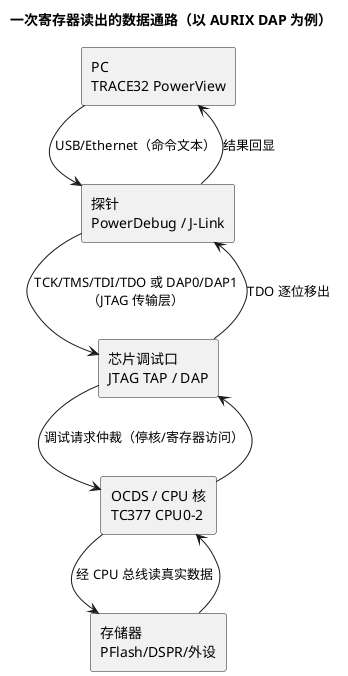

# 02-DAP-JTAG-SWD

> 一句话定位：探针和芯片之间那几根线的协议——JTAG 状态机、SWD 两线串行、AURIX 的 DAP，搞懂它才能治"连不上/连上就断"的物理层病。
> 等级：L1→L2 ｜ 前置：[TRACE32](01-TRACE32.md)

## 原理

调试器（PowerDebug/J-Link）不认识 C 代码，它只会通过固定协议往芯片的调试口发"寄存器读写请求"。这个口就是 JTAG、SWD 或 AURIX 的 DAP。三者本质都是**串行移位协议**：时钟线打拍，数据线逐位移入移出，代价是要懂得时序和状态机，回报是能在线访问任意地址空间（OCDS/DAP 仲裁）。

关键认知：**调试流量最终走的是 CPU 的总线**，所以停核瞬间数据是"零时差现场"；也正因为占用总线，频繁 dump 大段内存会拖慢目标——这是 DAP 和串口日志的分工起点。

## 详解

### 1. 三协议对比（选型看这张表）

| 维度 | JTAG | SWD | AURIX DAP（TC377） |
|---|---|---|---|
| 引脚 | TCK/TMS/TDI/TDO/TRST（5 根） | SWDIO/SWCLK（2 核心线） | 复用 ASC/JTAG 引脚，标准 JTAG 传输 + DAP 命令层 |
| 状态机 | 16 态 TAP，TMS 走位 | 无 TAP，线性包格式（ACK/读/写） | JTAG TAP 底座 + DAP 寄存器访问 |
| 速率 | 高（数 MHz~数十 MHz） | 中（几 MHz 起步） | 取决于探针与时钟配置 |
| 典型芯片 | 老平台/FPGA 边界扫描 | ARM Cortex-M（S32K） | AURIX TC2xx/TC3xx |
| 特点 | 引脚多、状态机复杂、通用 | 省引脚、支持 SWO 单线 trace | 原厂 OCDS：断点/单步/挂起全靠它 |

### 2. JTAG：TAP 状态机 30 秒版

16 个状态由 TMS 逐拍导航：`Test-Logic-Reset → Select-DR → Capture-DR → Shift-DR`（移位读写数据）`→ Exit → Update-DR`。指令寄存器（IR）选中要访问的目标寄存器（如 IDCODE、BYPASS），数据寄存器（DR）承载载荷。记住两件事就够：

- 复位后 TMS 连拉 5 个 1 必回 Test-Logic-Reset——探针"扫链"（detect）就是靠这个 + 读 32bit IDCODE 数出链上有几个器件；
- 链上多器件时其他器件挂 BYPASS，等效延迟 1 拍——所以**不能跳过前级器件直连后级**。

### 3. SWD：包格式与 ACK

SWD 每次操作 3 个包：请求（8bit：APnDP/RnW/A2A3 + 奇偶）、ACK（2~3bit：OK/WAIT/FAULT）、数据（32bit + 奇偶）。核心概念 DAP 分两层：**DP**（Debug Port，管连接与电源请求）→ **AP**（Access Port，MEM-AP 转成总线访问）。S32K（Cortex-M）上 TRACE32/J-Link 停核、读写内存，全走这条路。

### 4. AURIX 的 DAP/OCDS 特有物

- TC377 调试口在文档里叫 **DAP**，物理上就是 JTAG 传输层（4 线 TCK/TMS/TDI/TDO），上面跑 DAP 命令访问 OCDS（On-Chip Debug System）寄存器；
- 断点 = OCR（On-Chip Breakpoint Unit）地址比较器；程序流跟踪 = MCDS；内核挂起/复位由 OCDS 控制；
- 三核共享一个 DAP，**一次只能一个"当前核"做断点/单步上下文**，但访问其他核的内存不受限——多核问题的排法见 [TRACE32](01-TRACE32.md) 第 4 节。

## 实操/配置

### 1. 接线核对表（新板第一件事）

| 信号 | 方向（探针→目标） | 万用表静态检查 |
|---|---|---|
| TCK/SWCLK | 输出 | 空闲低电平，量目标侧应能拉到高（未短路） |
| TMS/SWDIO | 双向 | 上拉存在（多数板内/探针提供） |
| TDI | 输出 | 悬空可接受 |
| TDO | 输入 | 空闲高阻/低，不应被外部强拉 |
| TRST/nSRST | 输出（低有效） | 不接也常能跑；接错比不接更糟 |
| GND | — | 探针地与目标地必须共地 |

### 2. TRACE32 里配置协议与速率

| 命令 | 作用 |
|---|---|
| `SYStem.CONFIG DEBUGPORTTYPE JTAG` | 选传输层（AURIX 下默认 JTAG） |
| `SYStem.JTAGCLOCK 5.MHZ` | 降速首选排障手段（连不稳先降到 1MHz） |
| `SYStem.DETECT` | 扫 JTAG 链，读 IDCODE 验证物理层通 |
| `SYStem.CPU TC377TP` | 选器件（决定 SFR/OCDS 定义加载） |
| `SYStem.Mode Attach` | 不复位附加（板已在跑，保现场） |
| `SYStem.Mode Up` | 复位并 hold 在复位态加载 |

### 3. 排障三板斧

1. `SYStem.DETECT` 无 IDCODE → 物理层问题：线序/接触/供电/时钟（见下表）；
2. 有 IDCODE 连不稳 → 降 JTAGCLOCK；检查目标板内核时钟是否已按 cmm 初始化；
3. 全通但断点不灵 → 确认 OCDS 属于当前核，`Break.List` 看资源占用。

## 易错点与陷阱

1. **现象：`SYStem.Detect` 报 no target / IDCODE 全 0 或全 1。原因：TDI/TDO 接反或杜邦线虚接。对策：对照原理图逐根核对，用示波器看 TCK 有波形而 TDO 无应答，八成是回程线断。**
2. **现象：低速能连，一提速就断。原因：走线长/杜邦线无地回流的信号完整性差，或目标时钟未初始化。对策：JTAGCLOCK 降到 1MHz 验证，改善接线（缩短、加地线），bring-up 阶段固定低速。**
3. **现象：S32K 上 JTAG 四线怎么都不通。原因：Cortex-M 的调试口熔丝/默认配置是 SWD，引脚复用不同。对策：换 SWD 两线接 SWDIO/SWCLK，探针侧选 SWD 模式。**
4. **现象：多器件 JTAG 链上只认得到一个芯片。原因：前级器件没挂 BYPASS 或某 TDO 悬空断链。对策：链上所有器件必须上电且 TDO→TDI 串接完整；断电的器件会把链掐断。**
5. **现象：停核测量时时钟突然"不对"。原因：部分低功耗模式下调试口时钟被关（S32K 的 LLPU/STOP 模式）。对策：调试期禁用深度低功耗，或用引脚唤醒保持调试时钟。**
6. **现象：复位后偶发连不上。原因：nSRST 与 TRST 混用，软件复位策略与探针复位策略打架。对策：明确只用 nSRST 或只用 TRST，TRACE32 里 `SYStem.Option` 调整复位策略后固化进 cmm。**

## 面试高频题

**Q1：JTAG 和 SWD 的区别？**
答：JTAG 用 4~5 根线（TCK/TMS/TDI/TDO/TRST），16 态 TAP 状态机，通用性强还能做边界扫描；SWD 只用 SWDIO/SWCLK 两根线，线性包格式，专用于 ARM 调试访问（DP/AP 两级）。功能等价（断点/内存访问），SWD 省引脚是最大优势，JTAG 生态更老更通用。

**Q2：JTAG 的 TAP 状态机在调试器读写寄存器时干什么用？**
答：TMS 导航 16 态状态机：先走 IR 路径装指令（选中 IDCODE/BYPASS/自定义指令寄存器），再走 DR 路径在 Shift-DR 状态逐位移入/移出数据。状态机保证多器件链上数据同步移位、旁路器件只延迟 1 拍。

**Q3：AURIX 的 DAP 和 ARM 的 DAP 是一回事吗？**
答：不是。ARM 的 DAP（Debug Access Port）是 SWD/JTAG 之上 DP→AP→MEM-AP 的访问层级，服务 Cortex 核；AURIX 的 DAP 是英飞凌对经 JTAG 访问 OCDS 调试系统通道的叫法。缩写撞名，答的时候要主动区分，面试官常挖这个坑。

**Q4：新板 JTAG 连不上，你的排查顺序？**
答：一供电（目标板独立供电、共地）→ 二线序（对照原理图逐根核对，重点 TDI/TDO 方向）→ 三扫链（`SYStem.Detect` 看 IDCODE 判断物理层通没通）→ 四降速（1MHz 重试）→ 五复位策略（nSRST 被外围拉住则换 Attach 模式）。从物理到协议逐层收。

## 延伸

- [TRACE32](01-TRACE32.md)——协议通了之后，工具侧怎么用；
- [串口与RTT](03-串口与RTT.md)——不想停核时的旁路通道，同样经这几根线或 UART 走；
- [Trap定位方法](../../../02-芯片与体系结构/3-L3高级/异常与Trap/02-Trap定位方法.md)——OCDS 停核后的第一现场怎么读；
- [从一个坏掉的ECU说起-调试全景](../../00-入门导读/01-从一个坏掉的ECU说起-调试全景.md)——物理层在整个调试链路里的位置。
