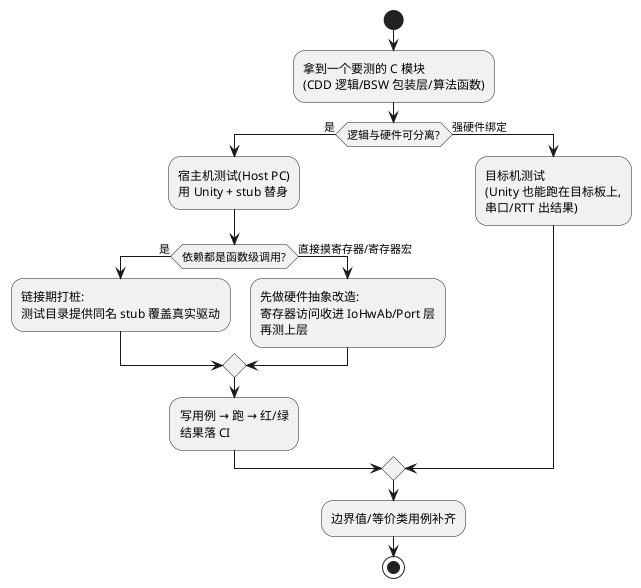

# 01-Unity

> 一句话定位：Unity 是嵌入式 C 单元测试的入门标准件——纯 C、零依赖、宿主机跑，用它把 CDD/BSW 逻辑层从硬件里剥出来先测一遍，再谈上板。
> 等级：L2 ｜ 前置：[01-从一个坏掉的ECU说起-调试全景](../../00-入门导读/01-从一个坏掉的ECU说起-调试全景.md)

## 原理/套路



宿主机测试 vs 目标机测试的选型是 AUTOSAR 项目第一决策：

| 维度 | 宿主机测试（Unity 主场） | 目标机测试 |
|---|---|---|
| 速度 | 毫秒级、海量跑 | 秒级、串口回传 |
| 覆盖场景 | 纯逻辑、状态机、协议解析 | 时序、寄存器、中断 |
| 依赖 | 编译器+stub | 板子+调试器+烧录 |
| 定位 | CDD 逻辑层、BSW 上层 | 驱动层、IoHwAb、集成 |
| 用量 | 80% 用例 | 20% 用例 |

## 详解

### 1. Unity 骨架（最小可跑）

```c
#include "unity.h"
#include "CddFan_Ctrl.h"

void setUp(void)    { CddFan_Init(); }          /* 每个用例前 */
void tearDown(void) { /* 每个用例后：清理 */ }

void test_温度超阈值应进入降档(void) {
    CddFan_SetTemp(105);
    TEST_ASSERT_EQUAL_INT(FAN_LVL_2, CddFan_GetLevel());
}

void test_临界值105属于降档区间(void) {
    CddFan_SetTemp(105);
    TEST_ASSERT_EQUAL_INT(FAN_LVL_2, CddFan_GetLevel());
}

int main(void) {
    UNITY_BEGIN();
    RUN_TEST(test_温度超阈值应进入降档);
    RUN_TEST(test_临界值105属于降档区间);
    return UNITY_END();
}
```

断言家族按精度选：整型用 `TEST_ASSERT_EQUAL_INT/UINT8/HEX32`（失败信息带类型语义），浮点用 `TEST_ASSERT_EQUAL_FLOAT` 配 `UNITY_FLOAT_PRECISION`，指针判空 `TEST_ASSERT_NOT_NULL`，位数组比对 `TEST_ASSERT_EQUAL_UINT32_ARRAY`。**别用 `TEST_ASSERT_TRUE(a==b)` 一把梭**——失败时只告诉你 false，不告诉你值。

### 2. 打桩（stub/mock）三板斧

AUTOSAR 代码测逻辑必然要桩，三种做法从轻到重：

1. **手写 stub**：测试工程里自己写一个 `CanIf_Transmit()` 假实现，记录调用参数、返回可控值。适合依赖少的 CDD。
2. **链接期替换**：链接时把真实 `CanIf.o` 换成 `stub_CanIf.o`（makefile 里换对象列表），**源码零改动**——BSW 供应商代码不可改时的唯一解。
3. **CMock 自动生成**：从头文件自动生成 mock，带期望调用次数/参数校验（`CanIf_Transmit_ExpectAndReturn(...)`）。Ceedling 默认集成。

静态函数怎么办（不可从外部调用）：要么 `#define static`（测试构建里宏定义为空，注意 MISRA 例外报备），要么经白盒工具直测（见 [03-Tessy](03-Tessy.md)），要么把真值得测的状态机抽成独立可测单元——最后一种是正道。

### 3. CDD 视角的落地目录

```
cdd_fan/
├── src/CddFan_Ctrl.c        # 逻辑（可测）
├── src/CddFan_Hw.c          # 寄存器（目标机测）
└── test/
    ├── test_CddFan_Ctrl.c   # Unity 用例
    ├── support/stub_CanIf.c # 桩
    └── Makefile             # gcc -I.. unity/src
```

逻辑与硬件分层的依据见 [01-CDD定位与边界](../../../04-MCAL与外设驱动/2-L2进阶/CDD设计方法论/01-CDD定位与边界.md)。经典练手对象：环形缓冲（输入输出纯内存），见 [01-环形缓冲区](../../../01-编程语言/2-L2进阶/数据结构与算法-C实现/01-环形缓冲区.md)。

## 易错点与陷阱

1. **现象**：用例本机绿，目标板上红。**原因**：宿主机 `int` 32 位、目标机也 32 位侥幸过关，但**字节序/对齐/位域布局**差异炸了。**对策**：用 `TEST_ASSERT_EQUAL_UINT32` 而非依赖内存布局的 memcmp；跨平台断言显式定宽类型。
2. **现象**：改一个头文件，半个测试工程重编，慢到没人愿意跑。**原因**：没做测试依赖最小化，桩头文件满天飞。**对策**：桩只 include 被测模块声明的接口头，用 Ceedling 的依赖管理。
3. **现象**：用例顺序相关——单独跑绿、全量跑红。**原因**：用例间共享静态状态，setUp 没重置干净。**对策**：setUp/tearDown 全量重建现场，静态变量提供 reset 接口。
4. **现象**：测出的 bug 修了，下个版本又回来。**原因**：用例没入 CI，靠手跑。**对策**：用例提交即触发，红灯禁止合入（见 [03-Tessy](03-Tessy.md) 的 CI 门槛讨论）。
5. **现象**：给寄存器直接寻址的代码写 stub 写到怀疑人生。**原因**：模块没分层，逻辑和寄存器耦合。**对策**：先重构分层再测试——测试驱动的不只是代码，还有架构。
6. **现象**：`RUN_TEST` 报 undefined reference。**原因**：链接顺序/前向声明，Unity 的 main 需要显式列用例。**对策**：保持每个用例一个函数、main 集中注册，别用自动发现花活。

## 面试高频题

**Q：嵌入式项目为什么要做宿主机单元测试？直接上目标板测不行吗？**
答：可以但低效：目标板测试慢（烧录+串口回传）、资源受限（大用例跑不动）、断点调试定位的是现象不是断言、且硬件强依赖让"每个开发随时跑全部测试"不可行。宿主机测试用 stub 隔离硬件，毫秒级回归、断言精确到值、可进 CI 门禁。经验分配：逻辑层 80% 用例在宿主机，时序/寄存器强相关的 20% 留给目标机——两者互补不是替代。

**Q：Unity 里 setUp/tearDown 和直接在用例开头写初始化有什么区别？**
答：setUp 在**每个** RUN_TEST 前自动执行、tearDown 在每个用例后执行，保证用例间隔离——单独跑和全量跑行为一致。写在用例内部则容易漏、且用例失败中断后清理逻辑不执行。原则：现场准备放 setUp，用例只写"给定-当-则"的断言部分。

**Q：BSW 供应商代码不可修改，怎么对依赖它的 CDD 做打桩测试？**
答：链接期替换：测试构建不链真实 BSW 对象文件，改链自写的同名 stub（签名一致）。源码零改动、不碰供应商文件；缺点是签名变更不会自动同步（要在 CI 里用头文件一致性检查兜底）。进一步用 CMock 从 BSW 头文件自动生成 mock，带参数期望与调用次数校验。

**Q：static 函数怎么测？**
答：优先选项：若它是被公开函数完整覆盖的内部细节，通过公开函数的用例间接覆盖（行为测而非实现测）；确需直测时：测试构建里用宏把 `static` 置空（`#define static`，需要 MISRA/评审例外），或把纯逻辑抽成新模块；商业白盒工具（Tessy）可直接调用 static 函数无需改码。团队统一一种策略写进编码规范。

## 延伸

- [02-CppUTest](02-CppUTest.md)：需要内存泄漏检测与 mock 框架时的升级选项
- [03-Tessy](03-Tessy.md)：白盒工具路线与覆盖率门槛
- [01-CDD定位与边界](../../../04-MCAL与外设驱动/2-L2进阶/CDD设计方法论/01-CDD定位与边界.md)：先分层才谈可测
- [01-环形缓冲区](../../../01-编程语言/2-L2进阶/数据结构与算法-C实现/01-环形缓冲区.md)：最适合上手练手的被测对象
