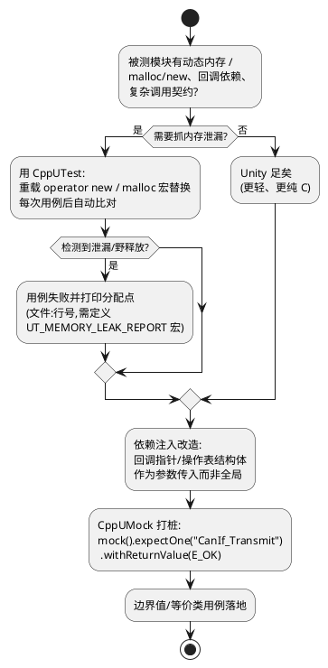

# 02-CppUTest

> 一句话定位：CppUTest 在 Unity 的断言骨架上加了内存泄漏检测和 CppUMock——BSW/CDD 里"会 new/malloc 会回调"的代码，用它测才能抓住泄漏与调用契约违约。
> 等级：L2 ｜ 前置：[01-Unity](01-Unity.md)

## 原理/套路



选型速判（和 Unity 互补）：**纯逻辑+无动态内存 → Unity；有 malloc/new、要严格校验桩的调用序列 → CppUTest**。测试代码用 C++ 写，被测代码仍是 C——这是 CppUTest 在嵌入式 C 项目里的标准用法。

## 详解

### 1. 骨架：TEST_GROUP 与用例

```cpp
#include <CppUTest/TestHarness.h>

TEST_GROUP(FanCtrl)
{
    void setup() override     { CddFan_Init(); }   /* 每用例前 */
    void teardown() override  {
        CddFan_DeInit();
        CHECK_TRUE(malloc_block_clean());          /* 自检钩子 */
    }
};

TEST(FanCtrl, 温度到105应升二档)
{
    CddFan_SetTemp(105);
    LONGS_EQUAL(FAN_LVL_2, CddFan_GetLevel());
}
```

四个核心宏：`CHECK_TRUE/` `CHECK_EQUAL`（宽松）、`LONGS_EQUAL/` `BYTES_EQUAL`（类型化比较）、`STRCMP_EQUAL`、`POINTERS_EQUAL`。失败输出比 Unity 更新详细（期望/实际分组打印）。内存泄漏检测：构建时 `-include CppUTest/MemoryLeakDetectorMallocMacros.h`，把 `malloc/free` 换成带记账的版本，**teardown 后统一清算**，泄漏点直接打到文件:行号。

### 2. 依赖注入与回调打桩（CDD 可测性核心套路）

AUTOSAR CDD 常见两种"不可测"写法与改造法：

| 不可测写法 | 问题 | 可测改造 |
|---|---|---|
| 直接 `CAN_HW_TX_REG = x;` | 宿主机没有该地址 | 收进 `CddFan_HwWrite()`，测试组注册假实现 |
| 回调直接写死 `CanIf_Transmit(...)` | 链不到桩就编不过 | 操作表注入：`void CddFan_SetBusIf(const FanBusIf_t* ops)` |
| 全局配置结构体 | 用例间状态串扰 | 提供 `CddFan_SetConfig()` 测试入口 |

```c
typedef struct { Std_ReturnType (*transmit)(PduIdType, const PduInfoType*); } FanBusIf_t;
/* 生产代码初始化时注入真实 CanIf 包装；测试里注入 mock 记录调用 */
```

这就是"可测性设计"（Design for Testability）：**依赖进参数、硬件进抽象、全局状态进门面**。评审检查项见 [04-模板与评审清单](../../../04-MCAL与外设驱动/2-L2进阶/CDD设计方法论/04-模板与评审清单.md)。

### 3. volatile 与寄存器访问的隔离

被测代码里 `volatile uint32* reg = (void*)0xF0000300;` 在宿主机是野指针。三种隔离法：

1. **地址宏注入**：`#ifndef FAN_REG_BASE #define FAN_REG_BASE 0xF0000300 #endif`，测试构建 `-DFAN_REG_BASE=((uint32)test_reg_ram)` 指到普通内存数组——寄存器"变"成了可读写的 RAM 镜像，写进去还能断言位段。
2. **访问函数隔离**：`Fan_HwWriteReg(offset, val)` 在测试里链到假实现，可记录写序列、按剧本回读。
3. **volatile 语义保留**：注意 volatile 在 [01-volatile的正确使用](../../../01-编程语言/2-L2进阶/寄存器编程/01-volatile的正确使用.md) 里的本义——隔离后测试跑在普通内存上，**测不出"编译器优化掉了读"这类问题**，这类问题留给目标机测试与代码评审。

### 4. 测试用例设计：边界值/等价类落到嵌入式

以"CAN 报文 DLC 拷贝进缓冲"为例的用例矩阵：

| 等价类 | 输入 | 期望 |
|---|---|---|
| 有效-最小 | DLC=1，缓冲剩余=1 | E_OK，写 1 字节 |
| 有效-最大 | DLC=8（经典 CAN 上限），剩余=8 | E_OK，写满 |
| 边界-恰好 | DLC=剩余 | E_OK，缓冲满 |
| 无效-超限 | DLC=9 | E_NOT_OK，不写 |
| 无效-空指针 | PduInfoPtr=NULL | E_NOT_OK（或 Det 上报） |
| 边界-DLC=0 | 空报文 | E_OK，零拷贝 |

套路：**每个函数参数画等价类，等价类边界各取一点，非法类单独成用例**；超时/重试逻辑再加时间轴用例（用"tick 注入"代替真实延时，即把时间也做成依赖）。

## 易错点与陷阱

1. **现象**：链接器把 `new`/`malloc` 宏替换漏了，泄漏检测静默失效。**原因**：只 include 了头、没启用宏或链接顺序错误。**对策**：用一个"故意泄漏"的哨兵用例验证检测器活着。
2. **现象**：被测 C 代码被 C++ 编译器编译后行为变了。**原因**：测试工程错把 `.c` 当 C++ 编（`implicit conversion`/`register` 关键字差异告警爆炸）。**对策**：被测代码保持 C 编译、extern "C" 包声明，只有测试文件是 C++。
3. **现象**：mock 报 unexpected call，但看代码调用是合理的。**原因**：用例只 expect 了一次而循环里调了两次——**调用次数也是契约**。**对策**：`mock().expectNCalls(2, ...)`，把次数期望写明确。
4. **现象**：teardown 里 DeInit 崩溃。**原因**：用例失败提前 return，半初始化状态进清理。**对策**：DeInit 写成幂等；用例尽量单一断言主题。
5. **现象**：C++ 测试工程在工具链交叉编译报 `libstdc++` 缺失。**原因**：目标机工具链没有 C++ 运行库。**对策**：CppUTest 仅用极少 C++ 特性，配 `-fno-exceptions -fno-rtti` 静态裁剪；或宿主机跑 CppUTest、目标机只跑 Unity。
6. **现象**：寄存器镜像法测试通过，板上仍错。**原因**：镜像测的是"写对了值"，不是"写满足时序"（读改写顺序、等待 ready）。**对策**：假实现里按剧本注入"busy→ready"序列覆盖轮询逻辑；硬件时序留给目标机测试。

## 面试高频题

**Q：CppUTest 相比 Unity 多给了什么？什么时候选它？**
答：三样：内存泄漏检测（operator new/malloc 宏记账，用例后自动清算并报分配点）、CppUMock（期望调用+参数+次数+返回值的严格桩，违约即失败）、TEST_GROUP 组织（setup/teardown 分组复用）。选它：被测代码有动态内存、桩需要校验调用契约（次数/顺序/参数）、团队愿意测试代码用 C++ 写。纯 C 无内存操作的简单逻辑层，Unity 更轻更快。

**Q：怎么让直接操作寄存器的 C 代码可以在宿主机被测试？**
答：核心是把"地址"与"访问"从逻辑里剥离：一是地址注入——寄存器基址宏在测试构建里指向普通 RAM 数组，寄存器访问变成对镜像内存的读写，还能直接断言位段；二是访问函数隔离——所有寄存器读写收进 HwRead/HwWrite 接口，测试链假实现并按剧本回读（可模拟 busy/ready 时序）；三是干脆分层，逻辑层只依赖抽象接口（操作表注入）。同时要清楚：镜像测不出真实时序与优化问题，那部分留给目标机测试。

**Q：嵌入式单元测试里边界值分析怎么做？举个例子。**
答：对每个输入先分等价类（有效/无效），再在类边界取点。例：CanTp 拷贝函数 `Copy(dlc, remain)`——有效类边界 dlc∈{1,8,dlc==remain}、无效类 {dlc>8, NULL 指针, dlc==0}，另加组合边界"dlc 恰好等于剩余空间"；对含重试/超时的逻辑，把时间做成可注入的 tick，用"第 N 次成功"覆盖重试边界。原则：每个边界一条用例，非法输入断言返回码而不是崩溃。

**Q：什么是可测性设计？在 AUTOSAR CDD 里具体怎么做？**
答：可测性设计指在编码阶段就让代码"能被低成本测试"：依赖以参数/操作表注入而不是写死调用（方便换桩）；硬件访问收进独立抽象层（IoHwAb/Hw 前后缀文件）；全局状态提供集中 reset/config 入口（用例隔离）；时间与随机源可注入（重试逻辑可控）。CDD 具体动作：接口分 `Ctrl`（逻辑，宿主机测）与 `Hw`（寄存器，目标机测）两层；回调用函数指针表注册；评审时按 [04-模板与评审清单](../../../04-MCAL与外设驱动/2-L2进阶/CDD设计方法论/04-模板与评审清单.md) 逐项过可测性检查项。

## 延伸

- [01-Unity](01-Unity.md)：更轻的纯 C 起点
- [03-Tessy](03-Tessy.md)：不改码直测 static、覆盖率闭环的商业路线
- [01-volatile的正确使用](../../../01-编程语言/2-L2进阶/寄存器编程/01-volatile的正确使用.md)：寄存器隔离后 volatile 还剩什么
- [04-模板与评审清单](../../../04-MCAL与外设驱动/2-L2进阶/CDD设计方法论/04-模板与评审清单.md)：可测性检查项落进评审
