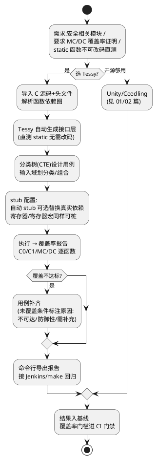

# 03-Tessy

> 一句话定位：Tessy 是汽车行业商用白盒单元测试工具——不改源码直测 static 函数、分类树设计用例、覆盖率（C0/C1/MC/DC）闭环，命令行驱动接 Jenkins，把"测没测够"变成数字门禁。
> 等级：L2 ｜ 前置：[02-CppUTest](02-CppUTest.md)

## 原理/套路



工具路线决策表（本目录三篇的总结）：

| 场景 | 推荐 | 理由 |
|---|---|---|
| 快速起步、纯逻辑、零预算 | Unity(+Ceedling) | 轻、纯 C、社区成熟 |
| 要内存泄漏检测/严格调用契约 mock | CppUTest | 内建泄漏检测+CppUMock |
| 安全件、要 MC/DC 证据、不改码测 static | Tessy | 工具链合规、报告可审计 |
| 大规模 BSW 回归、多编译器 | Tessy（或 Vector/CPPTestTools 类） | 工程化管理+命令行 CI |

## 详解

### 1. Tessy 的四个核心概念

1. **模块/函数导入**：把被测 `.c` 导入 Tessy 工程，它解析出所有函数（含 static）与全局变量依赖，自动分层展示。
2. **接口层自动生成**：对每个被测函数生成测试驱动（test harness），可直接调用 static 函数、读写 static 变量——**源码零改动**，这是与 Unity/CppUTest 路线最大的差异。
3. **分类树（Classification Tree，配 CTE）**：用图形化分类树划输入域，叶节点取值组合生成用例——等价类/边界值方法论的落地工具。
4. **Stub 与对象替换**：依赖函数自动生成 stub，可随时切换真实实现/stub；全局变量与"寄存器变量"也能定向替换（SFR 桩）。

### 2. 覆盖率：从 C0 到 MC/DC

| 级别 | 含义 | 工程门槛典型值 |
|---|---|---|
| C0（语句） | 每条语句执行过 | 入门基线 ~90%+ |
| C1（分支） | 每个分支两向都走过 | 常见门槛 ~85%~95% |
| MC/DC | 每个条件独立影响判定结果 | ISO 26262 高安全等级要求 |

Tessy 报告逐函数列出未覆盖的语句/分支/条件，并允许**标注原因**（防御性不可达、硬件异常分支）——审计时"没测的都有说法"比硬凑 100% 更重要。Tessy 的 Satisfying 用例还支持**自动推导**满足指定覆盖的最小用例集，再人工补充语义用例。

### 3. 命令行与 CI 集成（回归自动化）

Tessy 全功能可命令行驱动，典型回归流水线：

```
make unit_test:
    tessycli -p CddFan.pjx -r all -t all        # 跑全部用例
    tessycli -p CddFan.pjx --report html out/   # 出 HTML 报告
    tessycli -p CddFan.pjx --coverage xml cov.xml
    python check_gate.py cov.xml --c1 85        # 覆盖率门槛判定
```

Jenkins 触发点：提交触发单模块、 nightly 全量、发版节点出正式报告归档。**结果判读三看**：一看用例通过率（红即挡）、二看覆盖率对门槛的 delta（降超过阈值挡）、三看新增代码覆盖率（新代码必须达标，老代码逐步还债）。

覆盖率门槛要写进团队规范并与评审清单挂钩（[04-模板与评审清单](../../../04-MCAL与外设驱动/2-L2进阶/CDD设计方法论/04-模板与评审清单.md) 的 CDD 评审项可直接引用门槛值）。

### 4. 与 Unity/CppUTest 混用策略

现实项目常见混搭：**Tessy 管安全相关 CDD/算法（要证据）**，Unity 管普通逻辑快速迭代（要速度）。两者用例资产不互迁，但**门槛与报告统一进 CI**。注意编译器一致性：Tessy 支持换用与目标机一致的交叉编译器做"宿主机交叉编译+目标机执行"模式，避免"测的编译器与量产的不是同一个"的争议。

## 易错点与陷阱

1. **现象**：MC/DC 永远差几个条件到不了 100%。**原因**：防御性代码（如 `if(ptr != NULL)` 在契约保证下不可达）。**对策**：用 Tessy 的标注功能声明豁免并给理由，别为凑数写"绕过防御"的用例。
2. **现象**：换 Tessy 版本后旧工程用例跑挂。**原因**：工程文件格式/编译器适配层随版本变化。**对策**：版本升级走独立分支验证；工程文件进版本库，报告产物不进。
3. **现象**：stub 配置漂移——A 同电脑跑得过，CI 跑不过。**原因**：stub 开关、变量替换是工程级配置，本地点了没入库。**对策**：一切配置以工程文件为准，CI 用同一份 `tessycli` 脚本，禁 GUI 手改不入库。
4. **现象**：覆盖率 100% 但 bug 照出。**原因**：覆盖率只证明"执行过"，不证明"断言对"——用例没有期望值校验（尤其自动生成骨架没补断言）。**对策**：评审时抽查用例断言质量，把"用例有期望值"当检查项。
5. **现象**：全量回归一小时，没人愿意等。**原因**：所有模块 nightly 全跑+HTML 报告巨大。**对策**：提交级只跑受影响模块（依赖图增量），全量留 nightly；报告按模块拆分归档。
6. **现象**：目标机执行模式下偶发超时挂死。**原因**：测试驱动往串口回传大量数据，波特率不够。**对策**：精简输出（只传结果码），或提高回传带宽（ETM/以太网回传）。

## 面试高频题

**Q：Tessy 和 Unity/Ceedling 这类开源方案比，核心差异是什么？**
答：三点：一是**白盒直测能力**——Tessy 自动生成接口层可直接调用 static 函数、操作 static 变量，源码零改动；开源路线要么宏开 static 要么重构。二是**覆盖率闭环**——C0/C1/MC/DC 逐函数报告+未覆盖原因标注+Satisfying 自动推导用例，天然满足 ISO 26262 审计要求。三是**工具链合规**——商用工具有资质与支持，报告可直接作为安全证据交付。代价是许可成本与配置管理纪律。选型按"是否安全件、是否要 MC/DC 证据"划线。

**Q：MC/DC 覆盖率是什么意思？为什么 ASIL-D 常要求它？**
答：Modified Condition/Decision Coverage：每个布尔条件的所有可能取值都独立影响过一次判定结果。比 C1 更严格的地方：`if(a && b)` 分支覆盖只要整体真假各一次，而 MC/DC 要求证明 a 单独翻转能改变结果、b 单独翻转也能改变结果。ASIL-D 要求它是因为组合逻辑里"条件被短路掩盖"的缺陷只有独立翻转才能暴露——C1 会漏。Tessy 报告会直接指出每个条件缺哪组翻转，据此补用例。

**Q：单元测试结果怎么接入 CI 做回归？门槛怎么定？**
答：接入：工具全命令行化（开源用 make/ceedling，Tessy 用 tessycli），Jenkins 在提交/nightly 两级触发，产出机器可读结果（JUnit XML/覆盖率 XML），脚本按门槛判定通过失败。门槛定法：存量代码定"不下降"基线（如 C1≥85% 且较上周降超 2% 即挡），**新增/修改代码单独达标**（如 C1≥95%，安全件 MC/DC 按等级），不可达分支走显式豁免清单——"新债不欠、旧债渐还"。

**Q：Tessy 的 stub 和链接期替换打桩比有什么优势？**
答：链接期替换是全或无——整个函数换成桩；Tessy 的 stub 可以**逐用例切换**真实实现/桩，还能做"部分真实"（测集成路径时只桩最底层寄存器访问），并且全局变量、SFR 寄存器符号也能替换。另外 stub 参数/返回值按用例独立配置并记录，直接进报告，可审计性好。缺点是绑定在 Tessy 工程里，跨工具迁移成本高——所以要尽早定路线，别中途反复。

## 延伸

- [01-Unity](01-Unity.md)、[02-CppUTest](02-CppUTest.md)：开源路线与本篇组成选型决策三角
- [04-模板与评审清单](../../../04-MCAL与外设驱动/2-L2进阶/CDD设计方法论/04-模板与评审清单.md)：覆盖率门槛落进 CDD 评审项
- [02-MISRA-C规则分类导读](../../../01-编程语言/2-L2进阶/代码规范与MISRA-C/02-MISRA-C规则分类导读.md)：静态检查与单元测试互补的质量门
- [00-一坑一档模板](../踩坑案例库/00-一坑一档模板.md)：测试漏网 bug 复盘回填用例的闭环入口
