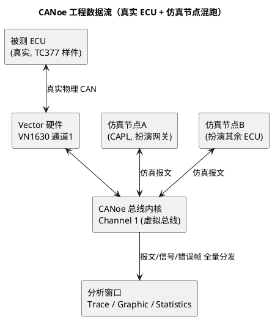

# 01-CANoe

> 一句话定位：Vector 的总线仿真与分析全家桶底座——DBC 加载、通道映射、Trace/Graphic 窗口、仿真节点一站搞定，台架调试 CAN/LIN/FlexRay 的主战场。
> 等级：L2 ｜ 前置：[从一个坏掉的ECU说起-调试全景](../../00-入门导读/01-从一个坏掉的ECU说起-调试全景.md)

## 原理

CANoe 工程的本质是**在 PC 上重建一条虚拟总线**：真实 ECU（被测件）经 VN1630/VN7640 等硬件接口卡接入，缺席的 ECU 由 PC 上的**仿真节点**（CAPL/模型）扮演，两者在 CANoe 内部总线里混跑。于是你能"缺谁补谁"——只挂一块被测 ECU，其余全网用仿真节点搭起来做台架。

三个关键对象先记住：**Channel**（逻辑通道，映射到硬件通道或纯虚拟）、**Database**（DBC/ARXML，把裸字节翻译成信号）、**Node**（挂在通道上的参与者，真实或仿真）。

## 详解

### 1. 工程结构四件套

| 对象 | 在哪配 | 干什么 |
|---|---|---|
| Channels | Simulation Setup → Channel Mapping | 逻辑通道 ↔ VN 硬件通道映射（CAN1→Channel1 of VN1630） |
| Databases | Databases 配置页 | 加载 DBC/ARXML，报文/信号符号化；多 DBC 注意分配通道 |
| Nodes | Simulation Setup 树 | 真实节点(不建模) vs 仿真节点(CAPL/.NET/模型) |
| Panels | Panel 设计器 | 做个滑条/按钮面板，人肉注入信号值 |

### 2. 分析窗口分工

- **Trace 窗口**：总线事件的时序流水（报文/信号/错误帧/诊断交互），排障第一落点。过滤列、右键"Filter on this ID"、彩色区分 Tx/Rx；
- **Graphic 窗口**：信号随时间曲线（多信号叠加、触发条件、游标量差值），看 NM 状态机跳变、信号毛刺必备；
- **Statistics 窗口**：每 ID 的周期/抖动/负载统计——**验证周期报文超时/抖动**就靠它；
- **Data 窗口**：当前最新信号值表，配合 Panel 快速核对；
- **Write 窗口**：CAPL `write()` 输出 + 系统提示，脚本调试台。

### 3. DBC 加载与报文过滤

1. Databases 页 Add DBC → 绑定通道号（DBC 里的 Channel 与工程 Channel 对上，信号名才解析）；
2. Trace 工具栏 Filter：按 ID/报文名/方向/类型过滤；"只看错误帧"模式抓 busoff 现场；
3. 快捷技巧：Trace 里右键某报文 → "Activate Filter on..."，一秒聚焦问题 ID。

### 4. 诊断与标定入口（工具间关系）

- **诊断控制台（Diagnostic Console）**：加载 CDD/ODX 后可手发 UDS 请求，配合 06 区 [DSL-DSD-DSP分层](../../../06-诊断与标定/2-L2进阶/Dcm配置/01-DSL-DSD-DSP分层.md) 排 Dcm 配置问题；
- **CANape 干标定**：见本区 [CANape](03-CANape.md)，走 XCP 不占 CANoe 通道也可共存；
- 工具角色一句话：**CANoe 管"总线上的行为"，CANape 管"ECU 内部参数"，CANdela/ODX 管"诊断描述数据"**。

## 实操/配置

### 1. 新建台架工程（从零到看到报文）

1. `File → New` 选 CAN 500k 模板，建 .cfg；
2. `Hardware → Channel Mapping`：把 Channel 1 映射到 VN1630 的 Channel 1（驱动先装 Vector Driver Setup）；
3. Databases 页加 DBC 并绑 Channel 1；
4. Simulation Setup 里右键 Channel 1 → Insert Network Node，指派 CAPL（见 [CAPL](02-CAPL.md)）；
5. `Home → Start`（Ctrl+Alt+S / F9 按版本）起测量，Trace 窗口应看到报文滚动。

### 2. Trace 窗口高频操作

| 操作 | 路径/快捷键 |
|---|---|
| 起停测量 | Start/Stop 按钮（快捷键见状态栏提示，不同版本 F9/Ctrl+Alt+S） |
| 单步暂停 | Step 按钮（只进一拍事件） |
| 过滤某 ID | 右键报文 → Activate Filter |
| 看原始字节 | View 切 Raw/Interpreted；列配置加 DLC/Data |
| 保存日志 | Trace → Log（.asc/.blf），离线可回灌分析 |
| 游标量时差 | Graphic 窗口放两个 Cursor，Δt 直接显示 |

### 3. 常用配置开关

| 开关 | 用途 |
|---|---|
| Measurement Setup → Filter | 全局过滤（不计入日志的事件） |
| Trace → Log to file | blf 记录，供离线复现与跨工具导入 |
| Option → CAN Driver | 选 VN 硬件 / 虚拟总线（无硬件也能跑仿真） |
| Offline Mode（回灌 .blf/.asc） | 复现台架现场给同事看 |
| Panel + 系统变量 | 手动注入信号激励被测 ECU |

## 易错点与陷阱

1. **现象：Trace 里报文显示原始 hex、信号名不解析。原因：DBC 没加载或没绑定到对应通道。对策：Databases 页核对 DBC 与通道绑定；改完 DBC 要重起测量才生效。**
2. **现象：真实 ECU 报文进不来，仿真节点自嗨。原因：Channel Mapping 映错硬件通道，或 VN 驱动被别的程序占用。对策：Vector Hardware Config 里确认通道占用；Mapping 页重新指认，Error 窗口看驱动报错。**
3. **现象：busoff 时 CANoe 一片绿，以为天下太平。原因：默认视图不显错误帧/错误计数。对策：Trace 过滤里勾上 Error Frames；Statistics 看 bus load 与 error 统计；配合 [busoff恢复策略](../../../05-汽车网络通讯/1-L1基础/CAN/总线错误与恢复/02-busoff恢复策略.md) 分析。**
4. **现象：周期报文偶发超时但 Graphic 看不出。原因：窗口分辨率/采样设置粗，短毛刺被平滑掉。对策：Graphic 改插值 None、加触发条件；Statistics 窗口直接看 min/max 周期。**
5. **现象：仿真节点发的信号 ECU 收不到。原因：DBC 里该报文 Tx 节点与仿真节点不匹配，或信号字节序/缩放配错。对策：在 Trace 里核对仿真发出的原始字节 vs DBC 定义；IG 里对字节序。**
6. **现象：一台电脑能跑另一台不能。原因：CANoe 版本/DSP 与 license、DBC 编码差异。对策：工程随 Git 管版本，注明 CANoe 版本；demo 版有通道/节点数限制要提前声明。**

## 面试高频题

**Q1：CANoe 和 CANalyzer 的区别？**
答：定位不同——CANalyzer 是纯分析工具（抓包/统计/简单发注），不能跑节点仿真与测试自动化；CANoe 是仿真+测试+分析平台，可建仿真节点、跑 Test Configuration/TSE、做 HIL。日常排障 CANalyzer 够用，台架开发与自动化回归必须 CANoe。

**Q2：怎么用 CANoe 验证一个周期报文发送超时缺陷？**
答：三步——Statistics 窗口看该 ID 的 max 周期是否超 DBC 标称（含抖动容限）；Graphic 窗口对该信号设触发条件抓丢失瞬间的总线状态；同步 Trace 过滤错误帧确认是否总线异常（如错误帧风暴、busoff）导致，最终区分"应用没发"还是"总线上丢了"。

**Q3：什么是 restbus 仿真？怎么搭？**
答：让被测 ECU 以为全网都在：其余 ECU 的周期/事件报文由 CANoe 仿真节点按 DBC 发出。搭法是 DBC 里每个 Tx 节点建对应仿真节点（或直接右键节点 → Set node as simulated），节点带 CAPL 循环发送；优点是单件台架即可测网络交互（如 NM 报文、丢失检测）。

**Q4：台架上 NM 不睡眠/假醒，CANoe 怎么配合？**
答：用 Trace/Graphic 观察 NM 报文的发送源与周期；把无关仿真节点的 NM 报文停发做变量隔离（Panel 开关控制）；对照 [睡眠与假醒](../../../05-汽车网络通讯/2-L2进阶/网络管理/03-睡眠与假醒.md) 的状态机逐个排查谁在发 User Data 阻止睡眠、谁在反复发 Ring。

## 延伸

- [CAPL](02-CAPL.md)——仿真节点与测试脚本的语言层；
- [CANape](03-CANape.md)——从总线观测深入 ECU 内部标定；
- [CANdela与ODX](04-CANdela与ODX.md)——诊断控制台背后加载的描述文件从哪来；
- [睡眠与假醒](../../../05-汽车网络通讯/2-L2进阶/网络管理/03-睡眠与假醒.md)、[传输层排障实录](../../../05-汽车网络通讯/2-L2进阶/传输层/03-排障实录.md)——CANoe 是这两类问题的主力武器；
- [TRACE32](../../1-L1基础/调试器/01-TRACE32.md)——总线上看到异常后回 ECU 内部查现场。
