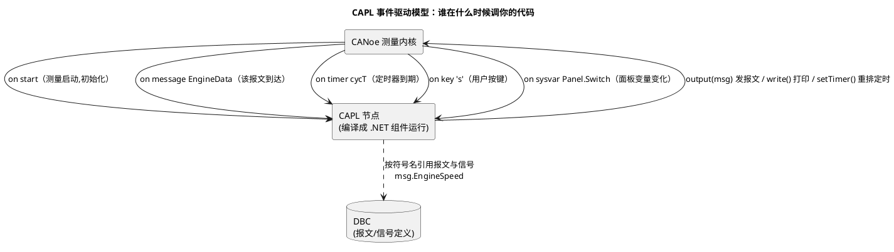

# 02-CAPL

> 一句话定位：CANoe 里 C 风格的事件驱动脚本语言——on message / on timer / on key 一把梭，仿真节点与测试激励都靠它写。
> 等级：L2 ｜ 前置：[CANoe](01-CANoe.md)

## 原理

CAPL（Vector Communication Access Programming Language）的执行模型是**事件驱动**：脚本不写 main 循环，你只注册"某事件发生时干什么"。事件源包括总线报文到达、定时器到期、按键、系统变量变化、测量启停等。CANoe 内核收到事件后回调你的 handler——本质和单片机中断向量表一个思路，写过裸机驱式的工程师秒懂。



两个心智模型：**定时器要手动续命**（到期回调一次就停，循环发送必须 `setTimer` 重排）；**报文是结构体**（`message EngineData msg;` 之后按 `msg.EngineSpeed` 读写，字节序/缩放由 DBC 处理）。

## 详解

### 1. 常用事件一览

| 事件 | 触发时机 | 典型用途 |
|---|---|---|
| `on start` / `on preStart` | 测量启动 | 变量初始化、首个 setTimer（preStart 更早，早于 DBC 就绪要小心） |
| `on message MsgX` | 收到 MsgX | 监听解析、计数、超时检测配合 |
| `on timer t` | 定时器到期 | 周期发送、状态机推进、超时判定 |
| `on key 'x'` | 用户按键 | 手动注入激励 |
| `on sysvar sv` | 系统变量变化 | Panel 面板联动 |
| `on errorFrame` | 错误帧 | 总线健康监测 |
| `on envVar` / `on diagResponse` | 环境变量/诊断应答 | 老面板/诊断脚本 |

### 2. 核心语法要点

- **类型**：`byte/word/dword/qword/int64/double/char[]/message`；**无 unsigned int 单独概念时注意 word 是无符号 16 位**，比较时符号坑高发；
- **定时器**：`msTimer t;`（毫秒）/ `timer t;`（秒）；`setTimer(t,100)` 启动一次，到期进 `on timer`；
- **报文输出**：`output(msg)` 立即发送；改信号 `msg.Sig = 值`（物理值，DBC 自动编码）；
- **日志**：`write("x=%d", x)` 输出到 Write 窗口，比断点调试快；
- **作用域**：全局变量在整个节点共享；`variables {}` 块里声明。

### 3. 三个典型应用形态

1. **restbus 仿真节点**：替缺席 ECU 周期发报文（本文实操示例）；
2. **监控节点**：监听目标报文，统计周期/超时、抓异常并 write 告警——排障利器；
3. **测试节点（Test Function/TestCase）**：配合 Test Configuration 或 vTESTstudio 做自动化回归，断言用 `testStepPass/Fail`。

### 4. IG 与 CAPL 的分工

Interactive Generator（IG）是**免代码报文发生器**：加载 DBC 后点选报文改信号值发送。快速验证用 IG，需要逻辑（条件、状态机、周期规律）就上 CAPL。IG 里的值也能经系统变量与 CAPL 联动。

## 实操/配置

### 1. 示例：一个"周期发送 + 接收超时监控"仿真节点

```c
/* 节点：扮演 BCM，周期发 BodyStatus；监控 ECU 心跳 EngineData */
includes { }

variables {
  msTimer tmSend;          /* 周期发送定时器 */
  msTimer tmTimeout;       /* 接收超时判定定时器 */
  message BodyStatus msgTx;
  long gRxCount;
  const int SEND_CYCLE = 100;   /* ms */
  const int RX_TIMEOUT = 300;   /* 3 倍周期 */
}

on start {
  gRxCount = 0;
  setTimer(tmSend, SEND_CYCLE);
  setTimer(tmTimeout, RX_TIMEOUT);
  write("[BCM] node started");
}

on timer tmSend {
  msgTx.LampStatus = @sysvar::Panel::LampCmd; /* 面板变量注入 */
  msgTx.CRC = 0;                              /* 按需算校验 */
  output(msgTx);
  setTimer(tmSend, SEND_CYCLE);               /* 续命:循环发送的关键 */
}

on message EngineData {
  gRxCount++;
  cancelTimer(tmTimeout);
  setTimer(tmTimeout, RX_TIMEOUT);            /* 每次收到就重置超时窗 */
}

on timer tmTimeout {
  write("[ALARM] EngineData lost! rx=%d, expect ~3 per 300ms", gRxCount);
  testStepFail("Heartbeat", "EngineData timeout");   /* 测试模式下判失败 */
  setTimer(tmTimeout, RX_TIMEOUT);           /* 继续监控下一窗 */
}

on key 's' {                                 /* 手动一键注入故障场景 */
  msgTx.LampStatus = 0xFF;
  output(msgTx);
  write("[BCM] injected LampStatus=0xFF");
}

on errorFrame {
  write("[ALARM] error frame on bus, time=%fs", timeNowInt()/1000000.0);
}
```

### 2. 接入 CANoe 的步骤

1. Simulation Setup → 右键通道 → Insert Network Node；
2. 节点属性里新建/指派 `.can` 文件，粘贴代码，编译（F9 编译当前节点）；
3. 该节点映射到 DBC 里的对应 Tx 节点（节点名一致则自动关联报文）；
4. Start 测量，Write 窗口看 `[BCM]` 日志验证。

### 3. 常用 API 速查

| API | 用途 |
|---|---|
| `output(msg)` | 发送报文 |
| `msg.SigName` / `msg.SigName.raw` | 信号物理值 / 原始值 |
| `setTimer / cancelTimer` | 定时器管理 |
| `write("fmt",...)` | Write 窗口日志 |
| `sysSetVariable / @sysvar::X::Y` | 系统变量读写 |
| `diagRequest ... SendRequest()` | 发诊断请求 |
| `timeNowInt()` / `timeNowNS()` | 当前时基 |
| `testStepPass/Fail(name, desc)` | 测试断言 |

## 易错点与陷阱

1. **现象：定时器只触发一次。原因：`on timer` 里忘了 `setTimer` 续命。对策：循环逻辑必须在 handler 尾部重排；一次性触发则不续。**
2. **现象：信号值比较永远不成立/负数溢出。原因：DBC 信号定义有符号，CAPL 比较时符号扩展。对策：用 `.raw` 明确原始值再自行符号处理，或修 DBC 属性。**
3. **现象：on message 不进回调。原因：DBC 未加载/通道不匹配，或节点被设为"不仿真"（真实模式）。对策：Trace 确认报文确实到达该通道；Simulation Setup 里节点图标为灰色=未激活。**
4. **现象：仿真报文和真实 ECU 报文打架（总线上同 ID 双发）。原因：真实 ECU 已在发该报文，仿真节点也发。对策：台架接入真件前先停对应仿真节点，或用 DBC 节点映射隔离。**
5. **现象：测量停了再启，全局变量没复位。原因：CANoe 停止不等于 CAPL 重编译，`on start` 未重置所有变量。对策：所有全局变量在 `on start` 显式初始化，别依赖默认零值。**
6. **现象：脚本在同事机器编译失败。原因：CAPL 版本语法差异（老版本不支持某些新类型）或 includes 路径写死。对策：相对路径引用共享 .can；锁定团队 CANoe 版本。**

## 面试高频题

**Q1：CAPL 的事件驱动模型和单片机中断有什么异同？**
答：同：都是注册回调、事件到达时执行，不写主循环。异：CAPL 回调跑在 PC 端单线程调度器里（回调间不抢占，长回调会阻塞其他事件），单片机中断有优先级可抢占。所以 CAPL 里长耗时逻辑要拆成定时器分片，否则丢事件。

**Q2：怎么用 CAPL 检测周期报文丢失？**
答：收到报文时 `cancelTimer` + `setTimer` 重置一个超时窗（N 倍标称周期），`on timer` 触发即判定丢失，write 告警/测试判失败。比单纯比对计数更实时，且能带时间戳记录丢失瞬间。

**Q3：CAPL 和 vTESTstudio 怎么选？**
答：简单激励/监控用 CAPL（Test Function 形式也可挂 Test Configuration）；正式自动化回归用 vTESTstudio——表格驱动测试用例、CAPL/ C# 混编、版本管理和报告更完善。很多团队是 vTESTstudio 编排 + 底层函数仍是 CAPL 实现。

**Q4：CAPL 里怎么做诊断测试？**
答：工程加载 CDD/ODX 后，CAPL 用 `diagRequest <Service> req;` 构造请求，`req.SendRequest()` 发送，在 `on diagResponse` 或返回值里断言 NRC/正响应；配合 [CANdela与ODX](04-CANdela与ODX.md) 里维护的诊断描述即可覆盖 27/2E/31 等服务的自动化验证。

## 延伸

- [CANoe](01-CANoe.md)——CAPL 跑在哪个壳里、工程怎么搭；
- [CANdela与ODX](04-CANdela与ODX.md)——`diagRequest` 用的描述文件怎么来的；
- [睡眠与假醒](../../../05-汽车网络通讯/2-L2进阶/网络管理/03-睡眠与假醒.md)——用 CAPL 仿真 NM 节点做变量隔离的典型场景；
- [传输层排障实录](../../../05-汽车网络通讯/2-L2进阶/传输层/03-排障实录.md)——CAPL 抓多帧时序的实战用例；
- [会话与安全配置](../../../06-诊断与标定/2-L2进阶/Dcm配置/03-会话与安全配置.md)——CAPL 诊断脚本常与之配合排障。
