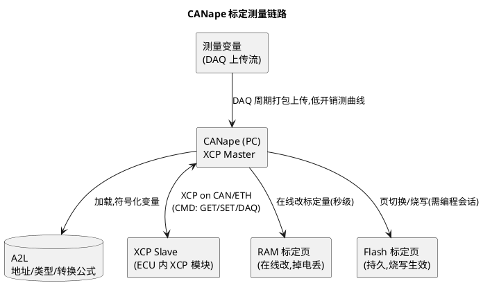

# 03-CANape

> 一句话定位：Vector 的标定与测量工具——经 XCP 直读 ECU 内部变量，在线改标定量、录曲线，是"从总线上看见的"到"ECU 里发生的"那把钥匙。
> 等级：L2 ｜ 前置：[CANoe](01-CANoe.md)

## 原理

CANoe 回答"总线上发生了什么"，CANape 回答"ECU 内部发生了什么"。桥是 **XCP**：ECU 固件里实现 XCP slave（AUTOSAR 的 XCP 模块），CANape 作为 master 经 CAN/ETH 下发命令，读写标定量与测量变量。变量怎么找？靠 **A2L** 文件——描述每个标定/测量量的地址、类型、转换公式（PHY 与 RAW 的映射）。**A2L 地址与固件版本一一对应**，这是本篇所有坑的总根源。

两个模式必须分清：**在线标定**（改 RAM 页立即可测效果，复位即失）与**固化**（写入 Flash 页或生成数据集由诊断刷写）。另一对概念是 **polling vs DAQ**：polling 一次一问、开销大；DAQ 让 ECU 主动按配置周期打包上传，测高频曲线必用 DAQ。

## 详解

### 1. CANape 的四件事

| 能力 | 说明 | 对应需求 |
|---|---|---|
| Measure | DAQ/polling 采集变量曲线，录 MDF 文件 | 标定验证、功能实测 |
| Calibrate | 在线读写标定量，RAM/Flash 页管理 | 参数快速迭代 |
| Flash | 刷程序/刷标定数据 | 免拆壳更新 |
| Diagnose | 集成诊断（加载 ODX/CDD） | 顺路做 UDS 交互 |

### 2. 关键对象

- **Device（ECU 描述）**：一个 Device = 一份 A2L + 传输协议（XCP on CAN/ETH）+ 通道；
- **Experiment/测量配置**：选变量、定采样方式（DAQ 列表/polling）、触发条件；
- **Calibration Page**：RAM 页（工作页）与 Flash 页（参考页）的切换，页切换靠 XCP 的页管理命令；
- **MDF 文件**：测量数据标准格式，MATLAB/MDA 直接打开分析。

### 3. XCP on CAN 速览（够用版）

- 命令走固定报文：CMD(0x01 命令方向)/RES/ERR/SERV/EV，ID 由 ECU 侧配置（如 0x901/0x902 或自定义）；
- 常用命令：`CONNECT`、`GET_STATUS`、`SET_MTA`+`UPLOAD/DOWNLOAD`（读写内存）、`SET_DAQ_PTR`+`WRITE_DAQ`（配 DAQ）、`START/STOP`；
- 详细协议与 ECU 侧配置见 [XCP-on-CAN](../../../06-诊断与标定/2-L2进阶/XCP与标定/01-XCP-on-CAN.md)，A2L 细节见 [A2L文件](../../../06-诊断与标定/2-L2进阶/XCP与标定/02-A2L文件.md)。

### 4. CANoe 里也能标定吗？

CANoe 有 XCP/标定窗口（基础能力），但深度标定（大量 DAQ、页管理、MDF 回放、标定数据管理）的工业实践仍以 CANape 为主；两者可同机并存（注意总线通道与带宽分配）。

## 实操/配置

### 1. 从零连接一个 ECU（步骤）

1. `File → New Project`，新增 Device：选 A2L 文件、传输层 XCP on CAN；
2. 配通道：指定 CAN 通道（走 CANoe 硬件或独立 VN 卡）、命令报文 ID 与波特率，与 ECU 侧 XCP 配置一致；
3. 连接：Device 右键 Connect，`GET_STATUS` 应答即通（失败先查 ID/波特率/ECU 是否初始化了 XCP）；
4. 拖变量：从变量树把测量量拖进 Experiment 窗口，标定量拖进 Calibration 窗口。

### 2. 测量与标定常用操作

| 操作 | 路径 |
|---|---|
| 起停测量 | Experiment 窗口 Start/Stop，数据自动记 MDF |
| 在线改标定量 | Calibration 窗口直接编辑物理值（写入 RAM 页） |
| 切换 RAM/Flash 页 | Device → Page Switching（Init/RAM/Flash 三态） |
| 固化标定 | Calipers → 生成数据集（a2l/hex）或 Flash 编程 |
| DAQ 配置 | Experiment 设置里给变量分 DAQ 列表，选事件通道与周期 |
| 离线分析 | MDF 用 CANape 自带或 MATLAB `mdfImport` 回看 |

### 3. 实用技巧

- 高频变量（>100Hz）一定进 DAQ，polling 会把总线打满还丢点；
- 触发条件（Trigger）配"事件变量跨阈值"，录发作瞬间前后窗口，别全程硬录；
- 标定前后各存一份 `.dsa/.par` 快照，参数回滚全靠它。

## 易错点与陷阱

1. **现象：连接成功但读值全错/乱跳。原因：A2L 与板上固件版本不匹配，地址全飘。对策：核对 ELF/A2L 与固件版本三件套一致；不一致重新生成 A2L（由 ELF+编译器插件导出）。**
2. **现象：DAQ 测量丢点、曲线断。原因：DAQ 带宽超了（事件周期太密/列表太长/总线负载高）。对策：合并低频变量到慢速 DAQ 列表、降采样率、CAN 500k 下预算负载；必要时上 XCP on ETH。**
3. **现象：改了标定量有效果，复位后消失。原因：改的是 RAM 工作页。对策：需要持久就切 Flash 页烧写或走刷写流程；试验期则刻意利用 RAM 页做快速试错。**
4. **现象：连不上 ECU（CONNECT 无应答）。原因：命令/应答 ID 配错、XCP 模块没初始化、或诊断会话未满足前置条件。对策：用 CANoe 抓 CAN 总线看 CONNECT 是否真发出、ECU 是否有应答帧；核对 ECU 侧 Xcp 配置。**
5. **现象：标定量显示只读改不动。原因：A2L 里标定量的访问权限/映射声明（e.g. 只读 MAP）或 seed&key 未解锁。对策：申请 DLL 解锁（key DLL），或修 A2L 记录属性。**
6. **现象：多人同时连一个 ECU 互相打断。原因：XCP slave 通常只允许一个 master。对策：台架排班或加 CANape 服务器版共享测量，避免并发连接。**

## 面试高频题

**Q1：CANape 和 CANoe 的分工？**
答：CANoe 管总线行为——仿真、报文分析、测试自动化；CANape 管 ECU 内部——经 XCP 读内部变量、在线标定、录 MDF、刷写。一个从外面看，一个从里面看；排"总线上为什么没发"用 CANoe，排"为什么发这个值"用 CANape。

**Q2：A2L 文件是干什么的？为什么强调版本匹配？**
答：A2L 是 ECU 的变量描述（ASAP2 标准）：每个测量/标定量的名称、地址、类型、转换公式（RAW↔PHY）、分组。CANape 靠它把地址翻译成人话。地址由链接决定，固件一重编地址就变，所以 A2L 必须与 ELF/固件严格同版本，否则读到的是错误内存。

**Q3：polling 和 DAQ 的区别，什么时候用哪个？**
答：polling 是 master 逐变量请求应答，简单但每变量每采样一次往返，高频不可用；DAQ 是 ECU 侧预先配置的周期上传列表，按事件自动打包发送，开销低适合高频测量。经验：≤10Hz 少量变量 polling 无所谓，>50Hz 或变量多必配 DAQ。

**Q4：在线标定改了参数，怎么让它永久生效？**
答：RAM 页改动只在当前上电周期有效。永久化两条路：一是 CANape 页切换到 Flash 页并执行编程（需编程会话/安全解锁）；二是导出标定数据集（hex/dsa），经诊断刷写（34/36/37 或专用 0x2F/写 DID 流程）烧进 ECU，量产走后者。

## 延伸

- [XCP-on-CAN](../../../06-诊断与标定/2-L2进阶/XCP与标定/01-XCP-on-CAN.md)、[A2L文件](../../../06-诊断与标定/2-L2进阶/XCP与标定/02-A2L文件.md)——CANape 赖以工作的协议与描述文件；
- [CANape实操](../../../06-诊断与标定/2-L2进阶/XCP与标定/03-CANape实操.md)——06 区配套实操细节；
- [CANoe](01-CANoe.md)——外层总线观测，与 CANape 配对使用；
- [CANdela与ODX](04-CANdela与ODX.md)——CANape 诊断功能加载的描述文件从哪来。
