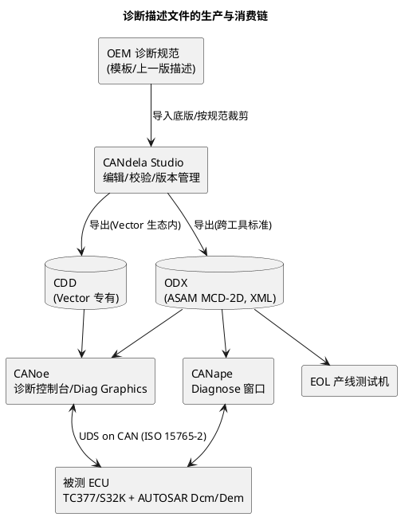

# 04-CANdela与ODX

> 一句话定位：诊断的"字典"从哪来——CANdela Studio 编辑诊断描述，CDD/ODX 两个格式承载它，CANoe/CANape 的诊断窗口加载之后才能把裸字节翻译成人话。
> 等级：L2 ｜ 前置：[CANape](03-CANape.md)

## 原理

UDS 协议只规定"怎么问怎么答"的语法，但"这个 ECU 有哪些 DID、哪些 DTC、会话与安全等级怎么编排、传输层参数是多少"是每个 ECU 独有的——这些信息写在**诊断描述文件**里。诊断工具（CANoe 诊断控制台、CANape、产线 EOL 测试机）加载它之后，才能把 `22 F1 90` 翻译成"读 VIN"，也才能在界面上点按钮发请求、按 NRC 表解释负响应。

两大格式：**CDD**（Vector 专有，CANdela Studio 原生）与 **ODX**（ASAM MCD-2D 标准，XML）。编辑维护它们的主流工具就是 CANdela Studio。给总线工程师的一句话类比：**描述文件之于诊断控制台 = DBC 之于 Trace 窗口 = A2L 之于 CANape**——没有它，工具只能看到裸字节。

一致性铁律：**描述文件、ECU 固件（Dcm/Dem 配置）、测试脚本三者必须同版本**——固件一改 DID 或 DTC，描述文件不跟着改，测试就会"看不见新 DID"或"读出假数据"，这与 A2L 地址漂移是同一类病。

## 详解

### 1. CDD vs ODX（选型一张表）

| 维度 | CDD | ODX |
|---|---|---|
| 出身 | Vector 专有格式 | ASAM 标准（MCD-2D，XML Schema） |
| 适用范围 | Vector 工具链内部、老项目 | 跨厂商：OEM 发布、产线、第三方工具 |
| 内容 | 服务/DID/DTC/会话/安全/传输参数 | 同左，且分层与变体管理更完备 |
| 编辑 | CANdela 原生双向编辑 | CANdela 可导出，亦有专用 ODX 编辑器 |
| 版本坑 | 随 CANdela 版本演进 | ODX 2.0 / 2.2 schema 差异，工具兼容要确认 |

经验法则：内部台架调试用 CDD 省事；跨团队/跨工具交付（给产线、给 OEM、给第三方 HIL）必须给 ODX。

### 2. ODX 结构速览（够用版）

- **COMPARAM-SPEC / COMPARAM-SUBSET**：通信参数——波特率、ISO-TP 的 STmin/BS、寻址方式。多帧传输失败第一落点在这里；
- **DIAG-LAYER-STACK**：按 VEHICLE→功能组→ECU 分层，服务逐层继承复用（车型变体差异只在叶子层覆写）；
- **DIAG-COMM / DIAG-SERVICE**：一条诊断服务 = REQUEST + POS-RESPONSE + NEG-RESPONSE（合法 NRC 列表）+ 参数布局；22/2E/19/27/31 各自一条；
- **DIAG-DICTIONARY**：DTC 表、DID 的数据对象定义（DATA-OBJECT-PROP 描述物理值转换）。

语法细节深入见 06 区 [ODX](../../../06-诊断与标定/2-L2进阶/诊断数据库/01-ODX.md)、[CDD与CANdela](../../../06-诊断与标定/2-L2进阶/诊断数据库/02-CDD与CANdela.md)。

### 3. CANdela 工作流（描述文件怎么维护出来）

| 步骤 | 操作 | 校验点 |
|---|---|---|
| 1 导入底版 | 导入 OEM 模板/上一版描述 | 变体结构（车型/配置）是否正确 |
| 2 编服务 | 增删 22/2E/19/31、改 DID 长度与编码 | 与 Dcm 的 DSL/DSD 配置逐条对齐 |
| 3 编会话与安全 | 会话跳转表、27 服务等级 | 与 [会话与安全配置](../../../06-诊断与标定/2-L2进阶/Dcm配置/03-会话与安全配置.md) 一致 |
| 4 编 DTC 表 | DTC 码/严重度/快照扩展长度 | 与 Dem 事件配置一致 |
| 5 校验导出 | 一致性检查 → 导出 CDD/ODX | 版本号 + 变更记录随 Git 入库 |

### 4. 诊断控制台实操（CANoe 侧高频操作）

| 操作 | 作用 | 入口/示例 |
|---|---|---|
| 加载描述 | 服务符号化 | Diagnostic → Configuration，加载 .odx/.cdd 并绑定 ECU/通道 |
| 选 ECU | 锁定诊断节点 | 诊断控制台左上角 ECU 下拉 |
| 切会话 | 0x10 01/02/03 | Session 栏选 Default/Extended/Programming |
| 安全解锁 | 0x27 seed&key | Security 栏 Send；DLL 路径需预先配置 |
| 读 DID | 0x22 | 双击服务或输入 `22 F1 90` → Send |
| 写 DID | 0x2E | 需先解锁；长度/编码按描述文件校验 |
| 读 DTC | 0x19 02 | status mask 常用 0x08/0xFF，状态位含义见 [读DTC](../../../06-诊断与标定/1-L1基础/UDS协议/SID19-读DTC.md) |
| 例程控制 | 0x31 | 自检/擦除类例程，RID 在描述文件里维护 |
| 留痕 | 复盘归档 | 控制台右键导出日志，或 Trace 记 blf |

### 5. 双平台一句

诊断描述与硬件平台无关：TC377 与 S32K 只要 AUTOSAR Dcm/Dem 配置一致，**同一份 CDD/ODX 通吃两个平台**。描述文件要对齐的对象是 Dcm/Dem 配置，不是芯片——这就是 BSW 工程师要维护"描述文件 ↔ Dcm/Dem 配置 ↔ 诊断测试脚本"三件套同步的原因。

## 实操/配置

### 1. 从描述文件到发出第一条请求（五步）

1. CANoe 工程 `Diagnostic → Configuration`：加载 .odx/.cdd，绑定到目标 ECU 节点与 CAN 通道；
2. 核对 COMPARAM：波特率与总线一致（500k），STmin/BS 与 ECU 侧 CanTp 配置对齐；
3. 配置 seed&key DLL（安全算法库，通常 OEM/算法组提供），否则 0x27 永远 NRC 0x33；
4. 打开 Diagnostic Console：切扩展会话（10 03）→ 安全解锁（27）→ 读 VIN（22 F1 90）验证全链路；
5. Trace 里同步看 0x7xx 请求/应答与多帧时序，NRC 原码一眼可见。

### 2. NRC 排障对照表（收到负响应先查哪）

| NRC | 含义 | 第一落点 |
|---|---|---|
| 0x31 | 请求超范围 | DID/RID 是否在描述文件与 Dcm 里都存在、长度对不对 |
| 0x33 | 安全访问拒绝 | seed&key DLL 配置/算法版本、尝试次数超限 |
| 0x22 | 条件不满足 | 会话没切、前置服务（如先 31 自检）没执行 |
| 0x7F + 0x78 | 响应挂起 | ECU 侧处理慢（Flash/NvM 写），等 pending，别重发 |
| 无响应 | 链路层问题 | COMPARAM 参数、物理/功能寻址、Tx/Rx ID 与 CanTp 配置 |

## 易错点与陷阱

1. **现象：新加的 DID 在诊断控制台里找不到。原因：工具加载的还是老版描述文件。对策：CANdela 更新导出后在 CANoe 重新加载（改描述必须重启测量才生效），并核对描述文件版本号。**
2. **现象：单帧服务（22 F1 87）正常，读长 DID 多帧传输失败。原因：COMPARAM 的 STmin/BS 与 ECU 侧 CanTp 配置不匹配，接收方来不及收连续帧。对策：对照 CanTp 配置改 COMPARAM，重连后验证 0x7F 0x78→正常应答的切换。**
3. **现象：0x27 永远回 NRC 0x33。原因：seed&key DLL 没配置、版本不符或安全等级选错。对策：Diagnostic Configuration 里指定 DLL；先用 OEM 提供的测试 DLL 验证算法链路，再查等级编排。**
4. **现象：同一份 ODX 在 A 工具正常、B 工具解析报错。原因：ODX 2.0 与 2.2 schema 差异，或导出时带了 Vector 专有扩展。对策：导出时选目标工具支持的版本，交付版去专有扩展；工具侧升级 ODX 支持包。**
5. **现象：19 读出的 DTC 内容与 Dem 预期对不上。原因：描述文件 DTC 表与 Dem 事件配置版本错位（固件改了 DTC 码，描述没跟）。对策：以 Dem 导出表为准刷新 CANdela 的 DTC 段，三件套同版本发版。**
6. **现象：一条 0x10 03 发出去全网 ECU 行为大乱。原因：误用功能寻址（0x7DF）发会话/安全服务，全网同时进编程会话。对策：测试默认物理寻址（节点真实 ID）；功能寻址只用于明确的全网广播场景（如 10 01、3E 80）。**

## 面试高频题

**Q1：CDD 和 ODX 的区别？项目里怎么选？**
答：CDD 是 Vector 专有格式，CANdela 原生编辑，Vector 生态内好用；ODX 是 ASAM MCD-2D 开放标准（XML），跨工具跨厂商通用。内部台架快速调试用 CDD；正式交付（OEM 发布、产线 EOL、第三方 HIL）必须给 ODX。注意 ODX 2.0/2.2 的 schema 兼容问题。

**Q2：诊断工具为什么必须先加载描述文件？**
答：UDS 只定义语法不定义每个 ECU 的内容。描述文件告诉工具：有哪些服务/DID/DTC、请求应答的字节布局、合法 NRC 列表、会话与安全编排、传输层参数。加载后工具才能符号化显示、按界面点选发请求、把负响应翻译成原因——相当于诊断世界的 DBC/A2L。

**Q3：怎么保证描述文件和 ECU 侧 Dcm/Dem 配置一致？**
答：流程上把描述文件当代码管：Dcm/Dem 配置变更（增删 DID/DTC、改会话安全）的同一张变更单里必须包含描述文件更新与导出；版本号与固件版本绑定入库；CI 或评审时用 Dem/Dcm 导出表与描述文件做 diff。测试前先核对三者版本三件套。

**Q4：0x27 安全访问在工具侧怎么配？收到 0x33 怎么排？**
答：工具侧要指定 seed&key DLL（实现 OEM 的密钥算法），Security 面板发送 27 01 取 seed、DLL 算 key 后自动发 27 02。回 0x33 的排查顺序：DLL 是否配置且版本正确 → 安全等级是否与描述文件/Dcm 一致 → 尝试次数是否超限（超限要等延时或复位重试）→ 会话是否满足前置。详见 [安全访问](../../../06-诊断与标定/1-L1基础/UDS协议/SID27-安全访问.md)。

## 延伸

- [ODX](../../../06-诊断与标定/2-L2进阶/诊断数据库/01-ODX.md)、[CDD与CANdela](../../../06-诊断与标定/2-L2进阶/诊断数据库/02-CDD与CANdela.md)——06 区正主篇目，格式语法细节在那里展开；
- [UDS服务总览](../../../06-诊断与标定/1-L1基础/UDS协议/01-服务总览.md)——描述文件里每条 DIAG-SERVICE 对应的服务语义；
- [CANoe](01-CANoe.md)、[CAPL](02-CAPL.md)——描述文件加载后，诊断控制台与 CAPL `diagRequest` 两个消费入口；
- [CANape](03-CANape.md)——A2L 与 CDD/ODX 是同一思想的两份"字典"：标定看内部变量，诊断看服务交互。
