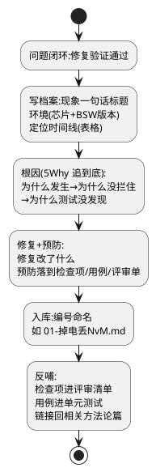

# 00-一坑一档模板

> 一句话定位：每个疑难 bug 一份档案——现象、环境、定位时间线、根因、修复、预防六段式，让踩过的坑变成团队的检查项，而不是个人记忆里的段子。
> 等级：L2 ｜ 前置：[01-从一个坏掉的ECU说起-调试全景](../../00-入门导读/01-从一个坏掉的ECU说起-调试全景.md)

## 原理/套路



5Why 示例（掉电丢 NvM）：
1. 为什么丢？→ WriteAll 没跑完就断电。
2. 为什么没跑完？→ 最坏耗时 46ms，大于整车最小断电保持 30ms。
3. 为什么耗时超标？→ 用户配置块 CRC 大块挤在 WriteAll 低优先级尾部。
4. 为什么设计时没发现？→ 下电窗口没有量化测试项，评审只看功能不看时序。
5. 为什么测试没发现？→ 台架断电是"温柔断电"，没有梯度断电用例。

**追到"流程缺口"才算到底**——根因落不到检查项上的档案等于没写。

## 详解

### 模板正文（复制即用）

```markdown
# XX-案例标题（现象一句话）

- 日期：YYYY-MM-DD ｜ 作者：xxx ｜ 状态：已闭环
- 环境：TC377 / EB tresos X.Y / AUTOSAR 4.4 / 项目代号
- 影响面：XX功能 / 复现率：X% 或 台架N次中M次

## 现象
（用户/测试视角的客观描述，不掺结论。附带证据文件路径：录波/DLT日志/照片）

## 定位时间线
| 时间 | 动作 | 结论 |
|---|---|---|
| D1 上午 | 查 XX 寄存器/日志 | 排除 A |
| D1 下午 | XX 实验 | 缩小到 B |
| D2 | XX 对比测试 | 锁定 C |

## 根因
（一句话根因 + 5Why 链。说清"为什么发生/为什么没拦住/为什么测试没发现"）

## 修复
（改动点：代码/配置/文档，附提交号或变更单号；回归验证方式与结果）

## 预防
- [ ] 检查项：并入 XX 评审清单第 N 条
- [ ] 测试用例：XX 单元测试补边界用例（链接）
- [ ] 台架用例：梯度断电/温度循环等场景（链接）
- [ ] 工具：XX 监控项加入产测/CI
```

命名规范：`序号-现象关键词.md`，与 [调试方法论](../../3-L3高级/调试方法论/README.md) 各篇互链——方法论篇给"套路"，案例库给"实例"，两头引用。

## 易错点与陷阱

1. **现象**：档案写成了"改动说明"。**原因**：只记修复没记定位过程，下次同类问题还得重走弯路。**对策**：定位时间线必须保留"排除项"——走过的死路同样值钱。
2. **现象**：根因写"代码写错了"。**原因**：没问"为什么错、为什么没拦住"。**对策**：强制 5Why，最后一问必须落在流程/评审/测试缺口上。
3. **现象**：档案入库后无人问津。**原因**：预防项没落到具体清单，成了空话。**对策**：预防四选一必填（检查项/用例/台架场景/工具监控），且有责任人与完成标记。
4. **现象**：环境信息缺失，半年后无法复现验证。**原因**：当时觉得"不就是版本号嘛"。**对策**：模板头部环境字段必填，含芯片、BSW 版本、项目代号、软件 tag。
5. **现象**：同一坑换个人再踩。**原因**：档案躺在库里，新人不知道读。**对策**：新人入职清单挂案例库索引；评审会上按预防检查项点名核对。

## 面试高频题

**Q：为什么踩坑案例要单独建库而不是写在周报/邮件里？**
答：三个理由：可检索——按现象关键词能秒查同类问题，避免重复排查；可闭环——档案结构强制把"根因"推进到"预防检查项"，周报里的教训通常止于感慨；可传承——人员流动时案例库是团队资产，且能和方法论篇互相引用形成"套路+实例"的知识网。写法的核心差别是：档案是"时间线+证据+检查项"的结构化数据，不是叙事文。

**Q：一个合格的"根因"应该写到什么深度？**
答：至少三层：直接技术原因（哪个函数哪个时序错了）→ 防线缺口（为什么评审/静态检查没拦住）→ 流程缺口（为什么测试用例没覆盖）。只写第一层是"修复记录"；写到第三层才叫"根因"，因为只有第三层能转化为检查项和用例，防止同类问题再发。用 5Why 链把三层串起来写进档案。

**Q：5Why 追问时怎么避免越问越虚（都怪到"人不行"）？**
答：每问一层都要有证据支撑（日志、实验、时间线），不允许推测性归因；把"人的失误"翻译成"系统的缺口"——代码写错要问"什么样的检查项/工具能在提交前发现"，而不是"下次仔细点"。原则：每一 Why 都要能对应一个可执行的改进项，落不到改进项就说明还没追到真因。

**Q：案例库和踩坑复盘会怎么配合？**
答：档案在问题闭环后 3 日内由定位人写，复盘会上过一遍：验证根因链是否成立、预防项是否可执行、指派责任人；会上还要问一句"这次的方法论哪步缺了"，反哺 [调试方法论](../../3-L3高级/调试方法论/README.md) 各篇的决策树。库是存量沉淀，会是增量入口，缺一头闭环就断。

## 示例案例：掉电丢 NvM（模板填充示范）

# 07-掉电丢用户配置

- 日期：2025-11-20 ｜ 作者：xxx ｜ 状态：已闭环
- 环境：S32K148 / EB tresos 28.1 / AUTOSAR 4.4 / 仪表项目 V2.3
- 影响面：用户个性化设置丢失 / 复现率：产线 0.3%

## 现象

整车 KL15 off 再上电后，用户配置（座椅/背光偏好）偶发回到出厂默认。无相关 DTC，日志显示 NvM 读结果为默认值。

## 定位时间线

| 时间 | 动作 | 结论 |
|---|---|---|
| D1 上午 | 读 NvM job 结果码与块状态 | 接口层无 NOT_OK——排除"读失败" |
| D1 下午 | 程控电源梯度断电（100/50/20/10ms ×N） | 20ms 档丢失 3/20——锁定下电窗口 |
| D2 上午 | 量 NvM_WriteAll 最坏耗时 | 46ms > 整车最小保持 30ms |
| D2 下午 | 按块拆耗时 | 用户配置块（含 CRC 大块）在列表尾部低优先级 |

## 根因

一句话：WriteAll 最坏耗时超出整车断电保持时间，低优先级用户配置块被挤出窗口。
5Why：没写完→窗口不够→CRC 大块在尾部→下电窗口无量化测试项→台架只有温柔断电（流程缺口）。

## 修复

用户配置块改为变更即写（NvM_SetRamBlockStatus+立即写）；WriteAll 清单瘦身；CRC 分片。变更单 CR-2103；梯度断电 10ms×500 次零丢失。

## 预防

- [x] 检查项：CDD 评审清单加"下电窗口预算表"（[04-模板与评审清单](../../../04-MCAL与外设驱动/2-L2进阶/CDD设计方法论/04-模板与评审清单.md)）
- [x] 测试用例：NvM 层单元测试补"写一半断电"模拟用例
- [x] 台架用例：程控电源梯度断电进下线测试
- [ ] 工具：WriteAll 耗时监控入产测报表

## 延伸

- [01-复位溯源](../../3-L3高级/调试方法论/01-复位溯源.md)：先分清复位还是唤醒再立案
- [05-NvM失效](../../3-L3高级/调试方法论/05-NvM失效.md)：NvM 类问题的完整方法论
- [03-睡眠与假醒](../../../05-汽车网络通讯/2-L2进阶/网络管理/03-睡眠与假醒.md)：假醒类案例的方法论母篇
- [01-NvM块管理](../../../07-AUTOSAR架构/2-L2进阶/内存栈/01-NvM块管理.md)：块类型与写策略，预防项的理论依据
