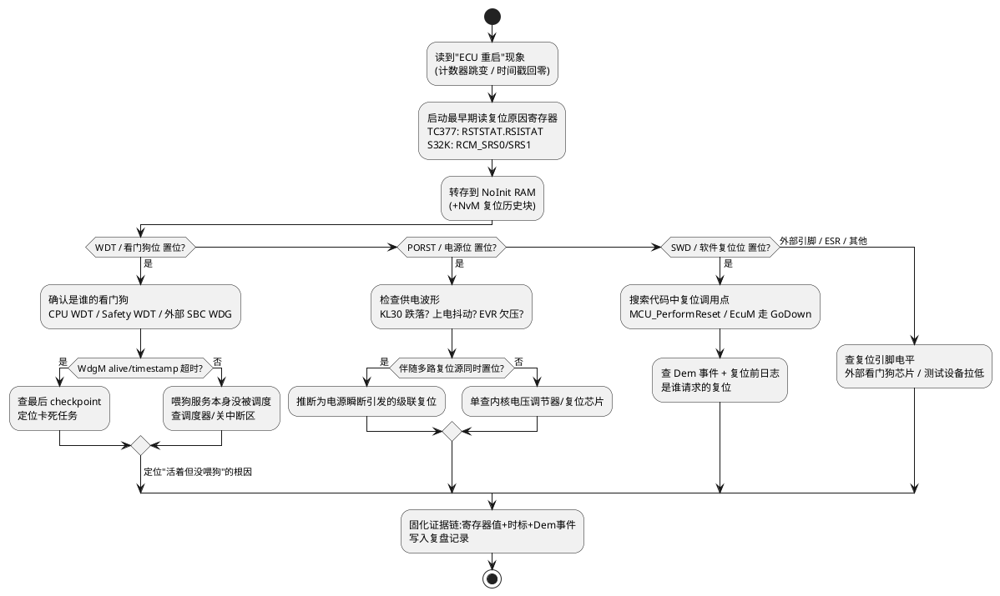

# 01-复位溯源

> 一句话定位：拿到"ECU 莫名重启"的现象，从复位原因寄存器一路追到 EcuM 复位类型与最终诱因，把"谁复位的"钉死成一条证据链。
> 等级：L2→L3 ｜ 前置：[01-从一个坏掉的ECU说起-调试全景](../../00-入门导读/01-从一个坏掉的ECU说起-调试全景.md)

## 太长不看

- 复位溯源三步走：**读复位原因寄存器 → 映射成 EcuM 复位类型 → 沿"看门狗/电源/软件"三类分叉找诱因**。
- 复位原因必须**在 main 之前（或启动最早期）读取并转存到 NoInit RAM / NvM**，否则会被下一次复位或 bootloader 冲掉。
- 看门狗复位、电源复位、软件复位在寄存器上是**独立 bit**，多位同时置位时要按"谁在先、谁能清谁"推断复位链。
- 只读寄存器不够：配上**复位计数器 + 最后一次喂狗/调度的时标**，才能区分"没人喂狗"和"任务卡死没机会喂"。

## 原理/套路

## 详解

### 1. 复位原因寄存器链

复位原因不是"一个寄存器读一个值"那么简单，它是一条链：

1. **硬件置位**：复位源发生时，芯片在复位域里置位 RSTSTAT（TC377）或 RCM_SRSx（S32K）的对应 bit。
2. **软件读取**：上电早期由 MCAL（`Mcu_GetResetReason`）读出，多数芯片该寄存器**写 1 清除或仅上电复位清除**，读了就没了。
3. **软件转存**：写入 NoInit RAM（不初始化段）+ NvM 复位历史块，供 Dem 上报与应用层使用。
4. **bootloader 转发**：若存在 Boot→App 跳转，Boot 必须**先读再通过共享 RAM 转发**给 App，否则 App 看到的永远是 Boot 自己产生的软件复位。

TC377 常用判读位：`PORST`（上电/外部复位脚）、`SWD`（软件复位）、`WDT`（CPU 看门狗）、`EVR`（内核电压调节器异常）、`CB0/CB1`（时钟失效检测）、`SMU`（安全管理的复位请求）、`STBYR`（standby 唤醒）。S32K 对应：`SRS.POR`、`PIN`（外部引脚）、`WDOG`、`SW`、`LOCKUP`（内核 lockup）、`LVD`（低压检测）。

### 2. EcuM 复位类型与软件链

AUTOSAR 语境下，复位证据链要走通 EcuM 这一层：

- `Mcu_GetResetReason()` 把寄存器值翻译成 `MCU_POWER_ON_RESET / MCU_SW_RESET / MCU_WATCHDOG_RESET` 等枚举；
- EcuM 在初始化阶段据此判定**冷启动/热启动**（`EcuM_ValidateWakeupEvent` 走的分支不同），并把复位原因交给 Dem 记录（如 `DEM_EVENT_RESET_SOURCE`）；
- 应用层请求重启走 `EcuM_Reset`（或 `EcuM_GoDown(E_RESET)`）→ MCU 驱动执行软件复位，**这条路径必然置 SWD/SW 位**——看到软件复位先别慌，可能是自己程序里正常的复位请求。
- 主动复位链路详见 [EcuM/02-上下电时序](../../../07-AUTOSAR架构/2-L2进阶/系统服务栈/EcuM/02-上下电时序.md)。

### 3. 三类复位鉴别表

| 特征 | 看门狗复位 | 电源复位 | 软件复位 |
|---|---|---|---|
| 寄存器位 | WDT/WDOG | PORST/POR/LVD/EVR | SWD/SW |
| 复位计数器 | 常与"任务卡死"伴生 | 常与电源波形异常伴生 | 与代码调用点一一对应 |
| NoInit RAM | 保留（可看到最后时标） | 可能被破坏（电压不足） | 完整保留 |
| 典型根因 | 死循环/关中断过长/WdgM 超时 | KL30 跌落/上电抖动/调节器欠压 | 应用主动重启/Boot 升级/失败兜底 |

多位同时置位不矛盾：电源瞬断会同时打 PORST 和 WDT（看门狗在低压下先失效），此时**以电源位优先**判断第一因。

## 实战走查

- **现象**：台架烘烤测试中，域控制器每 2~4 小时重启一次，现场只留下"仪表黑屏 2 秒后恢复"。
- **按套路走**：
  1. 复位历史块读出：`RSTSTAT = WDT`，复位计数器 +3；排除电源与软件复位。
  2. NoInit RAM 里的最后调度时标显示：复位前 1.2 s 起，所有 10 ms 任务时标全部停更，但 1 ms 中断时标还在走——**系统没死，是低优先级任务饿死**。
  3. 查 WdgM：被监督实体 SE3 的 checkpoint 停在 `RUNNING`，恰好对应 CanIf 发送任务。
  4. CAN 报文日志对齐时间轴：复位前 1.2 s 总线出现 busoff 风暴，CanIf 在错误处理里自旋重试。
- **定位**：CanIf 发送失败重试逻辑无退出条件，独占 CPU 导致喂狗任务饿死。
- **根因**：busoff 恢复策略中重试循环缺少超时退出（配置移植时丢了参数）。
- **修复**：重试循环加超时计数并上报 Dem，让 CanSM 接管恢复；WdgM 侧给 SE3 配置合理的死区。复测 48 h 无复位，复位计数器归零。

## 易错点与陷阱

1. **现象**：每次查复位原因都是"软件复位"。**原因**：bootloader 启动 App 前自己也做了一次软件复位，覆盖了原始复位源。**对策**：Boot 读到原因后写入共享 NoInit RAM 再跳转，App 优先读转存值。
2. **现象**：看门狗复位位时有时无，规律不明。**原因**：RSTSTAT 在下一次上电前被代码里某处"写 1 清除"式误操作清掉。**对策**：启动早期一次性读出并立即转存，全工程只允许这一处访问。
3. **现象**：判定为电源复位，但示波器抓电源毫无异常。**原因**：实际是外部 SBC 看门狗拉低复位脚，落在了 PIN/EXTR 位，误读了 PORST。**对策**：把外部复位脚复位单独当一类源排查，先看脚上的波形。
4. **现象**：复位计数器涨了但功能无感。**原因**：软件里有"失败就重启"的兜底逻辑（如初始化失败 `MCU_PerformReset`），复位是设计内行为。**对策**：软件复位必须配 Dem 事件与复位前日志，兜底点全部登记。
5. **现象**：NoInit RAM 转存值偶尔全 0xFF。**原因**：NoInit 段被启动代码的 RAM 清零例程覆盖（链接脚本/启动文件改过）。**对策**：把复位信息区放进带魔数校验的结构体，校验失败按"信息丢失"上报而不是当真值用。
6. **现象**：温箱低温下"看门狗复位"频发，常温正常。**原因**：低温下 Flash 等待周期参数未随频段调整，取指偶发错误引发跑飞后卡死。**对策**：复位溯源只到"谁复位"，根因要顺着 Trap/异常记录继续走（见下一篇）。

## 面试高频题

**Q：看门狗复位和电源复位在寄存器层面怎么区分？如果两个位同时置位怎么解释？**
答：看寄存器独立 bit：TC377 的 `RSTSTAT.WDT`、S32K 的 `RCM_SRS.WDOG` 表示看门狗超时复位；`PORST`/`POR`/`LVD`/`EVR` 表示电源类复位。同时置位常见于电源瞬断：电压跌落过程中看门狗计数器先乱套触发 WDT，随后电源监测触发 PORST——此时以电源位为第一因，并用示波器抓 KL30 波形佐证；若电源干净，则可能真是任务卡死导致喂狗停止。

**Q：为什么复位原因必须在 main 之前读取？AUTOSAR 里由谁负责？**
答：复位原因寄存器大多"读后清除"或"仅上电清除"，且 bootloader 跳转、启动中二次复位都会把它冲掉。标准做法是在启动早期（SystemInit 或 Mcu 驱动初始化）读出，写入 NoInit RAM，再由 `Mcu_GetResetReason()` 供 EcuM/Dem/应用层消费。EcuM 用它区分冷启动与热启动，决定走哪个初始化分支。

**Q：ECU 出现看门狗复位，你的排查步骤是什么？**
答：先确认是哪个看门狗（CPU WDT、Safety WDT、外部 SBC WDG）；再看 NoInit RAM 里最后调度时标判断是"全死"还是"局部饿死"；接着查 WdgM 最后 checkpoint 找到卡死的监督实体；最后结合总线日志/Trap 记录定位诱因（busoff、死循环、关中断过长）。复位原因只回答"谁复位"，不回答"为什么"，要靠时标与上下文补全证据链。

**Q：软件复位有哪些实现方式？各自落哪个复位源位？**
答：TriCore 上可用 `__asm(syscfg)` 触发复位、写 RST_REQ 类寄存器、或经 SMU 请求复位；S32K 上写 `RCM_SRS` 不触发复位，通常写 `SCB_AIRCR` 的 SYSRESETREQ 或调用 `MCU_PerformReset`。它们一般落 SWD/SW 位；经 SMU 的安全复位可能落 SMU 位。排查软件复位要 grep 全工程复位调用点并逐一登记用途。

## 工程深入场景

当复位原因指向 Safety WDT/SMU 复位、且伴随时钟失效（CB0/CB1）或多核级联复位时，就进入了功能安全复位的深水区：SMU 的复位请求树（CPU 复位 vs 系统复位 vs 仅报警）、时钟监控（CCU6/ERU 配合）与 FMEDA 的关系都需要系统学习。此时应回到 [WdgM/02-失效响应](../../../07-AUTOSAR架构/2-L2进阶/系统服务栈/WdgM/02-失效响应.md) 与 [TC377-WDT](../../../04-MCAL与外设驱动/2-L2进阶/Wdg/02-TC377-WDT.md) 把安全监控链路吃透，再回来解释寄存器现象。

## 延伸

- [02-Trap-HardFault定位](02-Trap-HardFault定位.md)：复位源指向跑飞时，下一站是 Trap 现场
- [05-NvM失效](05-NvM失效.md)：复位时序与下电窗口互相纠缠的高频组合
- [复位启动初识-第一条指令从哪来](../../../02-芯片与体系结构/00-入门导读/04-复位启动初识-第一条指令从哪来.md)：寄存器之前的硬件复位域
- [WdgM/01-监督实体与checkpoint](../../../07-AUTOSAR架构/2-L2进阶/系统服务栈/WdgM/01-监督实体与checkpoint.md)：看门狗复位的上层语义
- [看门狗原理](../../../04-MCAL与外设驱动/2-L2进阶/Wdg/01-看门狗原理.md)：内外部看门狗行为差异
