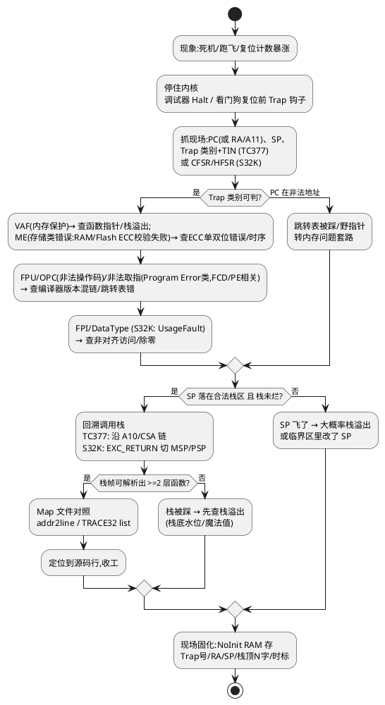

# 02-Trap-HardFault定位

> 一句话定位：ECU 死机/跑飞后别急着重启复现，先把 Trap/HardFault 现场钉住——停住、抓 PC/返回地址、判 Trap 类别、回溯调用栈、对 Map 文件，五步把"跑哪儿去了"变成"哪行代码"。
> 等级：L2→L3 ｜ 前置：[01-复位溯源](01-复位溯源.md)

## 太长不看

- 死机定位固定五步：**停住 → 抓现场（PC/RA、SP、Trap 号）→ 判类别 → 回溯调用栈 → 对 Map 找源码行**，缺一步都可能白干。
- TC377（TriCore）抓 **Trap 类别 + TIN + 返回地址 A11**；S32K（Cortex-M）抓 **PC/LR + HFSR/CFSR + MMFAR/BFAR**，两套路数同构。
- 调用栈回溯是分水岭：能回溯到出事前的正常函数，问题在**最后几层**；栈本身已烂，问题多半是**踩内存/栈溢出**，转内存问题套路。
- Trap 现场必须**落盘**（NoInit RAM + 复位后上报 DTC），只靠调试器挂着等复现，在台架/路试场景基本等不到。

### 工程深入场景

日常做到"Trap 号 + 返回地址 + 两层调用栈"就能解决 80% 问题。只有当现场栈已破坏、需要手工解析 CSA 链，或要做 Lockstep 核比对失效分析时，才需要深入 [CSA 上下文机制](../../../02-芯片与体系结构/3-L3高级/TriCore架构/02-CSA上下文机制.md) 与 [TC377-Trap分类与TIN](../../../02-芯片与体系结构/3-L3高级/异常与Trap/01-TC377-Trap分类与TIN.md)。

## 原理/套路

## 详解

### 1. 先停住，再说话

死机现场是易失证据，三种"停住"方式按优先级排：

1. **调试器 Halt**（TRACE32 attach / J-Link halt）：最直接，台架复现首选。
2. **Trap 处理钩子**：在默认 Trap 入口（TriCore 的 `__trap_vec` 派发处、Cortex-M 的 `HardFault_Handler`）写一个"现场快照 + 死循环喂狗停"函数，把寄存器组搬进 NoInit RAM 后 `while(1)`，等看门狗复位后在复位溯源里捞出来。这是量产件定位的主力手段。
3. **复位后倒查**：只拿到复位原因=WDT 时，说明现场已被冲掉，只能靠 NoInit RAM 里提前埋的时标/心跳反推。

TriCore 侧的 trap 入口汇编长什么样、寄存器怎么进栈，见 [04-trap入口代码](../../../01-编程语言/2-L2进阶/汇编基础/TriCore汇编/04-trap入口代码.md)。

### 2. 现场抓什么（寄存器清单）

| 目标 | TC377 (TriCore) | S32K (Cortex-M) |
|---|---|---|
| 出事点 | Trap 返回地址 A11（BTV 派发的上下文） | 压栈的 PC（EXC_RETURN 帧） |
| 类别号 | Trap Class 0~7 + TIN（查 BTV/寄存器） | HFSR.FORCED→看 CFSR 细分位 |
| 访问地址 | DPI 类：DIEAR/PIEAR | MMFAR / BFAR |
| 栈指针 | A10 / ISP | MSP / PSP（靠 EXC_RETURN 位2区分：bit2=0 返回后用 MSP，bit2=1 用 PSP） |
| 上层调用者 | PCXI 链（CSA） | LR 及栈上回溯帧 |

### 3. 类别判定速查

- **内存保护类**（TC377 Tag Overflow / MPU；Cortex-M MemManage/BusFault）：指向函数指针烂了或越界写——九成是踩内存，转 [06-内存泄漏与越界排查](../../../01-编程语言/2-L2进阶/内存管理/06-内存泄漏与越界排查.md)。
- **非法取指/操作码**：跳转表算错、RAM 函数 cache 不一致、Flash 擦除时还在取指（XIP 刷写场景高发）。
- **算术/非对齐**：除零、结构体指针强制转换后非对齐访问（Cortex-M0 无硬件非对齐，直接 UsageFault）。
- **FPU 上下文类**：中断里用了 FPU 又没开 lazy stacking。

### 4. 调用栈回溯 + Map 对照

- TC377：函数返回走 `RET`→恢复 CSA，回溯要沿 **PCXI 链**走；手工解链麻烦，直接用 TRACE32 `var /frame` 一把梭。
- Cortex-M：主线程栈在 PSP、Handler 在 MSP，先看 LR 的 EXC_RETURN 选中正确栈，再按 FP 帧或 `addr2line` 解。
- Map 对照：把地址丢给 `addr2line -e app.elf -f -C 0xA0001234`，或 TRACE32 `list` 直接带源码。注意**链接地址 vs 运行地址**（BMI/Boot 搬运场景要先减偏移）。

## 实战走查

- **现象**：S32K 平台 CDD 升级包校验功能，台架偶发（约 1/300 次）死机，看门狗复位。
- **走查**：Trap 钩子抓到现场 `HFSR.FORCED=1, CFSR.IBUSERR=1`（BFSR：取指总线错误），压栈 PC=0x0000BEEF——典型跳转表被踩。
- **回溯**：MSP 栈帧解出两层：`CddUpg_VerifyCb ← Crc_CalcCRC16Hw`，问题函数锁定在升级回调链。
- **对 Map**：0x0000BEEF 不落任何段，但位于 `.bss` 的 `CddUpg_JumpTable` 附近；查看代码发现回调表是运行时填充的，先用了后填了（时序问题），竞态窗口里取指取到旧值 0xBEEF（初始化魔法值）。
- **修复**：表先填好再注册中断；魔法值改为 NULL 并在使用处判空。3000 次压测无复现。

## 易错点与陷阱

1. **现象**：Trap 钩子本身又触发 Trap，系统直接锁死。**原因**：钩子里调用了 printf/OS 服务等非异步信号安全函数。**对策**：钩子只做裸寄存器搬运 + 写 NoInit RAM，一个库函数都不许调。
2. **现象**：回溯出的调用栈"看起来完全不合理"（都是 OS 调度函数）。**原因**：取错了栈——中断嵌套时现场可能在 Handler 栈。**对策**：先看 EXC_RETURN/PCXI 确定当前栈，再逐层剥。
3. **现象**：addr2line 显示源码行"明显不可能出错"。**原因**：开了优化，PC 落在尾调/内联重排后的地址。**对策**：以 Map 的函数边界为准，行号仅参考；Debug 版复现优先。
4. **现象**：死机只在高负载出现，一挂调试器就消失。**原因**：调试器改变了时序/关掉了看门狗。**对策**：改用 Trap 钩子 + NoInit RAM 离线捞现场，调试器只做事后 attach。
5. **现象**：栈回溯一层就断，SP 指向数据区。**原因**：栈溢出——深递归或大局部数组（`uint8 buf[2048]` 挂在任务栈）。**对策**：任务栈底埋水位标记 + 栈高水位监控；大缓冲改静态分配。
6. **现象**：TC377 上抓到 Class3（地址错）但 PIEAR 是 0。**原因**：Trap 类寄存器被更高优先级 Trap 覆盖（级联异常）。**对策**：钩子里把 BTV/类号也存下来，按最后一级倒推。

## 面试高频题

**Q：S32K 上发生 HardFault，你按什么顺序看哪些寄存器？**
答：先看压栈帧拿 PC/LR（从 EXC_RETURN 判断用 MSP 还是 PSP）；再看 `SCB->HFSR.FORCED` 确认是硬错误放大；接着看 `CFSR` 三段——MemManage（MMFSR+MMFAR，内存保护/非对齐）、BusFault（BFFSR+BFAR，总线错误，地址在外设区多半是寄存器访问错）、UsageFault（UFSR，除零/非法指令/栈对齐）；最后用 addr2line 对 Map 定位源码行。一句话：**PC 定"谁"、CFSR 定"哪种错"、MMFAR/BFAR 定"错在哪"**。

**Q：TC377 的 Trap 和 Cortex-M 的中断异常机制在定位上有什么差别？**
答：TC377 是同步 Trap，硬件自动跳 BTV 向量表并带 Trap Class（0~7）+ TIN，返回地址在 A11、上层上下文在 PCXI 指向的 CSA 链里，回溯要解 CSA；Cortex-M 是异常模型，硬件自动压栈 8 个寄存器（可含 FPU 帧），栈上直接有 PC，回溯沿栈帧走。定位套路同构：都是"类别→出事点→调用链→Map"，差别只在**现场存放位置（CSA vs 栈）和类别读法（TIN vs CFSR）**。

**Q：为什么 Trap 现场要存 NoInit RAM，直接串口打印不行吗？**
答：三个原因：一是死机现场可能连 UART 时钟都被改坏，打印函数本身不可靠；二是量产件/路试场景没有调试器，必须靠复位后回读；三是 NoInit RAM 复位不清零，与复位溯源链路（复位计数、时标）天然拼成一条证据链。打印只适合开发台架上的辅助手段，不能当证据保存机制。

**Q：调用栈回溯失败、栈内容已经乱掉，下一步怎么走？**
答：栈乱说明现场二次破坏，转"内存问题定位"套路：查任务栈水位判断是否栈溢出；在疑似被害数据区前后埋红区/校验和；用数据断点（TRACE32 break on write）守株待兔；结合 06-内存泄漏与越界排查 的分区排查法先缩小"谁在踩"，再谈"为什么跑飞"——**跑飞往往是结果，踩内存才是根因**。

## 工程深入场景

当需要手工解析 CSA 链、分析 Lockstep 核比对 Trap、或构建"Trap 自动分类统计"（按 Class/TIN 聚合上报 DTC）时，才需要啃 [02-CSA上下文机制](../../../02-芯片与体系结构/3-L3高级/TriCore架构/02-CSA上下文机制.md)、[03-Trap与中断机制](../../../02-芯片与体系结构/3-L3高级/TriCore架构/03-Trap与中断机制.md) 和 [03-HardFault定位](../../../02-芯片与体系结构/3-L3高级/异常与Trap/03-HardFault定位.md) 的内核级细节。

## 延伸

- [03-busoff排查](03-busoff排查.md)：跑飞的常见诱因之一是总线风暴引发的死循环
- [TC377-Trap分类与TIN](../../../02-芯片与体系结构/3-L3高级/异常与Trap/01-TC377-Trap分类与TIN.md)：类别号速查表
- [02-Trap定位方法](../../../02-芯片与体系结构/3-L3高级/异常与Trap/02-Trap定位方法.md)：同主题硬件视角
- [06-内存泄漏与越界排查](../../../01-编程语言/2-L2进阶/内存管理/06-内存泄漏与越界排查.md)：栈烂之后的主战场
- [01-TRACE32](../../1-L1基础/调试器/01-TRACE32.md)：现场解栈的趁手工具
