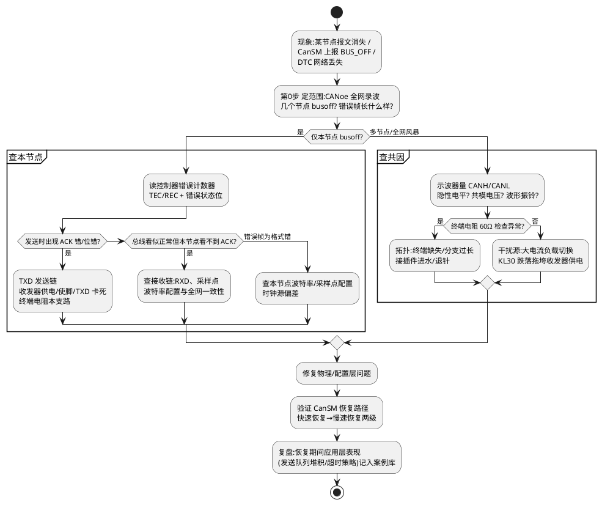

# 03-busoff排查

> 一句话定位：CAN 节点掉线别只会重启，按"物理层→帧层→PDU→应用"分层分治，先确认是单节点 busoff 还是全网风暴，再决定往采样点、收发器还是 CanSM 恢复策略去挖。
> 等级：L2→L3 ｜ 前置：[02-Trap-HardFault定位](02-Trap-HardFault定位.md)

## 太长不看

- busoff 是**结果**不是原因：TEC 涨过 255 说明本节点持续发送失败，先问"总线物理层坏了还是我在发烂帧"。
- 排查永远从**分层分治**开始：物理层（电阻/波形）→ 帧层（错误帧类型/采样点）→ PDU 层（CanIf 队列、ID 冲突）→ 应用层（CanSM 恢复状态机）。
- 单节点 busoff 和全网风暴的排查方向**完全不同**：前者查本节点（波特率、TXD 卡死、电源），后者查拓扑与共因（终端电阻、地偏移、干扰源）。
- 恢复策略要落在 CanSM（快速/慢速恢复两级），**不要在 CanIf/驱动里私自自旋重试**——那是喂狗饿死类复位的经典起点。

### 工程深入场景

日常用错误计数器 + CANoe 复现即可闭环。只有做"busoff 恢复时序与整车网络共存"（多节点同时恢复的风暴抑制）或 CAN FD 混网错误定位时，才需要深入 [02-busoff恢复策略](../../../05-汽车网络通讯/1-L1基础/CAN/总线错误与恢复/02-busoff恢复策略.md) 与 [02-与经典CAN共存](../../../05-汽车网络通讯/1-L1基础/CAN/CAN-FD/02-与经典CAN共存.md)。

## 原理/套路

## 详解

### 1. 先看计数器，再谈恢复

busoff 的硬件语义：TEC（发送错误计数器）> 255 → 控制器脱离总线，需软件干预（或等待 128×11 个隐性位后由软件触发恢复）。排查时先读三样东西：

- **TEC/REC 当前值与历史峰值**：TC377 MCAL/Eceray 寄存器、S32K FlexCAN 的 `ECR` 寄存器（FlexCAN 在 busoff 后 TEC 清零重计，要靠中断里快照）。
- **错误状态位**：Error Warning / Error Passive / Bus Off 三态，见 [01-错误计数器与状态](../../../05-汽车网络通讯/1-L1基础/CAN/总线错误与恢复/01-错误计数器与状态.md)。
- **错误帧长什么样**：CANoe Error Frame 里区分 stuff/CRC/ACK/位错误——**ACK 错查别人，位/CRC 错查自己**（详见 [04-错误帧](../../../05-汽车网络通讯/1-L1基础/CAN/协议原理/04-错误帧.md)）。

### 2. 分层分治表（通讯栈视角）

| 层 | 典型症状 | 排查动作 | 工具 |
|---|---|---|---|
| 物理层 | 隐性电平不回、振铃、共模异常 | 量电阻（应≈60Ω）、示波器看波形 | 万用表/示波器 |
| 帧层 | 位错/ACK 错/格式错 | 核对波特率、采样点、时钟源 | CANoe 图形窗口 |
| PDU 层 | 队列满、ID 冲突、报文风暴 | 看 CanIf Tx 确认/超时统计、Com 发送超时 | Dlt 日志/CANoe 统计 |
| 应用层 | 恢复后又立刻 busoff | 查 CanSM 两级恢复时序、恢复后发送补偿风暴 | CANoe + 代码走读 |

采样点错配是"偶发 busoff"头号元凶，计算与验证见 [02-位时序与采样点](../../../05-汽车网络通讯/1-L1基础/CAN/协议原理/02-位时序与采样点.md)。

### 3. AUTOSAR 恢复链路

CanIf 检测到 busoff → 上报 CanSM → CanSM 走 `BUS_OFF_RECOVERY`：先快速恢复（关中断→等待 129 个总线空闲→重启控制器），失败转慢速恢复（通知 Com 停发、BswM 切模式）。链路细节见 [03-CanSM](../../../07-AUTOSAR架构/2-L2进阶/通讯服务栈/03-CanSM.md) 与 [06-CanIf-LinIf](../../../07-AUTOSAR架构/2-L2进阶/通讯服务栈/06-CanIf-LinIf.md)。**恢复期间应用必须能扛住"通讯静默几百毫秒"**，这是设计评审要过的检查项。

## 实战走查

- **现象**：冬季路试，车门域控每天早高峰偶发 1~2 次 busoff，DTC 显示 CAN2 网络丢失 200ms 后自恢复。
- **走查**：
  1. CANoe 回放：busoff 瞬间总线上出现**连续 20+ 个 stuff 错误帧**，随后本节点 TEC 飙满——帧层先坏。
  2. 单节点复测：只有左后门节点同时掉线，范围锁定为两节点共因。
  3. 示波器挂总线：busoff 前夕 CANL 隐性电平抬高 0.4V，共模异常——物理层。
  4. 查拓扑：CAN2 支路过门铰链接插件，低温收缩后接触电阻变大，振铃加剧导致采样错位。
- **修复**：接插件换型 + 支路长度收敛；CanSM 侧补两级恢复参数，恢复期 Com 报文用事件触发补发避免风暴。低温箱 -40℃ 复测 48h 通过。

## 易错点与陷阱

1. **现象**：节点 busoff 后"自动恢复"了，没人管。**原因**：FlexCAN 等控制器硬件自动重启 + 应用没感知，问题被掩盖。**对策**：busoff 必须挂 DTC + 计数器，恢复路径全量监控。
2. **现象**：恢复后立刻再次 busoff，循环往复。**原因**：恢复瞬间积压报文全量重发，自己把自己打挂。**对策**：恢复后发送节流（先高优先级），CanSM 慢速恢复里通知 Com 丢弃过期数据。
3. **现象**：只在本节点发某条大长度报文时 busoff。**原因**：与另一节点 ID 冲突或 DLC 超出对方过滤器假设（混网 FD/经典 CAN）。**对策**：对照通讯矩阵查 ID 唯一性与 FD 兼容性。
4. **现象**：示波器波形完美，CANoe 却看到错误帧。**原因**：采样点配置错——单看模拟波形看不出"采错位置"。**对策**：用 CANoe 的采样点验证功能或双通道对比采样时刻，别迷信波形好看。
5. **现象**：调试器一断开就 busoff。**原因**：调试占用延长了收发器使能脚/STB 脚的切换时序。**对策**：排查时把收发器模式切换（Normal/Standby）逻辑单独验证，CanTrcv 状态机见 [07-CanTrcv](../../../07-AUTOSAR架构/2-L2进阶/通讯服务栈/07-CanTrcv.md)。
6. **现象**：整车一起动就 busoff，台架怎么都不复现。**原因**：EMC 干扰/地偏移，台架供电干净。**对策**：路试挂 CANoe + 电流探头，重点抓干扰事件与总线错误的时序相关性。

## 面试高频题

**Q：CAN busoff 的触发条件是什么？进入 busoff 后节点如何恢复？**
答：发送错误计数器 TEC 超过 255 时控制器进入 busoff，脱离总线（不收不发）。恢复分硬件辅助与软件主导：总线空闲 128×11 个隐性位后 TEC 自动清零条件满足，但多数控制器需软件重启控制器（复位 busoff 标志、重新进入正常模式）。AUTOSAR 里由 CanSM 的 BUS_OFF_RECOVERY 状态机驱动：快速恢复（CAN controller restart）失败则转慢速恢复（停 Com 发送、走模式切换），恢复后控制发送节奏防止二次风暴。

**Q：ACK 错误和位错误分别指向什么问题？**
答：ACK 错是"我发的帧没有任何节点应答"——本节点发送大概率没错，是**别的节点都没在线**（或都在错误被动态不回 ACK），查总线其他节点/拓扑；位错误是"我发的位读回来和发的不一致"——**本节点发送链或物理层有问题**（TXD、收发器、采样点、波特率）。一句话：ACK 错往外查，位错往内查。

**Q：如何判断 busoff 是单节点问题还是全网问题？**
答：三步：一是 CANoe 全网录波，数一数同一时刻有几个节点消失、错误帧集中在哪个相位；二是看本节点 TEC/REC 历史——只有 TEC 暴涨说明是发送侧被打；三是示波器量隐性电平与共模电压，物理层共因（终端电阻、地偏移、干扰）通常拖累多个节点。单节点查自身配置与 TX 链，多节点查拓扑与共因，方向不要搞反。

**Q：为什么不允许在 CanIf 或驱动里私自做 busoff 自旋重试？**
答：busoff 恢复期总线不可用，自旋重试会长时间占住 CPU：轻则饿死同优先级任务，重则喂狗任务得不到调度引发看门狗复位（复位溯源里见过这个组合）。恢复职责应交给 CanSM 状态机（超时驱动、两级恢复），驱动层只做"检测+上报"，应用层用超时+退避策略处理发送失败。

## 工程深入场景

当要做多节点同时掉线后的恢复风暴抑制、CAN FD/SIC 收发器混网错误分析，或把 busoff 统计做成网络健康度指标时，再深入 [03-排障实录](../../../05-汽车网络通讯/1-L1基础/CAN/总线错误与恢复/03-排障实录.md) 与 [01-收发器选型TJA1145](../../../05-汽车网络通讯/1-L1基础/CAN/收发器与物理层/01-收发器选型TJA1145.md)。

## 延伸

- [04-睡眠电流假醒](04-睡眠电流假醒.md)：busoff 风暴引发的反复唤醒是假醒的经典来源
- [01-错误计数器与状态](../../../05-汽车网络通讯/1-L1基础/CAN/总线错误与恢复/01-错误计数器与状态.md)：计数器语义
- [02-busoff恢复策略](../../../05-汽车网络通讯/1-L1基础/CAN/总线错误与恢复/02-busoff恢复策略.md)：恢复时序细节
- [03-CanSM](../../../07-AUTOSAR架构/2-L2进阶/通讯服务栈/03-CanSM.md)：状态机驱动的恢复实现
- [01-CANoe](../../2-L2进阶/总线工具/01-CANoe.md)：录波与错误帧分析主力工具
