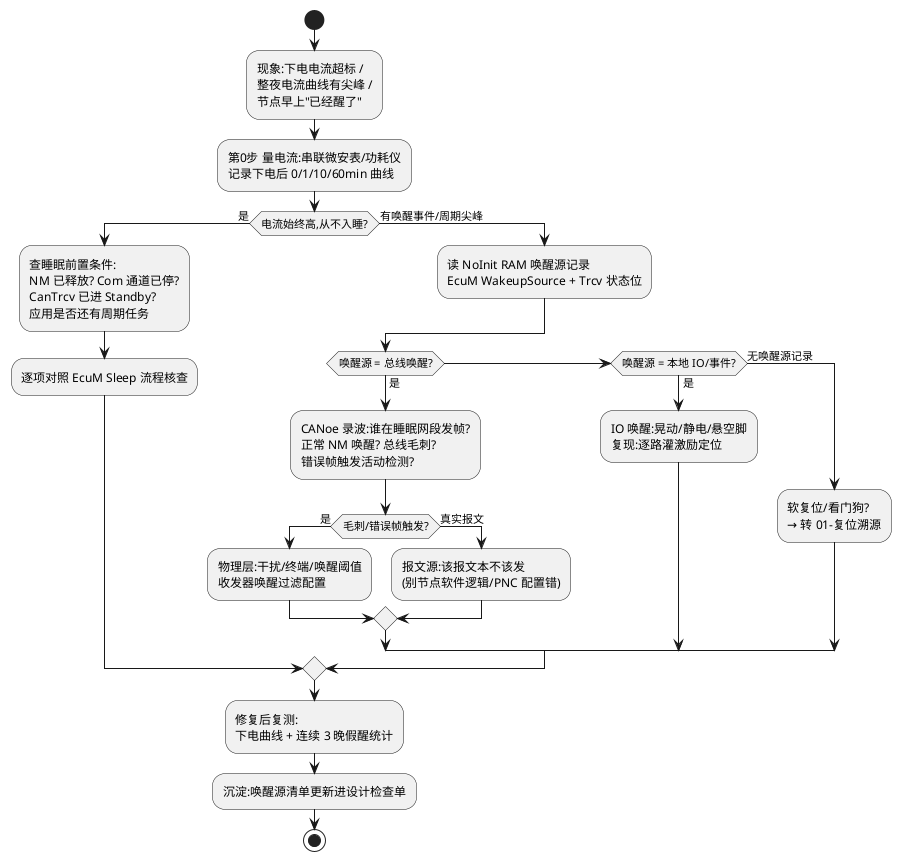

# 04-睡眠电流假醒

> 一句话定位：整车下电后电流超标或节点反复自醒，本质是"不该醒的时候醒了"——用电流曲线切分睡眠阶段，沿唤醒源清单逐一排除，把假醒钉死在具体信号/报文/寄存器位上。
> 等级：L2→L3 ｜ 前置：[03-busoff排查](03-busoff排查.md)

## 太长不看

- 假醒排查**先看电流曲线形态**：下电后纹丝不动→正常睡眠；周期性尖峰→定时器/网络在轮询；偶发跳变→事件触发唤醒（总线/IO/复位）。
- 唤醒源三大类逐一排除：**总线唤醒（CanTrcv 活动检测）、硬件唤醒源（EcuM WakeupSource/IO 边沿）、软件自醒（定时器、复位、BswM 回跳）**。
- EcuM 醒来必须**先读唤醒源事件寄存器并落 NoInit RAM**，否则"谁叫醒我"永远查不清——和复位溯源同一条铁律。
- "醒→睡不回去"比"醒→工作"更常见：重点查 Com 通道关闭、NM 释放、CanTrcv 进 Standby 三件套是否都完成。

### 工程深入场景

日常按"电流曲线+唤醒源清单"能闭环大部分假醒。只有做部分网络（PNC）下的选择性唤醒、或低功耗状态机（EcuM Sleep→Halt 三态）调优时，才需要深入 [04-部分网络](../../../05-汽车网络通讯/2-L2进阶/网络管理/04-部分网络.md) 与 [01-flex-vs-fixed](../../../07-AUTOSAR架构/2-L2进阶/系统服务栈/EcuM/01-flex-vs-fixed.md)。

## 原理/套路

## 详解

### 1. 先把"睡眠"定义清楚

EcuM 睡眠是链式条件：应用全部释放（`EcuM_SetWakeupEvent` 无未决）→ Com 停发/停收超时 → CanNm 进 `BUS_SLEEP` 并释放 → CanSM 关控制器 → CanTrcv 进 Standby/睡眠模式 → EcuM 调 `Mcu_SetMode(SLEEP)` → CPU 进 Halt，靠唤醒中断出来。**任何一环没走完，电流就下不来**。时序全景见 [02-AUTOSAR-NM状态机](../../../05-汽车网络通讯/2-L2进阶/网络管理/02-AUTOSAR-NM状态机.md) 与 [03-睡眠与假醒](../../../05-汽车网络通讯/2-L2进阶/网络管理/03-睡眠与假醒.md)。

### 2. 唤醒源清单（照着打勾）

| 类别 | 源 | 证据留痕 | 常见坑 |
|---|---|---|---|
| 总线唤醒 | CanTrcv 活动检测/选择性唤醒 | Trcv 状态寄存器 + 错误计数 | 毛刺误触发、唤醒阈值过灵 |
| 硬件唤醒 | EcuM WakeupSource（IO 边沿/RTC） | WKU/IRC 寄存器 | 悬空输入脚抖动 |
| 软件自醒 | 定时器超时、复位、BswM 规则回跳 | 复位原因+任务时标 | 复位与唤醒混淆 |
| 调试残留 | 调试器 attached、CANoe 供电注入 | 电流与工位相关 | 拔了就好，查不到"真相" |

EcuM 侧唤醒源的登记与校验见 [03-唤醒源](../../../07-AUTOSAR架构/2-L2进阶/系统服务栈/EcuM/03-唤醒源.md)。

### 3. 电流曲线判读表

- **下电后 30s 内掉到 µA 级再弹回 mA 级**：睡进去又被叫醒——真·假醒，按唤醒源清单查。
- **从未降下来**：睡眠链没走完，查 NM/Com/Trcv 三件套，属于"睡不着"不是"假醒"。
- **周期性尖峰（几十秒一次）**：某个定时任务没关（如诊断会话保持、XCP 连接保持）。
- **单次尖峰后维持在几 mA**：醒→睡不回去，重点查 CanNm 重复总线休眠等待、Com 超时没配。

## 实战走查

- **现象**：某空调控制器路试车辆停一晚，第二天亏电；返厂测得睡眠电流正常，偶发（约 1/5 晚）半夜醒来不再入睡。
- **走查**：
  1. 串联功耗仪过夜录曲线：凌晨 2 点许出现单次唤醒，之后电流稳定 18mA——"醒→睡不回去"。
  2. NoInit RAM 唤醒记录：EcuM WakeupSource = 总线唤醒（CAN），Trcv 状态位佐证。
  3. CANoe 长录波回放：唤醒时刻总线上有一条**周期性 NM 报文来自车身域控**——它没睡。
  4. 抓包看 NM 报文：车身域控的 `Repeat Message Bit` 长期置位，其 NM 配置里 `NmTimeoutTime` 与整车不一致，导致它一直保持总线唤醒状态。
  5. 本节点为什么睡不回去：收到 NM 报文→CanNm 回 `Repeat Message` 状态→重新等待休眠，但对方一直在发，永远等不到总线静默。
- **修复**：统一全网 NM 超时参数（网络规范里本该有表）；本节点侧补防御——被外部节点拖住时上报 DTC。连续一周过夜曲线干净。

## 易错点与陷阱

1. **现象**：实验室怎么都复现不了，路试必现。**原因**：台架总线干净、环境无干扰，真实车辆有毛刺与异构节点。**对策**：用 CANoe 回放路试录波 + 干扰注入器复现。
2. **现象**：唤醒源寄存器读出来永远是 0。**原因**：读取太晚——EcuM 初始化后已被清除，或 Boot 阶段读走了没转发。**对策**：与复位原因同待遇：最早读取+NoInit 转存，Boot→App 转发。
3. **现象**：电流超标但功能全正常。**原因**：CanTrcv 没进 Standby（CanSM 认为 NM 还在跑）或 IO 保持上拉驱动。**对策**：睡眠后用万用表量 Trcv STB/EN 脚电平，逐外设查使能状态。
4. **现象**：每次唤醒都伴随"复位"，被当成假醒处理。**原因**：其实是欠压复位——电池虚接，电压跌落先复位再走正常上电。**对策**：先读复位原因寄存器区分"唤醒"与"复位"，别混在一个清单里查。
5. **现象**：选择性唤醒收发器（如 TJA1145）配置了过滤，仍被无关报文叫醒。**原因**：过滤表没生效或处于标准唤醒（任何活动都醒）模式。**对策**：核对收发器模式与 ID 过滤寄存器，见 [02-唤醒与休眠](../../../05-汽车网络通讯/1-L1基础/CAN/收发器与物理层/02-唤醒与休眠.md)。
6. **现象**：拔掉调试器电流立刻正常。**原因**：调试口供电注入/KEEP 时钟维持。**对策**：测功耗时物理断开一切注入源，工装清单固定。

## 面试高频题

**Q：整车静态电流超标，你怎么区分是"睡不着"还是"假醒"？**
答：看电流曲线形态：下电后电流从未降到 µA 级，是"睡不着"——睡眠链（NM 释放→Com 停→CanSM 关→Trcv Standby→EcuM Halt）某环卡住；先降到 µA 级又弹回 mA 级，是"假醒"——有唤醒事件，读 EcuM 唤醒源记录+总线录波找唤醒触发者。两者根因方向完全不同，混着查会绕远。

**Q：CanNm 重复总线休眠等待（Repeat Bus Sleep）机制是干什么的？它和假醒有什么关系？**
答：CanNm 在准备睡眠时，若检测到总线又有活动（如别的节点还在发），会重新进入 Repeat Message 状态、重发自己的 NM 报文，防止"半睡半醒"导致网络撕裂。副作用是：若网络上有一个一直发帧的异常节点，其他所有节点都会被拖在"永远睡不下去"的状态——表现为整车静态电流超标。排查时要找的是那个"不睡的源头节点"，而不是被拖住的节点。

**Q：EcuM 的唤醒源为什么要"校验"？**
答：硬件报的唤醒事件只是"脚上有边沿/总线有活动"，不代表有效唤醒（可能是毛刺、静电、错误帧）。EcuM 收到后要调用 EcuM_CheckWakeup 校验链：CanSM→CanIf 逐层确认是否真有合法报文/合法唤醒事件，验证失败则清事件并尝试继续睡眠。这一环没配好，毛刺唤醒就会把节点反复叫醒。

**Q：如何让"谁唤醒了我"在量产件上可追溯？**
答：三件事：一是启动最早阶段读唤醒源寄存器并连同时标写入 NoInit RAM；二是 bootloader 场景下 Boot 读完转发给 App；三是唤醒事件上报 DTC（Dem 记录冻结帧：唤醒源+时间+总线状态）。这样路试回来读 DTC/复位历史块即可还原唤醒链，与复位溯源共用证据链基础设施。

## 工程深入场景

做部分网络（PN）时，假醒排查升级为"选择性唤醒过滤配置验证"：收发器 PNC 过滤表、CanNm 的 PNC 位图、EcuM 与 BswM 的 PN 协同任何一处错配都会表现为"不该醒的 ECU 醒了"。此时需要 [04-部分网络](../../../05-汽车网络通讯/2-L2进阶/网络管理/04-部分网络.md)、[05-CanNm-LinNm](../../../07-AUTOSAR架构/2-L2进阶/通讯服务栈/05-CanNm-LinNm.md) 与 [02-规则配置](../../../07-AUTOSAR架构/2-L2进阶/系统服务栈/BswM/02-规则配置.md) 一起看。

## 延伸

- [05-NvM失效](05-NvM失效.md)：下电时序的另一端——睡眠与下电写 NvM 互相挤压
- [03-睡眠与假醒](../../../05-汽车网络通讯/2-L2进阶/网络管理/03-睡眠与假醒.md)：同主题网络管理视角
- [03-唤醒源](../../../07-AUTOSAR架构/2-L2进阶/系统服务栈/EcuM/03-唤醒源.md)：EcuM 唤醒校验链
- [02-唤醒与休眠](../../../05-汽车网络通讯/1-L1基础/CAN/收发器与物理层/02-唤醒与休眠.md)：收发器侧的唤醒行为
- [01-复位溯源](01-复位溯源.md)：先分清"醒"还是"复位"再动手
