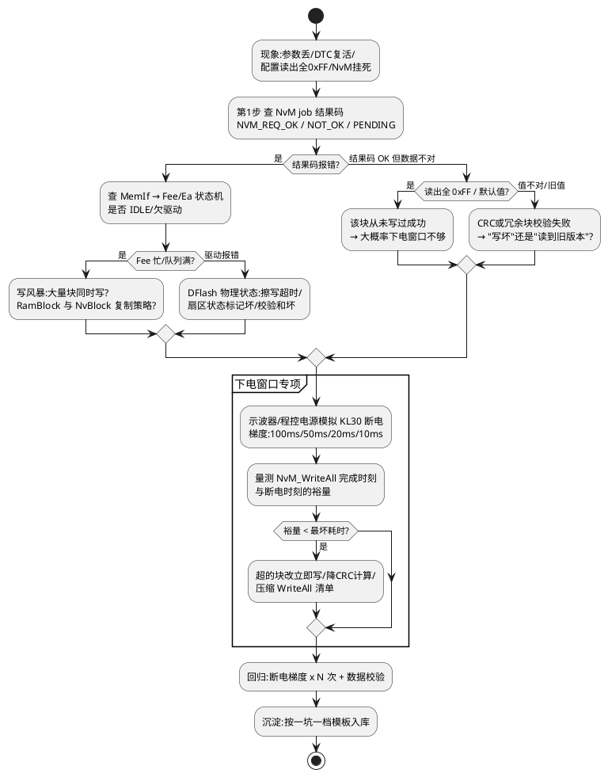

# 05-NvM失效

> 一句话定位：标定参数丢了、DTC 复位后复活、掉电丢配置——先把 NvM 失效分成"读失败/写失败/数据坏/写没发生"四类，再沿 NvM→MemIf→Fee/Ea→Flash 链路查证据，重点是下电窗口时序。
> 等级：L2→L3 ｜ 前置：[04-睡眠电流假醒](04-睡眠电流假醒.md)

## 太长不看

- NvM 失效先分类：**读出来的值错（数据坏）/ 读写接口报错（job 失败）/ 数据根本没写进去（下电窗口不够）**，三类查法完全不同。
- 证据链固定三步：**NvM job 结果码 → MemIf/Fee 状态机 → DFlash 物理状态**，一层层往下问"谁说的、什么时候说的"。
- 掉电丢 NvM 九成是**下电窗口时序问题**：KL30 断得太快，`NvM_WriteAll` 没跑完就断电——查 EcuM GoOff 序列与各块 WriteAll 属性的组合耗时。
- CRC/冗余块失败不要急着修数据：**先确认是"写坏"还是"读了旧版本"**（换页/双 Bank 边界场景）。

### 工程深入场景

日常按"结果码+状态机+下电窗口"三板斧能闭环绝大多数 NvM 问题。只有排查 Fee 换页失败、双 Bank 切换断电、DFlash 物理位坏块时，才需要深入 [04-MemIf-Fee-Ea](../../../07-AUTOSAR架构/2-L2进阶/内存栈/04-MemIf-Fee-Ea.md) 与 [01-PFlash与DFlash](../../../02-芯片与体系结构/2-L2进阶/TC377平台/存储器映射/01-PFlash与DFlash.md)。

## 原理/套路

## 详解

### 1. NvM 失效分类表（先归类再动手）

| 类别 | 典型现象 | 第一证据 | 主攻方向 |
|---|---|---|---|
| 数据坏 | CRC 错、读出旧值、冗余块不一致 | NvM job 结果+块状态 | Fee 换页/双 Bank 边界 |
| 读写接口失败 | NVM_REQ_NOT_OK、挂 PENDING 不动 | MemIf/Fee 状态机 | 写风暴、队列、扇区坏 |
| 写没发生 | 掉电后回到旧值/默认值 | 下电窗口实测 | EcuM 下电时序 |
| 块配置错 | 某块永远读默认值、长度不符 | 配置工具核对 | NvM 块属性/Job 优先级 |

### 2. 读失败 vs 写失败：先问"默认值从哪来"

NvM 读块失败（CRC 坏）时按配置可能返回**默认值**并置结果码——应用看到"数据还在只是离谱"，其实是读失败被吞了。所以第一件事是把结果码打出来（Dlt/Dem），别只看数据。块管理机制见 [01-NvM块管理](../../../07-AUTOSAR架构/2-L2进阶/内存栈/01-NvM块管理.md)，冗余与 CRC 见 [03-冗余与CRC](../../../07-AUTOSAR架构/2-L2进阶/内存栈/03-冗余与CRC.md)。

### 3. 下电窗口：掉电丢 NvM 的主战场

标准下电链：KL30 掉 → EcuM GoOff → `NvM_WriteAll`（把所有 RamBlock 落盘）→ 全部 `NVM_REQ_OK` → 断外设 → Sleep/Halt。失效模式两兄弟：

- **窗口不够**：WriteAll 里塞了太多立即写块/CRC 计算慢，最坏耗时 > 客户断电保持时间。用程控电源做**梯度断电测试**（如 100/50/20/10ms 各 N 次）量出真实裕量。
- **窗口被抢**：下电序列里还有大数据擦写（如标定数据落盘、DTC 快照），把 NvM 挤到断电之后——见 [02-写队列与显隐同步](../../../07-AUTOSAR架构/2-L2进阶/内存栈/02-写队列与显隐同步.md) 的队列优先级设计。

EcuM 下电时序细节见 [02-上下电时序](../../../07-AUTOSAR架构/2-L2进阶/系统服务栈/EcuM/02-上下电时序.md)。

### 4. Fee 层证据

Fee 用 DFlash 模拟 EEPROM，按块地址映射+换页搬移。排查时看三样：块头信息（状态标记：有效/无效/传输中）、换页计数、扇区擦写计数。Bootloader 与 App 共享 DFlash 时的分区冲突是隐蔽雷区，见 [04-Fls依赖](../../../06-诊断与标定/3-L3高级/Bootloader/04-Fls依赖.md) 与 [03-与NvM链路](../../../04-MCAL与外设驱动/2-L2进阶/Fls与Fee/03-与NvM链路.md)。

## 实战走查

- **现象**：仪表配置（用户个性化设置）偶发丢失，产线复现率约 0.3%，丢失后回到出厂默认。
- **走查**：
  1. 读 DTC/NvM 结果码：无 NOT_OK 记录——接口层"没报错"，说明要么读回默认值，要么根本没写。
  2. 台架断电梯度测试：50ms 断电 200 次无丢失；20ms 断电 20 次丢 3 次——**下电窗口边缘**。
  3. 量 WriteAll 完成耗时：最坏 46ms（含 2 个 CRC 大块），而整车 KL15 off 到 KL30 真正断电最小 30ms。
  4. 进一步看：丢失的恰是 WriteAll 列表最后两个块（Job 优先级低）。
- **修复**：把用户配置块改为写穿透（`NvMBlockWriteProt` 调整+变更即写），WriteAll 清单只留低频数据；CRC 大块分片。梯度复测 10ms 断电 500 次零丢失。

## 易错点与陷阱

1. **现象**：CRC 错误 DTC 大量上报，数据其实没坏。**原因**：块配置里 CRC 长度/计算初值改过，新旧数据混存。**对策**：配置变更要配套"版本号+强制重写"策略，别指望 CRC 自己兼容。
2. **现象**：掉电必丢，但 WriteAll 耗时明明够。**原因**：下电序列里 WriteAll 排在某长耗时操作（如 CanIf 等待帧发完、外设去初始化超时）之后。**对策**：实测各阶段耗时分解，不只看 WriteAll 本身。
3. **现象**：读出旧值，以为没写进去。**原因**：冗余块读主副本失败自动切备份，备份是旧版本——数据其实是"写了一半断电"。**对策**：块状态位+换页计数一起看，区分"没写"与"写了一半"。
4. **现象**：NvM 挂在 PENDING，整机功能锁死。**原因**：Fee 队列满（写风暴）或上层忘了调主函数轮询。**对策**：写请求限流；NvM_MainFunction 的周期与优先级实测确认没被饿死。
5. **现象**：升级（Boot 刷写）后首次上电数据全丢。**原因**：Boot 与 App 的 Fee 分区表不一致，App 把 Boot 写的区域当无效区。**对策**：分区表版本化，Boot/App 双方锁定同一版本。
6. **现象**：高低温箱里 NvM 失效率升高。**原因**：DFlash 擦写时序参数在温度极值下超时。**对策**：检查 Fls 驱动超时配置与数据手册温度曲线匹配；老化计数监控纳入产测。

## 面试高频题

**Q：掉电后 NvM 数据丢失，你的排查步骤？**
答：分四步：先看 NvM job 结果码与块状态，确认是"没写"还是"写坏"；再做梯度断电测试（程控电源按 100/50/20/10ms 断电各 N 次）定位窗口边缘；然后量 WriteAll 最坏完成耗时，与整车断电保持时间对比找裕量；最后按丢失块在 WriteAll 列表里的位置（优先级）锁定被挤掉的块。修复方向：关键块改变更即写、瘦身 WriteAll 清单、CRC 分片。

**Q：NvM 的 WriteAll 在什么时机触发？哪些块应该放进去？**
答：由 EcuM 下电流程（GoOff/ShutdownTarget）调用 `NvM_WriteAll`，把所有标记"脏"的 RamBlock 统一落盘。放进去的应是**低频变化、丢失可容忍度较高的数据**（如统计类）；用户强感知数据（配置、标定修正）建议变更即写（NvM_SetRamBlockStatus + NvM_WriteBlock 立即落盘），避免把所有风险押在下电窗口上。

**Q：NvM 冗余块读到主副本 CRC 失败时会发生什么？如何区分"数据真的坏了"？**
答：标准行为：主副本校验失败→NvM 尝试备份副本→备份可用则用备份并回写主副本（自愈），两边都坏才上报 NVM_REQ_NOT_OK 并按配置给默认值。区分方法：读块状态位和冗余副本版本——如果备份能自愈，说明主副本是"写一半断电"这类物理失效；两边同时坏且状态标记异常，才怀疑 Fee 层逻辑/分区问题。

**Q：Fee 换页（sector swap）和 NvM 失效有什么关系？**
答：Fee 的 DFlash 逻辑扇区写满后要换页：把有效块搬到新扇区、擦旧扇区。这个过程本身包含"擦除"，如果在搬移中途断电，可能出现块状态不一致（传输中标记）。设计上有扇区状态机保护（两阶段标记），但配置错（如搬移优先级低于普通写）或断电点极端时会表现为读旧值/坏块。排查要看扇区状态标记序列是否符合两阶段提交的合法路径。

## 工程深入场景

当问题落在 Fee 物理层（换页断电、扇区状态机非法迁移、DFlash 坏块管理）时，进入存储栈深水区：需要带 [04-MemIf-Fee-Ea](../../../07-AUTOSAR架构/2-L2进阶/内存栈/04-MemIf-Fee-Ea.md)、[02-Fee模拟EEPROM](../../../04-MCAL与外设驱动/2-L2进阶/Fls与Fee/02-Fee模拟EEPROM.md) 的实现细节对照扇区状态机逐块分析，并考虑用注入式断电测试（在换页各阶段精准断电）验证鲁棒性。

## 延伸

- [01-复位溯源](01-复位溯源.md)：下电/复位时序问题常常纠缠在一起
- [01-NvM块管理](../../../07-AUTOSAR架构/2-L2进阶/内存栈/01-NvM块管理.md)：块类型与 RamBlock 机制
- [03-与NvM链路](../../../04-MCAL与外设驱动/2-L2进阶/Fls与Fee/03-与NvM链路.md)：从 NvM 到 DFlash 的完整链路
- [一坑一档模板](../../2-L2进阶/踩坑案例库/00-一坑一档模板.md)：NvM 案例入库模板与本篇配套
- [04-Fls依赖](../../../06-诊断与标定/3-L3高级/Bootloader/04-Fls依赖.md)：Boot/App 共享存储的分区雷区
