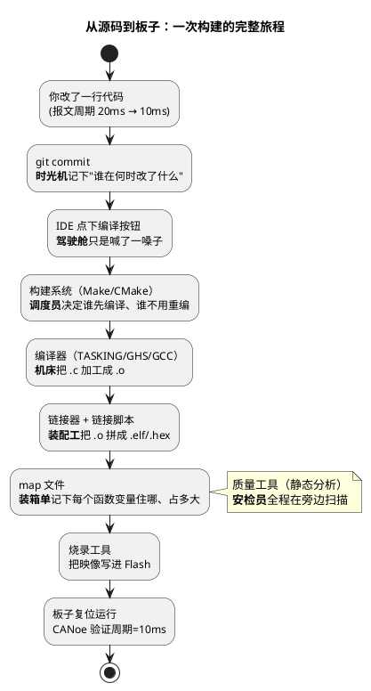

# 01-从敲下编译到烧进板子-工具链全景

> 一句话定位：跟着一次"改一行代码→提交→编译→烧进板子"的完整旅程走一遍，把 IDE、编译器、构建系统、Git、AUTOSAR 配置工具、质量工具、脚本七件套的位置摆到一张地图上——之后本区任何子目录迷路，都能靠这张地图找到回程。
> 等级：L1 ｜ 前置：无

## 一个普通的上午

你改了一行代码：把 CAN 报文周期从 20ms 改成 10ms。然后你按下 Ctrl+S，点了编译按钮，喝了一口咖啡，进度条走完，你把 `.hex` 拖进烧录工具，板子复位，CANoe 里周期变成了 10ms。收工。

这次"顺利"背后其实有一条完整的流水线在转：**Git 记下了这次修改、构建系统调度了一两百个编译动作、编译器把源码变成目标码、链接器把它们拼成映像、map 文件记下了每个变量的住址、质量工具在旁边扫了一轮 MISRA、AUTOSAR 配置工具生成的几千行配置代码也在里面**。工具链与工程化研究的就是这条流水线——它顺利时你感觉不到它，它出问题时你必须懂它。

五个直觉要点：

1. **IDE 只是驾驶舱，不是发动机**——点按钮只是触发，真正干活的是构建系统+编译器；脱离 IDE 也能命令行构建，才算真懂工具链；
2. **构建系统的核心问题是"哪些要重编"**——改一个 .c 全量重编 20 分钟，是没管好依赖关系，不是电脑慢；
3. **map 文件是"代码都去哪了"的唯一权威答案**——Flash 水位、变量地址、函数大小，都从它查；
4. **AUTOSAR 工程里"配置也是代码"**——EB tresos/DaVinci 生成的 BSW 代码量常常大于手写代码，配置工具的版本与 diff 管理同等重要；
5. **质量工具是安检员不是法官**——静态分析报的不是"都有错"，是"这里有风险，人来看一眼"。

## 工具箱地图：七件套各管一摊

| 工具 | 管什么 | 直觉 | 本区位置 |
|---|---|---|---|
| IDE | **驾驶体验** | "驾驶舱"：建工程、编辑、一键编译烧录调试 | [IDE](../1-L1基础/IDE/README.md) |
| Git 与版本管理 | **历史与协作** | "时光机"：谁在何时改了什么、随时回退、多人不打架 | [Git与版本管理](../1-L1基础/Git与版本管理/README.md) |
| 构建系统 | **编译的组织** | "调度员"：Make/CMake 决定编什么、怎么编、按什么顺序 | [构建系统](../2-L2进阶/构建系统/README.md) |
| 编译器 | **翻译与优化** | "机床"：TASKING/GHS/GCC 把 C 翻成机器码，附赠 map 清单 | [编译器](../2-L2进阶/编译器/README.md) |
| AUTOSAR 配置工具 | **配置生产线** | "图纸机"：EB tresos/DaVinci 把 ARXML 配置生成 BSW 代码 | [AUTOSAR配置工具](../2-L2进阶/AUTOSAR配置工具/README.md) |
| 代码质量 | **静态安检** | "安检员"：MISRA 工具链、静态分析，在编译前拦风险 | [代码质量](../2-L2进阶/代码质量/README.md) |
| 辅助脚本沉淀 | **重复劳动自动化** | "机器人学徒"：ARXML 处理、批量改名、报表生成 | [辅助脚本沉淀](../2-L2进阶/辅助脚本沉淀/README.md) |

一句话记忆：**写代码在 IDE，管历史靠 Git，编译归构建系统管调度、编译器管加工，配置走 AUTOSAR 工具，质量交给静态分析，重复劳动写成脚本。**

## 三类典型故障：先猜对环节，再选工具

流水线上的问题，先问一句："断在哪一环？"

| 故障环节 | 典型症状 | 直觉 | 首选落点 |
|---|---|---|---|
| **编译错** | 语法错、头文件找不到、宏没定义 | 翻译阶段就失败——**看编译** | 编译器报错信息 + Makefile 依赖 |
| **链接错** | undefined reference、重叠/溢出 | 单个 .o 都对，拼不起来——**看链接** | 链接脚本 + map 文件 |
| **运行错** | 烧进去行为不对、变量值诡异 | 流水线正常、产品不对——**看产物** | map 对地址 + 反汇编对现场 |

三个 30 秒小场景，练一下"猜环节"的手感：

| 场景 | 先猜哪个环节 | 第一动作 |
|---|---|---|
| "编译报 `Cannot open source file Ifx_Types.h`" | 编译错（include 路径） | 查 Makefile/工程里的 include path 与该头文件实际位置 |
| "链接报 `section .bss overflowed by 0x1F40 bytes`" | 链接错（内存不够） | map 文件看 .bss 大户，是数组开大了还是栈分配多了 |
| "板上读某变量永远是 0，但代码明明写了初值" | 运行错（产物/地址） | map 查该变量落在哪个段、启动代码有没有初始化该段 |

## 双平台工具链对照：一张表认全

本库主线是 TC377 + S32K 双平台，工具链也成对出现：

| 环节 | TC377 阵营 | S32K 阵营 |
|---|---|---|
| IDE | AURIX Dev Studio（Eclipse 系） | S32 Design Studio（Eclipse 系） |
| 编译器 | TASKING（也常用 GHS、GCC） | GCC（S32K 也有 GHS/iar 选项） |
| AUTOSAR 配置 | DaVinci Configurator（也见 EB tresos） | EB tresos Studio |
| 烧录/调试 | DAP miniWiggler + TRACE32 | J-Link/openSDA + 各家调试器 |

看出规律了吗：**IDE 都是 Eclipse 系、配置工具一区一霸、调试器殊途同归**——所以学工具链别死记按钮，学的是"配置结构 + 产物清单 + 命令行底层"这三样通用物，换个平台只是换个皮肤。

## 工具链第一原则

三条，背下来：

1. **能命令行，才算真会**——IDE 按钮背后是命令，能找到并看懂那条命令（编译选项、链接脚本、make 目标），出问题才有抓手；
2. **产物可信度靠清单**——.elf/.hex/map 三件套要能对上（map 里的地址 = 反汇编里的地址 = 调试器里的地址），对不上就是烧错了文件；
3. **一切配置进版本库**——源码、ARXML、链接脚本、makefile、工具版本说明全部 Git 管起来，"我电脑上能跑"不叫能跑。

反面对照：新手最常见的三连击——"重开 IDE 再试""把警告全关了""拿别人电脑编一版"——本质上都是不看命令、不查产物、不管版本三原则的反面教材。

自查口径：读完本篇你应能不查资料说出——七件套各管什么、三类故障各断在哪环、双平台工具链怎么成对记忆、工具链三原则是什么。

## 第一周上手清单

如果想立刻动手，按这个顺序攒装备：

| 顺序 | 做什么 | 在哪学 |
|---|---|---|
| 1 | S32DS/AURIX Dev Studio 建一个 demo 工程，编译烧录跑通 | [IDE](../1-L1基础/IDE/README.md) |
| 2 | 在工程里翻出编译命令与链接脚本，看清 IDE 背后的命令行 | [构建系统](../2-L2进阶/构建系统/README.md) |
| 3 | 打开 map 文件，找到 main 函数和你定义的一个大数组 | [编译器/03-map文件分析](../2-L2进阶/编译器/README.md) |
| 4 | 给这个工程建 Git 仓库，做第一次 commit | [Git与版本管理](../1-L1基础/Git与版本管理/README.md) |

第四步最重要——工具会换，"一切产物进版本库"的习惯从第一天开始养成。

## 下一步读什么

- 工具入门：[IDE](../1-L1基础/IDE/README.md)——S32DS/AURIX Dev Studio 建工程一条龙先跑通；
- 管好历史：[Git与版本管理](../1-L1基础/Git与版本管理/README.md)——Git 基础与 ARXML 的版本管理；
- 看懂底层：[构建系统](../2-L2进阶/构建系统/README.md)——读懂工程的 Makefile，再谈 CMake；
- 回答"代码都去哪了"：[编译器](../2-L2进阶/编译器/README.md)——map 文件分析；
- AUTOSAR 主业：[AUTOSAR配置工具](../2-L2进阶/AUTOSAR配置工具/README.md)——DaVinci/EB tresos 的配置与 diff review；
- 完整阅读顺序见本区 [README 入门坡道](../README.md)。

---

维护约定：笔记命名 `序号-主题.md`；真实截图放 `_images/`；流程/时序/状态/架构图用 PlantUML 内嵌正文，规范见 [图表规范与模板](../../00-总览/图表规范与模板.md)。
