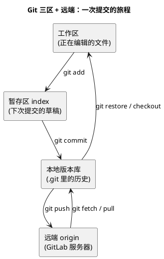

# 01-Git基础

> 一句话定位：分布式版本管理系统——把"谁在何时改了什么"全部记成不可变快照，工具链里的"时光机"，嵌入式工程师的第一件基础设施。
> 等级：L1 ｜ 前置：[01-从敲下编译到烧进板子-工具链全景](../../00-入门导读/01-从敲下编译到烧进板子-工具链全景.md)

## 原理

Git 的核心是**三区模型**：工作区（你正在改的文件）、暂存区（下次提交的快照草稿）、本地版本库（.git 里一条不可变历史），远端只是另一份库。理解三区，一半的 Git 困惑自动消失——**add 是拍照前取景，commit 才是按快门，push 是把照片寄给同事**。



两个嵌入式特有直觉：

1. **提交是"能编译通过的最小完整改动"**——一次提交最好独立可编，回退单位才干净；
2. **一切配置进版本库**——源码、ARXML、链接脚本、makefile、工具版本说明全部管起来，"我电脑上能跑"不叫能跑。

## 详解

### 1. 日常五命令

| 命令 | 干什么 | 频率直觉 |
|---|---|---|
| `git status` | 看三区现状（改了啥、暂存了啥） | 每次操作前先看一眼 |
| `git add <file>` | 把改动取景进暂存区 | 精确加文件，少用 add . |
| `git commit -m "..."` | 暂存区定格成一条历史 | 一天数次，小步提交 |
| `git pull` | 拉远端并合并到本地 | push 前必做 |
| `git push` | 本地历史寄给远端 | 下班/节点前必做 |

节奏建议：**小步提交、勤拉勤推**——改动攒三天再提交，review 的人和你自己都要哭。

### 2. 看改动：diff 与 log

| 命令 | 看什么 |
|---|---|
| `git diff` | 工作区 vs 暂存区（还没 add 的） |
| `git diff --cached` | 暂存区 vs 最近提交（将要提交的） |
| `git diff HEAD~1` / `git diff v1.1 v1.2` | 任意两个版本之间 |
| `git log --oneline --graph --all` | 提交历史一屏看 |
| `git log -p <file>` | 这个文件的历次改动+内容 |
| `git show <commit>` | 某次提交的完整内容 |
| `git blame <file>` | 每行最后是谁改的（先看代码再问人） |

### 3. .gitignore 该忽略什么

| 对象 | 忽略？ | 原因 |
|---|---|---|
| build 产物（*.o、.elf、.map、.hex） | 忽略 | 可再生；交付基线走 tag/制品库存档 |
| IDE 元数据（workspace/.metadata） | 忽略 | 个人环境相关 |
| .vscode/、.settings/ | 半忽略 | tasks/settings 团队约定可入库，个人偏好忽略 |
| 大文件（SDK 包、PDF 手册） | 不直接入 | 仓库膨胀，走 LFS/网盘/包管理 |
| 源码、头文件、makefile、lsl | 不忽略 | 真源 |
| *.arxml | 不忽略 | 配置真源，必须入库（见 ARXML 篇） |

### 4. 汽车项目的托管：GitLab 私有部署

车企/供应商基本是**内网私有化 GitLab**：代码不出厂墙（合规与客户保密要求）、按项目组精细授权、MR（merge request）评审留痕、内置 CI runner 挂编译环境（每个 tag 自动出包）。对你而言要习惯三件事：内网才能推拉、权限找项目管理员、CI 是流水线的一部分而不是可选项。

## 实操/配置

### 新工程从零起步

```bash
git init                          # 或 GitLab 建好仓库后 git clone
git add src/ makefile *.arxml     # 挑真源加，别 add .
git commit -m "初始化：xxx工程骨架"
git remote add origin <内网地址>
git push -u origin main
```

### 最小 .gitignore（嵌入式起步版）

```gitignore
# 构建产物
build/
Debug_*/
Release_*/
*.o
*.elf
*.map
*.hex
# IDE 元数据
.metadata/
# 本地杂项
*.log
Thumbs.db
```

提交前自检三问：编译产物进来了吗？工具生成的垃圾进来了吗？这版能独立编译通过吗？

## 易错点与陷阱

1. **现象：仓库几个月膨胀到几个 GB。原因：把 .elf/.hex/SDK 包全提交了。对策：.gitignore 先行；已进历史的走专门清理流程，光删当前文件没用。**
2. **现象：本地提交了同事拉不到。原因：commit 了但没 push，把 commit 当发布。对策：节点前 `git status` 确认 "Your branch is up to date"。**
3. **现象：一次提交混了三个功能。原因：`git add .` 一把梭。对策：按文件精确 add，大改动拆成多次小提交。**
4. **现象：换行符警告刷屏、diff 全文变红。原因：Windows CRLF 与 Linux LF 混战。对策：.gitattributes 统一策略（见分支策略篇），比各自改 .gitconfig 可靠。**
5. **现象：pull 遇冲突手忙脚乱。原因：本地改动没提交就 pull。对策：先 commit/stash 再 pull；冲突逐块按语义决策，别无脑"接受我的"。**
6. **现象：密码/密钥进了历史。原因：配置文件连真值一起提交。对策：敏感值模板化+本地覆盖文件忽略；已泄露立即改密并清理历史。**

## 面试高频题

**Q1：add 和 commit 的区别？**
答：add 把工作区改动取景进暂存区（可反复调整），commit 把暂存区定格成一条不可变历史。中间隔一层是为了保证"一次提交 = 一个完整意图"。

**Q2：pull 和 fetch 的区别？**
答：fetch 只把远端历史拉到本地库、不动你的分支；pull = fetch + merge/rebase，会直接更新当前分支。想先看看再合，用 fetch。

**Q3：嵌入式工程的 .gitignore 怎么写？**
答：忽略可再生物（build 输出、*.o/*.elf/*.map/*.hex）、个人 IDE 元数据、大文件；真源全部入库——源码、链接脚本、makefile、ARXML；团队约定的 IDE 配置（tasks、editorconfig）入库，个人偏好忽略。

**Q4：为什么汽车项目多用私有 GitLab？**
答：合规（客户代码不出内网、审计留痕）、权限（按项目组隔离）、CI 一体（runner 挂编译环境、tag 自动出包）。公有云代码托管在车规供应链里基本不让用。

## 延伸

- [02-分支策略](02-分支策略.md)——多版本并行、交样基线与 merge/rebase 约定；
- [03-ARXML的版本管理](03-ARXML的版本管理.md)——配置文件的 diff 与冲突处理；
- [01-从敲下编译到烧进板子-工具链全景](../../00-入门导读/01-从敲下编译到烧进板子-工具链全景.md)——"一切配置进版本库"原则的出处。
