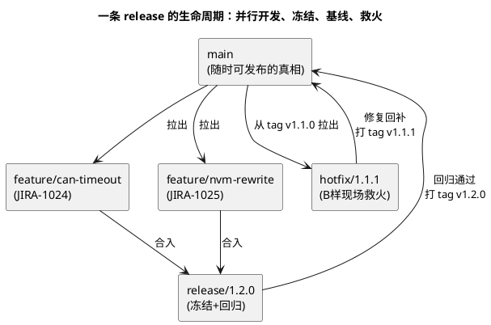

# 02-分支策略

> 一句话定位：决定"大家往哪提交、版本怎么长出来"的团队约定——主干/分支怎么分、feature/bugfix/release/hotfix 怎么命名、A 样 B 样基线怎么打 tag，是多人协作不打架的规则层。
> 等级：L1→L2 ｜ 前置：[01-Git基础](01-Git基础.md)

## 原理

分支策略回答一个问题：**变更从哪里长出来、什么时候合回去**。两大门派：主干开发（trunk-based，大家都往 main 提，分支短命）与分支开发（多长命分支，按版本/客户/阶段隔离）。汽车软件的特点是**节点驱动**——A 样/B 样交样、客户分支并行、量产 hotfix，纯主干或纯 git-flow 都不合身，常见形态是"主线 + 短命功能分支 + release 冻结 + tag 基线"。



## 详解

### 1. 主干开发 vs 分支开发

| 维度 | 主干开发 | 分支开发 |
|---|---|---|
| 形态 | 都往 main 提，功能分支活不过几天 | 长命分支按版本/客户/阶段隔离 |
| 优点 | 集成问题早暴露、历史线性 | 版本隔离干净，客户定制互不干扰 |
| 代价 | 每次提交都要能编译（半成品用开关藏） | 合并成本随时间指数涨、分支地狱 |
| 适合 | 单产品、持续交付 | 多客户/多车型并行、节点交付 |

汽车项目现实：**主线管共同底座，客户/项目差异走分支或编译开关**，避免一人一个 fork 各改各的。

### 2. 分支命名（写成文档钉死）

| 前缀 | 用途 | 示例 |
|---|---|---|
| feature/ | 新功能 | feature/JIRA-1024-can-timeout |
| bugfix/ | 缺陷修复 | bugfix/JIRA-1031-nvm-crc |
| release/ | 版本冻结回归 | release/1.2.0 |
| hotfix/ | 量产/交样救火 | hotfix/1.1.1 |

要点：**分支名带任务号**——code review 和事后追溯时一键跳到需求单。

### 3. tag 与基线：交样的"定桩"

- 交样节点（A 样/B 样/C 样/SOP）各打一个 tag，指向回归通过的 commit，**不可变**；
- 版本号语义：`主版本.次版本.修订号`——大改架构、加功能、修缺陷分别进位；构建号/日期后缀区分同版本多次构建；
- 对应规则示例：Git tag `v1.2.0` ↔ 软件上报版本 `SW_1.2.0_build20260819`，release note 记"这个 tag 装了哪些 JIRA 单"。

**tag 是事后审计的锚点**：客户现场报问题，第一句永远是"哪个 tag 的软件"。

### 4. merge vs rebase

| | merge | rebase |
|---|---|---|
| 历史 | 保留真实分叉，多一个合并提交 | 改写成一条直线 |
| 风险 | 历史图变复杂 | 改写历史，公共分支上禁止 |
| 直觉 | 把两条路接通 | 把我的路挪到你后面重铺 |

团队约定模板：**个人 feature 分支先 `git rebase main` 解掉小差异再提 MR；公共分支（main/release）只接受 merge——谁 rebase 公共分支，谁请全组喝奶茶**。

### 5. .gitattributes 处理换行

Windows CRLF 与 Linux LF 混战会让 diff 全文变红，一行真改动埋在里面。仓库根放 `.gitattributes` 统一口径：

```gitattributes
* text=auto
*.c text
*.h text
*.arxml text
*.sh text eol=lf
*.bat text eol=crlf
*.hex -text
*.s19 -text
*.png binary
```

含义：文本按声明规范化，脚本强制 LF、批处理强制 CRLF，hex/图片按二进制不动。**有了它，换行符就不该再出现在 diff 里**。

## 实操/配置

### 一次 feature 的标准动作

```bash
git switch -c feature/JIRA-1024-can-timeout main   # 从 main 拉分支
# ...开发，小步 commit...
git fetch origin
git rebase origin/main                              # 对齐主线，解小差异
git push -u origin feature/JIRA-1024-can-timeout    # 推上去
# GitLab 提 MR → review → merge（squash 与否，团队定死一种）
git branch -d feature/JIRA-1024-can-timeout         # 合并后删本地分支
```

### 打基线 tag

```bash
git tag -a v1.2.0 -m "B样交付：JIRA-1024/1025/1031"
git push origin v1.2.0
```

## 易错点与陷阱

1. **现象：合并要解几百个冲突。原因：feature 分支活了一个月没同步主线。对策：分支寿命以天计，定期 rebase 主线；大改动拆小。**
2. **现象：同事历史被改坏、到处冲突。原因：对公共分支 rebase / push --force。对策：公共分支只 merge；GitLab 分支保护配死，禁 force push。**
3. **现象：现场版本对不上源码。原因：交样没打 tag，或 tag 打完又悄悄改了代码。对策：交样即打 tag，tag 保护不可覆盖；改了就打新号。**
4. **现象：release 分支越冻越肥。原因：冻结期还往里塞新功能"顺手带上"。对策：release 只进 bugfix，新功能一律等下个版本。**
5. **现象：merge 冲突"全部接受我的"之后功能丢了。原因：冲突块里藏着对方分支的改动。对策：逐块读语义再选；ARXML 冲突按"以工具为准"流程（见 ARXML 篇）。**
6. **现象：hotfix 修完主线又复发。原因：只修了 release 分支没回补 main。对策：hotfix 从 tag 拉出→修复→同时合回 release 与 main，两边都打新 tag。**

## 面试高频题

**Q1：merge 和 rebase 怎么选？**
答：直觉是"接通两条路"vs"重铺一条路"。约定：个人分支先 rebase 主线保持干净再提 MR；公共分支只接受 merge，绝不 rebase 改写共享历史。

**Q2：你们项目 A 样 B 样的基线怎么管？**
答：每个交样节点回归通过后打不可变 tag（如 v1.2.0），软件版本号与 tag 一一对应，release note 关联 JIRA 单；现场问题先对 tag 定位源码，hotfix 从 tag 拉分支并回补主线。

**Q3：主干开发和分支开发各自的适用面？**
答：主干开发集成问题早暴露、适合单产品持续交付；分支开发隔离干净、适合多客户/节点交付的汽车项目。实践常是主线+短命功能分支+release 冻结的混合形态。

**Q4：换行符问题怎么根治？**
答：仓库根放 .gitattributes 统一策略（文本规范化、*.sh 强制 LF、*.bat 强制 CRLF、hex 按二进制），比每人力配 .gitconfig 可靠——因为它随仓库走、人人生效。

## 延伸

- [01-Git基础](01-Git基础.md)——三区模型与日常五命令，本篇的前置；
- [03-ARXML的版本管理](03-ARXML的版本管理.md)——分支策略落到配置文件上的特化打法；
- [01-从敲下编译到烧进板子-工具链全景](../../00-入门导读/01-从敲下编译到烧进板子-工具链全景.md)——回到工具链地图。
