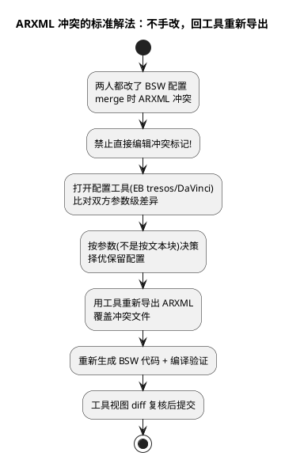

# 03-ARXML的版本管理

> 一句话定位：给"工具生成的大 XML"立规矩——ARXML 是 EB tresos/DaVinci 模型的序列化产物，diff 噪音大、冲突难手解；核心打法是"真源入库、diff 用工具视图、冲突以工具为准重新导出"。
> 等级：L2 ｜ 前置：[01-Git基础](01-Git基础.md)、[02-分支策略](02-分支策略.md)

## 原理

ARXML 是 AUTOSAR 的模型交换格式——一个 BSW 配置动辄几万行 XML，而且是**工具写出来的**：元素顺序、默认值展开、换行缩进全由工具版本决定。这带来 Git 的天然难题：**语义上只改了一个参数，文本 diff 却翻几千行**；反过来语义没变（只是换了工具版本重导出），diff 也翻几千行。所以总原则是：**把 ARXML 当"模型的序列化"而不是手写代码来管**——人读参数用工具视图，机器存历史用 Git，冲突永远回工具里重新导出解决。



## 详解

### 1. diff 噪音从哪来

| 噪音源 | 现象 | 说明 |
|---|---|---|
| 元素重排序 | 整段块"删了又加" | 工具导出顺序不稳定，语义没变 |
| 默认值展开 | 一堆属性凭空出现/消失 | 版本间"写不写默认值"的策略变了 |
| 换行与缩进 | 全文件标红 | 格式化差异，纯文本 diff 最怕这个 |
| 路径/GUID 变化 | 引用全部变样 | 工程挪了位置或工具重新分配标识 |
| 真实配置变化 | 少量有意义的行 | 这才是 review 想看的 |

结论：在纯文本 diff 里找最后那 5% 的真改动效率极低——所以要工具视图。

### 2. 基本策略：ARXML 入库 + 锁定生成物

- **ARXML 必须入库**：它是配置的真源，丢了它 BSW 无法复现；
- **生成物（generated/）进 .gitignore**：可由工具+ARXML 再生，入库只会制造 diff 海啸（生成代码入不入库另有流派之争，见第 5 节）；
- **工具版本钉死**：schema 与导出行为跟工具版本走，版本漂移 = 全文件 diff。

### 3. diff review：用工具视图，别盯文本

DaVinci Configurator 自带配置比较视图，EB tresos 有工程/模块级 comparison——按**参数**呈现差异："谁把哪个容器/参数从什么改成什么"。做法：MR 里贴工具导出的差异清单或截图，评审看参数表而不是 ARXML 文本 diff。手读 ARXML 与 diff 技巧见延伸链接。

### 4. 版本耦合：三层都要对齐

| 层 | 错配后果 | 对策 |
|---|---|---|
| 工具版本（tresos/DaVinci 主版本） | 打不开工程、被自动升级 schema | README 钉死版本号；升级走专项任务并全量重导 |
| AUTOSAR schema 版本（R4.x） | 跨项目交换 ARXML 解析失败 | 交换前核对 schema 与 ECU 提取参数 |
| 插件/BSW 包版本 | 生成代码接口变化、编译失败 | 与工具版本一起记录，同步升级 |

一句话：**ARXML 的可读性 = 特定工具版本 + 特定 schema**，版本信息本身也是配置的一部分。

### 5. 生成代码入不入库：两流派

| 流派 | 做法 | 优点 | 缺点 |
|---|---|---|---|
| 入库 | ARXML + generated 全提交 | 新人 clone 即可编译，不依赖本机工具 | diff 巨大、review 噪音、仓库膨胀 |
| 不入库 | 只提交 ARXML，生成物忽略 | 仓库干净、真源唯一 | 人人要装对版本工具，环境漂移风险 |

务实折中：**ARXML 入库 + CI 用钉死版本的工具重新生成并出包**——本地不依赖、流水线可复现，两头的优点都拿到。

## 实操/配置

### ARXML 工程的 .gitignore 片段

```gitignore
# 配置真源：入库（*.arxml、*.xdm 不忽略）

# 工具生成物：忽略
generated/
tresos_*/output/
daVinciOut/
```

### 提交前三步检查

1. 这次配置改动在工具视图里是哪个参数？（写进 commit message）；
2. ARXML 与生成代码同步了吗？（改了配置必须重新生成+编译）；
3. diff 里的噪音能解释吗？（工具版本没变却全文件 diff = 有问题，查清楚再提交）。

### 版本记录 README 模板

```text
工具：EB tresos Studio 23.0 + XDM 23.0
BSW 包：ComStack 4.6.2 / Os 7.2.0
AUTOSAR schema：R4.0 Rev3
构建：Generate 后须用 GCC x.y.z 编译通过
```

## 易错点与陷阱

1. **现象：手解 ARXML 冲突后工具打不开工程。原因：手工编辑破坏了 XML 结构/引用。对策：永远走"工具比对→重新导出"流程，冲突标记不是给人改的。**
2. **现象：没动配置却全文件 diff。原因：换了工具版本打开顺手保存，schema 悄悄升级。对策：版本钉死，开文件前确认版本；升级日全员统一做。**
3. **现象：review 里 generated 目录几千行刷屏。原因：生成物没 ignore。对策：.gitignore 补齐，并把已跟踪的生成物清出索引。**
4. **现象：同事编译失败说缺文件。原因：只提交了 ARXML 没提交生成代码（入库流派）。对策：流派定了就执行到位——入库则配置+生成物一起交，不入库则确认对方重新生成。**
5. **现象：换行符导致 ARXML 全文 diff。原因：没配 .gitattributes。对策：`*.arxml text` 统一规范化，工具重导出覆盖后提交。**
6. **现象：ARXML 和代码版本对不上。原因：改了配置没重新生成，或生成后没编译验证就提交。对策：提交前三步检查，配置改动必须落到"生成+编译通过"。**

## 面试高频题

**Q1：ARXML 版本管理的难点和你的策略？**
答：难点是它是工具生成的大 XML——文本 diff 噪音大、冲突难手解。策略：ARXML 作为真源入库、生成物锁定；diff review 用工具的参数级视图；冲突回工具比对择优后重新导出；工具与 schema 版本钉死并记录。

**Q2：BSW 生成代码要不要入库？**
答：两流派——入库换"clone 即编译"，代价是 diff 噪音与仓库膨胀；不入库换干净仓库，代价是环境依赖。我倾向折中：ARXML 入库 + CI 钉死工具版本重新生成出包，可复现且不污染 review。

**Q3：两人都改了 ARXML 怎么合并？**
答：不做文本级手解。在配置工具里比对双方参数差异，按参数决策保留项，用工具重新导出覆盖冲突文件，再重新生成、编译验证、工具视图复核后提交。

**Q4：为什么强调工具版本与 schema 版本对齐？**
答：ARXML 的可读性绑定"工具版本+schema 版本"——版本漂移会导致工程打不开、自动升级、全文件 diff，甚至生成代码接口变化。版本信息要随工程入库，升级要整体同步。

## 延伸

- [01-Git基础](01-Git基础.md)、[02-分支策略](02-分支策略.md)——本篇的 Git 前置；
- [ARXML手读](../../../07-AUTOSAR架构/2-L2进阶/方法论与ARXML/03-ARXML手读.md)——工具视图之外，能手读结构才有底气；
- [diff-review技巧](../../../07-AUTOSAR架构/2-L2进阶/方法论与ARXML/04-diff-review技巧.md)——配置 diff review 的完整打法。
