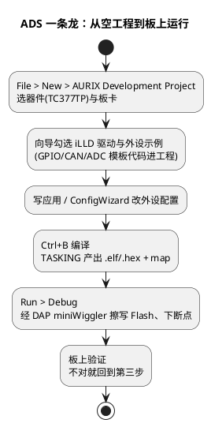

# 01-AURIX-Dev-Studio

> 一句话定位：英飞凌给 AURIX（TC2xx/TC3xx）做的免费 Eclipse 系 IDE——建工程、挂 iLLD 驱动、编译、经 DAP miniWiggler 烧录调试一条龙，是 TC377 平台的"官方驾驶舱"。
> 等级：L1→L2 ｜ 前置：[01-从敲下编译到烧进板子-工具链全景](../../00-入门导读/01-从敲下编译到烧进板子-工具链全景.md)

## 原理

AURIX Development Studio（下称 ADS）本体是 Eclipse CDT + 一包英飞凌插件：工程向导、iLLD 驱动库、图形配置向导（ConfigWizard）、烧录调试集成，编译器用 IDE 内免授权费的 TASKING TriCore。它值钱的不是编辑器，而是**把 AURIX 特有的东西打包好了**：多核工程模板、外设驱动、DAP 探针链路、TC3xx 启动代码和 lsl 链接脚本模板。记住全景篇那句话：IDE 是驾驶舱，按钮背后仍是命令行。

## 详解

### 1. 工程视图：先认得这几个文件夹

| 目录/文件 | 是什么 | 用途 |
|---|---|---|
| `Infineon` 库工程 | iLLD + Service Files（系统服务/寄存器定义） | 外设驱动底座，原则上只读 |
| `_Templates` | 向导生成的示例（Led、Can、Adc…） | 新人抄代码的起点 |
| 启动代码 + `*.lsl` | startup 代码 + 内存布局脚本 | 改内存分配在这里动刀 |
| ConfigWizard 配置文件 | 图形化外设配置（时钟/GPIO/中断优先级）的产物 | 双击进图形界面改，别手改生成物 |
| Debug/Launch 配置 | 烧录调试参数（探针类型、Flash 算法） | 换板换探针新建一份，别共用 |

### 2. AURIX 特有的三件事：Core、编译器选项、MemMap

- **Core 选择**：TC377 是三核（CPU0/1/2）。向导直接提供单核/多核模板；多核工程里"哪个核跑哪些代码"最终由链接段与启动配置决定——查证据永远看 map 文件里符号落在哪个核的地址空间。
- **TriCore 编译器选项入口**：`Project > Properties > C/C++ Build > Settings`——TASKING 的 Compiler 页管优化等级（-O0~-O3）、宏定义、警告；Linker 页挂 lsl 脚本；MAP 页勾生成 map。**每个 GUI 选项背后都是命令行一个参数**，去 Console 视图看完整命令才算真懂。
- **MemMap（内存映射）**：TriCore 的段机制——函数数据的 near/far、`#pragma section`、PSPR/DSPR/LMU/DCFL 这些内存区，都由 lsl 文件定义、编译器按声明归段；AUTOSAR 工程的 `MemMap.h` 段映射最终也要和 lsl 对得上。链接报 overflow，先开 map 看各段水位，再决定挪谁砍谁。

### 3. 与 TRACE32 的配合

| 维度 | ADS 自带调试 | TRACE32 |
|---|---|---|
| 硬件 | DAP miniWiggler（同一根线） | PowerDebug 探针 + 同一 DAP 口 |
| 强项 | 源码级断点、变量悬停、与工程无缝 | 脚本化、观察点、多核同步、Trap 现场 |
| 定位 | 开发期快速迭代 | 疑难杂症、产线、崩溃分析 |

关键是**两边共用同一份 .elf**：ADS 编出来的 ELF 直接给 TRACE32 加载符号，变量地址才对得上；cmm 脚本与 ELF 一起进 Git。

## 实操/配置

### 建工程到烧录 6 步

1. `File > New > Project > AURIX Development Project`，输入工程名；
2. 选器件（如 TC377TP）与板卡——评估板选对应 KIT，自制板选通用模板后自己配时钟；
3. 向导勾 iLLD 驱动与需要的外设示例，Finish（ADS 会把 Infineon 库工程一并导入工作区）；
4. Ctrl+B 编译，Problems 清零，Console 里顺便读一遍编译命令；
5. `Run > Debug Configurations`，Connection 页选 **DAP miniWiggler**，核对 Flash 算法与器件一致，点 Debug；
6. 首次烧录自动擦写 Flash 并停在 main——之后就是"改→编译→烧→验"的循环。

### 常用配置速查

| 位置 | 配什么 | 一句话 |
|---|---|---|
| Properties > Settings > Compiler | 优化/警告/宏定义 | 等价命令行参数，Console 可核对 |
| Settings > Linker | lsl 脚本与库 | 内存布局的唯一权威 |
| Debug Configurations > Connection | 探针类型与速率 | 连不上第一个查这里 |
| Project Explorer 双击配置文件 | ConfigWizard 图形配置 | 改完保存，生成代码别手摸 |

## 易错点与陷阱

1. **现象：编译过了、烧进去外设不动。原因：烧了另一个 build 配置的旧产物。对策：烧录前在输出目录确认时间戳，"哪个配置编的就烧哪个"。**
2. **现象：iLLD 头文件找不到。原因：只拷应用工程没带 Infineon 库工程，或工作区路径变了。对策：用 File > Import 整体导入，路径约定写进工程 README。**
3. **现象：同事机器编出结果不同。原因：TASKING/ADS 版本不一致或绝对路径引用。对策：README 钉死工具版本，工程内一律相对路径。**
4. **现象：断点打了不命中。原因：优化等级高，代码被重排/内联，源码行没了。对策：调试用单独的 -O0 配置，或对反汇编地址下断点。**
5. **现象：链接报 overflow by xxx bytes。原因：大数组/栈挤在同一内存区，MemMap 没规划。对策：map 查段水位，lsl 挪段或显式指定段放置。**
6. **现象：索引飘红但编译能过。原因：CDT 索引与真实编译选项脱节。对策：Rebuild Index，别去"修"明明能编译的代码。**

## 面试高频题

**Q1：ADS 和 TRACE32 怎么分工？**
答：ADS 管开发期快速迭代（编辑、编译、源码级调试）；TRACE32 管疑难杂症与产线（脚本化、观察点、多核同步、Trap 现场保留）。同一根 DAP 线、同一份 ELF，两边符号地址才一致。

**Q2：TC377 三核工程怎么控制代码跑在哪个核？**
答：向导选多核模板；代码归属本质由链接段与启动配置决定——每个核有自己的 PSPR/DSPR 与启动入口。证据看 map 里符号落在哪个核的地址空间，调试时先切到对应核再设断点。

**Q3：DAP miniWiggler 扮演什么角色？**
答：英飞凌调试探针，经 AURIX 的 DAP 口承担 Flash 擦写与在线调试访问；ADS 用它下载与断点，TRACE32 也能接管同一接口，两者不冲突。

**Q4：编译器优化选项在哪改？和命令行什么关系？**
答：Project Properties > C/C++ Build > Settings 的 Compiler/Linker 页；GUI 每个选项都对应命令行一个参数，Console 里能看到完整命令——出问题要读得懂这条命令，而不是只会点按钮。

## 延伸

- [TRACE32](../../../09-调试与测试/1-L1基础/调试器/01-TRACE32.md)——疑难问题换重型调试器，同一份 ELF 接着用；
- [DAP-JTAG-SWD](../../../09-调试与测试/1-L1基础/调试器/02-DAP-JTAG-SWD.md)——miniWiggler 到芯片之间那几根线的协议；
- [链接脚本与分散加载](../../../02-芯片与体系结构/2-L2进阶/启动流程/03-链接脚本与分散加载.md)——lsl 与 MemMap 背后的内存布局原理；
- [01-从敲下编译到烧进板子-工具链全景](../../00-入门导读/01-从敲下编译到烧进板子-工具链全景.md)——回到地图看 ADS 站在流水线哪一环。
