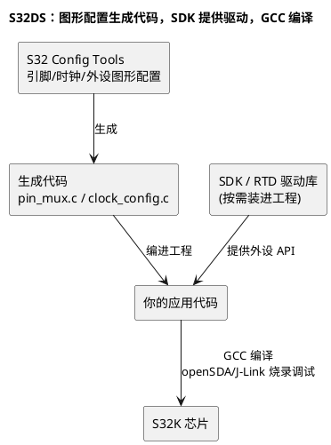

# 02-S32DS

> 一句话定位：NXP 给 S32 车规 MCU 做的 Eclipse 系 IDE——S32K1 配 SDK+Processor Expert，S32K3 换 RTD+S32 Config Tools，编译烧录调试（openSDA/J-Link）一站办完，是 S32K 平台的"官方驾驶舱"。
> 等级：L1→L2 ｜ 前置：[01-从敲下编译到烧进板子-工具链全景](../../00-入门导读/01-从敲下编译到烧进板子-工具链全景.md)

## 原理

S32 Design Studio（下称 S32DS）本体同样是 Eclipse CDT，NXP 在上面叠了三样东西：**SDK/RTD 驱动包的按需安装、S32 Config Tools 图形化配置、openSDA/J-Link 调试链**。编译器默认 GCC（S32K3 也集成 GHS/IAR 可选）。它和 AURIX Dev Studio 最大的差别在"配置工具是一等公民"——引脚、时钟这类原本要啃参考手册的活，在图形界面里点选，生成 C 代码编进工程。

## 详解

### 1. SDK 与 RTD：两代生态，别混

| 维度 | S32K1 时代（SDK） | S32K3 时代（RTD） |
|---|---|---|
| 驱动包 | S32 SDK（驱动+中间件） | RTD（Real-Time Drivers） |
| 图形配置 | Processor Expert 组件化生成代码 | S32 Config Tools（引脚/时钟）+ EB tresos（MCAL） |
| AUTOSAR MCAL | SDK 内带基础版 | RTD MCAL 用 tresos 配 ARXML |
| 安装方式 | SDK 独立包装进 S32DS | RTD 独立安装，版本要与 S32DS 匹配 |

生态细节见延伸里的对比篇；这里只需要记住：**拿到工程先问"SDK 还是 RTD、哪个版本"**——装错版本工程直接打不开。

### 2. Processor Expert 一句

S32K1 时代的图形化外设配置器：拖组件（GPIO/ADC/CAN…）→ 配参数 → Generate 生成驱动初始化代码。S32K3 起被 Config Tools + RTD 取代，但存量项目里到处都是——**会读它生成的代码，比会点组件更重要**。

### 3. S32 Config Tools：时钟和引脚的图形化

- **Pins 工具**：表格化选引脚复用、方向、上下拉，生成 `pin_mux.c`；
- **Clocks 工具**：拖方块图配时钟树（PLL 分频、外设时钟开关），生成 `clock_config.c`；
- **外设工具**：按外设配参数，常与驱动初始化二选一。

典型坑：图形界面改了**没点生成**，或生成后**没编进工程**——"我明明改了时钟怎么没生效"，九成是这两步跳了一步。

### 4. Debug/Release 双配置

| 配置 | 用途 | 差异点 |
|---|---|---|
| Debug | 日常调试 | -O0、带调试信息、输出在 `Debug_*` 目录 |
| Release | 交付/测性能 | 优化开、体积优先、输出在 `Release_*` 目录 |

`Project Properties > C/C++ Build > Set Active` 切换；两边配置各自独立——**在 Debug 里加的宏/路径，Release 里不会自动有**，交付前务必用 Release 全量编一遍。

### 5. 烧录调试：openSDA 与 J-Link

- **openSDA**：评估板板载调试电路，刷不同固件就表现为不同探针（SEGGER J-Link OB / P&E）；USB 一根线既供电又调试；
- **外接 J-Link**：Debug Configurations 里选 GDB SEGGER J-Link Debugging，配器件名与接口速率；
- 调试走 GDB 链路（SEGGER GDB Server / P&E），断点、变量、单步三件套齐全，开发期够用。

## 实操/配置

### 新建 S32K144 工程到跑通

1. `File > New > S32DS Application Project`，选 S32K144，起名；
2. 选 SDK 版本与驱动组件（按需勾，全勾编译巨慢）；
3. Debug/Release 各建一份配置，Finish；
4. Config Tools 里配好引脚与时钟，Generate；
5. Ctrl+B 编译，Problems 清零；
6. 板子接 openSDA 口，`Run > Debug` 选探针烧录，停在 main。

### 常用配置速查

| 位置 | 配什么 | 一句话 |
|---|---|---|
| Properties > C/C++ Build > Settings | 编译选项/宏/路径 | Debug、Release 各一份，别只改一边 |
| S32 Config Tools > Pins/Clocks | 引脚复用与时钟树 | 改完必须 Generate，再编译 |
| Debug Configurations | 探针（openSDA/J-Link）与下载算法 | 换板子换探针各存一份 |
| Window > Perspective > Debug | 调试视图 | 断点/变量/寄存器/反汇编 |

## 易错点与陷阱

1. **现象：工程导入后 SDK 报错。原因：机器上没装对应版本 SDK/RTD 或版本不匹配。对策：README 钉死 SDK 版本号，新机器先装包再导工程。**
2. **现象：Debug 能跑、Release 飞了。原因：两边配置漂移（优化/宏/路径不同步）。对策：交付前 Release 全量编译+上板回归，配置改动两边同步做。**
3. **现象：openSDA 连不上。原因：板载固件（J-Link OB/P&E）与调试配置不符，或 USB 线只供电不传数据。对策：刷对应固件或换匹配的 Debug Configuration，用数据线。**
4. **现象：改了时钟配置没生效。原因：Config Tools 改完没 Generate，或生成的 .c 没被编译。对策：Generate→编译→烧录三连，一步不跳。**
5. **现象：J-Link 调试频繁断线。原因：接口速率过高或目标供电不稳。对策：降 SWD/JTAG 速率，确认目标独立供电。**
6. **现象：全量重编极慢。原因：SDK 组件勾太多、没有增量习惯。对策：按需勾驱动，日常改哪编哪，全量交给 CI。**

## 面试高频题

**Q1：S32K1 和 S32K3 的开发环境差在哪？**
答：S32K1 是 S32DS+SDK+Processor Expert；S32K3 是 S32DS（S32 Platform 版）+RTD+S32 Config Tools，MCAL 配置交给 EB tresos（ARXML）。趋势是配置与驱动解耦、向 AUTOSAR 靠拢。

**Q2：Processor Expert 和 S32 Config Tools 什么关系？**
答：都是图形化配置生成代码的工具；Processor Expert 是 S32K1 时代的组件化全家桶，Config Tools 是新一代，聚焦引脚/时钟并与 RTD 配合，S32K3 上前者退场。

**Q3：Debug 和 Release 配置怎么管？**
答：Eclipse 的多 build configuration：各自独立的编译选项与输出目录（Debug_*/Release_*），Set Active 切换。要点是防配置漂移——改了 Debug 别忘 Release，交付前必须 Release 全量验证。

**Q4：openSDA 是什么？**
答：NXP 评估板的板载调试电路，USB 一线供电+调试，板载固件决定它表现为 J-Link OB 还是 P&E 探针；量产与高强度调试通常换外接 J-Link 或更专业的工具。

## 延伸

- [SDK与RTD生态对比](../../../02-芯片与体系结构/1-L1基础/S32K平台/S32K1与S32K3对比/02-SDK与RTD生态对比.md)——两代驱动生态的完整对比；
- [03-VSCode](03-VSCode.md)——把工程接到轻量编辑器看代码的思路；
- [01-从敲下编译到烧进板子-工具链全景](../../00-入门导读/01-从敲下编译到烧进板子-工具链全景.md)——回到地图看 S32DS 站在流水线哪一环。
