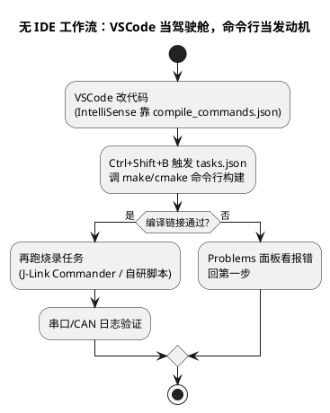

# 03-VSCode

> 一句话定位：一个"编辑器底座 + 扩展生态"——本体很轻，装上 C/C++ 扩展能看代码，配上 tasks.json 能当命令行工作流的驾驶舱；在嵌入式团队里通常当 IDE 的副业、脚本与文档的主力。
> 等级：L1→L2 ｜ 前置：[01-从敲下编译到烧进板子-工具链全景](../../00-入门导读/01-从敲下编译到烧进板子-工具链全景.md)

## 原理

VSCode 的设计是"编辑器 + 语言服务器（LSP）+ 任务"：本体不编译任何东西，C/C++ 的跳转补全由扩展起语言服务器，而服务器需要知道每个文件的**编译参数**（include 路径、宏、编译器）——这就是 `compile_commands.json` 存在的意义。构建、烧录它一概不管，靠外部命令（make/cmake/烧录脚本），用 `tasks.json` 串起来。**它不是 IDE 的替代品，是命令行工作流的漂亮外壳**——与全景篇"能命令行才算真会"的原则天然契合。



## 详解

### 1. 定位：主力还是副业？

| 场景 | 建议 | 原因 |
|---|---|---|
| 建工程、图形配置、一键烧录调试 | IDE（S32DS/ADS） | 配置工具与调试链是 IDE 的一部分 |
| 读大型仓库、跨组件跳转 | VSCode | 轻快、索引快、多窗口好用 |
| 写脚本/工具/文档 | VSCode | 插件生态与 Git 集成顺手 |
| 服务器/CI 侧看代码 | VSCode Remote | 无 GUI 环境最顺手的选择 |
| 新人第一天 | IDE | 向导兜底，少踩环境坑 |

### 2. C/C++ 扩展与 IntelliSense

想让跳转/补全准，就得喂对编译参数，三种来源：

| 来源 | 适用 | 一句话 |
|---|---|---|
| `compile_commands.json` | CMake 工程 | `-DCMAKE_EXPORT_COMPILE_COMMANDS=ON` 生成，settings 指定路径 |
| Bear / compiledb | Makefile 工程 | `bear -- make` 旁路录下真实编译命令 |
| `c_cpp_properties.json` 手工 | Eclipse 管理的工程 | includePath/defines 手写，与工程编译选项对齐 |

判断标准很简单：**跳转错了 = 喂的参数和真实编译不一致**——去修配置，别怀疑扩展，更别去改能编译的代码。

### 3. 嵌入式常用扩展

| 扩展 | 干什么 |
|---|---|
| C/C++（微软）或 clangd | IntelliSense、跳转、格式化，二选一为主 |
| Cortex-Debug | J-Link/OpenOCD 调试 ARM（S32K 侧好用） |
| PlantUML | 预览本库这种内嵌 plantuml 图 |
| GitLens / Git Graph | blame、分支图，review 利器 |
| Remote-SSH / WSL | 远程构建机 / Linux 工具链场景 |
| Task Explorer | 把 make 目标、烧录脚本列成可点的按钮 |
| EditorConfig | 团队统一缩进换行，配合 .gitattributes |

### 4. 无 IDE 工作流

组合拳：**VSCode 看 + 命令行编 + 脚本烧**。好处是构建可复现（本地命令就是 CI 命令）、不挑机器、新人一条脚本拉起环境；代价是前期要把 make/烧录脚本搭利索。适合已有规范构建系统的团队——IDE 向导的价值在工程初期，越到后期越该沉淀成脚本与任务。

## 实操/配置

### 最小可用三件套

`settings.json`（工程级，随仓库提交）：

```json
{
  "C_Cpp.default.compileCommands": "${workspaceFolder}/build/compile_commands.json",
  "files.encoding": "utf8",
  "editor.formatOnSave": false
}
```

`tasks.json`（构建 + 烧录两个任务）：

```json
{
  "version": "2.0.0",
  "tasks": [
    { "label": "build", "command": "make", "args": ["-j8"], "group": { "kind": "build", "isDefault": true } },
    { "label": "flash", "command": "python", "args": ["tools/flash_jlink.py"], "dependsOn": "build" }
  ]
}
```

原则：团队约定的 tasks/settings 入库，个人偏好（主题、快捷键）放用户级——与 Git 篇的忽略原则一致。

## 易错点与陷阱

1. **现象：满屏飘红但命令行能编译。原因：IntelliSense 的编译参数与真实构建不一致（没喂 compile_commands 或路径错）。对策：修 compile_commands 的来源与路径，别动能跑的代码。**
2. **现象：换个目录/换台机器跳转就坏。原因：配置里写死绝对路径。对策：一律 `${workspaceFolder}` 相对化。**
3. **现象：编辑器越用越卡。原因：扩展装太多、全仓库索引、多个格式化插件打架。对策：按工程启用扩展，C/C++ 与 clangd 只留一个。**
4. **现象：保存后 diff 全是格式变化。原因：格式化配置与团队规范不一致。对策：.editorconfig + 格式化设置入库对齐，慎用 formatOnSave。**
5. **现象：Remote 下找不到工具链。原因：扩展装在本地端而不是远端。对策：扩展面板切"在 SSH 上安装"，路径用远端路径。**
6. **现象：把 VSCode 当 IDE 用结果啥也干不了。原因：它没有配置工具/烧录链，那些长在 IDE 插件里。对策：图形配置回 S32DS/ADS 做，或把配置动作沉淀成命令行工具。**

## 面试高频题

**Q1：compile_commands.json 是什么、怎么来？**
答：compile database——每个 .c 一条真实编译命令（编译器、宏、include 路径）。CMake 加 `-DCMAKE_EXPORT_COMPILE_COMMANDS=ON` 生成，Makefile 工程用 Bear 旁路录制；clangd/VSCode 靠它提供准确跳转补全。

**Q2：VSCode 能替代嵌入式 IDE 吗？**
答：分环节。编辑/读代码/脚本/远程场景它更好；工程向导、图形化外设配置、一键烧录调试链是 IDE 独有。成熟团队常是"IDE 管配置与调试 + VSCode 管阅读与脚本"，或规范的纯命令行工作流。

**Q3：无 IDE 工作流的利与弊？**
答：利——构建命令即 CI 命令、可复现、不挑机器；弊——前期要自建 make/烧录脚本、调试链要自己搭（Cortex-Debug 等）。适合已有规范构建系统的团队。

**Q4：团队里推 VSCode，你先统一什么？**
答：统一"看代码的口径"：.editorconfig 管格式、compile_commands 管 IntelliSense 数据来源、tasks/settings 入库而个人偏好隔离；构建口径仍归构建系统与 CI 管。

## 延伸

- [02-S32DS](02-S32DS.md)、[01-AURIX-Dev-Studio](01-AURIX-Dev-Studio.md)——双平台官方 IDE，配置与烧录链的大本营；
- [01-从敲下编译到烧进板子-工具链全景](../../00-入门导读/01-从敲下编译到烧进板子-工具链全景.md)——"能命令行才算真会"的出处。
