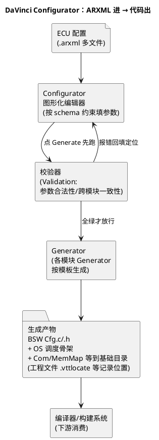

# 01-DaVinci-Configurator

> 一句话定位：Vector 家的 BSW 配置代码生成机——把 ARXML 配置"图纸"经图形化编辑、校验后批量吐出 MICROSAR C 代码与 OS 调度骨架，TC377 阵营的配置主战场。
> 等级：L2 ｜ 前置：[01-从敲下编译到烧进板子-工具链全景](../../00-入门导读/01-从敲下编译到烧进板子-工具链全景.md)

## 原理

DaVinci 家族两兄弟先分清：**Configurator 是"填表生成"的**，Developer 是"看 OS 运行时行为"的（任务切换/栈深/时序分析）。日常配 BSW 九成时间在 Configurator，调调度问题才开 Developer。

本质是一条**配置→代码的流水线**：工具读进 ECU 配置文件（ARXML），按每个 BSW 模块自带的 schema（约束规则）做一致性校验，校验过了才允许生成——生成的不是"配置文件本身"，而是**能参与编译链接的 C 代码与头文件**（`Com_Cfg.c`、`PduR_Cfg.h` 这类）。所以配置改错不会等到运行期才炸，多数在校验阶段就被拦下。

三个关键直觉：**schema 是法律**（校验红的生成不了）、**生成物是代码**（能 grep、能进版本库）、**工具管生成不管你手写**（BSW 生成物与手写代码分目录放，别混）。

## 详解

### 1. 工程文件直觉

| 文件/目录 | 直觉 |
|---|---|
| `.arxml`（多个） | 配置本体：顶层 Tresos 风格或 MICROSAR 导出的 ECU 配置，一个模块一份很常见 |
| 工程文件（.vttloc 等） | "装配清单"：记录用哪个 schema 版本、生成文件放哪些目录、导入哪些 ARXML |
| `_generated` 输出目录 | Generator 吐代码的地方，**不要手改**——下次生成全冲掉 |
| 手写集成层目录 | CDD、应用回调、Hook 代码的家，与生成物隔离 |
| schema/插件目录 | 每个 BSW 模块的参数定义与约束，换版本=换法律 |

### 2. 图形化编辑的三层结构

1. **模块列表**：左边树一模块一节点，图标状态（未配置/已改/有错）一眼扫全；
2. **容器树**：模块内按 Container 层级展开（如 Com → ComConfig → ComSignal），见 [容器与参数](../../../07-AUTOSAR架构/2-L2进阶/方法论与ARXML/02-容器与参数.md)；
3. **参数表**：右边表格填值，红叉/黄叹号即时提示违反 schema（值域、长度、引用完整性）。

### 3. 校验分两级

| 级别 | 抓什么 | 例子 |
|---|---|---|
| 单参数校验（即时） | 值域/格式 | ComTxTimeoutTime 填了非数、超 uint32 |
| 一致性校验（Generate 前） | 跨模块引用、结构矛盾 | PduR 引用了不存在的 Com Pdu；OS 任务优先级撞车；E2E DataId 未配 |

### 4. 与 MICROSAR 代码生成的关系

- Vector 的 BSW 实现叫 MICROSAR；Configurator 生成的是**配置代码 + 部分静态代码骨架**，基础 BSW 库（交付的源码包）与生成物在编译时合体；
- OS（OSEK/autosar OS）的任务、alarm、hook 也从同一份配置生成——所以"加个 Com 信号"最终会牵动 OS 侧的 task 映射（若配了 Com 周期任务）；
- 生成完成后构建系统重编，产物链路见 [工具链全景](../../00-入门导读/01-从敲下编译到烧进板子-工具链全景.md)。

## 实操/配置

### 1. 加一个 Com 信号（高频任务全流程）

1. 确认信号所在报文：System Signal 与 I-Signal 已在通讯矩阵 ARXML 里（缺先补，见 [通讯矩阵ARXML](../../../05-汽车网络通讯/1-L1基础/通讯数据库/03-通讯矩阵ARXML.md)）；
2. Com 模块 → ComConfig 下定位/新增对应 IPdu Group 容器，把报文挂进 ComIPdu；
3. 新增 ComSignal：绑 I-Signal、填位偏移/长度/字节序/转换函数；
4. 若是 Tx：配 ComTxMode（周期/事件）、ComFirstTimeout/ComTimeout；跨 ECU 还要查 PduR 路由是否已通（Com → CanIf → Can 驱动）；
5. 校验（Generate 触发）→ 报错就双击定位到容器改；
6. 生成代码 → 应用侧 `Com_SendSignal()` 用新 signal id（重新生成的头文件里拿 handle）；
7. 编译烧录，CANoe/总线工具验证信号确实在总线上出现。

### 2. 生成动作与产物核对

| 步骤 | 动作 | 核对点 |
|---|---|---|
| 1 | Generate（批量生成） | 输出窗口 0 error |
| 2 | 看生成目录时间戳 | 目标文件确实更新 |
| 3 | grep 关键配置 | `Com_SignalId` / Pdu id 与预期一致 |
| 4 | 编译 | 生成物与手写代码无符号冲突 |
| 5 | 烧录+总线验证 | 报文周期/信号值与配置一致 |

### 3. OS 任务挂钩（配置影响调度的典型）

- 在 OS 视图给 BSW 模块配 task 映射（如 Com 的 MainFunction 周期任务）；
- 注意优先级与激活策略：改了 Com 任务周期 → OS alarm/counter 跟着变 → 生成物里 Os_Cfg 更新；
- 配完看 Developer 的调度视图验证不超载、栈不溢（Developer 的本职）。

## 易错点与陷阱

1. **现象：Generate 报一堆红，找不到从哪改起。原因：改了通讯矩阵底层 ARXML，上游引用连坐。对策：按报错列表从"源头容器"改起（先补缺失定义，再清引用错误）；一次只改一个模块的配置再校验。**
2. **现象：生成代码编译过，板上信号死活不发。原因：ComTxMode 没配/超时没到，或 PduR 到 CanIf 的路由没通。对策：按"Com→PduR→CanIf→Can"四层逐层 grep 配置；总线侧用 CANoe 类工具确认报文到没到物理层。**
3. **现象：同事打开工程满屏红，你这边好好的。原因：schema/MICROSAR 版本不一致，配置写的是新 schema、他装的旧插件。对策：工程里固定 Vector 工具与交付包版本号，README 写明；版本升级单独开任务做迁移验证。**
4. **现象：手改了生成文件，下次生成后修改消失、功能"回退"。原因：生成目录是工具的领地。对策：所有定制走"配置"或集成层手写目录（回调/Hook/CDD），生成物零手改。**
5. **现象：配置改对了但行为没变。原因：忘了 Generate 或忘了重编对应模块。对策：把 Generate+编译做成固定顺序（或进 CI 批处理）；核对生成文件时间戳。**
6. **现象：加了几个信号后 RAM 暴涨/超 flash。原因：每个 ComSignal/IPdu 都占静态内存，顺手加的没删。对策：生成后看 map 文件对账（见本区编译器篇）；清理实验性配置再交付。**

## 面试高频题

**Q1：DaVinci Configurator 和 Developer 的分工？**
答：Configurator 负责"配置→生成"：编辑 ARXML 参数、校验、生成 MICROSAR BSW 代码；Developer 负责 OS 运行时分析：任务调度时序、栈使用、执行时间，用于验证配置出的调度合不合理。一个管"生孩子"，一个管"体检"。

**Q2：为什么 AUTOSAR 配置要"校验通过才能生成"而不是直接生成？**
答：配置间存在大量跨模块引用约束（PduR 引用、OS 优先级、E2E 参数组），文本层面看不出来；schema 校验把这些约束前置到生成阶段拦截，避免错误配置流入编译/运行期才爆出难查的运行时问题。这也是"配置即代码"质量的兜底。

**Q3：在 DaVinci 里新增一个 Com 发送信号，改动会波及哪些模块？**
答：至少 Com（ComSignal/IPdu/TxMode/超时）+ PduR（若路由未通）+ CanIf/Can（报文与 DLC 若新增）；若配了周期任务还牵动 OS（task/alarm 映射）；应用层要换用新 signal handle。答出"Com 为主、PduR/OS 可能连坐"即合格。

**Q4：BSW 生成代码怎么和手写代码共存？**
答：目录隔离——生成物在工具管理的输出目录（禁止手改），CDD/Hook/应用在独立源码目录；两边的"接头"是生成头文件里的 API 与 handle 定义。构建系统统一编译，map 文件最终对账。

## 延伸

- [EB-tresos](02-EB-tresos.md)——EB 系同类工具，S32K 阵营主力；
- [配置diff-review](03-配置diff-review.md)——配置改完怎么评审、怎么跟 Git 配合；
- [ECU配置结构](../../../07-AUTOSAR架构/2-L2进阶/方法论与ARXML/01-ECU配置结构.md)、[容器与参数](../../../07-AUTOSAR架构/2-L2进阶/方法论与ARXML/02-容器与参数.md)——工具里那棵树的底层模型；
- [通讯矩阵ARXML](../../../05-汽车网络通讯/1-L1基础/通讯数据库/03-通讯矩阵ARXML.md)——Com 配置的上游数据从哪来。
