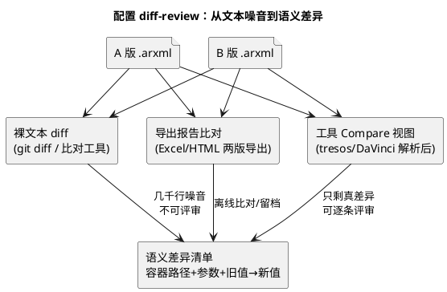

# 03-配置diff-review

> 一句话定位：ARXML 配置改动的评审方法论——为什么文本 diff 没法直接看、怎么用工具 Compare 视图/导出报告做"语义级"比对、以及怎么跟 Git 协作。
> 等级：L2 ｜ 前置：[01-从敲下编译到烧进板子-工具链全景](../../00-入门导读/01-从敲下编译到烧进板子-工具链全景.md)

## 原理

配置评审的核心矛盾：**ARXML 是"给机器看的"**——语义藏在容器层级路径里，但文本层面全是噪音。直接 `git diff` 一个 .arxml，你会看到几千行变化，其中真改动可能只有三行。

噪音从哪来：

| 噪音源 | 长什么样 | 为什么会变 |
|---|---|---|
| GUID/UUID | 每个容器的标识符整串换掉 | 工具重生成标识、或不同工具写入方式不同 |
| 元素顺序 | 同样的子容器换了排列顺序 | 工具按内部 hash/引用顺序输出，语义等价 |
| 版本头 | 文件头 schema 版本、工具版本、时间戳 | 工具版本升级、保存一次就刷 |
| 格式 | 缩进/换行/自闭合标签差异 | 不同版本工具的序列化器不同 |

所以正确姿势是**升一层看语义**：不比"文本行"，比"**容器路径 + 参数名 = 参数值**"三元组。这正是 tresos/DaVinci 自带 Compare 功能做的事——工具解析 ARXML 后按容器树比对，只报语义差异。

一句话原则：**Git 管存储，工具管阅读**——ARXML 进库，看 diff 用工具视图。

## 详解

### 1. 工具内 Compare（首选）

| 工具 | 入口 | 特点 |
|---|---|---|
| EB tresos | 工程/模块 → Compare（选基准版本或文件） | 按容器树列差异，能跳转到参数；支持与历史版本/外部文件比 |
| DaVinci Configurator | 工程内 Compare/导入对比类视图 | 同样按容器级比对，配合校验状态看 |

用法套路：评审前先跑一次 Compare，把差异清单（容器路径+旧值→新值）贴进评审记录——评审者对着清单问"为什么改"，而不是对着几千行 XML 猜。

### 2. 导出报告比对（留档/跨工具）

1. 两版配置各导出一份 Excel/HTML 报告（tresos/DaVinci 都有 Export 功能）；
2. 用脚本或表格工具按"容器路径+参数名"对齐比两列值；
3. 产出结构化差异表，可进评审记录附件——见 [脚本索引](../辅助脚本沉淀/01-脚本索引.md) 里报表类脚本的思路。

### 3. 关注容器路径而非文本行

- ARXML 的语义地址是**路径**：`Com/ComConfig/ComIPdu[XYZ]/ComTxModeTimeout`——评审讨论用路径说话，"第 1234 行改了"是无效信息；
- 路径读法与容器模型见 [容器与参数](../../../07-AUTOSAR架构/2-L2进阶/方法论与ARXML/02-容器与参数.md)、[ARXML手读](../../../07-AUTOSAR架构/2-L2进阶/方法论与ARXML/03-ARXML手读.md)。

### 4. 版本耦合陷阱

工具版本升级会让 diff "虚假变红"：schema 升级带来默认值显式化、容器结构迁移、属性改名——这些**不是工程师的语义改动**，却会在 Compare 里混进来。对策：

| 手段 | 说明 |
|---|---|
| 升级迁移独立提交 | 工具升级产生的 ARXML 变化单独一个 commit，不和功能改动混 |
| 升级前后全量比对留档 | 迁移 commit 里附 Compare 报告，证明"语义零变化"或列出被迫变化项 |
| 锁版本 | 工程内固定工具版本（见 [DaVinci](01-DaVinci-Configurator.md)/[tresos](02-EB-tresos.md) 各自的版本管理） |

### 5. 评审核查单：改动波及面

拿到差异清单后，按波及面逐项过：

| 波及维度 | 要问的问题 |
|---|---|
| 调度 | 有没有动 OS task/alarm/优先级？Com 周期变化会不会挤占 CPU？ |
| 内存 | 新增容器/IPdu 带来多少 RAM/Flash？map 水位还剩多少？ |
| 引脚复用 | MCAL 侧引脚配置变了没有？和硬件图纸对得上吗？ |
| 中断优先级 | 中断优先级/分组改了没？与 OS 优先级架构冲突吗？ |
| 通讯矩阵 | 信号/报文定义与系统级矩阵一致吗？上下游 ECU 知道吗？ |
| E2E/安全 | 涉及保护的报文 E2E 配置同步改了吗？ |
| 生成物 | Validate→Generate→编译三拍都跑了吗？ |

## 实操/配置

### 1. 一次标准配置评审流程

1. 开发者在工具里改配置，**Validate 全绿**才提交；
2. ARXML 提交 Git（commit message 注明模块与意图，如 "Com: 新增 XYZ 信号"）；
3. 评审者本地拉取后用工具 Compare 对比上一个 tag/commit 的 ARXML；
4. 导出/截图差异清单，对照上面核查单逐项过；
5. 涉及调度/内存/引脚的改动，要求附 map 对比或硬件确认；
6. 评审结论写回记录，问题项打回重改。

### 2. 与 Git 协作的姿势

| 做 | 不做 |
|---|---|
| ARXML 原样进库（工具可再打开） | 只存生成代码不存 ARXML（本末倒置） |
| 生成物按团队策略决定是否进库（进库则锁死生成环境） | 生成物和 ARXML 半混半改 |
| 一次 commit 一个模块的配置改动 | 十个模块的改动挤一个 commit |
| 工具升级迁移独立 commit | 升级+功能改混提交，diff 灾难 |

### 3. 无工具环境时的降级方案

- 用 Python 解析 ARXML 抽成"路径+参数+值"三列表（见 [Python处理ARXML](../../../01-编程语言/2-L2进阶/辅助脚本/01-Python处理ARXML.md)），再 diff 两张表——语义 diff 的手工版；
- 或两版导出报告后表格比对，效果等价、速度慢些。

## 易错点与陷阱

1. **现象：评审者直接 git diff ARXML，几千行绿红刷屏，直接放行。原因：文本噪音淹没语义差异，评审形同虚设。对策：规定 ARXML 评审一律走工具 Compare 或导出报告比对，差异清单贴进评审记录。**
2. **现象：两个人改同一模块的 ARXML，合并后工具打不开。原因：同一容器结构被两边分别增删，文本层面合并成功但语义结构破坏。对策：ARXML 冲突别手工拼文本——回工具里重新做一边的改动，或小步提交减少撞车面。**
3. **现象：Compare 显示大量差异但功能没改。原因：工具版本升级的 schema 迁移噪音混入。对策：迁移独立提交并附"语义零变化"比对报告；日常锁版本。**
4. **现象：改了参数但评审清单里没有。原因：改在生成代码里手改，ARXML 没动——改动不在"源头"。对策：生成物零手改纪律；评审时反向抽查关键参数在 ARXML 里确实存在。**
5. **现象：通讯相关的改动评审通过，整车联调对不上。原因：只看了本 ECU 的 Com 配置，没和系统级通讯矩阵对账。对策：核查单里"通讯矩阵"一栏强制：信号定义与矩阵文件逐项核对（上游见 [通讯矩阵ARXML](../../../05-汽车网络通讯/1-L1基础/通讯数据库/03-通讯矩阵ARXML.md)）。**
6. **现象：只盯参数值，漏了结构性改动。原因：Compare 默认聚焦值变化，容器增删/移动容易被略过。对策：清单里把"新增/删除/移动的容器"单独列一节重点过——结构改动波及面远大于改值。**

## 面试高频题

**Q1：为什么不能直接对 ARXML 做文本 diff 做配置评审？**
答：三个噪音源——GUID/UUID 变化、同语义的元素顺序变化、版本头与格式差异，会把三行真改动淹没在几千行文本变化里；且文本行号不承载语义，ARXML 的语义单位是"容器路径+参数"。正确做法是用配置工具的 Compare 功能做语义级比对，或把两版解析成"路径+参数+值"表后再比。

**Q2：配置工具版本升级时，怎么让 diff 评审仍然可信？**
答：把升级迁移独立成 commit：升级→重新保存/迁移→用工具 Compare 对比升级前后，证明语义零变化（或列出被迫变化项）附进提交记录；日常工程锁工具与插件版本，CI 机器同版本。这样后续功能 diff 才干净。

**Q3：一个"加个信号"的配置改动，评审时要检查哪些波及面？**
答：至少五维——通讯（Com/PduR/矩阵一致性）、调度（周期任务与 CPU 占用）、内存（RAM/Flash 增量，map 对账）、安全（若在保护域，E2E 同步）、生成链路（Validate/Generate/重编三拍齐全）。答出"配置改动不止影响本模块"的意识即合格。

**Q4：ARXML 和生成代码，哪个进 Git？**
答：ARXML 必进——它是配置的源头，工具能随时重新打开与生成；生成代码两种策略：进库则必须锁死生成环境保证可复现，不进库则 CI 里用命令行（如 tresos_cmd）从 ARXML 重新生成后再编译。核心原则：源头唯一，产物可重建。

## 延伸

- [DaVinci-Configurator](01-DaVinci-Configurator.md)、[EB-tresos](02-EB-tresos.md)——Compare 功能所在的两个工具；
- [diff-review技巧](../../../07-AUTOSAR架构/2-L2进阶/方法论与ARXML/04-diff-review技巧.md)——07 区同主题方法论（本篇是工具视角的落地）；
- [ARXML手读](../../../07-AUTOSAR架构/2-L2进阶/方法论与ARXML/03-ARXML手读.md)——没有工具时人肉读 ARXML 的底子；
- [Python处理ARXML](../../../01-编程语言/2-L2进阶/辅助脚本/01-Python处理ARXML.md)——手工语义 diff 的脚本写法。
