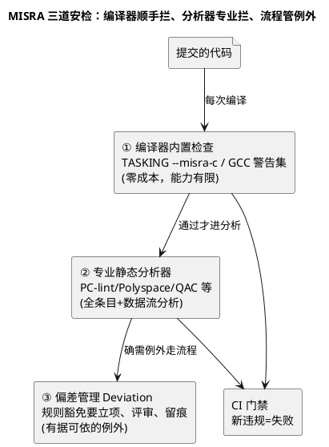

# 01-MISRA工具链

> 一句话定位：MISRA-C 从"纸面条目"到"工程门禁"的落地篇——编译器内置检查、专业静态分析器、偏差管理三件套怎么选、怎么接、怎么管，让规范真的拦住代码而不是躺在文档里。
> 等级：L2 ｜ 前置：[01-从敲下编译到烧进板子-工具链全景](../../00-入门导读/01-从敲下编译到烧进板子-工具链全景.md)

## 核心概念

MISRA-C 条目本身在 [01 区 代码规范与MISRA-C](../../../01-编程语言/2-L2进阶/代码规范与MISRA-C/README.md) 讲透了（分类导读、高频违规、改写案例）。本篇换一个问法：**规范靠什么执行？靠人眼评审是守不住的，要靠工具链**。

一句话分工：**编译器拦"顺手能拦的"，静态分析器拦"需要数据流推理的"，偏差流程管"确实要违反的"**——三者缺一，规范就有洞。

## 详解

### 1. 工具选型对照

| 工具类 | 代表 | 强项 | 局限 |
|---|---|---|---|
| 编译器内置 | TASKING `--misra-c`、部分编译器诊断 | 零额外成本、每次编译都跑 | 条目覆盖不全、无跨函数分析 |
| 专业静态分析 | PC-lint/PC-lint Plus、Helix QAC、Polyspace、Coverity 等 | 条目全、数据流/控制流推理、认证材料（ASIL 项目常点名 QAC 类） | 收费、有学习与误报治理成本 |
| 开源组合 | cppcheck + clang-tidy/clang-analyzer | 免费、CI 友好 | MISRA 条目覆盖与深度不及商用 |

AUTOSAR 量产项目（尤其 ASIL）常见组合：**编译器检查 + 商用静态分析器 + 客户/流程点名的工具各跑一遍**，报告归档进交付物。

### 2. 接入工程的三步走

**第一步：定基线。**首次全量扫描存量代码，结果必然是"四位数违规"——别慌，这不叫失败，叫家底盘点。把存量违规冻结为基线（baseline），门禁只管"新增"。

**第二步：定级别。**按条目类别定处理策略：

| 类别 | 处理 | 门禁 |
|---|---|---|
| Mandatory（强制） | 无条件改 | 违规即失败 |
| Required（必要） | 改；确实不能改走偏差 | 违规即失败（除非有偏差记录） |
| Advisory（建议） | 尽力；记录即可 | 不拦，趋势管理 |

（类别怎么来的详见 [MISRA-C规则分类导读](../../../01-编程语言/2-L2进阶/代码规范与MISRA-C/02-MISRA-C规则分类导读.md)。）

**第三步：进 CI。**扫描作为流水线一环（在编译后、评审前），新增违规=构建失败；存量基线逐步下压，每版消灭一批，趋势出报表。

### 3. 与 AUTOSAR 生成代码的关系

BSW 生成代码（tresos/DaVinci 吐出来的）自带偏差说明：厂商声明"生成代码按工具链规则集豁免部分条目"。**扫描配置要把生成代码目录与手写代码分开**：手写代码全量严查，生成代码沿用厂商规则集——否则每天被生成代码的"合规违规"刷屏，真正的手写问题反而看不见（生成代码与手写代码的边界见 [CDD定位与边界](../../../04-MCAL与外设驱动/2-L2进阶/CDD设计方法论/01-CDD定位与边界.md)）。

### 4. 偏差（Deviation）怎么管

偏差不是"关警告"，是**有文档的例外**：违反哪条、为什么必须违反、风险怎么补偿、谁批准、有效期多久。静态分析器普遍支持偏差注释（在代码处标注，与报告联动）。评审时偏差清单是必查项——**没有偏差记录的违规=未处理；有偏差但没有补偿措施的=不合格偏差**。

### 5. 规则集文档：团队的第一份契约

工具买回来只是开始，真正让三道防线不打架的是一份**项目规则集文档**，内容五件：

1. 采用的 MISRA 版本与是否含增补（如 MISRA-C:2012 + Amendments）；
2. 每条目的处置级别（强制改/走偏差/记录即可）；
3. 工具映射：条目在所用工具里的开关名与灵敏度；
4. 生成代码与手写代码的适用范围划分；
5. 偏差模板与审批链。

这份文档进版本库、随评审更新——新成员第一天读它，比读任何工具手册都先建立"本工程什么能做什么要走流程"的边界感。

## 易错点与陷阱

1. **现象：静态分析器一开，几千条违规，团队直接弃用。原因：把存量当新增，没有基线概念。对策：首扫定基线冻结存量，门禁只拦新增；存量按模块分批下压，每迭代消化一批并在例会报趋势。**
2. **现象：同一份代码两个工具结论打架。原因：各工具规则实现与默认配置不同，同类问题报不同条目/不同灵敏度。对策：以项目规则集文档为准（条目+级别+工具映射），两工具配置对齐同一规则集；争议条目人工裁决并留痕。**
3. **现象：生成代码的 MISRA 报告刷屏，淹没了手写代码的真问题。对策：扫描配置区分目录——生成代码按厂商规则集走，报告单独归档；手写目录全量严查，两份报告分开评审。**
4. **现象：交付审计被问"这条违规为什么豁免"答不上。原因：当初用行内注释随手压掉了，没有偏差文档。对策：偏差走流程三件套——理由、补偿措施、批准人；工具的偏差注释与偏差台账双向可追溯。**
5. **现象：编译器 MISRA 检查与静态分析器结果差异大，团队困惑。原因：以为两者等价。对策：明确宣传定位——编译器检查是"免费的顺带安检"，专业分析器才是规则集权威；规则冲突以分析器+规则集文档为准。**

## 面试高频题

**Q：MISRA-C 合规怎么在工程里落地执行？**
答：工具链三道防线——编译器内置 MISRA 检查每次编译跑（零成本）；专业静态分析器按项目规则集全量扫描（条目权威）；偏差流程管理例外（有理由、有补偿、有批准）。接入节奏是"基线冻结存量、门禁只拦新增、分批下压存量"，并区分手写代码与 BSW 生成代码两套规则集。CI 里静态分析作为一环，新增违规即构建失败。

**Q：什么是 MISRA 偏差（Deviation），为什么需要它？**
答：偏差是对某条规则的、有记录的、经批准的豁免——因为存在合理场景必须"违反"某条规则（如寄存器访问必须类型双关、某些宏必须嵌套）。合格的偏差包含：违反哪条、技术理由、风险补偿措施、批准人、范围/有效期。它与"注释压警告"的本质区别是可追溯与可审计：审计时每条豁免都有出处。

**Q：AUTOSAR 工程里静态分析要不要扫生成代码？**
答：要扫但分开管。生成代码按供应商声明/工具链规则集豁免部分条目（厂商已做偏差），扫描报告单独归档供审计；手写代码（应用+CDD）按项目完整规则集严查。混在一起会导致生成代码的海量"合规违规"淹没手写代码的真问题。

## 延伸

- [02-静态分析](02-静态分析.md)——静态分析的原理与日常使用法；
- [MISRA-C规则分类导读](../../../01-编程语言/2-L2进阶/代码规范与MISRA-C/02-MISRA-C规则分类导读.md)——Mandatory/Required/Advisory 的来历；
- [高频违规条目解析](../../../01-编程语言/2-L2进阶/代码规范与MISRA-C/03-高频违规条目解析.md)——哪些条目天天被触发；
- [01-TASKING](../编译器/01-TASKING.md)——编译器内置 MISRA 检查的挂载点；
- [CDD定位与边界](../../../04-MCAL与外设驱动/2-L2进阶/CDD设计方法论/01-CDD定位与边界.md)——手写 CDD 与生成代码的边界划分。
