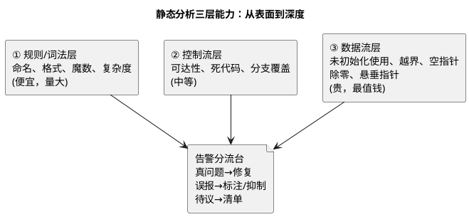

# 02-静态分析

> 一句话定位：不跑代码、只读代码的"X 光机"——用数据流与规则推理在编译前揪出未初始化、越界、空指针这类"测试难复现、场上必爆炸"的缺陷，并把告警治理成一条只降不升的基线。
> 等级：L2 ｜ 前置：[01-MISRA工具链](01-MISRA工具链.md)

## 核心概念

上一篇讲"工具怎么选怎么接"，这一篇讲"工具到底怎么工作、告警怎么治理"。静态分析与测试的根本区别：**测试证明"跑过的路径没问题"，静态分析推理"所有路径有没有问题"**——不用造输入、不用上板子。



三个能力层的投入产出不同：规则层便宜但价值密度低，数据流层计算贵但抓的是"高危低频"缺陷。**嵌入式最看重数据流层**——栈溢出、未初始化在车上复现一次的成本，够买十年分析器授权。

## 详解

### 1. 数据流分析抓什么（嵌入式高危清单）

| 缺陷类 | 典型现场 | 为什么测试难抓 |
|---|---|---|
| 未初始化读 | 局部变量在错误分支才赋值 | 取决于走哪条路径，正常用例碰不到 |
| 数组越界 | 环形缓冲索引回绕瞬间 | 边界条件只闪现一拍 |
| 空指针解引用 | 初始化失败的指针被使用 | 失败注入场景测试常漏 |
| 除零 | 采样值算速率，采样为 0 时 | 依赖外部数据状态 |
| 中断/主流程竞态 | 共享变量漏 volatile/无临界区 | 时序相关，复现概率低 |

前四条是分析器强项（纯数据流推理）；竞态类需要专门的并发分析，弱信号是**共享变量无保护的跨上下文访问**——分析器常以规则形式提示，终裁靠人（volatile 与屏障的正确用法见 [volatile的正确使用](../../../01-编程语言/2-L2进阶/寄存器编程/01-volatile的正确使用.md)、[读写时序与屏障](../../../01-编程语言/2-L2进阶/寄存器编程/04-读写时序与屏障.md)）。

### 2. 告警治理：基线的工作法

静态分析的失败模式不是"找不出问题"，而是"报得太多没人看"。治理三原则：

1. **基线冻结**：存量告警入基线文件（工具都支持导出/导入），门禁只拦新增；
2. **分级处置**：高危（数据流缺陷）当错误立即修；中危进迭代清单；低危（风格类）批量自动修或调低级别；
3. **趋势只降不升**：每版基线规模必须 ≤ 上版，CI 出趋势图，涨了要解释。

误报（false positive）的正确处理不是注释压掉就完事：**能用工具配置收窄的先收窄（更精确的参数约束、路径裁剪），确属工具局限的才标注抑制并注明原因**——无差别抑制会让真正的缺陷从同一个洞溜走。

### 3. 度量：顺手拿到的体检报告

静态分析器扫完顺手输出度量（圈复杂度、函数长度、全局变量数、注释率）。用法不是贴 KPI，是圈三个红灯：

- **圈复杂度 > 15 的函数**：状态机化的重构候选（怎么拆见 [状态机](../../../01-编程语言/2-L2进阶/数据结构与算法-C实现/04-状态机.md)）；
- **超长函数/超深嵌套**：评审时重点盯；
- **某模块告警密度突增**：设计问题或作者对接口理解有偏差，优先结对评审而非各自修。

### 4. 在流水线里的位置

```text
提交 → 编译（含编译器警告/MISRA 快检）→ 静态分析 → 单元测试 → 评审 → 合入
```

静态分析放编译后、评审前的理由：让评审人看的是"机器已经挑过一轮"的代码，人脑留给机器不擅长的设计权衡；分析器增量模式（只扫改动文件+受影响调用链）让这一步控制在分钟级，不拖垮提交节奏。

### 5. 静态分析的边界（别神化）

- **它不能证明程序正确**——只按规则集与推理深度报告"可疑点"，漏报永远存在；
- **并发与硬件交互是弱区**——中断时序、DMA、外设寄存器的真实行为，分析器只能提示模式风险；
- **误报治理是持续成本**——换工具/升版本常带来一批新误报，预留治理时间。

边界之外靠什么补：动态测试、代码评审、以及运行期防线（栈水印、看门狗，见 [看门狗原理](../../../04-MCAL与外设驱动/2-L2进阶/Wdg/01-看门狗原理.md)）——**质量是体系，分析器是其中一环**。

## 易错点与陷阱

1. **现象：分析跑一次 40 分钟，团队绕开它。原因：全量扫描塞进每次提交。对策：日常提交跑增量模式（改动+受影响链），夜间/合入前跑全量；大工程用分布式扫描拆分。**
2. **现象：告警 3000 条，两周后没人再看报告。原因：无基线、无分级，"报告"变成"垃圾邮件"。对策：基线冻结+新增即失败+高危立即修三板斧；报告只呈现"新增/高危/趋势"三块。**
3. **现象：为消一条未初始化告警，把变量随手赋 0。原因：不理解告警本质——"可能有未定义读"，赋 0 只是掩盖逻辑缺口。对策：先问"为什么会有未赋值路径"：是初始化顺序问题、错误分支漏处理、还是变量该收敛作用域；修路径而不是盖被子。**
4. **现象：两版本对比告警数下降，审计却查出新高危。原因：只看总数不看分布，低危修一堆、高危进基线被"合法化"。对策：趋势按严重级分列，高危基线单独台账、只减不增。**
5. **现象：误报标注越积越多，后来真缺陷混在抑制注释里漏网。对策：抑制注释带原因与工单号，定期复审抑制清单；工具升级后先清理一轮可解除的抑制。**

## 面试高频题

**Q：静态分析和动态测试各抓什么，为什么两个都要？**
答：静态分析不执行代码，靠规则与数据流推理，擅长"所有路径上"的缺陷模式（未初始化、越界、空指针、规则违规），便宜且可在提交瞬间跑；动态测试执行真实代码，验证功能行为与时序、硬件交互，能抓静态分析推不出的运行期问题（竞态实际发生、外设行为、性能）。前者广而浅（路径层面），后者真而窄（执行过的输入），互补缺一不可。

**Q：静态分析的误报怎么处理？**
答：三步——先收窄：用更精确的类型/取值约束、路径配置帮工具减小推理空间；再复核：确认是工具局限的，用带原因与工单号的抑制标注留痕；最后复审：工具升级后重开抑制清单，能解除的解除。红线是无差别压制：不加说明地压告警会让真缺陷从同一出口溜走。

**Q：怎么在团队里推行静态分析而不被抵触？**
答：关键是别把存量当新增——首次全量定基线，门禁只拦新增违规，存量分批消化并公开趋势；高危（数据流缺陷）当错误立即修，低危批量自动修或降级；增量模式保证提交速度；把度量当体检灯而不是 KPI。让工具从"找茬的"变成"挡枪的"，团队才会真用。

## 延伸

- [01-MISRA工具链](01-MISRA工具链.md)——工具选型、规则集与偏差管理；
- [03-高频违规条目解析](../../../01-编程语言/2-L2进阶/代码规范与MISRA-C/03-高频违规条目解析.md)——最常触发的条目与改法；
- [volatile的正确使用](../../../01-编程语言/2-L2进阶/寄存器编程/01-volatile的正确使用.md)——竞态类弱信号的正确姿势；
- [04-合规改写案例](../../../01-编程语言/2-L2进阶/代码规范与MISRA-C/04-合规改写案例.md)——从违规到合规的改写示范；
- [WdgM联动](../../../04-MCAL与外设驱动/2-L2进阶/Wdg/04-WdgM联动.md)——静态防线之外的运行期防线。
