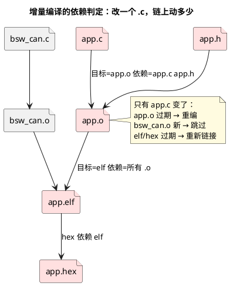

# 01-Makefile

> 一句话定位：make 的全部秘密就一条——"目标比依赖旧才重做"；Makefile 是用"目标-依赖-命令"三元组把这条规则写成工程说明书，增量编译、并行编译、自动化出包全从这里长出来。
> 等级：L2 ｜ 前置：[01-从敲下编译到烧进板子-工具链全景](../../00-入门导读/01-从敲下编译到烧进板子-工具链全景.md)

## 核心概念

AUTOSAR 工程动辄几百个 .c、几千个头文件，全量重编 20 分钟、增量重编 20 秒，差别不在机器快慢，在**依赖关系管没管好**。make 的世界观：一切都是文件，谁旧谁重做。



## 详解

### 1. 三元组与自动变量

```makefile
app.elf : app.o bsw_can.o          # 目标 : 依赖
	$(LD) $(LDFLAGS) -o $@ $^      # 命令（Tab 开头！）

# $@=目标(app.elf)  $^=全部依赖  $<=第一个依赖
```

三个自动变量 `$@` `$<` `$^` 覆盖 90% 场景；命令行必须以 **Tab** 开头，"missing separator" 报错九成是空格冒充 Tab。

### 2. 模式规则：一条规则管一目录的 .c→.o

```makefile
%.o : %.c
	$(CC) $(CFLAGS) -MMD -MP -c $< -o $@

SRCS := $(wildcard src/*.c)         # 收源文件
OBJS := $(SRCS:.c=.o)               # 换后缀

-include $(OBJS:.o=.d)              # 吃进头文件依赖
```

`-MMD -MP` 让编译器顺手生成 `.d` 依赖文件（记录"这个 .o 还依赖哪些头文件"），`-include` 吃回来——**头文件改动触发的重编全靠它**，没有这两行，改 .h 不重编是定时炸弹（机制见 [01-TASKING](../编译器/01-TASKING.md) 的诊断/选项篇与 GCC 侧 [02-GHS-GCC](../编译器/02-GHS-GCC.md)）。

### 3. 嵌入式 Makefile 的典型骨架

| 部分 | 内容 | 要点 |
|---|---|---|
| 工具链变量 | `CC/LD/OBJCOPY` 及路径 | 换工具链只改这里 |
| 编译/链接选项 | `CFLAGS/LDFLAGS`、`-O`、`-g`、`-Ctc…`/`-mcpu=…` | 调试/发布两套，变量切换 |
| 源收集 | `wildcard` + 子目录递归 | 生成代码目录（tresos output）单独变量，不与手写混 |
| 规则 | 模式规则 + 链接 + hex/srec 转换 | elf→hex 用 objcopy 类工具 |
| 伪目标 | `all / clean / flash / doc` | `.PHONY` 声明，避免与同名文件打架 |

### 4. 两个进阶技巧

- **目录自动创建**：`%.o : %.c | outdir` 把目录当"仅顺序依赖"（order-only），目录存在即可、不参与新旧判定，避免目录时间戳变化引发全量重编；
- **并行构建**：`make -j8` 多核齐编。前提是规则间依赖写全了——漏写依赖在并行下会随机崩，串行下只是偶尔编错，**并行编不过 = 依赖图有洞**，这是查依赖 bug 的免费体检。

### 5. AUTOSAR 工程里 Makefile 的现实位置

tresos/DaVinci 生成代码后，最终编译仍落在 Makefile/IDE 工程上；S32DS 工程背后也是 make。把"生成→编译→静态分析→打包"串成一条命令（`make all`），就是本地流水线的雏形，CI 无非把同一条命令搬到服务器跑（联动 [EB tresos](../AUTOSAR配置工具/02-EB-tresos.md) 命令行模式与 [S32K工程模板](../../../12-项目实战/2-L2进阶/S32K工程模板/01-模板说明.md)）。

## 易错点与陷阱

1. **现象：改了头文件，make 说"无事可做"。原因：没生成/没包含 .d 依赖文件，make 只看见 .c。对策：编译选项加 `-MMD -MP`，Makefile 加 `-include $(OBJS:.o=.d)`；验证：touch 一个 .h，对应 .o 应重编。**
2. **现象：偶尔编出"半新半旧"的 hex，重编全量才好。原因：依赖缺失+串行掩盖；或生成代码目录在编译中途被 tresos 重生成。对策：先修依赖（`make -j` 体检），生成步骤与编译步骤在 Makefile 里用伪目标串行化，别让 IDE 后台生成与 make 并发。**
3. **现象：make clean 后一切正常，增量编译必报怪错。原因：头文件依赖、生成代码、.o 不同步（依赖图有洞）。对策：把 clean 当"重启大法"是症状缓解；根治靠补依赖与隔离生成物目录。**
4. **现象：换个目录检出代码就编不过。原因：Makefile 里写死绝对路径（工具链、SDK 位置）。对策：路径全部变量化+环境变量/顶层层覆盖，README 写清最小环境；CI 机器照此配置。**
5. **现象：make -j 随机失败，串行正常。原因：规则并行不安全（多规则写同一文件、生成步骤无依赖声明）。对策：给共享产物补依赖；确实要串行的步骤用伪目标顺序依赖串起来。**

## 面试高频题

**Q：make 是怎么判断要不要重新编译的？**
答：比较时间戳：目标文件比任一依赖旧（或目标不存在），就执行命令重做目标。所以增量编译的本质是"文件系统时间戳驱动的有向图遍历"。两个推论：依赖写漏=该编不编；时间戳异常（如拷贝文件保留旧时间戳）=误判，可用 touch 校正。

**Q：为什么改了 .h 却没触发重编？怎么根治？**
答：make 默认只认 Makefile 里显式写的依赖，模式规则 `%.o:%.c` 天然看不见头文件。根治：编译时加 `-MMD -MP` 让编译器为每个 .o 生成 .d 依赖文件（列出全部头依赖），Makefile 里 `-include` 载入，依赖图补全后头文件改动即正确传播。

**Q：Makefile 在 AUTOSAR 工程里通常怎么组织？**
答：典型四块——工具链与选项变量（换编译器/切调试发布只改变量）、源文件收集（手写代码与 BSW 生成代码分开变量，生成目录整体可 clean 重建）、模式规则编译+链接+格式转换（elf→hex/srec）、伪目标（all/clean/生成代码/静态分析/打包）。把 tresos 命令行生成也做成一个伪目标，"生成→编译→出包"一条命令串完，本地和 CI 用同一套。

## 延伸

- [02-CMake](02-CMake.md)——工程长大后的元构建系统；
- [02-GHS-GCC](../编译器/02-GHS-GCC.md)——GCC 依赖生成选项与工具链变量；
- [03-map文件分析](../编译器/03-map文件分析.md)——链接产物对账；
- [S32K工程模板](../../../12-项目实战/2-L2进阶/S32K工程模板/01-模板说明.md)——出包脚本与 Makefile 的实战组合；
- [脚本索引](../辅助脚本沉淀/01-脚本索引.md)——构建周边的批量脚本沉淀。
