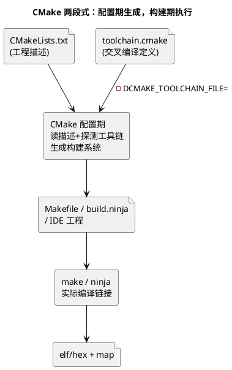

# 02-CMake

> 一句话定位：构建系统的"生成器"——用 CMakeLists.txt 描述工程，再生成 Makefile/Ninja/IDE 工程；嵌入式交叉编译的关键全在"工具链文件"一份配置里。
> 等级：L2 ｜ 前置：[01-Makefile](01-Makefile.md)

## 核心概念

Makefile 直接描述规则，CMake 多套一层：**你描述"要构建什么"，CMake 决定"在哪个生成器下怎么落地""。价值在工程规模化：多目录、多目标（应用+CDD+测试）、多平台（TC377 工具侧 / S32K 目标侧 / PC 单元测试）共用一份描述。



两个关键直觉：

1. **交叉编译的开关是工具链文件**——PC 上没装 arm-none-eabi-gcc 也没关系，CMake 不探测本机，一切以 toolchain.cmake 声明为准；
2. **目标（target）是一等公民**——现代 CMake 的写法是"选项挂在目标上"（`target_include_directories(app ...)`），而不是全局变量满天飞，依赖关系因此可传递、可复用。

## 详解

### 1. 工具链文件：交叉编译的全部秘密

```cmake
set(CMAKE_SYSTEM_NAME      Generic)          # 嵌入式裸机通用写法
set(CMAKE_SYSTEM_PROCESSOR arm)              # 或 tricore
set(CMAKE_C_COMPILER ${TOOLCHAIN_PREFIX}gcc) # arm-none-eabi-gcc
set(CMAKE_TRY_COMPILE_TARGET_TYPE STATIC_LIBRARY)  # 裸机不能跑试链接

# 链接脚本等放工程内，由 add_link_options 传入
```

三要素：系统名、处理器、编译器路径。`TRY_COMPILE_TARGET_TYPE` 是裸机工程的标配——否则 CMake 配置期试图"编一个可执行并跑起来"做探测，板上程序跑不了，配置直接失败。

### 2. 最小可用 CMakeLists.txt（嵌入式视角）

```cmake
cmake_minimum_required(VERSION 3.16)
project(app_cdd C)

add_executable(app.elf
    src/main.c
    src/cdd_led.c
    ${BSW_GENERATED_SRC})                    # 生成代码单独变量收口

target_include_directories(app.elf PRIVATE inc ${BSW_GENERATED_INC})
target_compile_options(app.elf PRIVATE
    -mcpu=cortex-m4 -mthumb -Os -g3 -Wall -Wextra -MMD -MP)
target_link_options(app.elf PRIVATE
    -T ${CMAKE_SOURCE_DIR}/ld/app.ld
    -Wl,--gc-sections -ffreestanding -nostdlib)

add_custom_command(TARGET app.elf POST_BUILD
    COMMAND ${CMAKE_OBJCOPY} -O ihex $<TARGET_FILE:app.elf> app.hex
    COMMAND ${CMAKE_OBJCOPY} -O srec $<TARGET_FILE:app.elf> app.srec)
```

读法：编译选项、链接选项、头文件路径全部**挂在目标上**；elf 出来后 POST_BUILD 自动转 hex/srec——一条 `cmake --build` 直达烧录文件。

### 3. Makefile vs CMake：什么时候用哪个

| 维度 | 手写 Makefile | CMake |
|---|---|---|
| 上手 | 三元组当天会写 | 概念多（目标/属性/生成器） |
| 多目录多目标 | 自己管，越写越乱 | 原生支持，add_subdirectory 复用 |
| 多平台/PC 测试 | 每平台一份 | 一份描述多份生成 |
| IDE 集成 | 各家自管工程 | 直接生成/导入 VSCode-clangd 等 |
| 现实约束 | AUTOSAR vendor 工程多为 make 系 | 新工程、工具侧、单元测试侧增长快 |

结论不是二选一：**读懂存量 Makefile 是维护 AUTOSAR 工程的必修课；CMake 是自己起新工程/工具链侧/PC 端单元测试时的生产力选择**（单元测试工程与目标工程共用 CDD 源码的典型用法见 [CDD 与 BSW-OS 集成](../../../04-MCAL与外设驱动/2-L2进阶/CDD设计方法论/03-与BSW-OS集成.md)）。

### 4. 构建目录与重复配置

```text
mkdir build && cd build
cmake -DCMAKE_TOOLCHAIN_FILE=../toolchain-arm.cmake -DCMAKE_BUILD_TYPE=Release ..
cmake --build . -j8
```

- **源外构建**（out-of-source）：产物全在 build/，干净、好 clean、好 ignore；
- CMake 缓存（CMakeCache.txt）记住首次配置——**换工具链文件必须换新 build 目录**（或清缓存），否则旧探测结果"粘住"；
- `CMAKE_BUILD_TYPE` 的 Debug/Release 切换选项组合，思路与 Makefile 双套配置一致。

## 易错点与陷阱

1. **现象：配置期报"compiler not able to compile a simple test program"。原因：裸机工具链链接了主机式测试程序（缺链接脚本/启动文件）。对策：工具链文件加 `set(CMAKE_TRY_COMPILE_TARGET_TYPE STATIC_LIBRARY)`，跳过可执行探测。**
2. **现象：换了 toolchain 文件，CMake 仍按旧编译器配置。原因：CMakeCache.txt 粘住首次探测结果。对策：换工具链=新 build 目录；脚本里 rm -rf build 再配置，别指望增量。**
3. **现象：include 的头文件路径时灵时不灵。原因：用全局 `include_directories` 污染所有目标，或路径写的是绝对路径。对策：统一 `target_include_directories(<target> ...)`；路径基于 `${CMAKE_CURRENT_SOURCE_DIR}` 相对展开。**
4. **现象：hex 没跟着最新源码更新。原因：POST_BUILD 挂错了目标或自定义命令依赖缺失。对策：转换命令用 `add_custom_command(TARGET ... POST_BUILD)` 保证每次链接后执行；产物清单进 CI 校验时间戳。**
5. **现象：同事检出即编不过，本机正常。原因：工具链路径、SDK 路径写死或依赖环境变量未声明。对策：路径变量提供默认值+可用 -D 覆盖；README/CI 脚本固化完整配置命令，保证"从零检出到出包"可脚本重放。**

## 面试高频题

**Q：CMake 相比手写 Makefile 好在哪，嵌入式工程为什么也用它？**
答：三个实质收益——多目标多目录的原生组织（add_subdirectory 复用）、一份描述生成多种构建系统（Makefile/Ninja/IDE）与多平台（目标机/PC 单元测试）、工具链文件把交叉编译配置与工程描述解耦。嵌入式用它主要在自研工程、CDD 的 PC 端单元测试、工具侧脚本工程；AUTOSAR vendor 交付工程多为 make 系，两者并存是常态。

**Q：CMake 交叉编译为什么要写 toolchain 文件，里面最关键的设置是什么？**
答：CMake 默认探测本机编译器，交叉编译必须提前声明"系统/处理器/编译器"，让配置期跳过本机探测。关键项：`CMAKE_SYSTEM_NAME=Generic`、`CMAKE_SYSTEM_PROCESSOR`、`CMAKE_C_COMPILER` 指向交叉 gcc，以及裸机必备的 `CMAKE_TRY_COMPILE_TARGET_TYPE=STATIC_LIBRARY`（避免配置期尝试链接运行测试程序）。传入方式：`-DCMAKE_TOOLCHAIN_FILE=...`，且只在空 build 目录首次配置生效。

**Q：CMakeLists 里怎么组织 Debug/Release 两套配置？**
答：用 `CMAKE_BUILD_TYPE` 切换，配合对应变量（CMAKE_C_FLAGS_DEBUG/RELEASE）或按类型条件追加目标选项——Debug 带 `-O0 -g`，Release 带 `-Os` 与裁剪。两个类型各用独立 build 目录（build/debug、build/release），互不污染；CI 出包只走 Release 目录，与 Makefile 双套配置思路一致。

## 延伸

- [01-Makefile](01-Makefile.md)——CMake 生成物的底层规则与依赖机制；
- [02-GHS-GCC](../编译器/02-GHS-GCC.md)——工具链文件里指向的 GCC 选项体系；
- [链接脚本与分散加载](../../../02-芯片与体系结构/2-L2进阶/启动流程/03-链接脚本与分散加载.md)——`-T` 传入的那份脚本讲的是什么；
- [VSCode](../../1-L1基础/IDE/03-VSCode.md)——CMake 工程在轻量 IDE 下的工作流；
- [脚本索引](../辅助脚本沉淀/01-脚本索引.md)——构建周边自动化脚本的沉淀入口。
