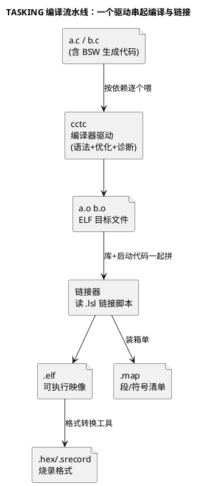

# 01-TASKING

> 一句话定位：Infineon AURIX 御用编译器——TriCore 专用指令调度、`.lsl` 链接脚本、内置 MISRA 检查，AURIX Dev Studio 里那个"编译"按钮背后就是它。
> 等级：L2 ｜ 前置：[01-从敲下编译到烧进板子-工具链全景](../../00-入门导读/01-从敲下编译到烧进板子-工具链全景.md)

## 核心概念

TASKING 是 TriCore 生态里事实标准的商用编译器（现属 Infineon，随 AURIX Development Studio 免费分发）。它的定位一句话：**只服务 TriCore 一族，把 TriCore 的多核、双字对齐、寄存器组、PC-relative 寻址吃到极致**。你不需要记住全部选项，需要记住的是它的三段式流水线与三类产物：

三个关键直觉：

1. **IDE 只是壳，cctc 才是发动机**——AURIX Dev Studio 的工程属性页改的每个选项，最终都变成命令行上的一串参数；出问题时把 Console 里的完整命令行抠出来看，是定位编译问题的第一动作；
2. **`.lsl` 是 TASKING 世界的链接脚本语言**——PFlash/DSPR/PSPR/DLMU 的地址与段怎么落，全写在这份文件里（内存区原理见 [TC377 存储器映射](../../../02-芯片与体系结构/2-L2进阶/TC377平台/存储器映射/README.md)）；
3. **map 是链接的副产品，不是可选项**——每次链接都应产出 map，它是"代码都去哪了"的唯一权威答案（详见下一篇 [03-map文件分析](03-map文件分析.md)）。

## 详解

### 1. 工程属性 → 命令行的映射

| IDE 里改什么 | 对应选项族 | 直觉 |
|---|---|---|
| 目标派系（TC37x/TC39x…） | 目标 CPU 选项 | 决定指令集版本与可用的核资源，错了直接编不过或跑飞 |
| 优化等级 | `-O0/-O1/-O2/…` | 调试用 `-O0`，出包用 `-O2`/代码密度优先；等级变了行为可能变，见易错点 |
| 调试信息 | `-g` | 加它才能源码级调试；不影响代码本身，只影响 elf 里带多少"元数据" |
| MISRA 检查 | `--misra-c=...` | 编译器内置的 MISRA-C 检查（能力弱于专业静态分析器，但零成本顺手拦） |
| C 标准 | `--iso=...` | 定严格 C 模式，AUTOSAR 工程通常锁 C99 并开严格警告 |

> 选项的精确拼写随版本有差异，以所装版本的手册（User Guide）为准；重要的是知道**每一类工程设置背后都有一条命令行参数**。

### 2. 优化等级与调试的矛盾

- `-O0`：变量老老实实呆在内存里，断点、单步、Watch 全部所见即所得——但时序慢，靠 NOP 数拍子的代码会失真；
- `-O2`：寄存器分配、指令调度全开，变量被优化掉、语句重排、内联展开——Watch 窗口里 `变量不可用/已优化` 是常态；
- 工程实践：**调试看逻辑用 `-O0`，复现"只在优化开时出现"的问题用 `-O2`+混合调试**（汇编窗口 + map 对照），不要试图让优化版迁就源码级调试。

### 3. 与 MemMap/pragma 的配合

AUTOSAR 工程的内存放置不走链接器自由发挥，而由 `MemMap.h` 的 `#pragma` 在源码层声明段（机制见 [AUTOSAR-MemMap机制](../../../01-编程语言/2-L2进阶/内存管理/05-AUTOSAR-MemMap机制.md)），TASKING 侧再由 `.lsl` 把这些段接住、落到对应内存区。**"源码声明段、脚本落地址"两层分工**，排查"变量住哪"时永远先查 MemMap 宏、再查 `.lsl`、最后 map 验证。

### 4. 诊断信息的三层用法

| 层 | 看什么 | 动作 |
|---|---|---|
| Error | 编不过的硬伤 | 从第一条改起，后面常是连坐 |
| Warning | 可疑但合法 | 工程约定"出包前警告清零"，新告警当错误对待 |
| Remark/Info | 提示级 | 按需开关，避免噪声淹没信号 |

把 `--misra-c` 检查挂在编译里，等于给每个开发者的每次编译加一道免费安检；条目本身怎么读见 [MISRA-C规则分类导读](../../../01-编程语言/2-L2进阶/代码规范与MISRA-C/02-MISRA-C规则分类导读.md)。

### 5. 版本与产物纪律

| 事项 | 纪律 | 为什么 |
|---|---|---|
| 编译器版本 | 工程 README 记版本号+补丁号，全员一致 | 版本差异=选项行为差异=产物差异 |
| 命令行导出 | 工程属性页能一键导出完整命令行，进版本库 | 排查"我编不过"的第一手证据 |
| 产物三件套 | elf/map/hex 同批同目录管理，时间戳对齐 | "烧的就是刚编的"证据链 |
| 出包环境 | 只在固定出包机/CI 上出正式包 | 消除"我电脑上能跑"的变量 |

## 易错点与陷阱

1. **现象：同一份代码同事能编过、我编不过。原因：TASKING 版本/补丁不一致，或工程属性里的目标派系不同。对策：工程 README 固定编译器版本号；比对两边 Console 里导出的完整命令行，一眼看出差异。**
2. **现象：关优化一切正常，开 `-O2` 板上跑飞。原因：依赖未定义行为（越界、未初始化、违反 volatile），优化放大了缺陷。对策：先用 `-O0` 复现对照，静态分析扫未初始化/越界（见 [02-静态分析](../代码质量/02-静态分析.md)），重点查中断共享变量是否漏 volatile（见 [volatile的正确使用](../../../01-编程语言/2-L2进阶/寄存器编程/01-volatile的正确使用.md)）。**
3. **现象：链接报 overlap/overflow。原因：`.lsl` 里段地址重叠，或 RAM 装不下增长后的 .bss。对策：先看 map 各区水位，定位最大增长段；查 MemMap 是否把大数组错放进快速 RAM。**
4. **现象：调试时断点打不上、变量看不了。原因：优化把变量优化进寄存器或整段内联。对策：调试构建降优化（局部可用 volatile 临时钉住关键变量）；或对单个文件单独降优化，别全局迁就。**
5. **现象：MISRA 检查一开满屏报错编不动。原因：把全部类别一次打开，旧代码历史欠账集中爆发。对策：分级引入——先只开强制类别（Mandatory）当 error，其余当 warning；新代码零容忍、旧代码走偏差流程。**
6. **现象：换机器后 hex 不一致被质量部门打回。原因：编译器版本、选项、环境变量任一不同都可能改变产物。对策：出包只在 CI/固定出包机上做，记录编译器版本+选项+源码 commit，保证可重建。**

## 面试高频题

**Q：TASKING 和 GCC TriCore 怎么选？**
答：TASKING 强在 TriCore 专用优化、诊断质量、`.lsl` 内存放置精细度与官方支持（Infineon 生态、安全认证材料齐全），是量产主流；GCC TriCore（HighTec 等）强在免费、开源、脚本友好，多用于早期评估与工具链侧。AUTOSAR 量产项目（尤其涉功能安全）多选 TASKING/GHS 这类可提供工具置信度证据的商用编译器。

**Q：编译器优化等级对嵌入式调试有什么影响，你怎么组织调试/发布配置？**
答：优化会重排指令、消灭变量、内联函数，源码级调试信息与实际执行流脱节。工程上分两套配置：调试构建 `-O0 -g` 看逻辑；发布构建高优化，出现"仅优化态复现"的问题时用 map+反汇编定位，必要时单文件降优化。两套配置都进版本库，出包只认发布配置。

**Q：AUTOSAR 工程里变量最终落在哪个内存区，由谁决定？**
答：两层协作——源码层 `MemMap.h` 的 `#pragma` 把代码/数据声明进逻辑段（如 `_FAST_DATA`），链接层 TASKING `.lsl` 把逻辑段映射到物理区（DSPR/PSPR/DFLA/PFlash 等）。编译器只管把段名记进 .o，真正"定地址"的是链接器；验证用 map 文件查符号地址。

## 延伸

- [02-GHS-GCC](02-GHS-GCC.md)——另两家 TriCore 可用编译器与选型对照；
- [03-map文件分析](03-map文件分析.md)——"代码都去哪了"的权威答案；
- [AURIX-Dev-Studio](../../1-L1基础/IDE/01-AURIX-Dev-Studio.md)——TASKING 在 IDE 里的集成形态；
- [AUTOSAR-MemMap机制](../../../01-编程语言/2-L2进阶/内存管理/05-AUTOSAR-MemMap机制.md)——段声明的源码侧机制；
- [链接脚本与分散加载](../../../02-芯片与体系结构/2-L2进阶/启动流程/03-链接脚本与分散加载.md)——链接脚本的通用原理篇。
