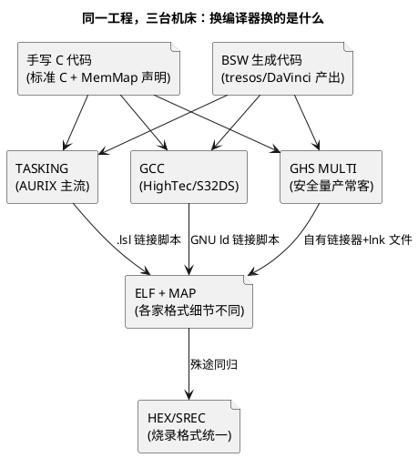

# 02-GHS-GCC

> 一句话定位：TriCore/AUTOSAR 世界另外两台常用"机床"——GHS MULTI 靠安全认证与代码密度立足量产，GCC 靠免费开源打通评估与工具侧；对照着看，才知道编译器之间的"可换"与"不可换"各在哪。
> 等级：L2 ｜ 前置：[01-TASKING](01-TASKING.md)

## 核心概念

上一篇把 TASKING 当"主场机床"讲透了，这一篇换视角：**把编译器当成一个可替换的部件来看，哪些东西换得动、哪些换不动**。TriCore 侧可选的是 GHS（Green Hills，MULTI IDE + 编译器）与 GCC TriCore（HighTec 发行版为代表）；S32K 侧主力是 arm-none-eabi GCC（S32DS 自带）。

一句话总纲：**源码层尽量编译器中立（标准 C + 少量条件编译），差异集中在链接脚本、选项体系、诊断与认证材料三处**。

## 详解

### 1. 三家定位对照

| 维度 | TASKING | GHS（MULTI） | GCC |
|---|---|---|---|
| 生态位 | Infineon AURIX 御用，AURIX DS 免费集成 | 多架构商用，功能安全量产项目常客 | 开源免费，评估/工具侧/S32K 主力 |
| 强项 | TriCore 专用优化、`.lsl` 精细放置 | 代码密度、优化稳定性、认证包（IEC/ISO 26262 工具置信度材料） | 免费、跨平台、脚本化好、生态大 |
| 链接 | 自家链接器 + `.lsl` | 自家链接器 + 链接命令文件 | GNU ld + `ld` 脚本 |
| 诊断 | 内置 MISRA 检查 | 编译器诊断 + 配套检查工具 | 警告体系丰富（`-Wall -Wextra`），MISRA 靠外挂静态分析 |
| 成本 | 商用（AURIX DS 内免费版受限） | 商用，价格高 | 免费 |

### 2. GCC 在两个平台上的两副面孔

- **TC377 侧（GCC TriCore/HighTec）**：内核是 TriCore 专用的 GCC 后端，选项体系是 GNU 风（`-mcpu=...` 选派系、`-O2`、`-ffreestanding`）；早期项目评估、内部工具、CI 里跑的脚本化构建常用它；
- **S32K 侧（arm-none-eabi-gcc）**：S32DS 的默认工具链，ARM Cortex-M 后端，`-mcpu=cortex-m4` 之类指定核；NXP SDK/RTD 的示例工程默认按 GCC 组织。

同一个你，两副肌肉记忆会打架——**记住共性：GNU 选项体系 + ld 脚本 + ELF 产物是同一套**，换目标只是换 `--target`。

### 3. GCC 常用选项族（S32K 视角）

| 选项族 | 典型值 | 干什么 |
|---|---|---|
| 目标 | `-mcpu=cortex-m4 -mthumb` | 指定核与指令集 |
| 优化 | `-O0/-O2/-Os` | `-Os` 代码密度优先，Flash 紧张时的量产选择 |
| 警告 | `-Wall -Wextra` | 基线警告集；新工程从第一天开满，别事后补 |
| C 标准 | `-std=c99 -pedantic` | 锁标准、禁方言 |
| 调试 | `-g3` | 带宏定义的调试信息 |
| 依赖 | `-MMD -MP` | 生成头文件依赖，增量编译的燃料（详见 [01-Makefile](../构建系统/01-Makefile.md)） |
| 链接 | `-T xxx.ld -Wl,--gc-sections` + 源码侧 `-ffunction-sections/-fdata-sections` | 指定链接脚本、裁掉没用的函数/数据 |

### 4. "可换性"清单：换编译器前先对一遍

- **换得动**：标准 C 源码、AUTOSAR 生成代码（厂商通常提供多家编译器适配的 MemMap/编译器抽象层）；
- **要改**：链接脚本（`.lsl`/lnk/`.ld` 三种语言各写一遍）、优化选项映射、警告治理基线、map 文件解析脚本；
- **要重做**：安全认证材料（功能安全项目里编译器是"工具置信度"评估对象，换编译器 = 重新评估）、代码尺寸/性能回归验证。

这解释了为什么量产项目不轻易换编译器，而评估期可以随便换——**换的是机床，重验的是整条质检线**。

## 易错点与陷阱

1. **现象：代码从 TASKING 搬到 GCC 编不过，报内联汇编/pragma 错。原因：源码里混了编译器方言（TASKING 式 pragma、`__asm` 内联语法差异）。对策：方言收进编译器抽象头（按 `__TASKING__/__GNUC__/__ghs__` 宏条件编译），业务代码保持标准 C。**
2. **现象：GCC 下 Flash 占用明显变大。原因：默认全量编译 + 未开 section 级裁剪；或没用 `-Os`。对策：`-ffunction-sections -fdata-sections` 配 `-Wl,--gc-sections`，优化用 `-Os`，用 map 对比裁剪前后（见 [03-map文件分析](03-map文件分析.md)）。**
3. **现象：S32K 工程在别人机器编的 hex 与我的一致，行为却不同。原因：不只编译器，SDK/启动文件/链接脚本版本也在变。对策：锁定整个工具链版本（S32DS + SDK/RTD + 编译器小版本），出包记录三件套版本。**
4. **现象：GCC 警告在 `-Wall` 下干净，换 `-Wextra` 后一堆新警告不敢动。原因：警告集是渐进治理的，一次性开全会淹没团队。对策：新目录/新文件全开，存量目录列清单分批消化；CI 里"新增警告即失败"锁住不再恶化。**
5. **现象：GHS 编译的工程想迁到 GCC 省授权费，被功能安全流程挡住。原因：ASIL 项目中编译器属需评估置信度的工具，换用即需重做工具评估与验证。对策：评估迁移成本时把认证重做算进去，常比授权费贵；非安全件可迁移。**

## 面试高频题

**Q：编译器方言怎么管理，才能让工程在多家编译器间可移植？**
答：三层收口——业务代码只写标准 C；编译器差异（pragma、内联汇编、关键字）收进编译器抽象头，用预定义宏（`__TASKING__`/`__GNUC__`/`__ghs__`）条件展开；AUTOSAR 侧依赖 MemMap 与编译器抽象层（Comp/Csm 类生成代码）适配。链接脚本单独维护一套一份。CI 上有条件就双编译器各编一遍，方言早暴露。

**Q：GCC 的 `-Os` 和 `-O2` 有什么区别，嵌入式怎么选？**
答：`-O2` 优先速度（展开、内联更激进），`-Os` 在优化同时以代码尺寸为目标、避免膨胀类优化。Flash 紧张的量产工程常选 `-Os`；对时序敏感的个别模块可以按文件单独提优化等级。决策依据是 map 的体积对比与实测性能，不是感觉。

**Q：为什么功能安全项目选编译器很谨慎？换编译器要重做什么？**
答：编译器是"开发工具链上的置信度对象"，ISO 26262 要求对其误编译风险有置信度证据——商用编译器（TASKING/GHS）提供认证包/鉴定报告。换编译器意味着：重做工具置信度评估、重跑代码尺寸/性能/回归验证、重写链接脚本与构建脚本，成本高，所以量产项目一旦锁定不轻易换。

## 延伸

- [01-TASKING](01-TASKING.md)——AURIX 主流编译器的流水线与选项体系；
- [03-map文件分析](03-map文件分析.md)——跨编译器都存在的"装箱单"读法；
- [S32DS](../../1-L1基础/IDE/02-S32DS.md)——S32K 侧 GCC 工具链的 IDE 集成；
- [SDK与RTD生态对比](../../../02-芯片与体系结构/1-L1基础/S32K平台/S32K1与S32K3对比/02-SDK与RTD生态对比.md)——S32K 侧工具链生态；
- [01-Makefile](../构建系统/01-Makefile.md)——GCC 依赖文件驱动增量编译的机制。
