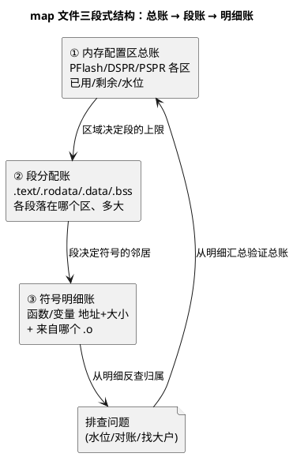

# 03-map文件分析

> 一句话定位：链接器交货时附的"装箱单"——每个函数/变量住哪、占多大、来自哪个 .o 一笔一笔记得清清楚楚；Flash 水位、地址对账、体积膨胀排查，全部从它查起。
> 等级：L2 ｜ 前置：[02-GHS-GCC](02-GHS-GCC.md)

## 核心概念

map 文件是链接的副产品，各家编译器（TASKING/GHS/GCC）格式不同，但**结构同构**：先列内存区域与段的总账，再列符号级明细。把它当数据库查，而不是当日志翻。



先修一遍段语义（详账见 [五大内存区](../../../01-编程语言/2-L2进阶/内存管理/01-五大内存区.md)）：

| 段 | 装什么 | 在哪 | 谁初始化 |
|---|---|---|---|
| `.text` | 代码 + 立即数 | Flash | 烧录时就有 |
| `.rodata` | const 常量、字符串 | Flash | 烧录时就有 |
| `.data` | 有初值的全局/静态 | Flash 存初值，启动时拷到 RAM | 启动代码拷贝 |
| `.bss` | 无初值（=0）的全局/静态 | RAM | 启动代码清零 |
| 栈/堆 | 运行时动态 | RAM | 启动代码/运行时 |

## 详解

### 1. 三个高频查询动作

**动作一：查水位——"还能塞多少"**

map 开头的内存区域表给出每区 used/free。盯两个数：PFlash 剩余（还剩几个版本可发）和 DSPR 剩余（栈余量够不够）。工程实践：给水位设阈值（如 Flash 剩余 <15% 就启动减肥），在 CI 里用脚本解析 map 出趋势报表（脚本沉淀见 [脚本索引](../辅助脚本沉淀/01-脚本索引.md)）。

**动作二：对地址——"这个变量到底在哪"**

调试器里看到变量地址 `0x70001234`，先在 map 里搜这个地址落在哪个段/区——落在 DSPR 还是 PSPR、是不是被 MemMap 宏挪进了快速 RAM，一眼定论。**map 的地址 = 调试器的地址 = 反汇编的地址**，三者对不上，就是烧错了文件或加载错了符号。

**动作三：找大户——"体积涨到哪去了"**

两个版本 map 对比：把符号按大小排序取 top，diff 出新增/暴涨项。典型元凶：printf 家族、误开的浮点库、某 CDD 里的大静态缓冲、意外以 `-O0` 编译的文件。

### 2. 查表实例（伪 map 片段）

```text
Section Info:
  .text   0x80000000  0x1F4A0  (代码+立即数 → PFlash)
  .rodata 0x8001F4A0  0x0C10   (常量 → PFlash)
  .data   0x70000100  0x0420   (初值在Flash，本体在 DSPR)
  .bss    0x70000520  0x1A00   (清零区 → DSPR)

Symbol Info:
  CanIf_Init            0x80001234  0x180  canif.o
  CddLedTxBuffer        0x70000640  0x400  cdd_led.o   ← 大户候选
```

读法示例：`CddLedTxBuffer` 是 `cdd_led.o` 里的 1KB 缓冲，落在 DSPR 的 .bss——如果它只是发送影子缓冲，1KB 就该被评审质疑（CDD 设计规范见 [CDD定位与边界](../../../04-MCAL与外设驱动/2-L2进阶/CDD设计方法论/01-CDD定位与边界.md)）。

### 3. 与链接脚本的闭环

map 是"结果"，链接脚本（`.lsl`/`.ld`）是"规则"：map 里段落在哪，是脚本写的；想让段搬家，改脚本再链接，用 map 验证搬对了。改脚本前先备份、改完先比对 map 全量段表——**脚本一动，全量符号地址都可能变**，回归别只看功能，还要看时序敏感部分的地址假设。

### 4. 跨编译器读 map 的通用心法

- TASKING/GHS/GCC 的 map 前缀表头不同，但都有"区域总表—段表—符号表"三层；
- 写解析脚本时按"列结构"而不是按"行前缀"提取，一份脚本稍作适配可服务多家（处理思路见 [Python处理ARXML](../../../01-编程语言/2-L2进阶/辅助脚本/01-Python处理ARXML.md) 的正则/表格解析套路）；
- hex 时间戳 + map 生成时间 + elf 的 build id（若有）三对齐，是"烧的就是刚编的"的证据链。

## 易错点与陷阱

1. **现象：改了代码，板上变量值诡异、断点对不上行。原因：烧的 hex 与调试器加载的 elf 不是同一次构建。对策：hex/elf/map 三件套同目录同时间戳管理；调试前核对 map 里符号地址与调试器一致。**
2. **现象：RAM 明明还有，链接却报 .bss 溢出。原因：链接脚本把栈/堆预留成固定大小区，或 .bss 被限制在某个子区域（如 core0 专属段）。对策：看 map 区域表中各子区水位，别只看 DSPR 总量；查 MemMap 宏是否把大数组绑死在某个核。**
3. **现象：两个版本 diff，几百个符号地址全变了，没法评审。原因：链接脚本变化或段顺序敏感的链接器优化，牵一发动全身。对策：体积评审用"符号大小"维度 diff，不看地址；地址变化单独立项核查。**
4. **现象：.data 比 .bss 大很多，Flash 也跟着涨。原因：大数组带了大初值（如标定表、字模），初值本体占 Flash。对策：能运行时初始化的别写死初值；确需常量的挪 .rodata 并确认编译器没复制两份。**
5. **现象：map 里找不到某 CDD 的静态函数。原因：被内联/优化合并，或 section 裁剪（gc-sections）删掉了未引用函数。对策：按文件名搜它的 .o 段；确认裁剪没误删被函数指针隐式引用的回调（回调没被显式调用时易被裁）。**

## 面试高频题

**Q：给你一个 map 文件，怎么快速判断这个工程的内存健康度？**
答：先看区域总表：PFlash/DSPR/PSPR 各区水位与剩余，栈预留是否合理（一般 ≥ 实测峰值 ×1.5）；再看段分布有无异常（如 .bss 占比畸高查大缓冲，.data 畸高查大初值表）；最后抽查 top 大户符号的归属是否合理。有历史 map 就做趋势对比，看增速是否可持续。

**Q：.data 和 .bss 的区别是什么？谁在什么时候初始化它们？**
答：.data 是有初值的全局/静态变量，初值存在 Flash、启动代码把初值拷贝到 RAM（拷贝表由链接器生成）；.bss 是无初值/零初值的全局/静态变量，只占 RAM、启动代码统一清零，Flash 里不存内容。所以"初始值是 0"是免费的，"初始值非 0"要用 Flash 换。

**Q：调试器里变量地址和 map 对不上，可能是什么问题？**
答：按可能性排查：烧录的 hex 与加载符号的 elf 不是同一构建（最常见）；链接脚本改过但烧的还是旧映像；变量被优化放置（寄存器变量/内联）根本不在内存；多核工程里符号重名，查到了另一个核的同名符号。先做"三对齐"（hex/elf/map 时间戳与 build id）再谈别的。

## 延伸

- [01-TASKING](01-TASKING.md)——`.lsl` 链接脚本与 map 的产出方；
- [链接脚本与分散加载](../../../02-芯片与体系结构/2-L2进阶/启动流程/03-链接脚本与分散加载.md)——决定段落位的"规则"篇；
- [五大内存区](../../../01-编程语言/2-L2进阶/内存管理/01-五大内存区.md)——段语义的地基；
- [AUTOSAR-MemMap机制](../../../01-编程语言/2-L2进阶/内存管理/05-AUTOSAR-MemMap机制.md)——源码侧段声明如何影响 map；
- [Trap-HardFault定位](../../../09-调试与测试/3-L3高级/调试方法论/02-Trap-HardFault定位.md)——崩溃现场用 map 反查代码位置的实战。
