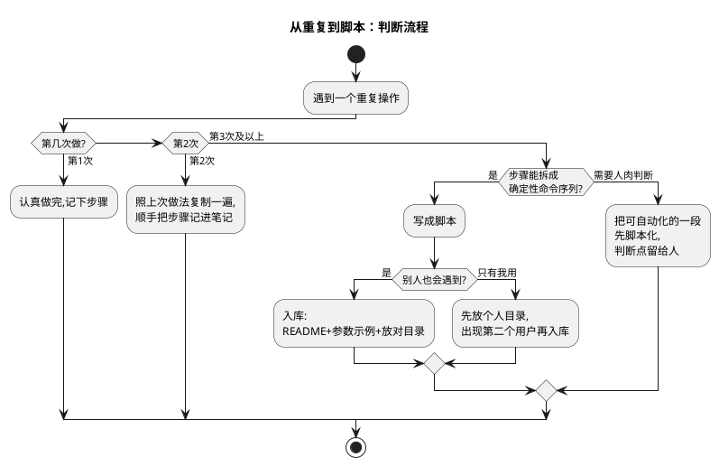

# 01-脚本索引

> 一句话定位：本库工具脚本的"目录页"——按用途分类列沉淀了哪些脚本点子（ARXML 处理/报表/批量操作），以及一条"第三次重复就脚本化"的入库纪律。
> 等级：L2 ｜ 前置：[01-从敲下编译到烧进板子-工具链全景](../../00-入门导读/01-从敲下编译到烧进板子-工具链全景.md)

## 原理

工程师的时间线通常是：第一次做某重复操作——忍了；第二次——复制粘贴上次的做法；第三次——还在复制粘贴，就该警觉了。**脚本沉淀的本质是把"熟练"变成"资产"**：写一次，之后所有人（包括三个月后的自己）一条命令跑完。

本页与 01 区的分工：**[Python处理ARXML](../../../01-编程语言/2-L2进阶/辅助脚本/01-Python处理ARXML.md) 讲"怎么写"**（解析库、容器遍历、写法套路），**本页讲"沉淀了什么"**——目录+入库规范。

## 详解

### 1. ARXML 处理类（配置流水线的自动化外挂）

| 脚本名（点子） | 输入 → 输出 | 一句话说明 |
|---|---|---|
| arxml_batch_edit | 一份/一批 .arxml + 修改表(csv) → 改后的 .arxml | 按容器路径批量改参数，30 个模块统一改超时值不再人肉点 |
| extract_com_matrix | 系统/ECU 配置 .arxml → Excel 信号清单 | 提取全部报文/信号/位偏移，与系统矩阵对账用 |
| check_e2e_consistency | ECU 配置 .arxml → 差异报告(txt) | 检查保护报文的 E2E DataId/长度在 Com 与 E2E 层配置一致 |

写法底子在 [Python处理ARXML](../../../01-编程语言/2-L2进阶/辅助脚本/01-Python处理ARXML.md)；配置的容器路径概念见 [容器与参数](../../../07-AUTOSAR架构/2-L2进阶/方法论与ARXML/02-容器与参数.md)。

### 2. 报表类（把"状态"变成一眼能看的表）

| 脚本名（点子） | 输入 → 输出 | 一句话说明 |
|---|---|---|
| map_trend | 历次构建的 .map → 水位趋势图(csv/图) | Flash/RAM 占用按版本画曲线，内存泄漏在爆之前看见 |
| warn_stats | 构建日志(.log) → 警告统计表(Excel) | 按警告类型/模块统计编译警告，新增警告无所遁形 |

map 怎么读见 [工具链全景](../../00-入门导读/01-从敲下编译到烧进板子-工具链全景.md) 里 map=装箱单的直觉；脚本只是把它的时间维度补上。

### 3. 批量操作类（文件与日志的体力活）

| 脚本名（点子） | 输入 → 输出 | 一句话说明 |
|---|---|---|
| batch_rename | 目录+规则 → 批量改名后的文件 | 按正则批量重命名源文件/资源，命名规范落地不用手点 |
| encoding_convert | 一批文件 → 统一编码(如 UTF-8) | 混着 GBK/UTF-8 的老工程一次洗白，编译器不再随机报错 |
| log_split | 大日志文件 + 行数/大小阈值 → 分片 | 十几 G 的 CANoe/TRACE32 日志切成能打开的段 |

### 4. 入库规范（脚本要能被别人用）

一个脚本"入库"的四件事：

1. **README 说明**：脚本目录里一个 README，每个脚本三行——干什么、输入输出、依赖（Python 版本/第三方库）；
2. **参数示例**：脚本头部 docstring 给一条可直接复制的运行示例（含典型参数），`-h` 有帮助；
3. **放哪**：随知识库/工程仓库走，目录结构固定（如 `tools/arxml/`、`tools/report/`、`tools/batch/`），不散在个人桌面；
4. **命名**：小写下划线、动词开头（extract_xxx / check_xxx），见名知意。

反面清单：无示例的脚本=没写；只在自己电脑路径下能跑的脚本=定时炸弹；改了不更新 README=下一个踩坑的就是同事。

## 实操/配置

### 1. 把一个脚本沉淀入库的标准动作

| 步骤 | 动作 | 检查点 |
|---|---|---|
| 1 | 脚本里写好 docstring（用途/输入/输出/示例命令） | `-h` 能自解释 |
| 2 | 放进对应分类目录 | 目录名与用途对上 |
| 3 | 更新脚本目录 README 的条目表 | 三行信息齐全 |
| 4 | 造一份最小测试输入跑通 | 别人拿到即能复现 |
| 5 | 提交 Git，commit 写清用途 | 能被搜索到 |

### 2. 一个脚本从"点子"到"条目"的示例

以 extract_com_matrix 为例：第一次对账通讯矩阵是手翻 ARXML 半天；第二次复制上次的做法还是半天；第三次写成脚本（解析 ARXML→抽 Signal 容器→落 Excel），从此对账 30 秒——然后按上面五步入库，本页表格里加一行。**流程结束的标志不是"我能跑了"，是"别人也能跑"。**

## 易错点与陷阱

1. **现象：脚本只有自己能跑，同事一跑就路径错。原因：硬编码了本机绝对路径与依赖。对策：路径全部参数化+给默认相对路径；依赖写进 README，能打包环境就打包。**
2. **现象：脚本改了 ARXML 但工具打不开/校验爆红。原因：只改了文本没维护容器结构与引用。对策：改完必过工具 Validate；批量改参数用容器路径定位而非字符串替换（写法见 [Python处理ARXML](../../../01-编程语言/2-L2进阶/辅助脚本/01-Python处理ARXML.md)）。**
3. **现象：报表脚本今天对明天错。原因：输入格式变了（工具升级换 schema/日志格式变化）没有察觉。对策：脚本开头做格式断言，格式不认识就明着报错退出，别默默出错误数据。**
4. **现象：脚本越攒越多没人敢用。原因：没有 README 与示例，用法靠口口相传。对策：入库四件套是硬门槛，不满足就留在个人目录不算"入库"。**
5. **现象：为只用一次的操作写脚本，浪费一下午。原因：跳过了"第三次"判断，一上来就工程化。对策：按判断流程走——一二次认真做并记录，第三次再脚本化；过度工程化和重复劳动一样是债。**
6. **现象：脚本产物直接进版本库污染 diff。原因：生成的报表/中间文件被随手 commit。对策：产物目录加 .gitignore，进库的只有脚本与其最小测试输入。**

## 面试高频题

**Q1：你平时沉淀了哪些工程脚本？举一个有价值的例子。**
答：按三类答——ARXML 处理（如 extract_com_matrix：解析 ECU 配置导出信号清单，与系统矩阵对账从半天变 30 秒）、报表类（map 水位趋势：每版构建的 Flash/RAM 占用画曲线，内存问题提前暴露）、批量操作（编码转换：混编码老工程一次洗白）。关键是讲清"第三次重复触发脚本化"的判断与入库规范。

**Q2：批量修改 ARXML 参数时要注意什么？**
答：三点——按容器路径定位而不是字符串替换（同名参数在不同容器语义不同）；改完必须过配置工具的校验（结构/引用完整性由 schema 兜底）；改前备份、改后做语义 diff 确认只动了目标参数（配套见 [配置diff-review](../AUTOSAR配置工具/03-配置diff-review.md)）。

**Q3：怎么让脚本能被团队长期使用而不是烂在你手里？**
答：入库四件套——README 三行说明（用途/输入输出/依赖）、可复制的运行示例、固定目录存放、命名规范；再加两条纪律：最小测试输入随脚本进库保证可复现，产物进 .gitignore 不污染仓库。核心是把脚本当"团队资产"而不是"个人快捷方式"。

**Q4：什么时候该写脚本，什么时候不该？**
答：判断标准是"第三次重复"：一二次人肉做并记录步骤，第三次出现才值得投入脚本化；另外看步骤能否拆成确定性命令序列——纯判断型工作先只自动化确定性的那段。避免为一锤子买卖过度工程化，也避免对高频重复视而不见。

## 延伸

- [Python处理ARXML](../../../01-编程语言/2-L2进阶/辅助脚本/01-Python处理ARXML.md)、[常用脚本索引](../../../01-编程语言/2-L2进阶/辅助脚本/02-常用脚本索引.md)——01 区讲"怎么写"，与本页"沉淀了什么"互补；
- [配置diff-review](../AUTOSAR配置工具/03-配置diff-review.md)——ARXML 批量改完的评审落地；
- [通讯矩阵ARXML](../../../05-汽车网络通讯/1-L1基础/通讯数据库/03-通讯矩阵ARXML.md)——extract 类脚本的主要解析对象。
