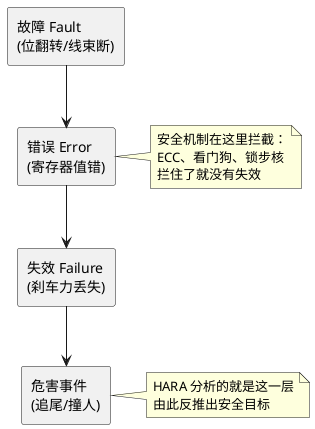

# 02-安全状态与故障-术语四件套

> 一句话定位：把 26262 里最绕的几个词——安全目标、安全状态、故障/错误/失效、FTTI——用"刹车失灵"一个故事串明白。
> 等级：L1 ｜ 前置：[01-ASIL与安全机制](../../00-入门导读/01-从一个刹车失灵的故事说起-功能安全全景.md)

## 原理

26262 全篇都在围绕一句话转：**系统坏了不可怕，坏了之后能在规定时间内进入安全状态就不怕**。所以先得搞清楚"坏"分几层：

- **故障（Fault）**：根源。芯片某一位被翻转了、线束断了、代码写错了——它是"病因"。
- **错误（Error）**：故障在系统内部的表现。寄存器值不对了、变量被污染了——它是"病理状态"。
- **失效（Failure）**：错误传到对外功能上，刹车就是踩不住、灯就是不亮——它是"症状"。

链条：故障是因，错误是中间态，失效是结果。安全机制的作用就是在"错误"这一层拦截，别让它长成"失效"。

**安全目标（Safety Goal）**：从危害反推出来的顶层安全需求，比如"车辆不得发生非驾驶员意图的制动力丢失"。它是 ASIL 的载体——HARA 定等级，等级挂在安全目标上。

**安全状态（Safe State）**：失效后系统可以退守的状态。刹车系统的安全状态往往是"断开动力 + 用另一路冗余刹车把车停住"；辅助系统的安全状态可能就是"报警 + 降级"。**安全状态必须是"维持安全"而不是"假装没事"**。

## 详解

### 1. 四种故障辨析（面试重灾区）

| 类型 | 人话 | 刹车失灵故事里 | 关键点 |
|---|---|---|---|
| 单点故障 SPFM | 一个故障直接导致违背安全目标 | 主刹车回路油管爆了 | 必须 + 安全机制降下来 |
| 残余故障 | 安全机制没拦干净剩下的那部分 | 油管爆了被检测到，但检测有 1% 盲区 | 机制覆盖率不到 100% |
| 潜伏故障（多点） | 单独不致命，藏着等帮手 | 备用回路的自检坏了，平时没事 | 靠多周期自检暴露 |
| 多点故障 | 两个以上故障凑齐才违背安全目标 | 主回路爆 + 备用回路也爆 | 用 L-FTI 周期性体检拆散它 |

记法：**单点靠机制、残余靠覆盖率、潜伏靠自检、多点靠周期**。

### 2. FTTI：安全界最贵的"黄金时间窗"

FTTI（Fault Tolerant Time Interval）= 从故障发生到危害事件之间的最短时间，系统必须在这段时间内完成"检测 + 反应 + 进入安全状态"。

直觉：手里端着一杯滚烫的汤要走 10 米，汤晃出来（故障）到烫伤人（危害）大概 3 秒，那你手的纠正反应必须远小于 3 秒。工程上通常再切成：

| 时间段 | 含义 | 典型量级 |
|---|---|---|
| 故障检测时间 | 机制发现不对劲 | 几 ms ~ 几十 ms |
| 反应时间 | 切换到安全状态 | 几十 ms ~ 百 ms |
| FTTI | 全流程预算 | 100ms ~ 数秒不等 |

所以 E2E 超时、看门狗喂狗周期这些配置，本质都是在给 FTTI"分蛋糕"。

### 3. ASIL 分解一句话

高 ASIL 的需求可以拆成两条低 ASIL 的需求，前提是两条路径**充分独立**（没有共因失效）。细节看 [01-ASIL与安全机制](01-ASIL与安全机制.md)，这里记住"D 分解成 B(D)+B(D) 是拿独立性换的"就够了。

## 实操/配置

嵌入式工程师落地的几个动作：

1. 拿到需求先看 ASIL 等级和安全状态定义，确认代码里"进入安全状态"由哪个接口触发。
2. 对照 FTTI 预算检查自己模块的超时/检测周期配置。
3. 潜伏故障相关：确认周期自检任务（RAM Test、Flash CRC、ADC 自检）的调度周期 < L-FTI。

| 需求里的词 | 你要配的东西 |
|---|---|
| Safe State 进入 | Mcu_SetMode / 应用降级函数 |
| FTTI ≤ 200ms | Wdg 超时、E2E 超时、任务死线监控 |
| 潜伏故障探测 | 周期 LBIST / RAM March 测试任务 |

## 易错点与陷阱

1. **现象：把故障和失效混着说。 原因：日常语言里"坏"一个字全覆盖。 对策：写文档时强制区分——Fault 是根因、Error 是内部态、Failure 是功能层面，评审时别人会抠。**
2. **现象：以为安全状态就是"关机重启"。 原因：忽略了"行车中关转向助力本身就是危害"。 对策：安全状态必须由系统工程师定义并确认安全，别自作主张。**
3. **现象：看门狗周期拍脑袋配的。 原因：没对齐 FTTI 分解表。 对策：Wdg 超时 + 反应链路总时长要留余量地小于分配给你模块的预算。**
4. **现象：潜伏故障自检任务被低优先级饿死。 原因：自检当普通后台任务排。 对策：按 L-FTI 给它保底调度窗口，或在特定模式（如停车时）强制执行。**
5. **现象：ASIL 分解后两条路径共用了同一个 RAM/同一个时钟。 原因：分解只做了文档层面。 对策：独立性要在硬件资源上真分开，做相关失效分析（ DFA）。**
6. **现象：ECC 拦住了错误就以为万事大吉。 原因：忘了残余故障概念，机制覆盖率有上限。 对策：算 SPFM/RFM 指标时把残余概率算进去。**

## 面试高频题

**Q1：故障、错误、失效的区别？**
答：故障是根因（如位翻转），错误是故障在系统内的表现（数据不对），失效是功能层面对外没干活的后果。因果链条 Fault→Error→Failure，安全机制在 Error 层拦截。RIAC 三角模型可以顺口提一句。

**Q2：什么是 FTTI？举例说明。**
答：故障发生到可能造成危害的最短时间。比如电动助力刹车 FTTI 可能定 100~200ms：油管泄漏必须在几十 ms 内被检测，剩余时间用于切换冗余回路建立安全状态。检测时间+反应时间必须 < FTTI。

**Q3：单点故障和潜伏故障的区别？**
答：单点故障一个就够致命，必须配安全机制压制；潜伏故障单独无害，但会让后续第二个故障变成致命组合，靠周期性自检在潜伏故障容忍时间（L-FTI）内暴露它。

**Q4：ASIL 分解是什么？**
答：把一条 ASIL D 的需求拆成两条独立路径的低等级需求（如 B(D)+A(D)），前提是路径间无共因/级联失效，需做独立性论证和 DFA。

## 延伸

- [01-ASIL与安全机制](01-ASIL与安全机制.md)——ASIL 从哪来、分解细则。
- [03-开发流程V模型](03-开发流程V模型.md)——这些术语在流程哪个阶段被产出。
- [../../../04-MCAL与外设驱动/3-L3高级/DMA/01-DMA总览.md]——DMA 传输错误如何被检测，Fault 拦截的实例。
