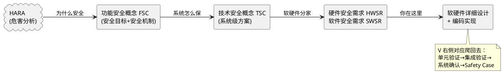

# 03-开发流程V模型

> 一句话定位：26262 把开发画成一个 V 字，左边从需求往下走到代码，右边从测试往上爬回需求，你的日常在 V 的左下角和右下角。
> 等级：L1 ｜ 前置：[01-从一个刹车失灵的故事说起-功能安全全景](../../00-入门导读/01-从一个刹车失灵的故事说起-功能安全全景.md)

## 原理

26262 的核心思想：**每往下一层做设计，就必须有一个往上的验证动作接住它**。左边"拆"（分解需求），右边"合"（验证集成），左右对角线一一对应——单元测试对着软件详细设计，集成测试对着架构，整车确认对着安全目标。

"安全生命周期"就是这个 V 再加上前后的运营（生产、运行、变更管理），覆盖产品一辈子。

瀑布直觉：**危害告诉你"不能发生什么"→ FSC 告诉你"靠什么机制保住"→ TSC 告诉你"机制在系统上怎么分布"→ SWSR 告诉你"软件具体要做什么"**。每一层都是上一层的回答，ASIL 等级跟着一路传递、只升不降（除非分解）。

## 详解

### 1. V 模型两侧对照表

| V 左侧（分解） | 产出 | V 右侧（验证） | 干什么 |
|---|---|---|---|
| HARA | 安全目标（含 ASIL） | — | 等级源头 |
| 功能安全概念 FSC | 安全机制、安全状态 | 整车确认 | 真车上放坏了试 |
| 技术安全概念 TSC | 系统架构方案 | 系统集成测试 | 接口/时序/失效反应 |
| 软硬件需求 | SWSR/HWSR | 硬软件集成测试 | 板级联调 |
| 详细设计+编码 | 源码 | 单元验证（单元测试+评审） | 你写的你证 |

### 2. 各阶段典型产物

| 阶段 | 关键产物 | 一句话说明 |
|---|---|---|
| 计划阶段 | 安全计划、确认计划、DIA | 谁在什么时候干啥，供应商分界 |
| 概念阶段 | HARA、FSC | 安全目标清单 |
| 系统开发 | TSC、安全分析（FTA/FMEA） | 架构级怎么保安全 |
| 硬件开发 | 硬件安全需求、FMEDA 指标 | SPFM/LFM/PMHF 算达标没有 |
| 软件开发 | SWSR、软件架构、单元设计 | 嵌入式日常主场 |
| 交付 | **安全案例 Safety Case** | 证据汇编："我们凭什么说它安全" |
| 生产运营 | 生产控制、现场监控、变更管理 | 量产了也得盯着 |

Safety Case 值得单独记：它不是一份测试报告，而是**论据集合**——把 HARA 结论、分析结果、验证证据、度量指标打包成一个可追溯的"安全论证"。

### 3. 嵌入式工程师你在哪

大多数人在这三段：

1. **详细设计**：把 SWSR 翻译成模块设计，标注哪些函数承担安全机制（E2E、监控、冗余管理）。
2. **编码实现**：按 MISRA-C 写，ASIL D 代码要过静态分析 + 圈复杂度控制。
3. **单元验证**：写单元测试打覆盖率（语句/分支/MC/DC），证明实现符合设计。

上游你碰不到 HARA，但**需求可追溯性**会追到你头上：每条 SWSR → 设计元素 → 代码 → 测试用例，链断了审核就挂。

### 4. 与 ASPICE 的关系

一句话：**ASPICE 管过程好不好（能力成熟度），26262 管安不安全（风险）**；两者文档结构高度同源（SWE1~SWE6 基本对应 26262 软件篇），实际项目里通常一套流程两把尺子量。

## 实操/配置

拿到项目后的正确动作：

1. 找 SWSR 清单，标出分配给自己模块的条目和 ASIL。
2. 建立追溯矩阵（DOORS/Polarion 里一般是现成模板）：需求 → 设计 → 代码 → 测试。
3. 编码前确认适用的编码规范子集和覆盖率等级要求。

| ASIL | 单元测试覆盖率（参考 26262-6 表12） | 备注 |
|---|---|---|
| A/B | 语句覆盖起 | 可论证降级 |
| C | 分支覆盖 | 建议加强 |
| D | MC/DC | 基本硬性 |

## 易错点与陷阱

1. **现象：写完代码再补需求追溯。 原因：流程倒挂，audit 必挂。 对策：需求条目先进跟踪工具再动代码，每个函数设计时挂需求 ID。**
2. **现象：单元测试只测正常路径。 原因：忘了测试目的是"验证设计"而不是"证明能跑"。 对策：边界值、失效注入用例按设计里的安全机制逐条出。**
3. **现象：把 FSC 和 TSC 当一回事。 原因：都是"概念"。 对策：FSC 是功能层（车辆视角），TSC 是技术层（系统架构视角），层级混了追溯就断。**
4. **现象：Safety Case 等项目末期才拼。 原因：当成一次性文档。 对策：它是证据持续沉淀的过程产物，每个验证活动结束就归档证据。**
5. **现象：ASIL D 模块混进 ASIL B 代码里不分治。 原因：免检区（QM 混布）没划。 对策：软件架构里明确 QM/ASIL 分区和接口隔离，否则整体按最高等级处理。**
6. **现象：改一行代码直接发版。 原因：忘了运营阶段也有变更管理。 对策：走影响分析，牵动安全需求就要回归对应层级的验证。**

## 面试高频题

**Q1：简述 26262 的 V 模型左右两侧？**
答：左侧自顶向下分解：安全目标→FSC→TSC→软硬件需求→详细设计与编码；右侧自底向上验证：单元验证→集成测试→系统确认，且左右层级一一对应，下层的测试验证上层的产出。

**Q2：什么是安全生命周期？**
答：从概念阶段一路覆盖系统/硬件/软件开发、生产、运行、退役及变更管理的全过程安全活动总和，不是只管开发期。

**Q3：Safety Case 是什么？**
答：安全论证的证据集合——把安全计划、分析（HARA/FTA/FMEA）、验证结果、硬件度量等结构化汇编，论证"系统满足安全目标"。特点是可追溯、随项目持续演进。

**Q4：嵌入式工程师在 V 模型什么位置？**
答：主要在软件详细设计、编码实现、单元验证三段，同时承担需求追溯和维护各阶段的证据链；ASIL 等级决定编码规范和覆盖率的严格度。

## 延伸

- [02-安全状态与故障-术语四件套](02-安全状态与故障-术语四件套.md)——V 左上角 HARA 产出的那些术语。
- [../../../07-AUTOSAR架构/2-L2进阶/方法论与ARXML/03-ARXML手读.md]——SWSR 落到 ARXML 里长什么样。
- [../../../04-MCAL与外设驱动/3-L3高级/DMA/01-DMA总览.md]——底层驱动实现阶段的安全考量实例。
