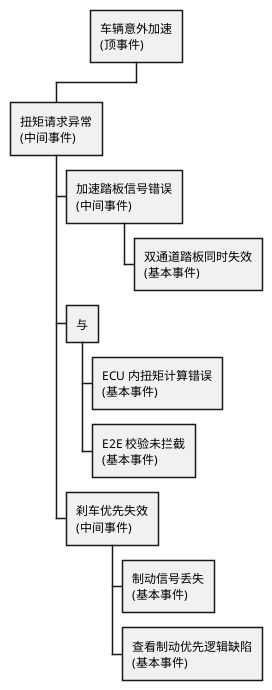

# 01-FTA-故障树入门

> 一句话定位：FTA 就是从"车怎么就出事了"这个结果往回追问"为什么"，一路问到底层原因，画成一棵倒挂的树。
> 等级：L1 ｜ 前置：[01-从一个刹车失灵的故事说起-功能安全全景](../../00-入门导读/01-从一个刹车失灵的故事说起-功能安全全景.md)

## 原理

安全分析两大门派：**FMEA 自底向上**（拿着零件挨个问"它坏了会怎样"），**FTA 自顶向下**（拿着事故问"凭什么会发生"）。FTA（Fault Tree Analysis，故障树分析）从顶事件出发，用布尔逻辑门把原因层层展开，直到**基本事件**——那些不再往下拆的、有数据可查的底层故障。

核心逻辑只有两个门：

- **或门（OR）**：任何一个输入发生，输出就发生——"任意一路坏都完蛋"，单点故障的味道。
- **与门（AND）**：所有输入同时发生，输出才发生——"得凑齐才行"，冗余设计的味道。

所以树里与门越多，说明冗余越好；或门成串，说明单点风险扎堆。

（读法示例：左支与门 = 踏板双通道同时坏 **且** 都没被拦住，才导致扭矩请求异常；右侧或门 = 制动信号丢失或优先逻辑有 bug，任一都让"刹车兜底"失效。）

## 详解

### 1. 基本符号直觉表

| 元素 | 长相/叫法 | 人话 |
|---|---|---|
| 顶事件 | 顶上的矩形 | 不想要的最终后果（危害事件级） |
| 中间事件 | 树中的矩形 | 还能继续追问"为什么"的原因 |
| 基本事件 | 底部的圆圈 | 拆到底了，有失效率数据的底层故障 |
| 或门 | 弧形盾牌 | 任一输入成立即输出，"或者" |
| 与门 | D 形平顶 | 全部输入成立才输出，"并且" |
| 未展开事件 | 菱形 | 懒得拆或没数据的，先挂起 |
| 转移符号 | 三角形 | 树太大，接到别的页继续 |

### 2. 最小割集

一句话直觉：**能让顶事件发生的"最小故障组合清单"**。组合里任何一个去掉，顶事件就不发生，就叫"最小"。单元素割集 = 单点故障，是优先围剿对象；阶数越高（组合越大）越难同时发生，概率越低。定量化就是把每个割集概率算出来求和，评估顶事件概率是否够低。

### 3. FMEA vs FTA 对照

| 维度 | FMEA | FTA |
|---|---|---|
| 方向 | 自底向上 | 自顶向下 |
| 起点 | 一个元件/功能失效 | 一个顶事件（危害） |
| 找什么 | 失效的影响和探测度 | 导致事故的原因组合 |
| 逻辑 | 表格穷举，无布尔逻辑 | 与/或门，可算割集和概率 |
| 适合 | 单点失效排查、工艺类 | 多重失效、冗余架构评价 |
| 谁用 | 系统/硬件工程师常用 | 系统安全、功能安全经理常用 |

实际项目两条腿走路：FTA 找出关键割集，FMEA 去底层落实每个基本事件怎么防。

## 实操/配置

嵌入式工程师不会天天画树，但一定会碰到这些场景：

1. **评审安全分析报告**：看分配到自己模块的基本事件，确认"预防/探测措施"栏里写的东西你真的实现了。
2. **认领基本事件**：例如"E2E 校验未拦截"——你要确认 CRC 算法、超时时间、计数器检查都配到位。
3. **提供失效率输入**：底层驱动故障检测时间、诊断覆盖率（DC）会进定量计算，别瞎报。

| 报告栏目 | 你要回答的问题 |
|---|---|
| 基本事件描述 | 这个故障对应我哪个模块哪个机制 |
| 探测措施 | 看门狗/E2E/自检，具体配置项 |
| 探测时间 | 与 FTTI 预算对齐了吗 |
| 诊断覆盖率 DC | 依据哪条标准/数据 |

## 易错点与陷阱

1. **现象：或门下挂一堆"软件 bug"。 原因：把设计缺陷当基本事件，树变成 bug 清单。 对策：软件 bug 应在开发过程消掉，FTA 基本事件应是随机硬件失效或明确定义的系统性失效。**
2. **现象：与门两边共用同一个电源/时钟。 原因：冗余分支有共因失效，与门"独立性"是假的。 对策：共因要单独建共因子树或用 β 因子修正，硬件资源真分开。**
3. **现象：割集算了但没按风险排序处理。 原因：只交报告不改设计。 对策：单元素、二阶割集优先加机制，改完重新算。**
4. **现象：探测措施写"软件保证"。 原因：评审时无法验证的空话。 对策：措施必须可追溯——具体配置项、具体测试用例。**
5. **现象：顶事件写成了"ECU 失效"。 原因：顶事件应是危害层面的后果，不是技术故障。 对策：顶事件从 HARA 的危害事件来，别把中间事件提拔成顶。**
6. **现象：FTA 做完 FMEA 不联动。 原因：两个组各干各的。 对策：FTA 割集里的基本事件应能在 FMEA 里找到对应条目和措施。**

## 面试高频题

**Q1：FTA 和 FMEA 的区别？**
答：FTA 自顶向下，从危害事件出发用与/或门展开原因组合，适合分析多重失效和冗余架构；FMEA 自底向上，逐个元件穷举失效模式看影响，适合单点失效排查。项目里通常配合使用。

**Q2：什么是最小割集？**
答：能使顶事件发生的最小基本事件集合，去掉其中任何一个顶事件就不再发生。单元素割集对应单点故障，是设计上最优先消除的对象。

**Q3：与门和或门在安全设计里各代表什么？**
答：或门表示任一输入故障即导致输出，暴露单点风险；与门表示需多个故障同时发生，对应冗余/独立通道设计——但与门成立的前提是分支相互独立、无共因失效。

**Q4：嵌入式工程师什么时候接触 FTA？**
答：主要在安全分析评审时认领基本事件——确认对应的探测措施（如 E2E、看门狗、自检）真实落地并提供探测时间与诊断覆盖率数据给定量分析。

## 延伸

- [02-安全状态与故障-术语四件套](../ISO-26262基础/02-安全状态与故障-术语四件套.md)——割集与单点/多点故障术语的对应。
- [03-开发流程V模型](../ISO-26262基础/03-开发流程V模型.md)——FTA 在 TSC 阶段的产物位置。
- [../../../07-AUTOSAR架构/2-L2进阶/方法论与ARXML/03-ARXML手读.md]——安全需求与分析结果如何落到 ARXML。
