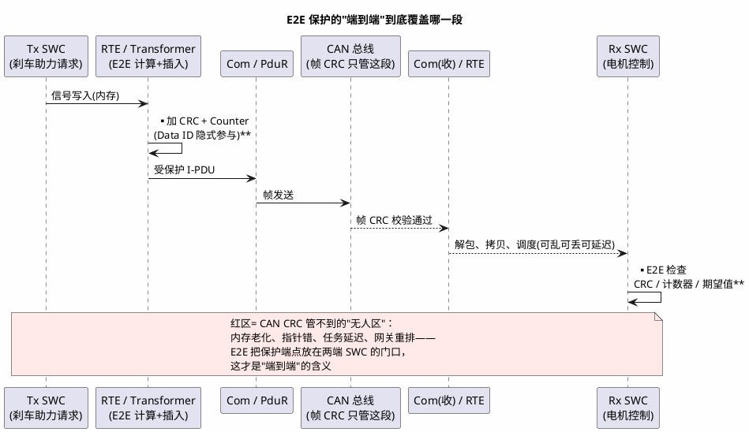

# 01-profile与CRC

> 一句话定位：E2E 端到端保护的本质是"用 CRC 抓内容损坏、用计数器抓丢失/重复/乱序、用 Data ID 抓张冠李戴"——因为 CAN/Com 的 CRC 只覆盖总线那一段，覆盖不了发送方内存到接收方内存的整条拷贝链。
> 等级：L2 ｜ 前置：[从一个刹车失灵的故事说起-功能安全全景](../../00-入门导读/01-从一个刹车失灵的故事说起-功能安全全景.md)、[ASIL与安全机制](../../1-L1基础/ISO-26262基础/01-ASIL与安全机制.md)

## 核心概念

### 动机：为什么 Com/CAN 的 CRC 不够

一条信号从发送方 SWC 到接收方 SWC，要经过一大串"无人看守"的环节：发送方 SWC 内存 → RTE 拷贝 → Com 打包（信号池→I-PDU）→ PduR 路由 → CanIf/Can 驱动 → 总线传输 → 接收 Can 驱动 FIFO → Com 解包写信号池 → RTE → 接收方 SWC 内存。中间还有网关转发、缓冲区复用。**CAN 帧的 15 位 CRC 只保护"总线那一段"**（见 [05 区 CAN 帧格式](../../../05-汽车网络通讯/1-L1基础/CAN/协议原理/01-帧格式.md)），前后每一段内存拷贝、每一次调度延迟、每一个网关路由表项，都是 CRC 管不到的地方。

ISO 26262-6 附录 D 把通信失效模式列得很直白，E2E 逐条对号：

| 失效模式 | 直觉场景（总线 CRC 都"通过"） | E2E 对策 |
|---|---|---|
| 损坏 corruption | RAM 位翻转、缓冲被踩，拷贝时数据坏了 | CRC 校验 |
| 重复 repetition | 接收侧任务延迟，把上一帧又处理一遍 | 计数器不增长 → 判重复 |
| 丢失 loss | 接收 FIFO 溢出丢了一帧 | 计数器跳变超出容忍窗 → 判丢失 |
| 延迟 delay | 调度积压，老数据晚到 | 计数器落后期望值过多 |
| 乱序 sequence | 网关双路由/队列重排 | 计数器回退 → 判乱序 |
| 伪装/错插 masquerading/insertion | 路由错、报文 ID 冲突，把别人的数据当成这份 | Data ID 参与 CRC |

端到端保护的覆盖范围，一张图看懂"端"在哪：

### 三件武器：CRC / Counter / Data ID

- **CRC**：对（Data ID + 长度 + 计数器 + 数据）整体计算校验码，随数据传输；收方重算比对。抓"内容坏了"。
- **Counter**：发送方每发一帧 +1（回绕）；收方维护期望值，并允许一个"容忍窗口"（如丢了 2 帧内不报错）。新值等于期望 → 正常；比期望旧 → 重复/乱序；跳太远 → 丢失。**容忍窗口的存在是噪声（偶发丢帧）与故障（持续异常）的分界**，窗口大小按安全机制的 FTTI 论证。
- **Data ID**：给每条受保护报文一个唯一标识，**不随报文传输、隐式参与 CRC 计算**。收发双方各按配置取值：如果这条数据被"张冠李戴"（路由错、伪装成别的报文），双方用的 Data ID 对不上，CRC 必然失败。

## 详解

### Profile 1/2/4/5/6 对比表

Profile 是 AUTOSAR E2E 规范预定义的"保护字段打包格式"，差别在字段宽度、CRC 算法与 Data ID 方式：

| Profile | CRC | 计数器 | Data ID | 长度字段 | 典型场景 |
|---|---|---|---|---|---|
| **P1** | CRC-8（SAE J1850） | 4 bit | 16 bit 隐式，报文级固定 | 8 bit | 经典 CAN 小报文（8 字节级），最老最普及 |
| **P2** | CRC-8（SAE J1850） | 4 bit | 8 bit + 16 项 **Data ID List**（随计数值轮换） | 8 bit | 经典 CAN，防伪装要求更高 |
| **P4** | CRC-32（以太网类） | 32 bit | 32 bit **显式**（随帧传输） | 32 bit | 车载以太网/SOME-IP 大报文（长度可达 GB 级） |
| **P5** | CRC-16（CCITT 0x1021） | 8 bit | 16 bit 隐式（可配 List） | 16 bit | CAN FD 大帧（64 字节级） |
| **P6** | 8/16/32 可选 | 4/8/16/32 可选 | 8/16/32 隐式，可配 | 可选 | 参数化"兜底"型，新项目按需裁剪 |

注：P05 计数器宽度为 8 bit（CRC-16、16 bit Data ID 与长度字段不变），各 Profile 字段定义以 AUTOSAR SWS E2E（PRP_SWC_0065 等）为准。

选型直觉：**报文多大（决定 CRC 与长度字段宽度）、跑在哪种总线（经典 CAN→P1/P2，CAN FD→P5，以太网→P4）、防伪装要多强（P2/P5 的 Data ID List 轮换强于 P1 固定值）**。另有 P7（CRC-64）面向超大数据流（Adaptive 平台时代），了解即可。

P2 的 Data ID List 值得多看一眼：16 个表项按计数值轮换取用——同一报文在第 0 帧和第 1 帧用的 Data ID 不同，伪造者不知道表内容，伪装难度陡增；代价是收发两端配置必须严格同版本。

### 收方判定逻辑直觉

收到一帧：① 先 CRC（含 Data ID、长度、计数器一起算）→ 错则判"损坏"；② 再看计数值：等于期望 → 推进期望；落在 [期望, 期望+容忍窗] → 判"曾丢失"但仍可用并推进；小于期望 → 判"重复/乱序"；跳变超窗 → 判"持续丢失"。三次判定全过，数据才交给应用。**CRC 过了不代表能信——计数器不过同样拒收**，很多初学者只盯 CRC。

### AUTOSAR 集成变体（配置细节回链 07 区）

E2E 在 AUTOSAR 里有三种挂法，原理相同、位置不同：

1. **E2E Transformer（RTE 侧）**：配置生成，SWC 无感，保护覆盖 RTE 拷贝链——当前推荐姿势；
2. **Com 内嵌 E2E**：保护挂在 [Com](../../../07-AUTOSAR架构/2-L2进阶/通讯服务栈/01-Com.md) 的 I-PDU 收发路径上，覆盖信号池打包/解包段；
3. **应用手调 E2E 库**：SWC 或 CDD 里显式调 `E2E_PxxProtect/Check`，最灵活也最容易漏。

网关转发受保护 I-PDU 时注意：PduR 原样透传则保护连续；一旦重新组包/换 Profile，必须在网关处"先验后重造"，否则网关自己就成了保护盲区。

### 与 SecOC 的分工（一句话版）

E2E 防**随机失效**（CRC+计数器，无密钥，坏了能发现）；SecOC 防**蓄意攻击**（MAC 用密钥算，攻击者伪造不出来，Freshness 防重放）。两者常共存于同一条安全报文——SecOC 的栈与配置见 [07 区加密栈 SecOC 配置](../../../07-AUTOSAR架构/3-L3高级/加密栈/02-SecOC配置.md)，攻击侧全景见本区 [SecOC](../SecOC/README.md)。

## 易错点与陷阱

1. **"CAN 帧有 CRC，不用 E2E"**：现象——评审通过一个安全报文方案只有 CAN CRC；原因——CAN CRC 只覆盖总线段，SWC↔Com 的多次内存拷贝、调度延迟、网关路由全裸奔；对策——ASIL 要求通信保护的信号按 ISO 26262-6 附录 D 逐条对失效模式加 E2E。
2. **容忍窗口配 0**：现象——偶发一次丢帧/调度抖动就报 E2E 错误，产线误报泛滥；原因——把容忍窗口理解成"严格性"，其实它区分偶发噪声与持续故障；对策——按 FTTI 与丢帧率统计配 1~2 帧容忍，错误处理分"瞬时/持续"两档。
3. **Data ID 两端不一致**：现象——新 ECU 一上线，收方 CRC 全错；原因——通讯矩阵版本错位，收发 Data ID（或 List 表项）不同；对策——Data ID 由系统描述统一生成下发，联调先做 E2E 版本握手续。
4. **复位后计数器失配**：现象——发送 ECU 复位后收方连续报乱序/重复；原因——发送方计数器清零、接收方期望值还停在旧值；对策——启动阶段设计重同步（首帧容忍/复位通知报文），或收方检测到大回退触发一次重新对齐。
5. **保护挂错层，链路仍有裸奔段**：现象——SWC 里手调 E2E 库，但 Com 信号池与 RTE 拷贝仍在保护圈外；原因——只保护了"应用层副本"，端点没放真正两端；对策——优先 E2E Transformer 放 RTE/Com 一侧，让保护圈覆盖整条拷贝链（配置见 07 区）。
6. **Profile 字段配置两端不对称**：现象——CRC 永远失败但人肉比对数据"明明一样"；原因——长度字段单位、字节序、Data ID 布局两端配置不一致；对策——用 E2E 一致性测试向量（标准附录有样例数据）先在台架对齐，再上整车。

## 面试高频题

**Q：CAN 报文自带 CRC，为什么还要 E2E 保护？**
答：CAN 的 CRC 只覆盖总线传输这一段；从发送方 SWC 内存经 RTE、Com 打包、调度、网关路由到接收方 SWC 内存，中间每一次拷贝都可能位翻转/踩内存，还可能丢失、重复、延迟、乱序——这些都在帧 CRC 的保护范围之外。E2E 把保护端点放在两端应用门口，用 CRC+计数器+Data ID 对整条链路兜底，对应 ISO 26262-6 附录 D 的通信失效模式。

**Q：E2E 靠什么发现丢帧和重复帧？**
答：靠计数字段。发送方每帧计数器+1，接收方维护期望值并允许一个容忍窗口：新计数等于期望值则正常推进；比期望值落后说明重复或乱序；跳变超过容忍窗说明丢失。CRC 本身发现不了"内容完好但来得不对"的帧，计数器才是抓时序失效的武器。

**Q：Profile 1 和 Profile 4 有什么差别，怎么选型？**
答：P1 是经典 CAN 时代的紧凑格式：CRC-8、4 位计数器、16 位隐式 Data ID，适合 8 字节级小报文；P4 面向以太网大报文：CRC-32、32 位计数器、32 位长度字段、Data ID 显式随帧传输，保护范围可达 GB 级。选型看三条：报文长度决定 CRC/长度字段宽度，总线类型（经典 CAN/CAN FD/以太网）决定可用 Profile 家族，防伪装强度决定要不要 Data ID List 轮换（P2/P5）。

**Q：E2E 和 SecOC 有什么区别？**
答：目标不同——E2E 防"自己坏"（随机失效：位翻转、丢失、乱序），用 CRC+计数器，无密钥，失效是概率事件；SecOC 防"有人弄坏你"（攻击），用密钥算 MAC 做认证、Freshness 防重放，攻击是意图事件。安全报文常两者叠加：SecOC 保"真"，E2E 保"全与序"。

## 延伸

- [ASIL与安全机制](../../1-L1基础/ISO-26262基础/01-ASIL与安全机制.md)：E2E 作为安全机制在概念链 TSR 层的出处；
- [07 区 Com 模块](../../../07-AUTOSAR架构/2-L2进阶/通讯服务栈/01-Com.md)：信号池/I-PDU 打包——E2E 保护圈要盖住的那段；
- [05 区 CAN 帧格式](../../../05-汽车网络通讯/1-L1基础/CAN/协议原理/01-帧格式.md)：帧 CRC 字段与覆盖范围，理解"总线段"的边界；
- [07 区 SecOC 配置](../../../07-AUTOSAR架构/3-L3高级/加密栈/02-SecOC配置.md) 与 [Csm-CryIf-Crypto](../../../07-AUTOSAR架构/3-L3高级/加密栈/01-Csm-CryIf-Crypto.md)：与 E2E 共存的认证侧栈实现；
- [07 区 内存栈 冗余与CRC](../../../07-AUTOSAR架构/2-L2进阶/内存栈/03-冗余与CRC.md)：另一类 CRC 场景（存储完整性），对比着看 CRC 的用法差异。
