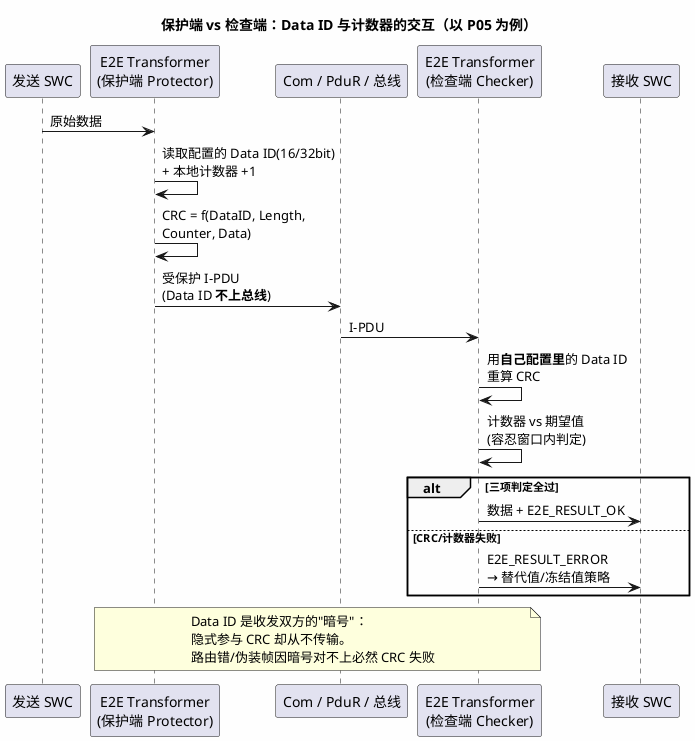

# 02-保护实操与数据ID

> 一句话定位：E2E 落到 AUTOSAR 工程里就三件事——E2E 库挂在哪、Data ID 怎么配、检查失败了消费端拿什么值顶上；其中 Data ID 配错是最经典的"间歇性抽风"来源。
> 等级：L2 ｜ 前置：[01-profile与CRC](01-profile与CRC.md)

## 原理

01 篇讲了"CRC+计数器+Data ID"三件武器的机制，本篇回答落地问题：**这些计算发生在 AUTOSAR 分层结构的哪个位置、由谁配置、失败之后系统怎么表现**。

E2E 保护链路的两个角色分工：

**核心直觉**：保护端负责"算好并附加"，检查端负责"重算并裁决"，两者唯一共享的是配置（Profile、Data ID、容忍窗口）——所以 E2E 的大部分 bug 本质是**两端配置不同步**。

## 详解

### 1. E2E 库在 AUTOSAR 里的位置

| 集成方式 | 位置 | 谁调用 | 优缺点 |
|---|---|---|---|
| **E2E Transformer** | RTE 侧（RTE 生成代码调用 E2E 库） | RTE，SWC 无感 | 覆盖 RTE 拷贝链，当前主流；但要求信号组/Transformer 配置到位 |
| **Com 内嵌 E2E** | Com 的 I-PDU 收发路径 | Com | 覆盖信号池打包段，配置集中在 Com；RTE 拷贝在圈外 |
| **手调 E2E 库** | SWC/CDD 里显式调 `E2E_P05Protect/Check` | 应用 | 最灵活，端点可以贴到真正的应用门口；最容易漏调、重复调 |

E2E 库本身（如 `E2E_P05Protect/Check`）是 AUTOSAR E2E 规范定义的标准函数集，Vector/EB 各家实现一致，**差别全在配置容器**。P05 在 CAN FD 项目里最常见（CRC-16 + 8bit 计数器，字段宽度以 AUTOSAR SWS E2E PRP_SWC_0065 等定义为准，见 [01 篇 Profile 对比](01-profile与CRC.md)）。

### 2. Data ID 机制：三种模式

| 模式 | 工作方式 | 防护强度 | 典型 Profile |
|---|---|---|---|
| **固定 Data ID** | 每条报文一个固定值，隐式进 CRC | 基础：防路由错、报文混插 | P1 |
| **Data ID List（低位模式）** | 按 4bit 计数器低 2~4 位从 N 项表里轮换取值 | 增强：同一报文每帧"暗号"都变，伪造者不知表内容无从伪装 | P2/P5 |
| **Data ID List（高位模式）** | 按计数器高位轮换，配合长容忍窗 | 轮换更慢，适合低速率 | P5 |

Data ID 怎么逐条对应失效模式：

- **错插/伪装**：别的报文被路由进本通道 → 双方 Data ID 对不上 → CRC 失败；
- **重复/丢失/延迟**：靠计数器 + 容忍窗口判（Data ID 不直接管，但 List 轮换让"重放旧帧"连 CRC 都过不了——旧帧用的是旧轮换项）；
- **16 vs 32 位**：宽度只影响碰撞概率与伪装搜索空间，经典 CAN 用 16bit 足够，以太网大系统建议 32bit（P4 显式传输）。

### 3. 保护端 / 检查端职责表（P05 为例）

| 职责 | 保护端 Protector（发送侧） | 检查端 Checker（接收侧） |
|---|---|---|
| 计数器 | 每帧 +1，回绕后跳过特定值（P05 可配） | 维护期望值，按窗口 [0, tolerance] 判定 |
| CRC 计算 | 用 Data ID + 长度 + 计数器 + 数据算出并插入 | 用**同一套配置**重算比对 |
| 状态上报 | 一般无 | 每次返回 E2E_RESULT（OK/WRONG_CRC/REPEATED/SEQUENCEERROR...） |
| 数据交付 | 原样发出（保护字段附加在头/尾） | 判定失败时**不交付新数据**，按策略给替代值 |

### 4. 消费端失败策略：替代值与冻结值

E2E 检查失败 ≠ 立即复位，**消费端拿到错误后给什么值**才是安全设计的关键（在 Com 配置叫信号失效替换，在 SWC 侧是应用逻辑）：

| 策略 | 行为 | 适用 |
|---|---|---|
| **冻结值 Freeze** | 保持最后一次有效值，起超时计时 | 短时抖动可容忍的缓变信号（车温、电量） |
| **替代值 Substitute** | 立即换成预定义安全值（0 或限幅值） | 快变控制信号（扭矩请求→替换为 0） |
| **失效通知** | 置 DEM 故障 + 通知应用 | 所有情况都应叠加，供上层决策降级 |

替代值策略在信号级配置（Com 的 Signal Invalid Value / E2E Transformer 的错误通知回调），冻结/替代的选择写进安全分析（违背哪条安全目标就选多保守的策略）。

## 实操/配置

### SW-C 级配置步骤（以 E2E Transformer + P05 为例）

| 步骤 | 做什么 | 关键参数 |
|---|---|---|
| 1. 系统侧定义 | 在系统描述（通讯矩阵 ARXML）给安全 I-PDU 标注 E2E 属性 | Profile=P05、Data ID、Data ID List、容忍窗口 |
| 2. 发送侧 Transformer | E2E Transformer 配置挂在信号组/I-PDU 上 | CRC offset、计数器位置、最大差值 tolerance |
| 3. 接收侧 Transformer | 同一套参数照抄（工具从系统描述分发，别手抄） | 同上 + 检查超时窗口 |
| 4. 错误处理 | 注册 Transformer 错误回调 / Com 的 E2E 指示 | 错误类型→DEM 事件码→应用降级动作 |
| 5. 联调 | 台架用标准测试向量对齐，再上整车 | 双端一致性验证 |

**tolerance（容忍窗口）怎么定**：统计正常工况最大丢帧/调度抖动帧数 N，配 N+1~2 裕量；同时满足"连续丢失超过窗口的时间 < FTTI"。配 0 必误报（见 01 篇陷阱 2）。

### Data ID 分配约定（工程实践）

- 每条受保护报文全网唯一，由通讯矩阵工具统一生成（见 [通讯矩阵ARXML](../../../05-汽车网络通讯/1-L1基础/通讯数据库/03-通讯矩阵ARXML.md)），禁止各 ECU 手工填；
- 版本变更（增删报文）时 Data ID 表整体重新下发，避免"新 ECU 用新表、老 ECU 用旧表"；
- 使用 List 模式时，表内容属于"准密钥"信息，随密钥类管理而非普通工程文档。

## 易错点与陷阱

1. **现象：某条信号间歇性 E2E 错，重启又好。 原因：收发两端 Data ID（或 List 表项）版本不一致，恰好旧帧计数器落在轮换表"碰巧对齐"的项上，表现为间歇性。 对策：Data ID 全部由系统描述统一生成下发，联调先跑 E2E 握手/版本检查。**
2. **现象：网关转发后收方永远 CRC 错。 原因：网关两侧用了不同 Data ID（各段总线独立分配），透传时保护字段是按发送侧 Data ID 算的。 对策：网关对受保护 Pdu 做"验后重造"（先按 A 侧 Data ID 校验，再按 B 侧重算保护字段），或全网统一 Data ID。**
3. **现象：同一个 I-PDU 既被 Transformer 保护、又被 SWC 手调 E2E 库再保护一层。 原因：集成时两层都配了 E2E，保护字段嵌套，收方算 CRC 时把外层字段当数据。 对策：一条数据链路只允许一个保护点，配置评审专项检查"重复保护"。**
4. **现象：共享 Pdu（多信号组拼一个 I-PDU）只有部分信号需要保护，整帧保护后 CRC 每次都变。 原因：把保护配在整 Pdu 级，未受保护信号组的正常更新也刷新计数器，接收端非保护消费者误判数据"总在变"。 对策：按信号组拆分保护范围，或整 Pdu 保护时明确所有消费者都做 E2E 检查。**
5. **现象：E2E 检查失败后消费端用了旧值但没任何故障记录，事后无法定位。 原因：只配了替代值，没把 E2E_RESULT_ERROR 上报 DEM/应用。 对策：所有失败类型都映射 DEM 事件并区分瞬时/持续计数。**
6. **现象：复位后收方连续报 SEQUENCEERROR 几秒才恢复。 原因：发送方复位计数器清零，收方期望值停在高位，要等回绕追上。 对策：启动阶段做重同步（收方检测到大回退触发期望值重对齐，或复位通知报文），别硬等回绕。**

## 面试高频题

**Q1：Data ID 在 E2E 里起什么作用？为什么不随报文传输？**
答：Data ID 是每条受保护报文的唯一暗号，和长度、计数器、数据一起参与 CRC 计算。不上总线恰恰是精髓：路由错/伪装的帧，接收方用自己的 Data ID 重算 CRC 必然对不上，等于零字节开销获得"防张冠李戴"能力；同时 List 轮换模式还能让旧帧重放连 CRC 都过不去。

**Q2：E2E 检查失败时消费端应该怎么处理？**
答：分三层——数据层：不交付新数据，按信号特性给冻结值（缓变量）或替代安全值（快变控制量）；故障层：错误类型映射 DEM 事件，区分瞬时/持续；系统层：持续超时触发上层降级甚至进入安全状态，时限按 FTTI 论证。切忌"失败就复位"一刀切，偶发丢帧属于可容忍噪声。

**Q3：E2E 库在 AUTOSAR 中有哪几种集成方式，怎么选？**
答：三种：E2E Transformer（RTE 侧，生成代码调用，SWC 无感，覆盖 RTE 拷贝链，主流推荐）；Com 内嵌（挂 I-PDU 收发路径，覆盖信号池段）；应用手调 E2E 库（最灵活、端点可贴应用门口，但最易漏调和重复调）。选型看保护圈要盖住哪段链路，且一条链路只能有一个保护点。

**Q4：tolerance 容忍窗口怎么配置？**
答：统计正常工况下最大偶发丢帧/调度抖动帧数 N，配 N 加 1~2 帧裕量；上限受 FTTI 约束——连续丢失超过窗口的时间必须小于故障容忍时间。配 0 会把正常抖动当故障，误报泛滥；配太大会让真故障发现太晚，两个方向都要论证。

## 延伸

- [01-profile与CRC](01-profile与CRC.md)——本篇前置：三件武器与 Profile 家族对比；
- [CMAC与新鲜度](../SecOC/01-CMAC与新鲜度.md)——SecOC 侧的"防伪造+防重放"，与 E2E 分工互补；
- [通讯矩阵ARXML](../../../05-汽车网络通讯/1-L1基础/通讯数据库/03-通讯矩阵ARXML.md)——Data ID 全网统一分配的系统描述载体；
- [WdgM与Windowed-WDT](../看门狗与监控/01-WdgM与Windowed-WDT.md)——E2E 之外另一类"发现异常"的安全机制，一个管通信一个管程序流。
