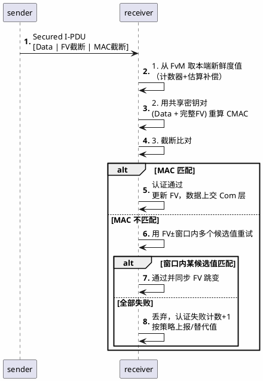

# CMAC与新鲜度

> 一句话定位：SecOC 的两根支柱——CMAC 证明"报文是我发的、没被改过"，Freshness Value 证明"这是新的报文、不是重放"，两者缺一即破防。
> 等级：L2→L3 ｜ 前置：[从一个刹车失灵的故事说起——功能安全全景](../../00-入门导读/01-从一个刹车失灵的故事说起-功能安全全景.md)、[ISO-21434概览/01-概览](../ISO-21434概览/01-概览.md)

## 太长不看

- CAN/CAN-FD 报文天然无发送者身份，开源工具加一个总线接口就能伪造车控指令——SecOC 给报文加"暗号"（CMAC）和"流水号"（新鲜度值）。
- CMAC 是认证不是加密：保护**完整性**（防篡改防伪造），不保护机密性；车控报文威胁模型里攻击者要的是"发假命令"而不是"看懂报文"，所以多数只认证不加密。
- 只加 MAC 不加新鲜度值，攻击者可以原样重放合法旧报文（旧的开锁、旧的扭矩），所以必须有单调变化的新鲜度值参与 MAC 计算。
- Authenticator 和新鲜度值都做截断（MAC 24~64bit、FV 4~8bit），本质是带宽/实时性与碰撞概率的权衡。

### 工程深入场景

量产 SecOC 调试期 90% 的问题不在"MAC 算得对不对"，而在收发双方新鲜度值**不同步**（接收端估出来的 FV 与发送端实际值错位，认证全挂）。真正上量产线前要专门演练：冷启动、掉电重启、总线长时间静默后恢复、FV 回绕这四种场景的重新同步，这也是本文"军备竞赛"一节的主角。

## 核心概念

发送端用共享密钥对（数据+新鲜度值）算 CMAC，截断后随数据一起发；接收端用同样的密钥与"自己推算的新鲜度值"重算并比对——比对通过才把数据交给上层：

## 详解

### 1. 动机：CAN 报文为什么能被伪造

经典 CAN 的设计前提是"总线上都是自己人"：帧格式里只有 ID、DLC、数据和 CRC——CRC 防传输误码，不防恶意篡改（攻击者改完数据自己把 CRC 算对即可）。总线物理上是共享广播介质，接入点除了 OBD 口还有网关背板、无线入口经过的 TBox。攻击链条在 [ISO-21434 概览](../ISO-21434概览/01-概览.md)里已经走过一遍：Jeep 事件的最后一步就是"以合法帧格式发非法内容"。结论：**传输正确性（CRC/E2E）与内容真实性（SecOC）是两个正交问题**——E2E 防"路上坏了"，SecOC 防"源头是假的"，两者常叠加在同一信号上。

### 2. CMAC 认证 vs 加密：为什么车控报文只认证不加密

| | 加密（如 AES-CBC） | CMAC 认证（如 AES-CMAC） |
|---|---|---|
| 保护什么 | 机密性：看不懂 | 完整性+真实性：改不了、冒充不了 |
| 输出 | 与明文等长的密文 | 固定长度的认证标签（可截断） |
| 车控报文需要吗 | 多数不需要 | 需要 |

三个理由决定车控报文多数只认证不加密：其一，威胁模型——攻击者关心的是**伪造指令**而不是读懂指令（转速、扭矩这些物理量本来就能从车外推出来），加密对这种攻击毫无作用；其二，加密不改变长度但破坏信号可观测性，售后诊断、总线分析、网络管理都要退化；其三，密文换一次明文变一位会导致密文全变，与 Com 层信号打包、失效处理策略冲突。反例是密钥分发报文、防盗码这类**内容本身机密**的数据，才做加密——往往在诊断/升级协议层而非 SecOC 里做。

CMAC（Cipher-based MAC）的直觉：用对称密钥把"整块数据"压成一个 128bit 指纹，没密钥的人造不出能通过校验的指纹，改一位数据指纹就面目全非。它与 CRC 的本质区别：CRC 是无密钥的公开算法，攻击者可任意伪造；CMAC 的安全性锚在**密钥只有合法双方知道**——这把问题转移到"密钥放哪"，答案是 [HSM/SHE 硬件](../../3-L3高级/HSM与SHE/README.md)。

### 3. Freshness Value：与重放攻击的军备竞赛

只有 MAC 还不安全：攻击者录下一条合法的"解锁"报文，原样重发——数据没改、MAC 自然校验通过。必须让每条报文的 MAC 输入里含一个"不会重复使用"的量，即新鲜度值（Freshness Value, FV）。防御与攻击的军备竞赛：

- **第 0 回合：无 FV。** 重放任意旧报文即可 → 必须引入变化量。
- **第 1 回合：报文里带完整单调计数器。** 攻击者把旧报文的计数字段和 MAC 一起重放 → **FV 必须参与 MAC 计算**，且校验时用收方本地推算值，不信报文里的字段。
- **第 2 回合：报文里只发 FV 截断（低 4~8bit）。** 攻击者伪造 FV 截断+重放旧 MAC → 截断只是提示，真正校验值来自本地计数器；伪造碰撞概率 2^-截断宽度。
- **第 3 回合：收发计数器漂移。** 丢一帧两边计数器就错位，后续全挂 → 引入**重同步机制**：接收端在本地值±容差窗口内穷举重试；漂出窗口则靠 FV 同步报文（FvM/Sm 主从分发，SHE 密钥导出的 Key Update 报文也带新鲜度）拉回。
- **第 4 回合：长时间静默后（如车辆停放数周）计数器漂移过大。** 单纯计数器不够 → 业界常用**时间基 FV**（全局时间+单调计数器组合），或复位后走诊断通道重新同步。

计数器截断位宽的权衡是带宽问题：FV 截断每多 1 bit，报文开销多 1 bit、收端重试窗口可减半；常见配置 4~8bit，配合容差窗口（如 ±16）覆盖连续丢帧。

### 4. SecOC 帧结构：截断长度的三重权衡

Secured I-PDU 的布局：`[PDU 数据 | 截断的新鲜度值 | 截断的 Authenticator(MAC)]`。两个截断长度是 SecOC 最核心的配置决策（配置参数与栈实现见 [07 区 SecOC 配置](../../../07-AUTOSAR架构/3-L3高级/加密栈/02-SecOC配置.md)，本篇只讲原理权衡）：

| 截断长度 | 收益 | 代价 |
|---|---|---|
| MAC 长（64bit+） | 伪造碰撞概率 2^-64，几乎不可能 | 经典 CAN 8 字节装不下；延迟与带宽开销大 |
| MAC 短（24~28bit） | 经典 CAN 可塞下（数据 4B+FV 1B+MAC 3B 的经典布局） | 碰撞概率上升，但攻击者只有**有限次在线尝试**机会（失败即被计数/锁定），24bit 配合失败锁定已足够 |
| FV 长 | 同步更鲁棒 | 挤占数据与 MAC 空间 |

核心直觉：CMAC 碰撞攻击是**在线**攻击——攻击者每次猜测都要真发一帧、且失败会累计暴露；而离线暴力算 MAC 需要密钥。所以短 MAC 的安全性不等于 2^-n 的裸概率，而是"2^-n × 每次尝试的暴露成本"。这也是为什么 E2E 的 CRC-8 与 SecOC 的 MAC-24 完全不是一个安全量级。

## 易错点与陷阱

1. **现象：收发报文内容完全一致，认证失败率却随时间上升。** 原因：双方新鲜度值计数器漂移（丢帧、静默期未同步递增）超出容差窗口。对策：FvM 同步策略覆盖静默场景，接收窗口参数按最坏丢帧率整定，量产前专项测试掉电重启与长停场景。
2. **现象：把 FV 截断字段当"数据"比对通过就放行。** 原因：混淆"FV 提示字段"与"校验基准"。对策：MAC 计算必须用**本地完整 FV**（截断仅用于提示与跳变检测），比对失败时在窗口内穷举本地候选值，绝不信任报文携带值。
3. **现象：MAC 只算了数据没算 FV（或反之）。** 原因：收发两端的"MAC 输入构成"（Data ID、数据、FV 组装方式）不一致。对策：SecOC 的 AuthDataInfo（Data ID、FV 长度、截断方式）双侧必须逐字段对齐，联调用"已知答案测试"（KAT）向量先过一遍。
4. **现象：加了 SecOC 后 10ms 周期报文发送抖动。** 原因：CMAC 用软件 AES 算，占用 CPU 与任务时间。对策：走 Csm→CryIf→Crypto 驱动到硬件（HSM/CSEc）作业队列，把认证延迟计入 Com 发送时序预算。
5. **现象：某节点长期 100% 认证失败但整车"看起来正常"。** 原因：SecOC 失败策略配了"替代值+不报警"，问题被静默吞掉。对策：认证失败计数与状态必须可读（诊断 DID）且超阈值上报，别让安全机制自己变成不可观测的黑洞。
6. **现象：开发环境用测试密钥、上量产线忘了换。** 原因：密钥注入流程与产线烧录流程脱节。对策：密钥由产线经 HSM 安全通道注入（见 [HSM 与 SHE](../../3-L3高级/HSM与SHE/README.md)），固件里禁止硬编码任何密钥。

## 面试高频题

**Q：SecOC 为什么用 CMAC 而不直接加密报文？**
答：CMAC 保护完整性与真实性，加密保护机密性，车控报文的威胁是"伪造/篡改指令"而非"被读懂"，加密对此无效；且 CMAC 标签定长可截断，对带宽和实时性友好，不破坏信号可观测性。只有密钥分发、防盗数据这类内容本身机密的报文才加密，且通常在应用/诊断层做。

**Q：新鲜度值为什么要参与 MAC 计算？只发计数器不行吗？**
答：若计数器不参与 MAC（或校验信任报文携带的计数器），攻击者可原样重放"数据+计数器+MAC"三元组，校验全部通过。FV 参与计算且校验基准取自接收端本地推算值后，重放旧报文时本地 FV 已前进，MAC 对不上，重放即失效。

**Q：SecOC 的 MAC 截断到 24bit，安全吗？**
答：截断后伪造碰撞概率是 2^-24 每次尝试，但这不是离线暴力——攻击者每次猜测必须真实发帧且会累计认证失败计数，配合失败锁定/上报机制，在线尝试次数被限制在很小的值，总攻击成功率可压到可接受水平。截断长度是带宽开销与在线攻击窗口的权衡，典型 24~64bit。

**Q：E2E 和 SecOC 都是"校验"，它们什么关系？**
答：E2E（CRC+Counter）防**传输过程中**的随机损坏，无密钥、防不了伪造（CRC 公开可算）；SecOC（CMAC+FV）防**恶意**的伪造与重放，依赖密钥。两者正交且常叠加在同一关键信号上，E2E 由功能安全需求驱动（ASIL 降权），SecOC 由网络安全需求驱动（CAL/CSMS）。

## 延伸

- [SecOC/02-配置要点](02-配置要点.md)：本目录续篇，Authentic I-PDU 布局与 FvM 同步的工程配置
- [HSM与SHE](../../3-L3高级/HSM与SHE/README.md)：CMAC 密钥的硬件保险箱
- [07 区 SecOC 配置](../../../07-AUTOSAR架构/3-L3高级/加密栈/02-SecOC配置.md)：SecOC 模块参数级配置实操（本区讲原理，07 区讲配置）
- [07 区 Csm-CryIf-Crypto](../../../07-AUTOSAR架构/3-L3高级/加密栈/01-Csm-CryIf-Crypto.md)：CMAC 作业在栈里的调用链
- [从一帧 CAN 报文说起——车载网络全景](../../../05-汽车网络通讯/00-入门导读/01-从一帧CAN报文说起-车载网络全景.md)：SecOC 保护的对象——一帧 CAN 报文本身
