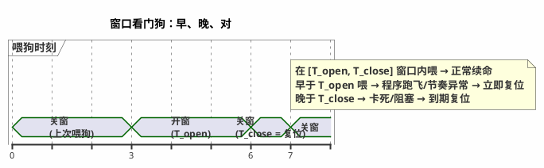
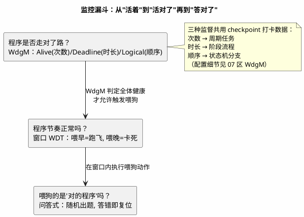
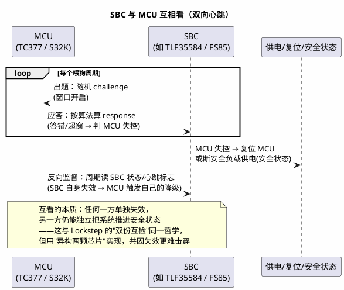

# 01-WdgM与Windowed-WDT

> 一句话定位：喂狗从"别太晚"升级为"必须在窗口内、还得答对题"——窗口看门狗抓"喂早=跑飞、喂晚=卡死"，问答式抓"瞎猫碰上死耗子"，WdgM 三监督（Alive/Deadline/Logical）把"活着"升级为"活对了"，SBC 与 MCU 互相看则把监控做到芯片之外。
> 等级：L2 ｜ 前置：[从一个刹车失灵的故事说起-功能安全全景](../../00-入门导读/01-从一个刹车失灵的故事说起-功能安全全景.md)、[ASIL与安全机制](../../1-L1基础/ISO-26262基础/01-ASIL与安全机制.md)

## 核心概念

### 为什么必须是"窗口式"

普通看门狗只判一件事：**到期前有没有喂**。它抓得住"卡死"（喂晚了），抓不住"跑飞"——程序跑飞后高速乱转，完全可能提前撞进喂狗代码，把狗喂得比谁都准时。窗口式看门狗再加一条：**喂早了（早于开窗时刻）也算失效，立即复位**。于是"喂狗"从一个宽泛的"还在动"，收紧成"以正常节奏在动"：

窗口宽度是设计出来的：太窄（T_open 贴着理想周期）正常抖动就"喂早"，太宽（T_close 太远）卡死发现得慢、超 FTTI。典型做法：喂狗统一收口在 WdgM 主循环里，窗口按"最坏调度延迟 × 裕量"定。

### 为什么还要"问答式"（Challenge-Response）

窗口式仍有一个洞：喂狗动作本身是"写一个固定魔数"。跑飞的程序如果跳到喂狗函数、或喂狗调用散落多处（谁都能喂），照样续命。**问答式喂狗**把喂狗变成解题：看门狗硬件（或外部 SBC）出一道随机 challenge，软件按约定算法算出 response 写回——**答案取决于题目，题目每次不同**。跑飞的程序不会解题，瞎写必然答错，答错立即复位。它同时消灭了"多点喂狗"的可能：答案只有按正确流程算得出。

三监督 + 窗口 + 问答，构成一个层层收紧的漏斗：

### WdgM 三监督：一眼分清

| 监督 | 检查什么 | 违规长什么样 | 适合对象 |
|---|---|---|---|
| Alive 活监督 | 周期内某 checkpoint 到达**次数** ∈ [min,max] | 次数太少=停转；太多=狂转/风暴 | 周期任务（10ms 控制、100ms 监控） |
| Deadline 期限监督 | 两个 checkpoint **之间**时长 ∈ [min,max] | 太慢=阻塞；太快=跳过了工作 | 初始化、阶段流程（等传感器应答） |
| Logical 逻辑监督 | checkpoint 到达**顺序**符合预定义合法图 | 跳步、回跳、走非法分支 | 有模式/分支的状态机 |

细节（SE/checkpoint 埋点、参数计算、失效反应配置）在 [07 区 WdgM 监督实体与checkpoint](../../../07-AUTOSAR架构/2-L2进阶/系统服务栈/WdgM/01-监督实体与checkpoint.md)——**本区讲"为什么要三层"，07 区讲"每层怎么配"**。

## 详解

### 外部监控式：SBC + MCU 互相看

MCU 内部看门狗再强，也和被监控对象共生死：时钟挂了、内核锁步对死了、电源塌了，内部狗可能跟着一起哑。所以安全设计常用 **SBC（系统基础芯片）从外部看住 MCU**，且是双向互看：

- **正向**：SBC 的窗口+问答狗监督 MCU。MCU 软件卡死/跑飞 → 答错或超窗 → SBC 复位 MCU，复位无效则直接切断安全相关负载供电（SBC 握有电源开关，这是它比内部狗硬气的地方）。
- **反向**：MCU 周期性读 SBC 的状态/错误标志，SBC 自身失效（如内部时钟漂了）→ MCU 主动进自己的安全状态。只做正向是常见设计缺陷。
- **附带收益**：SBC 天然集成欠压/过压、过温监控，构成 MCU 内部监控之外的**独立监控通道**（多样性），直接支撑 Part 5 的诊断覆盖率计算。

### 外部 WdgM：监督逻辑跑在别的芯片上

AUTOSAR 允许 WdgM 的"判定+喂狗决策"不在本 ECU 上：监督实体打卡数据经总线发往外部（比如区域控制器/网关上的 WdgM），由它判定后再决定是否让 SBC 续命。架构意义：**判定者与被判定者物理分离**，被监控 ECU 整个瘫掉，外部照样能发现并处置。代价是打卡数据本身要走一条受保护的链路（又回到 [E2E保护](../E2E保护/01-profile与CRC.md)）。

### 双平台落点（硬件层各叫什么名）

- **TC377（AURIX）**：内部 WDT 自带窗口 + 寄存器密码保护（操作需按约定 opcode，乱写直接产生 trap，喂狗错误本身可被捕获），到期/违规经 **SMU** 集中响应（复位/中断/引脚，可配）；开机 LBIST 自检与时钟监控同属这套硬件安全设施（[04 区 TC377-WDT](../../../04-MCAL与外设驱动/2-L2进阶/Wdg/02-TC377-WDT.md)）。
- **S32K**：S32K1 的 WDOG 靠解锁序列（0xC520/0xD928）防误写、LPO 独立时钟；S32K3 升级为 **SWT**：窗口模式 + **问答模式（QA）**，与 **FCCU**（故障集中收集响应）、**CMU**（时钟监控）联动（[04 区 S32K-WDOG](../../../04-MCAL与外设驱动/2-L2进阶/Wdg/03-S32K-WDOG.md)）。
- 共同点：**喂狗时钟独立于系统时钟**（狗不能跟着系统时钟一起死），这是硬件选型的底线检查项。驱动层细节见 [04 区 看门狗原理](../../../04-MCAL与外设驱动/2-L2进阶/Wdg/01-看门狗原理.md)。

### 与 07 区的分工（读哪儿）

本区回答"为什么窗口/为什么问答/为什么三监督/为什么互看"；落到工程配置——SE 与 checkpoint 怎么建、Alive 容差怎么算、失效反应怎么接 EcuM/BswM——全部在 07 区：[监督实体与checkpoint](../../../07-AUTOSAR架构/2-L2进阶/系统服务栈/WdgM/01-监督实体与checkpoint.md)、[失效响应](../../../07-AUTOSAR架构/2-L2进阶/系统服务栈/WdgM/02-失效响应.md)、[WdgM 联动](../../../04-MCAL与外设驱动/2-L2进阶/Wdg/04-WdgM联动.md)。

## 易错点与陷阱

1. **窗口贴着理想周期配满**：现象——负载高峰期偶发复位，日志只有"喂狗过早"；原因——T_open 太贴近理想周期，调度抖动就成了"跑飞"；对策——窗口下限按最坏调度延迟加裕量定，喂狗统一收口单一函数，别让多处各喂各的。
2. **中断里到处喂狗**：现象——某任务死循环系统照样活；原因——喂狗点分散，任何一个活着的执行流都能续命；对策——只有 WdgM 判定全体 SE 健康后才喂（决策与执行分离），多点喂狗一律清掉。
3. **下电/刷写阶段没切监督模式**：现象——写 NvM/Flash 慢任务跑一半被复位，配置偶尔写坏；原因——正常模式的 Deadline/窗口参数不适配慢阶段；对策——按 EcuM 生命周期切换 WdgM 模式（SLOW/OFF，见 [07 区 EcuM 上下电时序](../../../07-AUTOSAR架构/2-L2进阶/系统服务栈/EcuM/02-上下电时序.md)）。
4. **问答式的"算法/答案表"放在 RAM**：现象——RAM 被踩后狗照样被喂活；原因——challenge-response 计算依赖的数据可被失控程序篡改或碰巧匹配；对策——算法与密钥表放 Flash/由硬件（SBC）生成 challenge，软件只做计算。
5. **SBC 互看只做正向**：现象——SBC 自身失效时 MCU 无感知，整机停在半死状态；原因——设计只考虑"MCU 坏了 SBC 兜底"，忘了反向；对策——MCU 周期读 SBC 状态标志+超时判定，双向各有安全状态定义。
6. **调试一断点就复位**：现象——单步调试、打断点立即被狗咬；原因——WDT 在 debug 会话没有冻结，停核=超窗；对策——debug 模式启用 WDT 冻结（TC377 调试模式可冻结、S32K 有对应使能位），且量产映像必须确认冻结关闭。

## 面试高频题

**Q：为什么安全相关的看门狗必须是窗口式的？**
答：普通看门狗只判"喂晚了"（卡死），判不出"喂早了"——程序跑飞后高速乱转完全可能提前撞进喂狗代码，狗反而喂得更准时。窗口式规定必须在 [T_open, T_close] 内喂：早于开窗说明节奏异常（跑飞/提前跳转），立即复位；晚于关窗才复位。窗口把监控对象从"活着"收紧为"以正常节奏活着"。

**Q：问答式（Challenge-Response）喂狗解决什么问题？**
答：固定魔数喂狗挡不住两类情况：跑飞程序碰巧跳到喂狗代码、喂狗调用散落多处谁都能喂。问答式由看门狗硬件/SBC 每次出随机题，软件按约定算法算出答案——答案依赖题目且只有正确流程算得出，答错立即复位。它同时天然消灭多点喂狗。典型实现：S32K3 的 SWT QA 模式、TLF35584 等 SBC 的挑战应答狗。

**Q：WdgM 的三种监督分别抓什么故障？**
答：Alive 查监督周期内 checkpoint 到达次数（太少=任务停转，太多=风暴），适合周期任务；Deadline 查两个 checkpoint 之间的时长（太慢=阻塞，太快=跳过了工作），适合初始化等阶段流程；Logical 查 checkpoint 到达顺序是否符合预定义合法转移图（跳步/回跳=控制流跑偏），适合有分支的状态机。三者共用打卡数据，从频率、时长、路径三个维度证明"活对了"。

**Q：为什么外部 SBC 看门狗比 MCU 内部看门狗更可靠？两者如何配合？**
答：内部狗与被监控对象共生死——时钟/电源/内核整体失效时内部狗可能一起哑。SBC 独立供电独立时钟，MCU 失控时能复位它甚至直接切断安全负载供电，构成异构冗余。配合是双向的：SBC 用窗口+问答监督 MCU（正向），MCU 周期读 SBC 状态做反向监督，任一方单独失效另一方都能把系统推进安全状态。

## 延伸

- [07 区 监督实体与checkpoint](../../../07-AUTOSAR架构/2-L2进阶/系统服务栈/WdgM/01-监督实体与checkpoint.md)：三监督的 SE/checkpoint 建模与参数直觉（本区的配置续集）；
- [07 区 WdgM 失效响应](../../../07-AUTOSAR架构/2-L2进阶/系统服务栈/WdgM/02-失效响应.md)：违规后本地/全局状态机与失效反应；
- [04 区 看门狗原理](../../../04-MCAL与外设驱动/2-L2进阶/Wdg/01-看门狗原理.md)、[TC377-WDT](../../../04-MCAL与外设驱动/2-L2进阶/Wdg/02-TC377-WDT.md)、[S32K-WDOG](../../../04-MCAL与外设驱动/2-L2进阶/Wdg/03-S32K-WDOG.md)：硬件狗机制与双平台驱动层；
- [02 区 Lockstep 安全机制](../../../02-芯片与体系结构/3-L3高级/TriCore架构/05-Lockstep安全机制.md)：与"互相看"同哲学的硬件层实现，对照理解异构 vs 同构冗余；
- [E2E保护](../E2E保护/01-profile与CRC.md)：外部 WdgM 的打卡数据走总线时，链路完整性靠它兜底。
