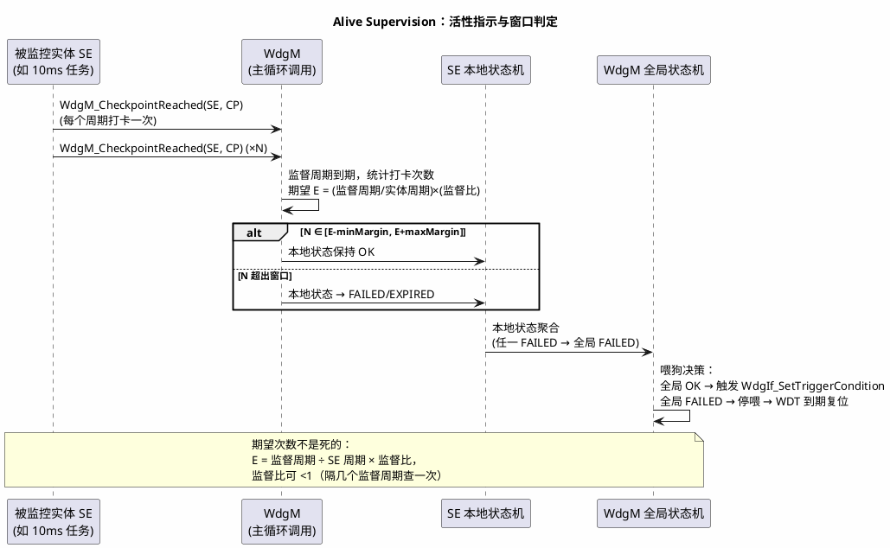
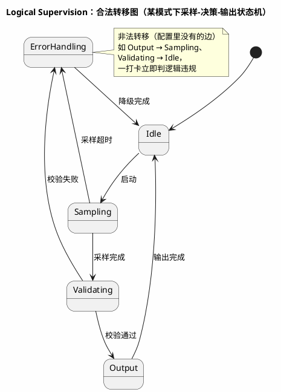

# 02-Alive-Supervision与Deadline

> 一句话定位：WdgM 的三监督分别从"次数、时长、顺序"三个角度证明程序"活对了"——Alive 抓停转和风暴、Deadline 抓阻塞和跳步、Logical 抓走错路，判定都基于 SE 本地/全局状态机，喂不喂狗由 WdgM 说了算。
> 等级：L2 ｜ 前置：[01-WdgM与Windowed-WDT](01-WdgM与Windowed-WDT.md)

## 原理

01 篇讲了"为什么要三监督"，本篇把三个监督机制拆开看：**被监控实体（SE, Supervised Entity）在 checkpoint 打卡，WdgM 周期性"对账"**，账对不上就推进本地/全局状态机，最终决定"这轮喂不喂狗"。

Alive Supervision 的核心交互（三监督中最常用，先看懂它）：

## 详解

### 1. Alive Supervision（活动监督）

**机制直觉**：约定"一个监督周期内你该打卡 N 次"，多了少了都是病。

| 参数 | 含义 | 配错症状 |
|---|---|---|
| Supervised Reference Cycle | SE 的基准周期 | 配短 → 期望次数偏高 → 误报"次数不足" |
| Supervision Reference Cycle | WdgM 的对账周期 | 必须是所有 SE 基准周期的公倍数，否则没法算期望 |
| Min/Max Margin | 允许 N 偏低/偏高的次数 | 配 0 → 一拍抖动就 FAILED |
| Supervision Ratio | 监督比（隔多久查一轮） | 拉长会推迟故障发现时间，受 FTTI 约束 |

抓两类故障：**次数太少 = 任务停转/被饿死**（低优先级任务被高优先级长期抢占）；**次数太多 = 任务风暴/重复调度**（定时器配错、回调被重入）。

### 2. Deadline Supervision（期限监督）

**机制直觉**：不数次数，掐表——两次打卡之间的时长必须落在 [min, max]。

| 维度 | 说明 |
|---|---|
| 监控对象 | **同**一个 SE 的两个 checkpoint 之间（起步 CP → 完成CP） |
| min 违规 | 太快 = 中间工作被跳过（比如空跑的初始化） |
| max 违规 | 太慢 = 阻塞/等待超时（等传感器应答卡住） |
| 适合对象 | **非周期**的阶段流程：初始化序列、请求-应答、慢速任务 |
| 与 Alive 的区别 | Alive 看长期频率，Deadline 看单次间隔；周期任务两个都配是冗余，选一个即可 |

例：CAN 收驱动的"收到帧→处理完"两个 checkpoint 之间 max=5ms，超了说明接收处理被阻塞，这一帧链路的失效 Alive 看不出来（任务整体频率可能正常）。

### 3. Logical Supervision（逻辑监督）

**机制直觉**：给程序画一张合法路线图，打卡序列必须符合图上的边——**跳步、回跳、走非法分支都算违规**。

逻辑监督按模式（不同的图）可切换——刷写模式下合法序列和运行模式完全不同，WdgM 支持随模式切转移图。

### 4. 三监督对比一张表

| | Alive | Deadline | Logical |
|---|---|---|---|
| 检查维度 | 次数 | 时长 | 顺序 |
| 抓什么 | 停转/风暴 | 阻塞/跳过工作 | 控制流跑偏 |
| 参数核心 | 期望次数 ± margin | [min,max] 区间 | 合法转移图 |
| 适合 | 周期任务 | 阶段流程/请求应答 | 状态机/分支程序 |
| 判定时机 | 监督周期到期 | 第二个 checkpoint 到达时 | 打卡瞬间 |

### 5. 本地/全局状态机与失效反应

每个 SE 有**本地状态机**（OK → FAILED → EXPIRED → DEACTIVATED），WdgM 有**全局状态机**（聚合所有 SE：任一 FAILED → 全局 FAILED）。失效反应按状态推进逐级触发：

| 全局状态 | 典型反应 |
|---|---|
| OK | 正常喂狗 |
| FAILED | 停止喂狗（WdgIf 不再设触发条件）、置 DEM、通知 EcuM/BswM 进降级 |
| EXPIRED | 允许重启 SE / 复位 ECU（按配置 reaction：RESET/RESET_REACTIVE...） |

**WdgM 与外部看门狗的关系一句话**：WdgM 决定"喂不喂"（判定逻辑），WdgDrv/WDT 硬件决定"怎么喂"（窗口、问答机制见 [01 篇](01-WdgM与Windowed-WDT.md)）——决策与执行分离，是多点喂狗问题的根治方案。

### 6. 监控实体（SE）配置表结构

| SE 参数 | 说明 |
|---|---|
| SupervisionKind | alive / deadline / alive-deadline / logical |
| Checkpoints | 打卡点列表，各带 ID 与所属转移 |
| 期望参数 | Alive：参考周期+margin；Deadline：min/max；Logical：转移图 |
| Local-Global 参数 | 本地状态聚合方式、失效后是否继续监控 |
| Failed Reaction | 失效反应类型（停喂狗/复位/通知）+ 目标（DEM/EcuM） |

## 实操/配置

配置顺序建议（打点先行，参数后调）：

| 步骤 | 做什么 | 注意 |
|---|---|---|
| 1. 圈 SE | 按安全分析圈出需要监控的程序单元（OS 任务/状态机） | 覆盖所有安全相关执行流，一个 SE 别跨任务 |
| 2. 埋 checkpoint | 在任务头尾、状态机关键节点插 `WdgM_CheckpointReached` | 头尾各一个最稳；别埋在中断里与任务混打 |
| 3. 定参数 | Alive 期望次数按"监督周期/任务周期"算，margin 按 OS 抖动实测 | 台架跑最大负载统计，别拍脑袋 |
| 4. 配失效反应 | FAILED→DEM+停喂狗，EXPIRED→复位 | 慢速阶段（NvM 写入）切 WdgM 模式 |
| 5. 验证 | 故障注入：故意死循环一个 SE，验证狗真的咬 | 常被跳过、也最常翻车的一步 |

## 易错点与陷阱

1. **现象：低优先级任务偶发 ALIVE 失败，高优先级正常。 原因：期望次数按标称周期算，没算高负载下低优先级任务的抢占延迟。 对策：margin 用最大负载实测抖动帧数定，或调 OS 调度保证该任务的执行预算。**
2. **现象：Deadline 的 min 违规天天报。 原因：min 配了 0，正常快路径也被判"太快=跳过工作"。 对策：min 按真实最短执行时间加裕量，只对"中间有实质工作"的段配 min。**
3. **现象：Logical 模式切换后集体违规。 原因：新模式的转移图没配或 SE 打点没随模式改。 对策：模式切换（含刷写/下电）与 WdgM 模式同步切，BswM 里做联动。**
4. **现象：SE FAILED 了狗却还活着。 原因：失效反应配成"只记 DEM"不停喂狗，或该 SE 被配成失效即 DEACTIVATED 不再参与全局聚合。 对策：检查 reaction 与本地-全局聚合配置，故障注入验证"失败必停喂"。**
5. **现象：监督周期与任务周期不成整数倍，期望次数算出小数。 原因：Supervision Reference Cycle 与 SE 参考周期不匹配。 对策：监督周期取各 SE 周期公倍数，期望次数四舍五入的偏差吃进 margin。**
6. **现象：把喂狗调用塞在某个 SE 里，该 SE 一死全系统复位。 原因：把"WdgM 判定"和"喂狗执行"混在一个被监控对象里。 对策：喂狗决策由 WdgM 主循环统一做（决策与执行分离），SE 里只打卡。**

## 面试高频题

**Q1：Alive Supervision 的判定逻辑是什么？**
答：被监控实体在 checkpoint 调 `WdgM_CheckpointReached` 打卡；WdgM 每个监督周期统计次数，期望值 = 监督周期 ÷ SE 基准周期（再乘监督比），实际次数落在 [期望-minMargin, 期望+maxMargin] 内才算通过。次数偏少抓任务停转/饿死，偏多抓重复调度风暴；失败推进 SE 本地状态机（FAILED/EXPIRED），聚合到全局状态机后决定停喂狗乃至复位。

**Q2：Deadline 和 Alive 都管"时间"，什么时候用哪个？**
答：Alive 看一个监督周期内的打卡频率，适合周期任务；Deadline 看同一 SE 两个 checkpoint 之间单次间隔是否在 [min,max]，适合非周期阶段流程和请求-应答。关键差别：任务整体频率正常但某一步卡住（阻塞在等外设应答），Alive 看不出来，Deadline 能抓；反过来偶发跳过一次执行，Alive 靠次数缺口抓更直接。周期任务配其一即可，配两个是冗余。

**Q3：Logical Supervision 怎么工作？**
答：为 SE 配一张合法 checkpoint 转移图（带模式维度）。每次打卡时 WdgM 检查"上一个 checkpoint 到本次 checkpoint"是否是图中一条合法边——跳步、回跳、走未配置的边立即判逻辑违规。它抓的是控制流跑偏（错误分支、跑飞后撞进别的路径），是三监督中唯一证明"走的路对"的。注意随程序模式切换转移图。

**Q4：WdgM 和底层看门狗驱动是什么关系？**
答：分工是"决策与执行分离"——WdgM 拥有判定权：聚合所有 SE 的本地状态得到全局状态，全局 OK 才通过 WdgIf 设置触发条件（允许喂狗）；WdgDrv/WDT 硬件拥有执行权：窗口喂狗、问答校验等"怎么喂"的机制（见 01 篇）。这杜绝了多点喂狗：任何单个任务活着不等于喂狗，必须全体 SE 健康 WdgM 才放行。

## 延伸

- [01-WdgM与Windowed-WDT](01-WdgM与Windowed-WDT.md)——本篇前置：窗口/问答狗与监控漏斗全景；
- [E2E保护](../E2E保护/01-profile与CRC.md)——外部 WdgM 打卡数据走总线时的链路保护；
- [SecOC配置要点](../SecOC/02-配置要点.md)——同属"检测+响应"类安全机制的配置实操，横向对比配置粒度。
