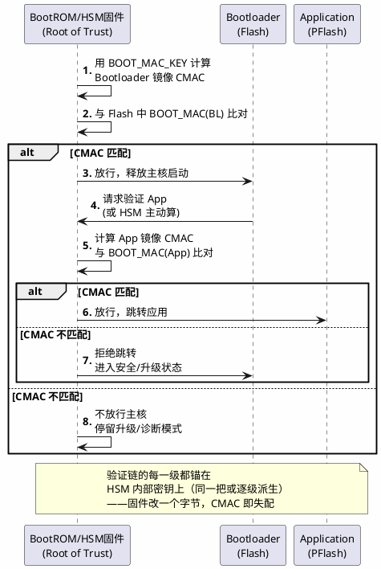

# TC377-HSM

> 一句话定位：AURIX TC377 的片上 HSM——一个藏在主核旁边、握着全部密钥的"保险箱小核"，SHE 兼容密钥槽 + CMAC 自举 + 安全启动链条，SecOC 的密钥最终都锁在这里。
> 等级：L2→L3 ｜ 前置：[从一个刹车失灵的故事说起——功能安全全景](../../00-入门导读/01-从一个刹车失灵的故事说起-功能安全全景.md)、[SecOC/02-配置要点](../../2-L2进阶/SecOC/02-配置要点.md)

## 太长不看

- HSM 的动机一句话：**密钥放 Flash/RAM 明文 = 钥匙挂在门上**——调试口一开、固件一 dump，SecOC 的 CMAC 就形同虚设，所以密钥必须锁进"软件读不出来、只能喂算式"的硬件隔离域。
- TC377 的 HSM 是独立的精简 TriCore 内核 + 专用 SRAM/ROM，跑自己的固件（如 She+），与主核通过邮箱/共享内存协作；主核只发"用几号槽算 CMAC"的请求，永远拿不到密钥本体。
- SHE 规范给出固定 10 个密钥槽 + RAM_KEY + BOOT_MAC_KEY 的极简模型，安全启动用"逐级 CMAC 验证链"实现：Root of Trust 是 HSM 里永不出门的 BOOT_MAC_KEY。
- EVITA Light/Medium/Full 是能力分级：Light≈SHE（纯对称），Full 带非对称硬件加速（RSA/ECC，V2X 场景）。

### 工程深入场景

TC377 上做安全启动联调时的经典卡点：HSM 固件烧录与版本、BOOT_MAC 与 App 镜像不匹配（App 每次重编译都要重算 CMAC 更新 BOOT_MAC 或在开发阶段关闭 BOOT_MAC 检查）、DAP 调试口开关与 DEBUG_PROT 属性联动。产线与实验室环境的 HSM 配置差异必须做成两套显式 profile，禁止"手工改一次忘了改回来"。

## 核心概念

安全启动的验证链——信任根是 HSM 内部密钥，逐级 CMAC 验证，任何一级失败即拒绝执行：

## 详解

### 1. 为什么密钥不能放 Flash/RAM 明文

[SecOC 配置](../../2-L2进阶/SecOC/02-配置要点.md)里说过，SecOC 的安全性全部押在"密钥只有合法双方知道"上。如果密钥以明文躺在 Flash：①调试口（TC377 的 DAP、S32K 的 JTAG/SWD）一开，PC 上一个工具就能整片读出；②任何软件漏洞导致的内存读越界都可能把密钥带进日志/CAN 报文；③售后件、拆车件上的密钥可以被提取后批量伪造报文——攻破一辆等于攻破一个车型。HSM 的解法是物理隔离 + 权限边界：密钥存在只有 HSM 内核能访问的存储里，对外只暴露"运算服务"（算 CMAC/加密/解密），密钥本体没有读出通道。这与 [Lockstep](../../../02-芯片与体系结构/3-L3高级/TriCore架构/05-Lockstep安全机制.md) 的思路同源——**不信任"单一防线"，把关键资产的暴露面物理性砍掉**。

### 2. SHE：极简主义的安全模块模型

SHE（Secure Hardware Extension，HIS 规范）定义了一个最小可用的安全模块接口，理解它就理解了所有汽车安全引擎的骨架：

- **固定 10 个密钥槽（KEY_1~KEY_10）**：槽位号即身份，固件无需解析密钥结构；每个槽带属性位——`WRITE_PROT`（不可覆盖）、`BOOT_PROT`（参与启动保护）、`DEBUG_PROT`（调试口关联）、`KEY_UPDATE`（允许 Key Update 协议更新）。
- **特殊密钥**：`SECRET_MASTER_ECU`（主密钥，永远不可读，Key Update 的保护根）、`SECRET_BOOT_MAC_KEY`（安全启动专用）、`RAM_KEY`（仅存在于 RAM、掉电即失——适合会话密钥）。
- **CMAC 自举**：模块对外的信任表达全部用 AES-CMAC——验固件、保护密钥更新（M1~M5 报文组）、SecOC 报文认证，一套原语打天下。
- **Key Update 协议**：换密钥不用把新密钥明文发上总线——M1(目标槽+计数) + M2(用主密钥 CMAC 保护的新密钥) + M3(新 BOOT_MAC 及其保护)，五段报文原子完成，这就是"CMAC 自举"的含义：主密钥保护一切，包括密钥的分发。

### 3. HSM 与 EVITA 分级：从"够用"到"全能"

EVITA 项目把硬件安全模块按能力分成三档（外加强防护的扩展档），选型时对号入座：

| 档位 | 密码能力 | 安全启动 | 典型场景 |
|---|---|---|---|
| Light | 对称 AES-128（CMAC/加解密） | CMAC 验证 | 车控 ECU：SecOC、安全 onboard 通信（≈SHE） |
| Medium | 对称 + HASH 加速，非对称软件算 | CMAC 验证 | 网关、域控：海量报文认证、固件校验 |
| Full | 对称 + HASH + **非对称硬件加速**（RSA/ECC 级） | 可做非对称验签 | V2X、云认证、OTA 验签 |

直觉：Light 解决"报文别被伪造"（对称够用）；Full 解决"和陌生人对端互信"（非对称必需）。TC377 的 HSM 硬件特性对应 EVITA Medium~Full 档（含非对称+对称加速，具体覆盖以型号 DS/安全手册为准），固件方案可从 She+（SHE 兼容超集）起步往上做——S32K 的 CSEc 则停在 SHE/Light 档，对比见 [下一篇](02-S32K-CSEc.md)。

### 4. TC377 HSM 的架构直觉

把 TC377 想成"大楼里有一间独立的保险库办公室"：

- **独立 TriCore 内核**（HSM 专用，非 Lockstep 主核），有自己的时钟、中断、专用 SRAM（HSM 独占，主核默认无权访问）与 ROM——这就是"办公室"。
- **固件（She+ / EVITA Medium~Full 类）**：办公室里的"管理员"，实现 SHE 命令集与扩展服务；固件本身受保护，是信任链的上游。
- **邮箱/共享内存**：主核与 HSM 的唯一沟通窗口——主核把"请用 KEY_5 算这段数据的 CMAC"的请求与数据放邮箱，HSM 算完把结果放回去。密钥在办公室内部使用，从不越过窗口。
- **DMA 式访问**：HSM 可按授权直接读主核内存/PFlash 上的数据区算 CMAC——所以安全启动时 App 镜像不用搬运，HSM 直接对着 PFlash 算。
- **调试口管控**：DAP 对 HSM 域的访问受密钥槽 DEBUG_PROT 属性与生命周期状态约束——量产件的 HSM 域对调试器是黑洞。

### 5. 安全启动链条：每一级都锚在 HSM 密钥上

核心概念图就是完整流程，补三条工程要点：①**BOOT_MAC 与镜像绑定**——App 每次构建都要重算 CMAC 回填 BOOT_MAC（产线由 HSM 用 BOOT_MAC_KEY 现算现写，实验室用开发工具），忘了回填=启动即拒；②**逐级验证的顺序性**——先 BL 后 App，BL 可在验签通过前只开放最小外设（防"边启动边攻击"）；③**失败路径要产品化**——验证失败不是死机了事，要进入定义好的升级/诊断模式（否则 OTA 永远救不回一块砖）。

## 易错点与陷阱

1. **现象：App 重编译后 ECU 拒绝启动，串口无输出。** 原因：镜像变了但 BOOT_MAC 还是旧值，CMAC 失配。对策：开发流程里把"烧录后重算 BOOT_MAC"做成脚本一步完成；开发态可配 DEBUG_PROT/跳过策略，但量产 profile 必须恢复强校验。
2. **现象：调试器一断开 HSM 服务就超时，系统随机挂死。** 原因：调试器 halt 了 HSM 核而主核还在等邮箱应答。对策：多核调试配置里把 HSM 核加入同步运行组，或调试策略里明确"HSM 不停机"；启动代码对 HSM 未就绪要有超时与降级路径。
3. **现象：密钥槽用错号，SecOC 校验双方各自都对却对不上。** 原因：KEY_x 槽位映射双侧不一致（一个 ECU 用 KEY_3 另一个用 KEY_5）。对策：密钥槽分配表进接口基线文档，与 SecOC Key ID 映射一起评审。
4. **现象：RAM_KEY 掉电后 SecOC 全挂，重启又好了。** 原因：会话密钥放在 RAM_KEY 里但没做掉电重建逻辑。对策：RAM_KEY 只存"可重建"的会话密钥，上电初始化序列里重新派生注入。
5. **现象：产线烧写的 ECU 密钥与样件不同，联调环境 SecOC 互认失败。** 原因：产线密钥注入与开发密钥两套体系没对表。对策：密钥体系（车族主密钥→ECU 派生）在 TARA 里整体设计，联调台架显式登记每块板的密钥域。
6. **现象：HSM 固件升级后主核服务调用全部返回错误码。** 原因：HSM 固件与主核驱动（Crypto 层接口）版本不匹配。对策：HSM 固件版本与 BSW 加密栈版本做兼容性矩阵管理，升级走双侧同步变更。

## 面试高频题

**Q：为什么密钥必须放在 HSM/SHE 里，Flash 加密存储不行吗？**
答：Flash 里的"加密密钥"仍需要另一把密钥解密，问题只是被推了一层；且调试口打开后整片 Flash 可读，软件实现的解密过程密钥必然在主核 RAM 中暴露。HSM 用硬件隔离把暴露面砍到零：密钥只在 HSM 内部存储与运算，对外只有运算服务没有读出通道，即使主核被完全攻破，密钥依然安全。

**Q：SHE 和 HSM 是什么关系？**
答：SHE 是 HIS 组织定义的安全模块接口规范（固定 10 密钥槽、AES-CMAC 自举、Key Update 协议、安全启动），偏"最小可用"；HSM 是更广义的硬件安全模块概念，能力上限更高（EVITA Medium/Full 支持非对称加速）。可以说 SHE 是 HSM 的一个标准化子集/档位（≈EVITA Light）。TC377 的 HSM 固件实现 She+（SHE 兼容超集），S32K 的 CSEc 则是直接的 SHE 硬件实现。

**Q：安全启动为什么多用 CMAC 而不是非对称签名？**
答：CMAC（对称）验证速度远快于 RSA/ECC 验签，且密钥不出 HSM、验证链自包含，满足启动毫秒级时序要求；非对称签名的优势是"公钥可公开分发"——适合 OTA 云端对车这种不共享密钥的场景。所以常见组合：本地启动链用 CMAC（快），OTA/云端交互用非对称验签（信任域不同）。

**Q：EVITA Light/Medium/Full 怎么选型？**
答：按信任域和算力需求：纯车内 SecOC 报文认证、固件校验，对称 CMAC 够用 → Light（SHE 级）；网关/域控海量认证要吞吐 → Medium；涉及 V2X、云端双向认证、OTA 非对称验签 → Full。原则是够用即可——Full 的非对称引擎和配套软件成本、功耗都更高，全车 Full 是浪费。

## 延伸

- [S32K-CSEc](02-S32K-CSEc.md)：另一平台的 SHE 实现，双平台对比表
- [SecOC/01-CMAC与新鲜度](../../2-L2进阶/SecOC/01-CMAC与新鲜度.md)：HSM 里密钥服务的最大客户
- [07 区 Csm-CryIf-Crypto](../../../07-AUTOSAR架构/3-L3高级/加密栈/01-Csm-CryIf-Crypto.md)：主核侧如何调用 HSM 的密钥服务
- [TC1.6P 内核概览](../../../02-芯片与体系结构/3-L3高级/TriCore架构/01-TC1.6P内核概览.md)：HSM 内核与主核同宗同源
- [Lockstep 安全机制](../../../02-芯片与体系结构/3-L3高级/TriCore架构/05-Lockstep安全机制.md)：同为"砍掉单一信任防线"的芯片级设计哲学
