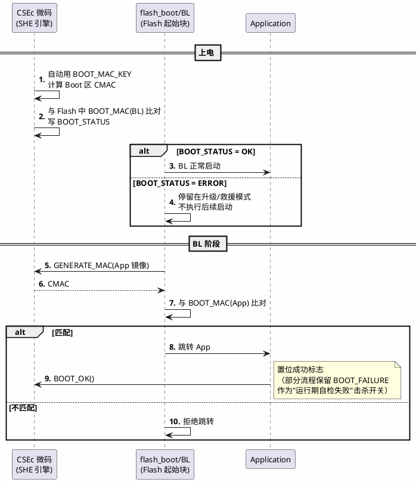

# S32K-CSEc

> 一句话定位：S32K1xx 上的 CSEc——SHE 规范的"官方硬件实现"，固定微码、10 个密钥槽、CMAC 安全启动，够 SecOC 用但没有非对称引擎，与 TC377 HSM 一高一低正好凑成双平台对照组。
> 等级：L2→L3 ｜ 前置：[TC377-HSM](01-TC377-HSM.md)

## 太长不看

- CSEc（Cryptographic Services Engine compact）是 NXP 在 S32K1xx 里对 SHE 1.1 规范的直接硬化：固定微码（不可升级）、AES-128 对称运算、10 个 Flash 密钥槽 + RAM_KEY + BOOT_MAC——能力档位约 EVITA Light。
- 安全启动走 SHE Boot 流程：上电 CSEc 自动校验 Boot 区 CMAC → BL 验 App 的 BOOT_MAC → App 调 BOOT_OK 解锁"击杀开关"；与 TC377 HSM 的"独立核+可升级固件"是两种产品哲学。
- CSEc 没有独立 CPU，命令通过专属 RAM 邮箱投递、由微码引擎执行——够轻够省，但吞吐与非对称能力封顶；S32K3 已升级为 HSE（更强的硬件安全引擎）。
- 对工程师最重要的三件事：RAM_KEY 掉电即失、FLASH 密钥区与程序 Flash 的烧写边界、BOOT_MAC 与镜像绑定（重编译必须重算）。

### 工程深入场景

S32K 量产线的密钥注入流程：空白片经产线工装用 LOAD_KEY 命令注入 OEM 密钥域（M1~M5，由 MASTER ECU KEY 保护），随后计算并写入 BOOT_MAC；样件与产线件密钥域不同，SecOC 联调前必须核对"这块板属于哪个密钥域"。刷机工具若对 Flash 做 mass erase，密钥区属性与 BOOT_MAC 状态一并被重置——产线返工程序里要显式处理。

## 核心概念

SHE Boot 安全启动流程——CSEc 上电自动校验、BL 校验 App、App 报 BOOT_OK 的三段式：

## 详解

### 1. CSEc 在双平台坐标系里的位置

上一篇建立了 EVITA 分级与 SHE 模型，CSEc 就是"SHE 规范照着做"的那类实现：**AES-128 对称 + CMAC 自举 + 固定 10 密钥槽**，无非对称硬件、无 HASH 加速，定位约 EVITA Light（吞吐上够单 ECU 的 SecOC 与启动校验，撑不起网关级海量认证）。与 TC377 HSM 的对照（选型/移植时直接抄）：

| 维度 | TC377 HSM | S32K1xx CSEc |
|---|---|---|
| 形态 | 独立 TriCore 内核 + 专用 SRAM/ROM + 固件 | 无独立 CPU，固定微码引擎 + 专属 RAM 邮箱 |
| 密码能力 | 视固件：She+~EVITA Full（可含 RSA/ECC） | AES-128（ECB/CBC/CMAC），非对称无 |
| 固件 | 可随软件体系升级（版本要与 Crypto 栈配对） | 微码固化，不可升级 |
| 密钥保护 | HSM 域硬件隔离，调试器黑洞 | 密钥区受属性位保护，调试认证/擦除联动 |
| 安全启动 | HSM 逐级算 CMAC，链式放行 | SHE Boot 三段式（核心概念图） |
| 适合场景 | 域控/网关/V2X/OTA 验签 | 节点 ECU：SecOC、SHE 启动、密钥存储 |

一句话选型直觉：**要"够用的保险箱"选 CSEc，要"保险箱+代办处"（非对称、可扩展服务）选 HSM**。S32K3 用 HSE 替代 CSEc（独立核、非对称、EVITA Medium+），正是 NXP 补上这一档的结果。

### 2. CSEc 的密钥体系与命令面

SHE 模型照单全收：`KEY_1~KEY_10`（Flash 槽，带 WRITE_PROT/BOOT_PROT/DEBUG_PROT/KEY_UPDATE 属性位）、`RAM_KEY`（掉电即失）、`SECRET_BOOT_MAC_KEY`（启动专用）、`SECRET_MASTER_ECU`（Key Update 的根）。命令通过写 CSEc 专属 RAM 的命令块+中断/轮询完成，高频命令：

- **GENERATE_MAC / VERIFY_MAC**：SecOC CMAC 的底层原语，主核经 Crypto 驱动（S32K SDK 的 csec 驱动）调用。
- **LOAD_KEY（M1~M5）/ LOAD_PLAIN_KEY**：产线与密钥域管理；PLAIN_KEY 仅开发用，量产件禁用。
- **GENERATE_RND / EXTEND_SEED**：随机数与会话密钥派生（RAM_KEY 常由此建立）。
- **BOOT_OK / BOOT_FAILURE**：SHE Boot 流程的收尾命令。
- **DEBUG_CHALLENGE / DEBUG_AUTHORIZATION**：调试口认证——量产件调试口默认锁，凭 CSEc 挑战-应答解锁。

### 3. 安全启动的工程细节

比 TC377 篇多两件 S32K 特有的事：①**flash_boot 的选择**——S32K 上电先跑 Flash 起始地址的 flash_boot（哪怕只有几 KB），它负责把控制权交给 BL 并触发 CSEc 的 Boot 校验状态机，配置时 Boot 块大小与 BOOT_MAC 覆盖范围必须一致；②**BOOT_OK 的击杀开关语义**——BL/App 若在运行期检测到严重篡改，可调 BOOT_FAILURE 让下次启动拒绝放行，这把"启动时校验"延伸成"运行期可信状态"。其余同理：App 重编译必须重算 BOOT_MAC，校验失败路径要产品化（升级模式）。

### 4. 与 SecOC 栈的衔接

CSEc 本身只是引擎，AUTOSAR 视角下主核侧还是那条链：`SecOC → Csm → CryIf → Crypto(S32K Crypto Driver) → csec 命令`。Crypto 驱动把 CMAC 作业翻成 CSEc 命令块，密钥槽映射（SecOC Key ID → KEY_x）在配置里对齐——这层的模块配置细节在 [07 区加密栈](../../../07-AUTOSAR架构/3-L3高级/加密栈/01-Csm-CryIf-Crypto.md)，跨平台移植时 SecOC/Com 配置不动，只换 Crypto 驱动与槽位表。

## 易错点与陷阱

1. **现象：掉电重启后 SecOC 报 Key 未初始化。** 原因：会话密钥放在 RAM_KEY，掉电即失，上电没有重建流程。对策：上电序列里用 GENERATE_RND/EXTEND_SEED 重新派生注入 RAM_KEY，或干脆把长期密钥放 FLASH 槽。
2. **现象：mass erase 刷机后 ECU "失忆"，BOOT_MAC 与密钥域全乱。** 原因：密钥区与 BOOT_MAC 跟随 Flash 擦除/解锁序列被重置。对策：刷机工具与产线返工程序显式管理密钥域状态，刷机后按密钥域重新注入+重算 BOOT_MAC。
3. **现象：量产件上调试器连不上，也无法进入 SHE Boot 升级模式。** 原因：DEBUG_PROT 属性把调试口与密钥绑定，量产生命周期下默认锁死。对策：量产调试走 DEBUG_CHALLENGE/AUTH 认证通道，产线工装持有应答密钥；开发件用独立生命周期配置。
4. **现象：BOOT_MAC 校验偶尔通过偶尔失败。** 原因：App 镜像边界（校验覆盖长度）与链接脚本/OTA 双分区布局不一致，算 CMAC 的范围和写 BOOT_MAC 的范围差了几 KB。对策：镜像描述符（起始+长度）单一来源，构建脚本、BL、产线工具共用同一份。
5. **现象：CSEc 命令偶发超时，总线高负载时更明显。** 原因：CSEc 无独立 CPU，命令执行与主核共享总线带宽，Flash 高压写入/PFlash 读挤占通道。对策：CMAC 作业避开 Flash 写窗口；SecOC 发送任务对 CSEc 延迟做实测预算（参考 [SecOC 配置要点](../../2-L2进阶/SecOC/02-配置要点.md)时序一节）。
6. **现象：KEY_UPDATE 换钥后部分 ECU 起新钥旧钥混用，SecOC 间歇失败。** 原因：换钥窗口内收发双方不同步，报文用旧钥算的 MAC 撞上已更新的接收槽。对策：密钥轮换协议设计成"双槽过渡"（新旧槽并存 N 个周期再弃旧），并让 SecOC 失败计数器可观测以确认收敛。

## 面试高频题

**Q：CSEc 和 SHE、HSM 是什么关系？**
答：SHE 是 HIS 的安全模块接口规范（10 密钥槽、CMAC 自举、Key Update、安全启动）；CSEc 是 NXP S32K1xx 对该规范的硬件实现，能力≈EVITA Light（纯 AES-128 对称）；HSM 是更广义、更强的硬件安全模块（独立 CPU、可含非对称加速，如 TC377 HSM 可到 EVITA Full）。三者关系：SHE 是规范，CSEc 是它的轻量硬件实例，HSM 是能力上限更高的通用形态。

**Q：S32K 的安全启动流程是怎样的？**
答：三段式 SHE Boot：上电 CSEc 自动用 BOOT_MAC_KEY 计算 Boot 区 CMAC 并与 Flash 中的 BOOT_MAC 比对，写 BOOT_STATUS；通过则 BL 启动，BL 调 GENERATE_MAC 校验 App 的 BOOT_MAC，匹配才跳转；App 运行后调 BOOT_OK 确认成功（BOOT_FAILURE 可作为运行期击杀开关）。信任根是永不外泄的 BOOT_MAC_KEY，镜像改一个字节 CMAC 即失配。

**Q：TC377 HSM 和 S32K CSEc 怎么选型/移植要注意什么？**
答：能力上 CSEc 停在 SHE/Light（对称、微码固化），TC377 HSM 视固件可到 EVITA Full（非对称、固件可升级）——域控/网关/V2X 选 HSM，节点 ECU 的 SecOC 与启动保护 CSEc 够用。移植时 SecOC/Com/Csm 配置基本不动，替换的是 Crypto 驱动与密钥槽映射；要重点核对两平台的密钥属性语义差异与 CMAC 作业延迟预算。

**Q：RAM_KEY 和 FLASH 密钥槽各适合放什么？**
答：FLASH 槽（KEY_1~10）持久保存，适合 SecOC 长期密钥、启动密钥，受属性位保护；RAM_KEY 掉电即失，适合会话密钥/临时派生密钥——配合 GENERATE_RND/EXTEND_SEED 每次上电重建，天然抗"拆机提取"。不要把长期密钥只放 RAM_KEY（掉电丢失导致启动失败），也不要把高价值长期密钥频繁经 LOAD_PLAIN_KEY 装载（明文装载通道量产件应禁用）。

## 延伸

- [TC377-HSM](01-TC377-HSM.md)：双平台对照组的另一半，EVITA 分级与 HSM 架构直觉
- [SecOC/02-配置要点](../../2-L2进阶/SecOC/02-配置要点.md)：CSEc 服务的最大客户，密钥槽映射与失败处理
- [07 区 Csm-CryIf-Crypto](../../../07-AUTOSAR架构/3-L3高级/加密栈/01-Csm-CryIf-Crypto.md)：Crypto 驱动如何把作业翻成 CSEc 命令
- [07 区 SecOC 配置](../../../07-AUTOSAR架构/3-L3高级/加密栈/02-SecOC配置.md)：跨平台时"不动的那层"配置长什么样
- [从一个刹车失灵的故事说起——功能安全全景](../../00-入门导读/01-从一个刹车失灵的故事说起-功能安全全景.md)：Security 支柱为什么从这儿长出来
