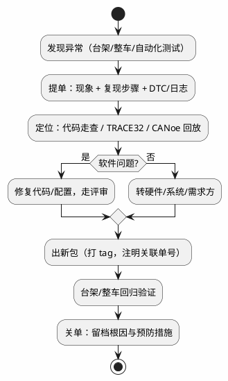

# 一个 ECU 项目的一生——实战全景

> 一句话定位：从 RFQ 到 SOP 把一个 ECU 项目按时间线完整走一遍，看清每个阶段软件工程师在干什么、交付什么，以及每一步背后对应知识库哪个区——为整个 12 区（也是全库）建立项目坐标。
> 等级：L1 ｜ 前置：无

## 0. 开场：一块 ECU 是怎么"生"出来的

前面 01~11 区拆开讲了每一门手艺：C 语言、MCU、MCAL、总线、诊断、AUTOSAR、OS、调试、工具链、安全。但真实工作里没有一门手艺是孤立用的——你入职接到的第一个任务往往是："下周 A 样件要交付，把 CAN 通讯矩阵更新到 2.3 版，刷写失败的 3 个问题单今天闭环。"——这一句话里藏着矩阵（05 区）、A 样件（本文）、问题单（本文）、刷写（06 区）。

所以 12 区干一件事：**把全库知识按"项目时间线"重新串一遍**。你将看到每门手艺在项目哪个阶段登场、以什么形式交付（ARXML？代码？测试报告？问题单？）。读完这篇，你去看任何一家 Tier1 项目的排期表，都能对号入座。

一个车身域 ECU 项目，从 OEM 询价到量产，典型要 24~36 个月。软件工程师的活儿集中在中间 12~18 个月，但头尾两段决定了你写代码时"戴没戴镣铐"。

## 1. 全景时间线：RFQ → SOP

```plantuml
@startuml
skinparam backgroundColor #FEFEFE
skinparam defaultFontSize 13
concise "整车" as V
concise "软件" as S

@0
V is RFQ/定点
@1
V is 需求冻结
S is 启动
@2
V is 架构评审
S is BSW配置
@3
V is {A样}
S is CDD开发
@4
V is {B样}
S is 集成测试
@5
V is {C样/PPAP}
S is 台架联调
@6
V is 整车验证
S is 问题闭环
@7
V is SOP量产
S is 维护期

@1 <-> @2 : 概念阶段\n(需求/架构)
@2 <-> @5 : 开发阶段\n(配置/编码/测试)
@5 <-> @7 : 验证与量产\n(联调/闭环/SOP)
@enduml
```

三段各自的"主旋律"：

| 阶段 | 时间占比 | 软件工程师在干嘛 | 交付物 |
|---|---|---|---|
| 概念（RFQ→架构） | ~20% | 读需求、拆软件需求、选芯片定架构 | 软件需求规范、架构文档 |
| 开发（A/B 样） | ~50% | Tresos/DaVinci 配 BSW、写 CDD、单元/集成测试 | 可刷写软件包、测试报告 |
| 验证量产（C 样→SOP） | ~30% | 台架联调、整车跟着跑、问题单闭环 | 问题单关闭记录、量产放行 |

样件节奏是项目的"心跳"：A 样功能跑通即可、B 样凑齐全功能+初步诊断、C 样软硬件冻结只改 bug——每次样件交付前两周，通常是加班高峰。

## 2. 逐站拆解：每一站干什么、回链哪个区

### 站 1：RFQ 与需求输入（项目还没立项）

OEM 发来询价：功能清单（车窗、座椅、氛围灯……）、网络架构图（挂在哪条 CAN/LIN 上）、ASIL 等级、成本盒子和时间节点。供应商报价、定点。这一步工程师基本不参与，但**需求文档的每一行将来都会变成你的代码或测试用例**。

- 你需要的能力：看得懂整车功能拆解、通讯矩阵初稿。→ [05 区通讯导读](../../05-汽车网络通讯/00-入门导读/01-从一帧CAN报文说起-车载网络全景.md)、[11 区功能安全导读](../../11-功能安全与信息安全/00-入门导读/01-从一个刹车失灵的故事说起-功能安全全景.md)（ASIL 定级从哪来）。

### 站 2：需求分析与管理（DOORS/Jira 建链）

定点后，系统工程师把整车需求拆成 ECU 级需求，导入 DOORS；功能安全需求（ASIL 项）单独成链。软件负责人再拆成软件需求，每条带编号（如 `SWREQ-CAN-012`），建立双向追溯：整车需求 ← ECU 需求 ← 软件需求 ← 代码 ← 测试用例。Jira 管任务与缺陷，DOORS 管需求——两边的链路在评审时要拿得出来。

- 你需要的能力：把"氛围灯随车速变色"这种功能语言翻译成"周期 100ms 收报文 X、解析信号 Y、PWM 占空比插值输出"。→ [08 区状态机](../../08-操作系统/1-L1基础/裸机与状态机编程/03-事件驱动状态机.md)、[01 区 C 语言功底](../../01-编程语言/00-入门导读/01-C功底自检与爬坡图.md)。

### 站 3：架构设计（定"城的分区"）

选芯片（TC377 还是 S32K？资源、安全等级、成本三角权衡）、画软件分层图、定义 SWC 边界、分核（哪核跑应用哪核跑通讯）、定 NvM 块、定诊断 DID 清单。AUTOSAR 方法论下，这一步产出 ECU 配置的骨架（ECUC ARXML）。

- 你需要的能力：分层架构、RTE 端口、SWC 划分。→ [07 区架构导读](../../07-AUTOSAR架构/00-入门导读/01-AUTOSAR第一课-一座城的分区图.md)、[方法论与 ARXML](../../07-AUTOSAR架构/2-L2进阶/方法论与ARXML/01-ECU配置结构.md)、选型看 [02 区导读](../../02-芯片与体系结构/00-入门导读/01-从零认识一颗MCU.md)。

### 站 4：BSW 配置（Tresos/DaVinci 的日常）

架构定了，开始用 EB tresos（TC377 项目常见）或 DaVinci Configurator 把 BSW 配出来：MCAL（Port/Adc/Pwm/Can…）、通讯栈（Com/PduR/CanIf/CanSM/Nm）、内存栈（NvM/Fee/Fls）、诊断（Dcm/Dem）、EcuM 上下电时序、Os 任务与调度表。配置一次生成几千行代码，配置工程师的核心竞争力是**知道每个参数牵动什么行为**。

- 你需要的能力：MCAL 配置、通讯栈 PDU 路由、EcuM 时序。→ [04 区 MCAL 导读](../../04-MCAL与外设驱动/00-入门导读/01-MCAL第一课-从点灯到分层驱动.md)、[10 区 EB tresos](../../10-工具链与工程化/2-L2进阶/AUTOSAR配置工具/02-EB-tresos.md)、[EcuM 上下电时序](../../07-AUTOSAR架构/2-L2进阶/系统服务栈/EcuM/02-上下电时序.md)。

### 站 5：CDD 与应用开发（写自己的代码）

BSW 覆盖不到的（专有芯片驱动、复杂传感算法）写 CDD，挂在 OS 任务里跑；应用逻辑写成 SWC 或裸 C 模块。这一阶段同时定 Git 分支策略：`develop` 日常提交、样件交付拉 `release/A1` 分支打 tag——A/B 样件包永远可追溯。

- 你需要的能力：CDD 定位与 OS 集成、MISRA-C 合规。→ [04 区 CDD 方法论](../../04-MCAL与外设驱动/2-L2进阶/CDD设计方法论/01-CDD定位与边界.md)、[01 区 MISRA-C](../../01-编程语言/2-L2进阶/代码规范与MISRA-C/03-高频违规条目解析.md)、[10 区分支策略](../../10-工具链与工程化/1-L1基础/Git与版本管理/02-分支策略.md)。

### 站 6：单元测试与集成测试

A 样前后：CDD/应用模块过单元测试（Tessy/Unity，覆盖率有要求，ASIL 项更严），然后集成——烧进板子，CANoe 发矩阵报文、验 Com 信号路由、验 Dcm 诊断响应、跑 EcuM 上下电。集成测试用例直接追溯到软件需求编号。

- 你需要的能力：单元测试框架、CANoe 仿真。→ [09 区 Tessy](../../09-调试与测试/2-L2进阶/单元测试与自动化/03-Tessy.md)、[09 区 CANoe](../../09-调试与测试/2-L2进阶/总线工具/01-CANoe.md)、[06 区诊断导读](../../06-诊断与标定/00-入门导读/01-从诊断仪的一次连接说起-诊断全景.md)。

### 站 7：台架与整车联调（B/C 样）

B 样起进台架：与真实传感器执行器对接、CAN/LIN 与其他 ECU 同台、跑睡眠唤醒电流测试。C 样跟整车：冬标夏标（零下 40° 吐鲁番 50°）、EMC、耐久路试。软件工程师的日常变成：白天跟车/跟台架，晚上改 bug 出新包，问题单（Jira）当天必须响应。凌晨两点被电话叫醒"车趴窝了 DTC 是 XXX"，去读 [09 区调试方法论](../../09-调试与测试/3-L3高级/调试方法论/01-复位溯源.md) 的时刻就在这里。

- 你需要的能力：总线排障、DTC 分析、低功耗排查。→ [05 区 busoff 排查](../../05-汽车网络通讯/1-L1基础/CAN/总线错误与恢复/03-排障实录.md)、[09 区调试导读](../../09-调试与测试/00-入门导读/01-从一个坏掉的ECU说起-调试全景.md)。

### 站 8：SOP 与量产维护

PPAP 放行、产线爬坡、SOP。软件进入维护期：只改售后反馈的 bug、8D 报告、偶尔小改款。此时最值钱的资产是**配置基线与问题单库**——下次新项目，这些就是起点。

## 3. 一条"问题单"的一生（项目节奏的微缩样本)

问题单（Issue/Defect）是贯穿站 5~站 8 的工作流单位：发现（台架/整车/测试）→ 提单（现象+复现步骤+DTC/日志）→ 定位（读代码/TRACE32/CANoe 回放）→ 修复（改代码或改配置）→ 出包验证 → 关单。一个成熟项目里，你会同时背着 10~30 张单子，每天站会同步。**"闭环"是关键词：改了什么、影响哪些需求、哪个软件包验证、谁批准**——这套纪律与 [09 区一坑一档模板](../../09-调试与测试/2-L2进阶/踩坑案例库/00-一坑一档模板.md) 一脉相承。



## 4. 本区地图（怎么分带）

| 带 | 装什么 | 对应问题 |
|---|---|---|
| [1-L1基础](../1-L1基础/README.md) | 练手项目 | 第一次动手：点灯→PWM+ADC→CAN→LIN，按难度递增 |
| [2-L2进阶](../2-L2进阶/README.md) | S32K工程模板、TC377工程模板 | 一个像样的工程骨架长什么样、怎么搭 |
| [3-L3高级](../3-L3高级/README.md) | 项目复盘 | 做完项目怎么沉淀成可复用资产 |

## 5. 下一步读什么

1. [1-L1基础/练手项目](../1-L1基础/练手项目/README.md)：从 [01-MCAL点灯](../1-L1基础/练手项目/01-MCAL点灯.md) 开始亲手跑通第一个 AUTOSAR 工程；
2. [2-L2进阶/S32K工程模板](../2-L2进阶/S32K工程模板/README.md) 与 [TC377工程模板](../2-L2进阶/TC377工程模板/README.md)：把练手的散件组织成可交付的工程骨架（对应站 4~站 5）；
3. [3-L3高级/项目复盘](../3-L3高级/项目复盘/README.md)：用复盘模板把站 2~站 7 的产出沉淀为个人资产；
4. 想补时间线上某一站的深水区：站 3→[07 区](../../07-AUTOSAR架构/README.md)，站 4→[10 区配置工具](../../10-工具链与工程化/2-L2进阶/AUTOSAR配置工具/02-EB-tresos.md)，站 7→[09 区调试方法论](../../09-调试与测试/3-L3高级/调试方法论/02-Trap-HardFault定位.md)。

---

维护约定：笔记命名 `序号-主题.md`；真实截图放 `_images/`；流程/时序/状态/架构图用 PlantUML 内嵌正文，规范见 [图表规范与模板](../../00-总览/图表规范与模板.md)。
