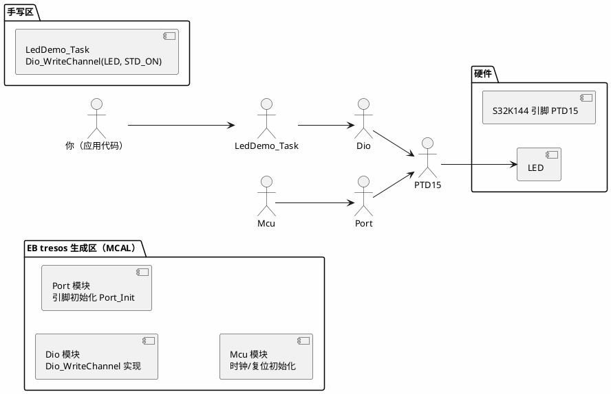

# 练手项目 01：MCAL 点灯——跑通第一个 AUTOSAR 工程

> 一句话定位：以 S32K144 + EB tresos（MCAL）+ S32DS 为例，从零配置 Port/Dio、生成代码、建任务、编译烧录到看见 LED 心跳闪烁——把"配置→生成→集成→验证"这条最小闭环亲手走通。
> 等级：L1 ｜ 前置：[一个ECU项目的一生-实战全景](../../00-入门导读/01-一个ECU项目的一生-实战全景.md)

## 1. 核心概念：点灯为什么值得做成第一个项目

嵌入式世界的"Hello World"就是点灯，但在 AUTOSAR 工程里点灯不是一句 `PTx->PDOR |= ...`，而是走完一条分层调用链：应用代码调 `Dio_WriteChannel()`，Dio 模块操作 Port 引脚，而引脚的方向/上下拉/复用早在 Port 配置里生成好了。点灯虽小，五脏俱全——它逼你第一次面对配置工具、生成代码、手写代码三者的交界，这正是导读里"站 4（BSW 配置）+站 5（应用开发）"的最小样本。

记住这条铁律：**生成区只读、手写区自由**——所有业务代码（哪怕是点灯）都放应用层，通过 MCAL 标准接口摸硬件，这是后面所有练手项目的地基。

## 2. 详解：五步走通

**第一步：建 MCAL 配置工程。** 打开 EB tresos，导入 S32K1xx MCAL 插件，新建工程 `s32k144_blink`。先配 Mcu（时钟树：SPLL 80MHz、内核时钟 40MHz——具体寄存器原理见 [Mcu 时钟初始化](../../../04-MCAL与外设驱动/2-L2进阶/Mcu模块/01-时钟初始化.md)），再配 Port：找到 LED 所在引脚（以 S32K144-EVB 板载 LED 为例，PTD15），方向 Output、初始电平 High、无上下拉。最后配 Dio：DioChannel 0 映射到 PTD15。点击 Generate，tresos 吐出一组 `.c/.h`。

**第二步：建集成工程。** 在 S32DS 里新建 Application 工程，把生成代码目录挂进编译路径（生成代码目录结构与导入顺序详见 [MCAL 配置与生成流程](../../../04-MCAL与外设驱动/1-L1基础/MCAL总览/03-配置与生成流程.md)；S32DS 工程操作见 [S32DS](../../../10-工具链与工程化/1-L1基础/IDE/02-S32DS.md)）。此时先别上 OS——练手第一版用"前后台"结构：main 里依次 `Mcu_Init → Port_Init`，主循环 `for(;;){ Dio_FlipChannel(...); 延时; }`，能最快看到灯亮，建立正反馈。

**第三步：加任务化。** 灯闪起来后立刻升级：把翻转动作放进 100ms 周期函数（第一版可以用 Gpt 通知或简单的软件定时器），让代码形态向真实项目靠拢——真实项目里没有"延时大循环"，只有被调度的任务（为什么，见 [08 区前后台系统](../../../08-操作系统/1-L1基础/裸机与状态机编程/01-前后台系统.md)）。

**第四步：编译烧录。** 链接脚本、启动文件用 RTD/芯片包自带的（启动流程深水区见 [S32K 启动代码分析](../../../01-编程语言/2-L2进阶/汇编基础/启动代码阅读/02-S32K启动代码分析.md)）。JTAG/OPENSDA 烧录，上电复位。

动手前的准备清单（缺一样都会卡半小时）：

| 物料/工具 | 用途 | 卡住的典型症状 |
|---|---|---|
| S32K144-EVB（或自制最小系统板） | 目标板 | 无板可烧，一切免谈 |
| OPENSDA/J-Link 调试器 | 烧录+断点 | 烧录报 "no target" |
| EB tresos + S32K1xx MCAL 插件 | 生成 MCAL | 建不了配置工程 |
| S32DS + S32K 编译器 | 集成编译 | 链接报架构不符 |
| 一根杜邦线+万用表 | 量引脚电平 | 灯不亮时瞎猜 |

**第五步：验收。** 现象：LED 以 1Hz 频率闪烁；进阶验收：用逻辑笔/示波器量 PTD15，确认占空比 50%、周期误差 <1%（时钟配错的灯照样闪，但周期会错——量周期就是在验时钟链）。

| 验收项 | 通过标准 | 实测 |
|---|---|---|
| LED 周期闪烁 | 约 1Hz，肉眼稳定 | （留空手记） |
| 示波器周期 | 设计值 ±1% | |
| 复位行为 | 每次复位后 3s 内开始闪 | |
| 代码分层自查 | 应用代码 0 处直写寄存器 | |

## 3. 易错点与陷阱

- **现象：灯完全不亮。原因：** Port 引脚方向配成 Input，或 DioChannel 映射的引脚号与 Port 配置不一致，或忘调 `Port_Init`。**对策：** 用调试器读 PORT_PCR 寄存器，确认 PA/MUX/PE/PS 位与配置一致；检查 `Mcu_Init` 与 `Port_Init` 调用顺序。
- **现象：灯常亮/常灭不闪。原因：** 翻转代码没被周期执行——大循环被别的阻塞代码卡住，或延时函数依赖的时钟没初始化。**对策：** 断点打在翻转语句看是否反复命中；第一版先用粗粒度软件循环自证。
- **现象：编译报 `Dio_WriteChannel` 未定义。原因：** 生成代码没加入编译，或 tresos 里 Dio 模块没勾选（生成物里根本没有 Dio）。**对策：** 检查工程 Include 路径与源文件分组；回 tresos 确认模块勾选与 Generate 输出。
- **现象：闪烁周期是设计值的一半/两倍。原因：** Mcu 时钟配置（SPLL/分频）与预期不符，任务周期计算基于错误时钟。**对策：** 读 `Mcu_GetClockFrequency` 之类的 API 自检，或示波器量周期反推；时钟链细节看 [SCG 与 PCC](../../../02-芯片与体系结构/1-L1基础/S32K平台/时钟系统/01-SCG与PCC.md)。
- **现象：改了 tresos 配置重新生成后工程编译崩了。原因：** 手写代码误改了生成区文件，重新生成时被覆盖丢失。**对策：** 生成区只读纪律；手写内容一律放应用目录，跨目录引用头文件。
- **现象：灯闪但复位后偶发不闪。原因：** 初始化顺序问题——应用先跑、`Port_Init` 后跑，上电瞬间引脚处于默认态。**对策：** 保证 EcuM/ main 里初始化顺序：Mcu→Port→Dio 使用，应用逻辑在初始化完成之后才启动。

## 4. 面试高频题

**Q：AUTOSAR 里点个灯为什么要点两层 Port 和 Dio？**

答：Port 管引脚"物理属性"（方向、复用、上下拉、驱动能力），在初始化时一次性配置好；Dio 管"逻辑读写"（置位/翻转/读电平），运行期高频调用。两者分离使运行期操作不关心引脚细节，换板子只改 Port 配置，应用代码不动——这是 MCAL 分层思想的缩影。

**Q：`Dio_WriteChannel` 和直接写 `PTD->PDOR` 有什么区别？什么时候必须用后者？**

答：Dio 接口是平台无关的标准 API，可移植、可被上层复用，且 MISRA 友好；直接写寄存器快但绑死平台。裸机小工程可以直写，AUTOSAR 工程必须走 Dio——除非在 Dio 之下（如 CanDrv 之类对时序极端敏感的驱动里），那是"寄存器层"的地盘。

**Q：你的点灯工程里，`main` 到 LED 第一次翻转之间发生了什么？**

答：复位→启动文件（拷数据段、清 BSS、配栈）→ `main`→ `Mcu_Init`（时钟）→ `Port_Init`（引脚）→ 应用循环/任务启动→ 第一次翻转。能把这条链说全，说明不是只会调 API。

**Q：为什么建议第一版用前后台，第二版立刻改任务化？**

答：前后台最快看到现象、排除环境问题（板子/烧录/时钟），建立正反馈；任务化让代码形态贴近真实项目，后续 CAN/LIN 练手都要挂在周期任务上，早改早受益。

## 5. 延伸

- [Port 配置](../../../04-MCAL与外设驱动/1-L1基础/Port与Dio/01-Port配置.md)：引脚复用与上下拉的完整参数表；
- [Dio 接口](../../../04-MCAL与外设驱动/1-L1基础/Port与Dio/02-Dio接口.md)：Channel/Port/Group 三组 API 的边界；
- [MCAL-vs-iLLD-vs-RTD](../../../04-MCAL与外设驱动/1-L1基础/MCAL总览/02-MCAL-vs-iLLD-vs-RTD.md)：S32K 上三套生态怎么选；
- 下一篇：[02-PWM与ADC](02-PWM与ADC.md)：从数字量跳到模拟量，引入周期采样与滤波。

---

维护约定：笔记命名 `序号-主题.md`；真实截图放 `_images/`；流程/时序/状态/架构图用 PlantUML 内嵌正文，规范见 [图表规范与模板](../../../00-总览/图表规范与模板.md)。
