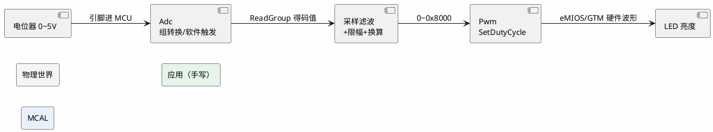

# 练手项目 02：PWM 与 ADC——旋钮调光台

> 一句话定位：用一个电位器（ADC 采样）实时调节 LED 亮度（PWM 占空比），打通"模拟量进→数字处理→模拟量出"的第一条数据链，并顺手把采样滤波与任务周期设计练扎实。
> 等级：L1 ｜ 前置：[01-MCAL点灯](01-MCAL点灯.md)

## 1. 核心概念：一条最短的"信号链"

点灯只有"输出"，这个项目补上"输入"：旋钮转动改变分压→ ADC 周期采样转成 0~4095 的码值→ 应用做滤波与限幅→ 换算成 0~10000 的占空比→ PWM 硬件自己输出方波→ LED 亮度连续变化。它是车载无数功能的骨架——油门踏板（ADC）→扭矩计算→风扇转速（PWM），本质同构，只是换成 CAN 报文做输入输出。

两个"第一次"：第一次用**硬件定时资源**输出波形（PWM 一旦启动，波形由硬件维持，CPU 不参与）；第一次处理**带噪声的采样值**（真实 ADC 读数会抖 ±20 LSB，不滤波灯就"呼吸"）。

本篇涉及的核心 API 一共四个，记住它们就拿到了 MCAL 模拟量的钥匙：`Adc_StartGroupConversion`（触发）、`Adc_ReadGroup`（取值）、`Pwm_SetDutyCycle`（占空比 0~0x8000）、`Pwm_SetPeriodAndDuty`（变周期场景）。

## 2. 详解：四步落地

**第一步：配 Adc。** EB tresos 里把电位器所在引脚配成 Analog（Port 模块），Adc 模块建一个 Group，塞入该通道，转换模式 One-Shot/Continuous 按需（练手用软件触发 + 轮询读取最直观；中断与队列模式见 [Adc MCAL 配置要点](../../../04-MCAL与外设驱动/2-L2进阶/Adc/04-MCAL配置要点.md)）。采样时间按源阻抗选大不选小，原理见 [采样时间与源阻抗](../../../03-硬件基础/2-L2进阶/模拟电路/ADC采样原理/03-采样时间与源阻抗.md)。

**第二步：配 Pwm。** 建一个 PwmChannel：周期 1kHz（人眼无频闪感）、极性、空闲态。S32K 上底层是 eMIOS/FTM（双平台细节见 [S32K eMIOS/FTM](../../../04-MCAL与外设驱动/2-L2进阶/Pwm/02-S32K-eMIOS-FTM.md) 与 [TC377 GTM](../../../04-MCAL与外设驱动/2-L2进阶/Pwm/03-TC377-GTM.md)），但应用只面对 `Pwm_SetDutyCycle(Channel, 0~0x8000)`——占空比参数是 0x0000~0x8000 的"万分比"，不是 0~100，新手最常踩。

**第三步：写应用任务。** 20ms 周期任务里做三件事：`Adc_StartGroupConversion` + `Adc_ReadGroup` 取值→滑动平均（窗口 8）+ 上下限幅→线性换算占空比 `duty = filtered << 3`（12 位 ADC 4096 级 → 0x8000=32768 级，恰好 ×8）→ `Pwm_SetDutyCycle`。换算前先做"死区"处理：码值 <50 一律输出 0，避免旋到底还有微亮。

整条数值链路换算一览（以 Vref=5V、12 位 ADC、1kHz PWM 为例）：

| 环节 | 数值示例 | 说明 |
|---|---|---|
| 旋钮位置 | 半程 | 物理输入 |
| 引脚电压 | 2.5V | 分压决定 |
| ADC 码值 | ≈2048 | 5V/4096 每档 ≈1.22mV |
| 滤波后 | 2046±3 | 滑动平均压抖动 |
| 死区判断 | 通过 | 阈值 50~4045 之间 |
| 占空比参数 | 2046<<3≈0x3FF8 | 4096 级 ×8 映射到 0~0x8000（≈50%） |
| 引脚现象 | 约 50% 亮度 | 人眼感 nonlinear |

把这个表填一遍，你对"信号链"的理解就从名词变成了数字——排障时也能按行逐段量测。

**第四步：验收。** 现象：旋钮平滑调光，两端到位（全灭/全亮）；进阶验收：调试器 watch 滤波值不抖（连续采样极差 ≤ 几个 LSB）；把 PWM 周期临时改成 5Hz 能肉眼看到闪烁，证明占空比确实在变。

| 验收项 | 通过标准 | 实测 |
|---|---|---|
| 调光平滑度 | 无肉眼跳变/呼吸感 | （留空手记） |
| 两端饱和 | 旋到底全灭、旋到顶全亮 | |
| 滤波效果 | 静止时极差 ≤5 LSB | |
| 响应延迟 | 快速拧旋钮 ≤100ms 跟上 | |

## 3. 易错点与陷阱

- **现象：亮度只有全亮全灭两档。原因：** 占空比参数直接传了 0~4095 的 ADC 码值，而接口期望 0~0x8000，小值全被当成≈0% 处理。**对策：** 换算公式补上量程映射；读 SWS 确认 `PwmDutyCycleType` 取值范围。
- **现象：LED 亮度乱跳/呼吸感。原因：** ADC 噪声未滤波直接换算；或采样与换算分属两个任务、数据无保护读到半新半旧。**对策：** 加滑动平均；采样-换算-输出放同一周期任务，天然原子。
- **现象：旋钮到底还剩微亮。原因：** 电位器端到端有残余电阻，码值到不了 0；PWM 低占空比仍有可见窄脉冲。**对策：** 应用层加死区（<阈值输出 0）+ 顶端饱和（>阈值输出 0x8000）。
- **现象：`Adc_ReadGroup` 返回值恒为 0。原因：** 忘了 `Adc_StartGroupConversion`（One-Shot 模式每次都要触发）；或 Group 未配该通道；或引脚没配成 Analog。**对策：** 按链路排查：Port Analog→Adc Group→Start→Read 顺序执行一遍。
- **现象：PWM 无输出。原因：** 时钟门控没开（外设时钟未使能）、通道 Idle 态没进入 Running、或周期寄存器配 0。**对策：** 先 `Pwm_SetOutputToIdle`/`SetOutputToActive` 自检通道是否被强制 Idle；量引脚波形从后往前倒推。
- **现象：换算后非线性（中段偏暗）。原因：** LED 亮度与占空比非线性（人眼对数感知），不是代码错。**对策：** 需要平滑手感就加伽马校正查找表；练手阶段知道原因即可。

## 4. 面试高频题

**Q：ADC 采样为什么要滤波？常用什么方法？**

答：真实信号叠加热噪声/电源纹波/量化噪声，直接用会导致输出抖动；嵌入式最常用滑动平均（窗口 N，代价 N 个变量）与一阶低通（`y += a*(x-y)`，一个变量、可调响应速度）。安全相关信号还要加范围检查与超时监控——那是 [Dem/监控](../../../07-AUTOSAR架构/2-L2进阶/系统服务栈/WdgM/01-监督实体与checkpoint.md) 的活。

**Q：PWM 占空比一改，波形什么时候生效？**

答：取决于硬件的更新机制：FTM/eMIOS/GTM 大多支持缓冲预装载——新比较值先写影子寄存器，下个周期边界才生效，避免波形出现毛刺。应用层不用操心，但要知道"改了占空比最长一个周期后才体现在引脚上"，这对控制周期设计有意义。

**Q：如果这个功能是"油门踏板"，你的设计要加什么？**

答：双通道冗余采样+互相校验（防单点失效）、范围/梯度诊断进 Dem、采样周期与滤波参数按需求时延定、断线检测（上下拉让断线读出固定值）——功能安全角度的完整拼图在 [11 区导读](../../../11-功能安全与信息安全/00-入门导读/01-从一个刹车失灵的故事说起-功能安全全景.md)。

**Q：`Adc` 的 Group 是什么概念？为什么要把通道组织成组？**

答：组是一次转换请求的单位：同组通道按配置顺序连续转换、共享触发源与通知回调，组完成触发一次中断。把"总是一起用"的通道（如同一传感器的双通道）放一组，一次触发全拿到，省调度开销——见 [Adc 原理与转换链路](../../../04-MCAL与外设驱动/2-L2进阶/Adc/01-原理与转换链路.md)。

## 5. 延伸

- [PWM 原理](../../../04-MCAL与外设驱动/2-L2进阶/Pwm/01-PWM原理.md)：频率/占空比/分辨率的三角关系；
- [S32K-ADC-BCTU](../../../04-MCAL与外设驱动/2-L2进阶/Adc/03-S32K-ADC-BCTU.md)：S32K3 的硬件队列触发，硬件化"周期采样"；
- [参考电压与精度](../../../03-硬件基础/2-L2进阶/模拟电路/ADC采样原理/02-参考电压与精度.md)：码值换算电压的基准从哪来；
- 下一篇：[03-CAN裸驱收发](03-CAN裸驱收发.md)：跳出单板，第一次跟别的节点说话。

---

维护约定：笔记命名 `序号-主题.md`；真实截图放 `_images/`；流程/时序/状态/架构图用 PlantUML 内嵌正文，规范见 [图表规范与模板](../../../00-总览/图表规范与模板.md)。
