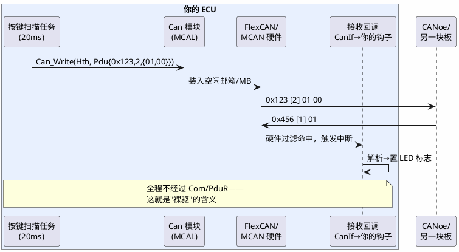

# 练手项目 03：CAN 裸驱收发——第一次跟别的节点说话

> 一句话定位：绕开 Com/PduR/CanIf 完整通讯栈，直接用 MCAL 的 Can 模块收发一帧报文——配置邮箱与过滤器、发送按键状态、中断接收点灯，体会 CanDrv 的接口契约与"总线是共享的"这件事。
> 等级：L2 ｜ 前置：[02-PWM与ADC](02-PWM与ADC.md)

## 1. 核心概念：为什么"裸驱"值得一做

真实项目里你面对的是 Com/PduR/CanIf/CanSM 一整摞，报文在栈里流转看不见摸不着。裸驱练习把这一摞暂时推开，直接站在 CanDrv 上：发一帧就是填 `Can_PduType` 调 `Can_Write`；收一帧就是在中断回调里拿到 ID+DLC+数据。走完这一遭再回头看完整栈，你会明白 CanIf 不过是给裸驱穿了制服、Com 不过是给数据加了信号打包——**先见过素颜，再认得化妆**。

帧收发要素小抄（练手取值与工程含义对照）：

| 要素 | 练手取值 | 工程含义 |
|---|---|---|
| 帧 ID | 0x123（标准帧 11 位） | 仲裁优先级，越小越优先 |
| ID 类型 | 标准/扩展需两端一致 | 29 位扩展帧用于网关场景 |
| DLC | 2 | 数据长度 0~8（经典 CAN） |
| 周期 | 100ms | 事件+周期混合是整车常态 |
| 字节序 | byte0=按键、byte1=校验 | 信号排布遵循矩阵文档 |
| 过滤器 | ID=0x456、mask 精确 | 硬件层第一道减负闸 |

## 2. 详解：五步落地

**第一步：配 Can 模块。** EB tresos：CanController 波特率 500k（位时序参数采样点 75% 左右，整车常见约定，原理见 [位时序与采样点](../../../05-汽车网络通讯/1-L1基础/CAN/协议原理/02-位时序与采样点.md)）；S32K 上底层 FlexCAN 邮箱（MB）若干，TC377 上是 MCAN 的报文对象——概念同构，配置入口见 [CanDrv 接口契约](../../../04-MCAL与外设驱动/2-L2进阶/CanDrv与LinDrv/01-CanDrv接口契约.md)。

**第二步：配硬件过滤。** 给接收邮箱/对象设 ID + mask（标准帧 0x456，mask 精确匹配）。不过滤也能收（全收+软件判断），但每帧都进中断，真实项目绝不允许——过滤是第一道减负闸门。

**第三步：发送路径。** 按键任务里组 `Can_PduType {id=0x123, length=2, swPduHandle=0, sdu={按键状态,校验}}`，调 `Can_Write(Hth, &Pdu)`。检查返回值：`CAN_OK`/`CAN_BUSY`（无空闲邮箱）——BUSY 要重试或丢弃，练手项目记一个计数器观察。

**第四步：接收路径。** Can 模块中断→ `CanIf`（tresos 生成的最小 CanIf）→ 你的回调 `CanIf_RxIndication`：拿 `Can_IdType`/`PduInfo`，解析字节 0，置 LED 标志；LED 任务里按标志闪烁。中断里只置标志不干活——这是 [中断挂接规范](../../../04-MCAL与外设驱动/2-L2进阶/CDD设计方法论/02-中断挂接规范.md) 的第一条纪律。

**第五步：验收。** CANoe 侧：Trace 窗口看到 0x123 每 100ms 一帧、按键翻转时 byte0 变化；模拟发送 0x456，板上 LED 响应。进阶验收：故意把 CANoe 端波特率配成 250k，观察总线 ErrorFrame 刷屏、你的 ECU 进入错误被动——认识 [错误帧](../../../05-汽车网络通讯/1-L1基础/CAN/协议原理/04-错误帧.md) 长什么样。

| 验收项 | 通过标准 | 实测 |
|---|---|---|
| 周期发送 | 0x123 间隔 100ms±5% | （留空手记） |
| 内容正确 | 按键翻转后下一帧 byte0 变化 | |
| 接收响应 | 模拟 0x456 后 LED ≤200ms 动作 | |
| 错误注入 | 波特率错配能看到 ErrorFrame 风暴 | |
| 恢复能力 | 恢复正确波特率后通讯自愈 | |

排障时的观测点按链路排布，从近到远四站：调试器断点（确认 `Can_Write` 被调、返回值 OK）→ 邮箱寄存器（确认帧真的进了硬件）→ CANoe Trace（确认帧上了总线）→ 对端接收（确认对方解析）。哪一站断，问题就在哪一站的前半段——这个"分段归因"的习惯比记住任何单个寄存器都值钱。

## 3. 易错点与陷阱

- **现象：一帧都发不出去，Can_Write 永远 BUSY。原因：** 无硬件发送邮箱（HTH 没配/全被占用）、控制器还在 STOP 模式（没走 Can_SetControllerMode→START）、或上一帧无人消费。**对策：** 初始化序列完整：Init→Start→再 Write；确认 HTH 配置与 Pdu 路由。
- **现象：CANoe 能收到帧，但板上收不到任何东西。原因：** 硬件过滤 mask 配错（全 0 意味着全不匹配）、接收中断没使能、或 ID 类型配成扩展帧而对端发标准帧。**对策：** 先把 mask 放开全收自证链路，再逐步收紧；对比收发双方 ID 类型与字节序。
- **现象：收到的数据"错位"半帧。原因：** 中断里直接做长处理，新帧覆盖了缓冲；或读数据与清除接收标志的顺序颠倒。**对策：** 回调里只拷贝+置标志；按"读数据→清标志"顺序操作邮箱。
- **现象：偶尔总线大乱、ErrorFrame 风暴，之后节点"死"了。原因：** 对端波特率/采样点不一致，持续错误计数飙升进入 bus-off，控制器自动离线。**对策：** 对齐位时序参数；bus-off 后需要重启恢复策略（自动/上层指令，详见 [busoff 恢复策略](../../../05-汽车网络通讯/1-L1基础/CAN/总线错误与恢复/02-busoff恢复策略.md)）。
- **现象：单板自发自收正常，接真实总线就不行。原因：** 终端电阻缺失（120Ω×2）、收发器型号/唤醒模式不对、或用了内部回环（loopback）模式没关。**对策：** 量总线两端电阻≈60Ω；关闭 loopback；物理层检查清单见 [终端电阻与拓扑](../../../05-汽车网络通讯/1-L1基础/CAN/收发器与物理层/03-终端电阻与拓扑.md)。
- **现象：低负载正常，压力测试丢帧。原因：** 软件处理速度跟不上：中断处理过长或队列深度不足。**对策：** 缩短回调、加环形缓冲（[环形缓冲区](../../../01-编程语言/2-L2进阶/数据结构与算法-C实现/01-环形缓冲区.md) 是标准解法）。

## 4. 面试高频题

**Q：Can_Write 之后，帧什么时候真正上线？**

答：Can_Write 只是把报文放入硬件发送邮箱，立刻返回；实际发送由控制器按总线仲裁决定——若总线上有更高优先级（更小 ID）报文在传，你的帧要等。所以发送 API 的"完成"与"上线"是两件事，确认上线要用 TX 确认中断/TxConfirmation 回调。

**Q：硬件过滤器（mask）的原理是什么？**

答：收到的 ID 与配置 ID 逐位异或再和 mask 相与，非零则丢弃——mask 的 1 位是"必须匹配"位，0 位是"无所谓"位。例如 ID=0x700、mask=0x700 收 0x700~0x7FF 一组（高 3 位必须等于 0b011，低 8 位随意，共 256 个 ID）；若只想收 0x700~0x77F，把 mask 收紧到 0x780（多限一位 bit7）。这是把过滤下沉到硬件，CPU 只见需要的帧。

**Q：为什么接收中断里不能做业务处理？**

答：CAN 500k 速率下最高每秒上千帧中断，回调里做重活会占住 CPU、丢后续帧、拉高其他中断延迟。正确姿势是回调只拷贝数据+置标志（或塞队列），业务在任务里消化——顶半/底半原则，见 [顶半底半](../../../08-操作系统/1-L1基础/RTOS通用原理/中断管理/04-顶半底半.md)。

**Q：裸驱练完，真实项目的 CanIf 多了什么？**

答：硬件对象（HRH/HTH）与 PDU 的映射、控制器模式管理（配合 CanSM 做 bus-off 恢复、唤醒）、TxConfirmation/RxIndication 的统一分发、PDU 网关场景的复制转发——相当于给裸驱加"调度与管理"，详见 [与 CanIf 集成](../../../04-MCAL与外设驱动/2-L2进阶/CanDrv与LinDrv/03-与CanIf-LinIf集成.md)。

## 5. 延伸

- [CAN 帧格式](../../../05-汽车网络通讯/1-L1基础/CAN/协议原理/01-帧格式.md)：SOF/仲裁/控制/数据/CRC/ACK 段逐位拆解；
- [仲裁与填充](../../../05-汽车网络通讯/1-L1基础/CAN/协议原理/03-仲裁与填充.md)：为什么 ID 小的赢、位填充怎么影响真实帧长；
- [中断与轮询模式](../../../04-MCAL与外设驱动/2-L2进阶/CanDrv与LinDrv/04-中断与轮询模式.md)：Can 模块两种处理模式的取舍；
- [CANoe](../../../09-调试与测试/2-L2进阶/总线工具/01-CANoe.md)：练手的黄金对端，下一阶段也靠它做自动化；
- 下一篇：[04-LIN节点](04-LIN节点.md)：从多主竞争的 CAN 走到严格主从的 LIN。

---

维护约定：笔记命名 `序号-主题.md`；真实截图放 `_images/`；流程/时序/状态/架构图用 PlantUML 内嵌正文，规范见 [图表规范与模板](../../../00-总览/图表规范与模板.md)。
