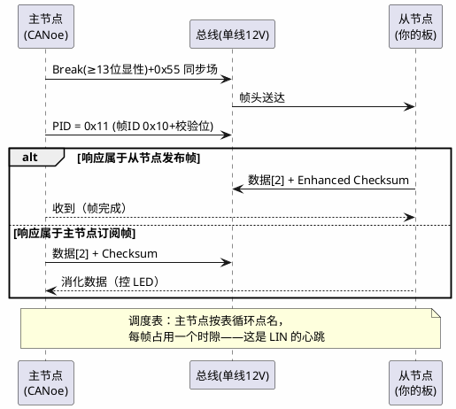

# 练手项目 04：LIN 节点——严格主从的总线初体验

> 一句话定位：以 CANoe 做 LIN 主站、你的板子做从站，配 LinDrv 收发无条件帧——看清帧头由主机发出、从机只回响应的主从节奏，体会 LIN 与 CAN 世界观的根本差异，为四个练手项目收官。
> 等级：L2 ｜ 前置：[03-CAN裸驱收发](03-CAN裸驱收发.md)

## 1. 核心概念：从"人人平等"到"主从点名"

CAN 是多主竞争、谁 ID 小谁先说；LIN 反过来——总线上只有一个主节点，它按**调度表**逐帧发"帧头"（Break+SyncByte+PID），被点名的从节点在规定时隙内回"响应"（数据+校验和）。从节点永远不主动说话，连波特率都要靠监听同步场来对齐。这套设计换来了什么：单线、便宜、无需晶振的从节点——所以 LIN 车上专管车窗、雨刮、后视镜这些"慢且不重要"的执行器。

练手分工：板子做**从节点**最有教学价值——你要同时实现"被点名发布"（按键状态帧）与"接收订阅"（LED 控制帧）两个方向的响应，调度表的节奏感全在主站侧配置里看得到。

## 2. 详解：五步落地

**第一步：定义两个帧。** 用 LDF 描述：帧 0x10（2 字节，从机发布：按键状态）、帧 0x11（1 字节，主机订阅：LED 命令）。LDF 语法与信号映射见 [LDF 结构](../../../05-汽车网络通讯/1-L1基础/LIN/LDF与配置/01-LDF结构.md)、[信号映射](../../../05-汽车网络通讯/1-L1基础/LIN/LDF与配置/02-信号映射.md)。协议细节速查见 [LIN 帧结构](../../../05-汽车网络通讯/1-L1基础/LIN/协议原理/02-帧结构.md)。

**第二步：配 LinDrv。** tresos：LinChannel 波特率 19200；从节点侧配两个帧槽（帧 ID、方向、校验类型 Enhanced、超时时间）。接口契约见 [LinDrv 接口契约](../../../04-MCAL与外设驱动/2-L2进阶/CanDrv与LinDrv/02-LinDrv接口契约.md)。校验类型务必与 LDF 一致——Enhanced 把 PID 也算进校验，Classic 不算，配错就是"数据对了校验永远错"。

**第三步：CANoe 做主站。** 导入 LDF，LIN Simulation 节点当主站，调度表把 0x10、0x11 排成 100ms 轮询；Trace 里应看到帧头+响应完整帧流。

**第四步：写板端逻辑。** 帧头中断→判断 PID：是 0x10 则准备响应数据（按键状态+计数）；收到 0x11 响应→解析 LED 命令置标志。同样遵守"回调只拷贝+置标志"纪律。从节点波特率同步靠硬件自动测同步场宽度，不达标会进 [波特率与同步](../../../05-汽车网络通讯/1-L1基础/LIN/协议原理/03-波特率与同步.md) 里的失步状态。

**第五步：验收。** 现象：CANoe Trace 每秒 10 帧节奏稳定；按板上按键，下一轮 0x10 响应 byte0 翻转；CANoe 手动发 LED 命令，板上灯响应。进阶验收：把主站调度表周期改到 1s，观察从站响应时隙依旧对齐（从站跟帧头走，不跟表走）；人为断开总线再接回，观察从站重新同步。

| 验收项 | 通过标准 | 实测 |
|---|---|---|
| 调度节奏 | Trace 每秒 10 帧±1 | （留空手记） |
| 发布方向 | 按键后下一轮 0x10 数据翻转 | |
| 订阅方向 | LED 命令 ≤2 个表周期生效 | |
| 失步恢复 | 总线断接后 ≤3 帧重新同步 | |
| 时隙对齐 | 改表周期后响应不漂移 | |

与 CAN 练手的对照（做完两篇各答一遍，答不上就回去补）：

| 维度 | 03-CAN裸驱 | 04-LIN节点 |
|---|---|---|
| 谁发起 | 任意节点随时可发 | 仅主节点按表点名 |
| 从节点主动性 | 平等 | 只响应，不主动 |
| 时钟 | 各自独立晶振 | 从站靠同步场对齐 |
| 错误处理 | 错误计数/bus-off | 帧错误计数/从站失步 |
| 典型用途 | 高实时车身主干 | 车窗雨刮等低速执行器 |

## 3. 易错点与陷阱

- **现象：从站一帧响应都不发。原因：** 从站没收到合法帧头（Break 检测未使能）、PID 校验位算错、或波特率偏差超容限（>2%）导致同步失败。**对策：** 示波器/逻辑分析仪量 Break 长度与同步场；从站侧确认 LinChannel 波特率与主站一致。
- **现象：Trace 里响应数据"鬼影"或错位。原因：** 时隙错配——从站响应太晚（主站已发下一帧头）；中断延迟过大或响应准备放在了慢任务里。**对策：** 响应数据在中断里提前就绪；缩短帧头到响应的处理路径。
- **现象：校验和永远报错。原因：** Classic/Enhanced 配置两端不一致，或多字节信号的字节序（Intel/Motorola）不一致。**对策：** 对照 LDF 逐项核对 checksum 与字节序；典型案例见 [checksum 类型](../../../05-汽车网络通讯/1-L1基础/LIN/排障/02-checksum类型.md)。
- **现象：调度表跑一会儿从站"消失"，过几秒又回来。原因：** 从站响应超时被主站记帧错误，主站按策略重试/跳过；或从节点进睡眠后被漏唤醒。**对策：** 查 [帧超时](../../../05-汽车网络通讯/1-L1基础/LIN/排障/01-帧超时.md) 的时隙计算；睡眠唤醒策略两端对齐。
- **现象：单看每帧都对，但控制延迟忽大忽小。原因：** 调度表里帧的排布顺序导致该帧时隙忽近忽远（表周期与请求相位拍频）。**对策：** 把高实时性帧在表里排密、低优先级排疏——LIN 的"实时性"就是调度表设计，见 [主从与调度表](../../../05-汽车网络通讯/1-L1基础/LIN/协议原理/01-主从与调度表.md)。
- **现象：总线上偶发波形畸变、帧错误集中出现。原因：** 单线总线阻抗/上拉不足、线束过长或节点数超标。**对策：** 量上拉与总线电压；LIN 是"低成本单线"，物理层余量远小于 CAN，别拿 CAN 的拓扑习惯套 LIN。

## 4. 面试高频题

**Q：LIN 与 CAN 最本质的三个区别？**

答：①介质与速率：单线、最高 ~20kbps vs 差分双线、1Mbps（FD 更高）；②访问方式：主节点按调度表点名 vs 多主仲裁竞争；③时钟：从节点无晶振靠同步场对齐 vs 每节点独立时基。一句话：LIN 用"确定性的慢"换成本，CAN 用"带宽与鲁棒"换通用。

**Q：从节点怎么知道自己该发还是该收？**

答：看帧头里的 PID：主节点发的帧头本身就携带"下一个响应由谁发"的信息——若该帧在 LDF 里定义为"从机发布"，点名到的从机发响应；若定义为"主机订阅"，主机自己接着发数据、从机收。从机的收/发方向由 LDF 配置静态决定。

**Q：Enhanced 与 Classic 校验和怎么选？**

答：Classic 只校验数据字节，用于 LIN 1.x 传统帧（且帧 ID 0x3C~0x3F 强制 Classic）；Enhanced 把 PID 一起校验，LIN 2.x 数据帧默认，能多防"帧 ID 被干扰"这一类错。选型跟着 LDF/主机配置走，两端必须一致。

**Q：LIN 网络里主节点挂了会怎样？对比 CAN 一个节点挂了？**

答：LIN 主节点是单点：它挂了整条总线静默，所有从节点收不到帧头、最终进睡眠——所以主节点常由网关类高可靠 ECU 兼任。CAN 没有单点：任一节点下线，其余照常通讯（只是丢它的报文），这是多主架构的鲁棒性红利。

## 5. 延伸

- [LIN 排障实录](../../../05-汽车网络通讯/1-L1基础/LIN/排障/03-排障实录.md)：真实项目的 LIN 翻车集，与本文陷阱清单互补；
- [LinTp](../../../05-汽车网络通讯/2-L2进阶/传输层/02-LinTp.md)：LIN 上的诊断传输层，帧长大的代价；
- [LinSM](../../../07-AUTOSAR架构/2-L2进阶/通讯服务栈/04-LinSM.md)：完整栈里 LIN 调度表切换怎么被管理；
- [LinIf](../../../07-AUTOSAR架构/2-L2进阶/通讯服务栈/06-CanIf-LinIf.md)：裸驱之上再加的那层"帧调度抽象"；
- 四篇收官，下一站：[2-L2进阶/S32K工程模板](../../2-L2进阶/S32K工程模板/README.md)——把练手散件组织成可交付工程。

---

维护约定：笔记命名 `序号-主题.md`；真实截图放 `_images/`；流程/时序/状态/架构图用 PlantUML 内嵌正文，规范见 [图表规范与模板](../../../00-总览/图表规范与模板.md)。
