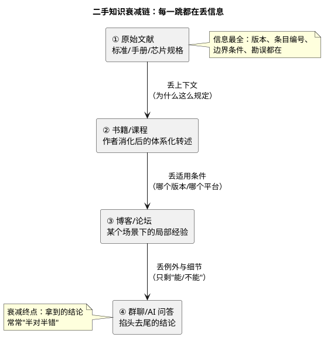
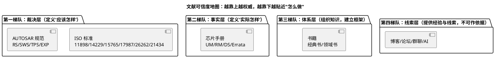

# 01-站在巨人肩膀上-标准与文献怎么读

> 一句话定位：讲清为什么"读原著"是工程师的天花板、四类文献（标准/芯片手册/书/博客）各在可信度地图的哪一层、以及 AUTOSAR 标准与芯片手册各自的正确打开方式——把"搜博客碰运气"升级成"按图索骥查原文"。
> 等级：L1 ｜ 前置：无

新手靠博客入门没问题，但两三年后你会发现：**排查卡壳、评审抬杠、面试追问，最后拼的都是"能不能拿出原文依据"**。本区收的就是这些"原著"的阅读法——标准怎么查、手册怎么翻、书怎么选。本篇是全区的总地图。

## 为什么"读原著"是天花板：二手知识的衰减链

任何一条知识从诞生到抵达你眼前，通常走了这样一条链：

真实案例（本库各区的老朋友）：

- **CAN 采样点**：博客常说"采样点一般设 75%"，但它是 `SYNC_SEG + PROP_SEG + PHASE_SEG1` 之后的计算结果，跟波特率、线长、振荡器容差强相关——原文在 ISO 11898-1 的位时序定义里，拿着结论算不出自己的值；
- **CanNm 假醒**：论坛偏方是"把超时调大"，但状态机里 RepeatMessage 状态的进入条件写死在 AUTOSAR SWS 的行为条目里——不回原文，参数怎么调都治标；
- **volatile 万能论**：二手结论说"共享变量加 volatile 就行"，原文（编译器文档 + C 标准）告诉你 volatile 既不原子也不建立内存屏障。

结论不是"博客没用"——博客提供**线索**很有用；而是**裁决**只能靠第一梯队文献。这也决定了本区的写法：不抄原文，只写"去哪份原文、翻哪一章、怎么核对"。

## 四类文献定位地图：各就各位，各管一层

| 梯队 | 文献 | 回答什么 | 时效性 | 正确用法 |
|---|---|---|---|---|
| 裁决层 | AUTOSAR 规范 | 模块行为/接口/配置项"应该怎样" | 按版本冻结，永不漂移 | 争议终审：认条目编号不认页码 |
| 裁决层 | ISO 标准 | 协议/流程/安全方法"应该怎样" | 按版次修订 | 同上，注意版次（如 14229-1:2020） |
| 事实层 | UM/RM/DS/Errata | 这颗芯片"实际怎样"：寄存器/时序/电气参数 | 随芯片版本更新 | 开发对表：配置前先查寄存器位域与限制 |
| 体系层 | 书籍 | 把零散知识组织成框架 | 慢衰 | 建体系用，不查细节用；细节回上两层 |
| 线索层 | 博客/论坛/AI | 别人踩过的坑、快速线索 | 快衰且真假掺半 | 只当"搜索关键词生成器"，结论必须回上三层验证 |

使用口诀：**第四层找线索，第三层建框架，第二层对事实，第一层做裁决**——四层各干各的活，谁也替代不了谁。

## 如何高效读 AUTOSAR 标准：方法论先行 + PART 结构 + SWS 查表

AUTOSAR 规范库庞大（一个版本动辄几百份 PDF），逐份读是不可能的，正确姿势是三招：

1. **方法论先行**：先读 `AUTOSAR_TR_Methodology`（经典平台方法论），它是全局目录——ECU 从系统描述到生成代码的完整流程走一遍，之后每个模块的 SWS 都能挂到流程中的某个位置，不会"只见树木"；
2. **认 PART/文档家族**：模块文档分 RS（需求）/SWS（软件规范）/BSWMD（配置定义 arxml）/TPS（模板）/EXP-TR（解释性报告）五类，日常 90% 只碰 SWS——家族分工详见 [07 区-如何查SWS](../../07-AUTOSAR架构/1-L1基础/SWS阅读法/01-如何查SWS.md)，那是本区的"姊妹篇"，这篇讲地图，那篇讲手法；
3. **SWS 查表法**：不要通读。带着问题走"功能概述定位 → 行为条目（SWS_xxx 编号）→ 配置项范围"三段式，五分钟定位到裁决条目；引用一律带编号（如 `[SWS_CanNm_00xxx]`），换版本不失效。

本区 [AUTOSAR规范索引](../7-阅读笔记/AUTOSAR规范/00-SWS索引.md) 把常用 SWS 与库内笔记做了对照表，按工作场景反查。

## 芯片手册三层阅读法：Datasheet vs User Manual vs Application Note

| 层 | 文档 | 内容 | 什么时候读 |
|---|---|---|---|
| 选型层 | Datasheet（DS） | 资源清单（外设数量/主频/封装）、电气参数（V/I/温度）、引脚定义 | 选型、画板、查极限参数 |
| 开发层 | User Manual / Reference Manual（UM/RM） | 全部模块的寄存器、工作机制、时钟电源、时序图——最厚的那本 | 写驱动、配外设、排硬件疑难 |
| 应用层 | Application Note（AN） | 官方针对某个具体课题的示例工程与踩坑提示（如 EVADC 采样优化、GTM ADC 串联） | 做对应功能前先搜一份 AN |

阅读顺序建议：**DS 读两遍**（选型一遍、画板前再读电气参数一遍），**UM 只读地图不逐章啃**（先画结构地图，按问题反查章节，见本区 [TC377 UM 读法](../7-阅读笔记/芯片手册/01-TC377-UM.md) 与 [S32K RM 读法](../7-阅读笔记/芯片手册/02-S32K-RM.md)），**AN 按需检索**（动工前先查有没有官方示例）。硬件侧的数据手册通读法另有姊妹篇：[03 区-Datasheet-vs-Reference-Manual](../../03-硬件基础/1-L1基础/原理图阅读/数据手册阅读法/01-Datasheet-vs-Reference-Manual.md)。

## 本区地图：先笔记后原件，按问题取用

本区不是"学完一个区"，而是**资料库**——实体资源架放着 PDF/DOC 原件，[7-阅读笔记](../7-阅读笔记/README.md) 是翻原件前的地图：

| 架位 | 收什么 | 什么时候来 |
|---|---|---|
| [1-诊断与通信协议](../1-诊断与通信协议/README.md) | CAN/J1939/LIN/FlexRay/UDS/15765/DoIP 协议原件 | 配总线、调诊断前先落一份原文 |
| [2-AUTOSAR标准](../2-AUTOSAR标准/README.md) | CP AUTOSAR 多版本标准包（R19-11 ~ R4.2.2） | 行为争议回 SWS 裁决 |
| [3-芯片手册](../3-芯片手册/README.md) | TC3xx / S32K 官方手册原件 | 写驱动、配外设时反查 |
| [4-电子书](../4-电子书/README.md) | 经典书电子版 | 主线学习按书单取用 |
| [5-论文与好文](../5-论文与好文/README.md) | 论文与深度好文存档 | 专题研究按需检索 |
| [6-在线资源](../6-在线资源/README.md) | 官方下载渠道与在线文库 | 手上没有原件时去哪下 |

对应的阅读笔记（怎么读、先读哪章）收在 [7-阅读笔记](../7-阅读笔记/README.md)：芯片手册 / AUTOSAR规范 / ISO标准 / 书籍 四类。

## 易错点与陷阱

1. **拿博客结论当依据写进评审意见**：二手结论缺版本与适用条件，评审里一句"哪份文档哪一条"就能击穿；养成"结论必附出处"的习惯；
2. **版本错配**：拿 R19-11 的 SWS 解释 R4.2.2 工程、拿 TC39x 的 UM 查 TC377 寄存器——先核版本/型号再翻内容，这一条在 [版本演进](../../07-AUTOSAR架构/1-L1基础/架构总览/03-版本演进.md) 有展开；
3. **把 DS 当 RM 用**：DS 里的"功能简介"只是摘要，寄存器与机制必须回 UM/RM；反过来查电气参数（如 IO 驱动能力）必须用 DS，UM 里没有；
4. **忽视 Errata**：芯片勘误表是"事实层的补丁"，不改规格但改行为——立项第一周先过一遍 Errata，常见坑（某外设某模式下异常）能提前绕开；
5. **读书求全**：经典书通读一遍效率极低，正确用法是"先读目录建框架，按问题跳章节"——选书与读法见 [书籍索引](../7-阅读笔记/书籍/00-书籍索引.md)；
6. **AI 问答直接抄进代码**：AI 是第四梯队的"超快线索源"，给出的 API 名/参数范围常张冠李戴，任何条目都要回第一、二梯队核验后才能用。

## 面试高频题

**Q：CAN 采样点是什么？为什么你项目里设 75%？**
答：采样点是一位电平被读取的时刻，位于 `SYNC+PROP+PHASE1` 之后；它决定收发双方对"同一位"的判定时机，受线长传播延迟与时钟容差约束。75% 是较长总线、较高容差下的常用折中——但依据应是位时序计算（ISO 11898-1 定义 + 收发器环回延迟），而不是"大家都这么配"。可延伸到 [位时序与采样点](../../05-汽车网络通讯/1-L1基础/CAN/协议原理/02-位时序与采样点.md)。

**Q：AUTOSAR 规范那么多，你平时怎么查？**
答：方法论（TR_Methodology）建全局坐标，再按模块锁定 SWS，走"概述定位→行为条目→配置项"三段式，引用带条目编号；配置争议再加 BSWMD 与配置工具互证。详见 [如何查SWS](../../07-AUTOSAR架构/1-L1基础/SWS阅读法/01-如何查SWS.md)。

**Q：Datasheet 和 Reference Manual 有什么区别？给你一个新外设任务，你怎么开始？**
答：DS 管资源/电气/引脚，RM/UM 管寄存器与机制。接新任务先 DS 确认可用资源与引脚复用，再在 RM 里读该模块的 functional description 与寄存器章，搜官方 AppNote 看示例，最后才动手写驱动；同时核对 Errata。

**Q：ISO 26262 的哪个部分和嵌入式软件开发最相关？**
答：Part 6（软件级产品开发）与 Part 8（支持过程，含软件工具置信度）最贴日常；ASIL 概念来自 Part 3 的 HARA。库内展开见 [ASIL与安全机制](../../11-功能安全与信息安全/1-L1基础/ISO-26262基础/01-ASIL与安全机制.md)。

## 下一步读什么

- 手上正有芯片任务 → [TC377-UM 读法](../7-阅读笔记/芯片手册/01-TC377-UM.md) / [S32K-RM 读法](../7-阅读笔记/芯片手册/02-S32K-RM.md)：先给手册画地图，再按问题反查；
- 想补书单 → [书籍索引](../7-阅读笔记/书籍/00-书籍索引.md)：按 L1/L2/L3 分层的书架与读法；
- 配置争议待裁决 → [SWS索引](../7-阅读笔记/AUTOSAR规范/00-SWS索引.md) → [ISO标准索引](../7-阅读笔记/ISO标准/00-标准索引.md)：两份导航地图，链接直达库内实战笔记；
- 想学 SWS 检索手法本身 → [07 区-如何查SWS](../../07-AUTOSAR架构/1-L1基础/SWS阅读法/01-如何查SWS.md)（姊妹篇，含完整实例走查）。
