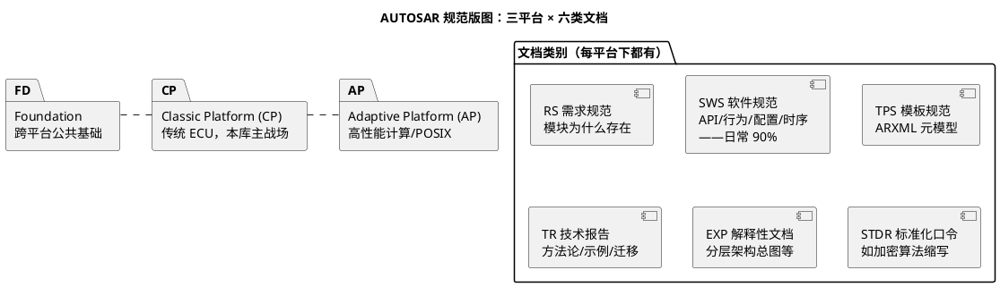

# 00-SWS索引

> 一句话定位：AUTOSAR 规范库的导航地图——三个平台、六类文档怎么分，日常最常用的十几份 SWS 与库内实战笔记逐一对照，以及"从工作问题路由到具体文档"的查法；本篇不抄规范，只画地图。
> 等级：L2 ｜ 前置：[站在巨人肩膀上-标准与文献怎么读](../../00-入门导读/01-站在巨人肩膀上-标准与文献怎么读.md)

AUTOSAR 规范库一个版本数百份 PDF，全部读完是不可能的任务。工程师的正确姿势：**记住版图（哪类文档管什么）+ 常用文档坐标（常用 SWS 与工作的对应）+ 路由法（按问题跳转）**。本篇就是这三件套，检索手法详见姊妹篇 [如何查SWS](../../../07-AUTOSAR架构/1-L1基础/SWS阅读法/01-如何查SWS.md)。

## 标准族结构：平台 × 文档类别

- **命名规律**：文档名 = `AUTOSAR_类别_名称`，如 `AUTOSAR_SWS_CANNetworkManagement`、`AUTOSAR_TR_Methodology`、`AUTOSAR_EXP_LayeredSoftwareArchitecture`——看前缀就知道类型，不用点开猜；
- **版本规律**：老版本 R4.x（如 R4.2.2，与诸多量产工具链绑定），现行按 `R年-月`（R19-11、R20-11、R23-11…）；**项目锁定哪个版本，你的文档库就停在哪个版本**，规范引用一律带"版本+条目编号"；
- **分工规律**：RS 讲需求动机，SWS 讲行为与配置（主战场），TPS 讲 ARXML 语法，TR/EXP 讲方法论与背景——查行为进 SWS，查语法进 TPS，查流程进 TR_Methodology。

## 核心 SWS 速览：常用文档 × 库内实战

按 07 区四大栈归类（"库内笔记"列即读 SWS 时的落地对照物）：

| 栈 | 模块 SWS | 管（一句话） | 库内笔记 |
|---|---|---|---|
| 系统服务 | `SWS_OS` | 任务/调度/事件/Hook/多核 OS | [任务与调度](../../../07-AUTOSAR架构/2-L2进阶/系统服务栈/Os/01-任务与调度.md) |
| 系统服务 | `SWS_ECUStateManager` | 上下电时序、唤醒、flex/fixed | [上下电时序](../../../07-AUTOSAR架构/2-L2进阶/系统服务栈/EcuM/02-上下电时序.md) |
| 系统服务 | `SWS_BSWMManager` | 模式仲裁与规则 | [模式仲裁](../../../07-AUTOSAR架构/2-L2进阶/系统服务栈/BswM/01-模式仲裁.md) |
| 系统服务 | `SWS_WatchdogManager` | 监督实体/checkpoint/失效响应 | [监督实体与checkpoint](../../../07-AUTOSAR架构/2-L2进阶/系统服务栈/WdgM/01-监督实体与checkpoint.md) |
| 系统服务 | `SWS_DefaultErrorTracer` | 运行时错误上报 | [Det](../../../07-AUTOSAR架构/2-L2进阶/系统服务栈/Det与Dlt/01-Det.md) |
| 通讯服务 | `SWS_COM` | 信号组装/失效处理/更新位 | [Com](../../../07-AUTOSAR架构/2-L2进阶/通讯服务栈/01-Com.md) |
| 通讯服务 | `SWS_PDURouter` | PDU 路由表/网关 | [PduR](../../../07-AUTOSAR架构/2-L2进阶/通讯服务栈/02-PduR.md) |
| 通讯服务 | `SWS_CanStateManager` | 总线状态机（bus-off 恢复） | [CanSM](../../../07-AUTOSAR架构/2-L2进阶/通讯服务栈/03-CanSM.md) |
| 通讯服务 | `SWS_CANNetworkManagement` | NM 状态机/超时/部分网络 | [CanNm-LinNm](../../../07-AUTOSAR架构/2-L2进阶/通讯服务栈/05-CanNm-LinNm.md) |
| 通讯服务 | `SWS_CanIf` 等 | 驱动抽象/收发控制 | [CanIf-LinIf](../../../07-AUTOSAR架构/2-L2进阶/通讯服务栈/06-CanIf-LinIf.md) |
| 内存 | `SWS_NVRAMManager` | 块管理/写队列/冗余 | [NvM块管理](../../../07-AUTOSAR架构/2-L2进阶/内存栈/01-NvM块管理.md) |
| 内存 | `SWS_MemIf/Fee/Ea` | 抽象层与 Flash 仿真 | [MemIf-Fee-Ea](../../../07-AUTOSAR架构/2-L2进阶/内存栈/04-MemIf-Fee-Ea.md) |
| RTE | `SWS_RTE` | 端口/映射/生成代码约束 | [S-R与C-S端口](../../../07-AUTOSAR架构/3-L3高级/RTE/01-S-R与C-S端口.md) |
| 加密 | `SWS_CryptoServiceManager` 等 | 密钥/CMAC/SecOC 依赖 | [Csm-CryIf-Crypto](../../../07-AUTOSAR架构/3-L3高级/加密栈/01-Csm-CryIf-Crypto.md) |

## 怎么查怎么读：三条路线

1. **按模块查**（知道模块名）：本地文档库按 `版本/类别/文档名` 三级目录存好（如 `R4.2.2/SWS/AUTOSAR_SWS_CANNetworkManagement.pdf`），Everything/pdfgrep 秒级定位——先建库，别用到才去官网翻；
2. **按 API/配置项查**（知道名字）：PDF 里直接搜 API 名（`CanNm_NetworkRequest`）或参数名（`CanNmTimeoutTime`），命中后读条目正文，注意条目编号（`[SWS_CanNm_00xxx]`）与所属章节（API 章/行为章/配置章）；
3. **按现象查**（只有症状）：先在对应库内笔记定位"机制关键词"（如"网络管理睡不下去"→[AUTOSAR-NM状态机](../../../05-汽车网络通讯/2-L2进阶/网络管理/02-AUTOSAR-NM状态机.md)），再带着关键词回 SWS 的功能概述+状态机图确认转移条件——**库内笔记给线索，SWS 给裁决**。

阅读顺序建议：新模块先读 SWS 开头的 Functional Overview（分层位置+框图+术语，约 10 页），再读与手头任务相关的行为条目；配置参数表当字典用，不逐行读。

### 版本路线速查

| 版本线 | 命名/时代 | 工程含义 |
|---|---|---|
| R4.0.x ~ R4.4 | 2009~2016 的 4.x 线 | 大量量产项目与工具链（如 tresos Classic 4.2.x 时代）锁定于此，SWS 条目编号体系成熟稳定 |
| R17-10 ~ R18-10 | 过渡期命名 | 4.x 之后的年度版，模块拆分与命名开始调整 |
| R19-11 起 | `R年-月` 命名（R20-11/R22-11/R23-11/R24-11…） | Classic/Adaptive/Foundation 分平台发布；新项目多从 R20-11 之后选版 |

三条纪律：**项目锁哪版，本地库就停在哪版**；跨版本引用（评审/工单）必须带版本号；升级工具链时逐模块过 Change Information，不整包盲升。

## 易错点与陷阱

1. **版本错配**：拿 R23-11 的 SWS 解释 R4.2.2 工程——条目编号、参数范围、默认值可能全对不上；引用规范前先核项目版本（见 [版本演进](../../../07-AUTOSAR架构/1-L1基础/架构总览/03-版本演进.md)）；
2. **CP/AP 文档混用**：Adaptive 的 ara::com 与 Classic 的 Com 完全是两套体系，搜文档时认准 Classic Platform 分区（本库工程均为 CP）；
3. **只看配置表不看行为条目**：配置项的"含义"定义在行为条目里，只查表读值不改行为就配，是配置工程师最常见的返工源；
4. **忽略条目的执行上下文约束**：SWS 每个 API 条目标注 Reentrancy/Context（任务级/ISR 级），在错误的上下文调用会埋下时序雷；
5. **SWS 与 BSWMD 不互证**：配置工具按 BSWMD（arxml 形式化定义）校验，SWS 是人读的表述——两者版本不一致时，以项目工具链锁定的 BSWMD 为准，差异要留记录；
6. **漏读 Change Information**：跨版本升级工具链时，只看正文不看变更章（哪些条目废弃/新增），老配置可能带着已废弃参数升级。

## 面试高频题

**Q：AUTOSAR 文档分几类？日常主要读哪类？**
答：RS（需求）、SWS（软件规范）、TPS（模板）、TR（技术报告）、EXP（解释性）、STDR（标准化缩写）六类；日常 90% 读 SWS（API/行为/配置/时序），查 ARXML 语法进 TPS，建全局流程读 TR_Methodology。

**Q：项目要配 CanNm，你怎么用规范指导配置？**
答：先读 SWS_CANNetworkManagement 的功能概述与状态机图，明确 RepeatMessage/Normal/PrepareSleep 的进入条件，再逐个把工程参数（超时/重发数/报文 payload）对到配置规范章节核取值范围，最后拿 [CanNm-LinNm 库内笔记](../../../07-AUTOSAR架构/2-L2进阶/通讯服务栈/05-CanNm-LinNm.md) 的配置要点自查——规范裁决，笔记提效。

**Q：SRS/RS 和 SWS 什么关系？为什么 SWS 条目都挂着需求编号？**
答：RS 定义模块存在的需求动机，SWS 的行为条目向下实现这些需求并带编号可追溯；排障时若 SWS 行为解释不了"为什么这么设计"，往 RS 或 TR_Methodology 溯源。

**Q：两个版本 SWS 对同一行为描述不一致，工程上怎么办？**
答：以项目工具链锁定的 AUTOSAR 版本对应文档为准（版本对齐是纪律），差异写入项目决策记录；若新版行为更合理，走变更评审升级工具链，而不是"混用两版各取所长"。

## 延伸

- [站在巨人肩膀上-标准与文献怎么读](../../00-入门导读/01-站在巨人肩膀上-标准与文献怎么读.md)：本篇的上级地图
- [如何查SWS](../../../07-AUTOSAR架构/1-L1基础/SWS阅读法/01-如何查SWS.md)：姊妹篇——查表三步法的完整实例走查
- [ISO标准索引](../ISO标准/00-标准索引.md)：协议类（11898/14229/26262）的另一半地图
- [通讯服务栈](../../../07-AUTOSAR架构/2-L2进阶/通讯服务栈/README.md)：SWS 最密集的练兵场，逐模块对照读
- [S32K-RM 读法](../芯片手册/02-S32K-RM.md)：AUTOSAR 说"应该怎样"，芯片手册说"实际怎样"——两份地图配合用
