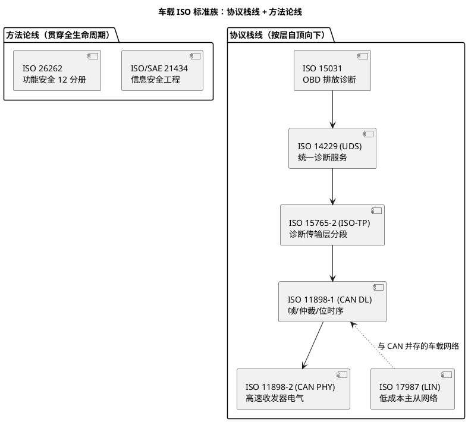

# 00-标准索引

> 一句话定位：车载 ISO 标准族的导航地图——11898/15765/14229/17987/26262/21434 各自的 Series 划分、一句话概念、与库内实战笔记的对照，以及"按问题选标准、按条文查细节"的读法；本篇不抄条文，只画地图。
> 等级：L2 ｜ 前置：[站在巨人肩膀上-标准与文献怎么读](../../00-入门导读/01-站在巨人肩膀上-标准与文献怎么读.md)

车载软件工程师的争议裁决层有两根柱子：AUTOSAR 规范（[SWS索引](../AUTOSAR规范/00-SWS索引.md)）管"软件栈应该怎样"，ISO 标准管"协议与流程应该怎样"。本篇按"网络协议栈"与"安全方法论"两条线给 ISO 标准族建索引。

## 标准族结构：两条主线

### Series 划分表（各标准族的"PART"）

| 标准 | 全称/常用名 | 分册结构 | 常用分册 |
|---|---|---|---|
| ISO 11898 | CAN 总线 | -1 数据链路层；-2 高速物理层（含 CAN FD 收发器）；-3 低速容错；-6 选择性唤醒（部分网络） | -1、-2 |
| ISO 15765 | 诊断通信 | -2 传输层与网络层（ISO-TP）；-3 应用层（已被 14229 取代） | -2 |
| ISO 14229 | UDS 统一诊断服务 | -1 需求与规范（2020 版并入 CAN/LIN/DoIP 实现细节）；-2 会话层服务 | -1 |
| ISO 17987 | LIN 总线 | -1 概述；-2 传输协议；-3 电气规范；-6 协议一致性 | -1、-2 |
| ISO 15031 | OBD 排放诊断 | -5 诊断服务（模式 $01~$0A）；-6 DTC 定义（与 SAE J2012 对应）；-7 数据链路安全 | -5、-6 |
| ISO 26262 | 道路车辆功能安全 | 12 分册（1 词汇；2 管理；3 概念；4 系统级；5 硬件；6 软件；7 生产运行；8 支持过程；9 ASIL 导向分析；10 应用指南；11 半导体；12 摩托车适应） | 3、6、8 |
| ISO/SAE 21434 | 道路车辆信息安全工程 | 单分册 + 配套实践（条款式：风险管理/TARA/工程活动） | 全册 |

## 核心概念速览（一句话版）

- **11898-1**：帧格式（数据/远程/错误帧）、逐位仲裁、位填充、位时序四段划分——CAN 的一切行为争议回到这里；
- **11898-2**：显性/隐性电平、总线终端与拓扑、CAN FD 收发器的 TTL/SIC 要求——物理层选型与 EMC 的依据；
- **15765-2**：多帧分段（SF/FF/CF/FC）、流控参数（BS/STmin）、N_PCI 编码——诊断多帧收发的规则书；
- **14229**：SID（$10/$11/$22/$2E/$27/$28/$3E/$31/…）、会话与安全状态、正/负响应（NRC）、时序参数（P2/P2*\*）——诊断服务交互的全部规则；
- **17987**：主节点调度表轮询、帧类型、增强校验和（checksum）与波特率同步——LIN 与 CAN 最大的差别是"调度权在主"；
- **26262**：HARA→ASIL（A/B/C/D）→安全目标→安全机制→验证确认——"失效可以发生，但不允许演变成伤害"；
- **21434**：TARA（威胁分析）、CSMS（网络安全管理体系）、按 CAL 分级管控——安全工程的"信息安全镜像"。

## 与我们工作的关联点：标准 × 库内笔记

| 你在做什么 | 依据标准 | 库内实战笔记 |
|---|---|---|
| 配帧格式/采样点/仲裁 | 11898-1 | [帧格式](../../../05-汽车网络通讯/1-L1基础/CAN/协议原理/01-帧格式.md) → [位时序与采样点](../../../05-汽车网络通讯/1-L1基础/CAN/协议原理/02-位时序与采样点.md) |
| 选收发器/配终端电阻 | 11898-2 | [终端电阻与拓扑](../../../05-汽车网络通讯/1-L1基础/CAN/收发器与物理层/03-终端电阻与拓扑.md) |
| 调多帧诊断收发 | 15765-2 | [CanTp分段15765-2](../../../05-汽车网络通讯/2-L2进阶/传输层/01-CanTp分段15765-2.md) |
| 配 Dcm 服务/安全访问 | 14229 | [UDS服务总览](../../../06-诊断与标定/1-L1基础/UDS协议/01-服务总览.md) → [SID27-安全访问](../../../06-诊断与标定/1-L1基础/UDS协议/SID27-安全访问.md) |
| 配 LIN 调度表/LDF | 17987 | [主从与调度表](../../../05-汽车网络通讯/1-L1基础/LIN/协议原理/01-主从与调度表.md) → [LDF结构](../../../05-汽车网络通讯/1-L1基础/LIN/LDF与配置/01-LDF结构.md) |
| 解 OBD 模式/DTC | 15031 | [OBD法规与模式](../../../06-诊断与标定/1-L1基础/OBD/01-法规与模式.md) |
| 评 ASIL/安全机制 | 26262 | [ASIL与安全机制](../../../11-功能安全与信息安全/1-L1基础/ISO-26262基础/01-ASIL与安全机制.md) → [E2E的profile与CRC](../../../11-功能安全与信息安全/2-L2进阶/E2E保护/01-profile与CRC.md) |
| 做信息安全需求 | 21434 | [ISO-21434概览](../../../11-功能安全与信息安全/2-L2进阶/ISO-21434概览/01-概览.md) |

配套关系提醒：ISO 标准讲"协议应该怎样"，AUTOSAR SWS 讲"栈模块怎么实现它"（如 14229 的会话/安全落到 Dcm 配置）——两条索引配合用，别只看一边。

## 怎么查怎么读

1. **获取渠道（合规第一）**：ISO 正版按份付费，工程上通常走公司标准库/OEM 提供的正本；个人学习用 OEM 规范（如各家 Diagnostic Specification）与 AUTOSAR SWS 引用反推，别用来路不明的扫描件当依据；
2. **读结构不读全文**：ISO 文档按 Clause（条款）组织，先读 Scope（范围）与 Terms（术语）章确认适用边界，再按问题跳条款；协议类标准重点读帧格式表/时序图/参数表三样；
3. **认版次**：同一标准不同年份版次差异大（14229-1 的 2006/2013/2020 三版服务数量与时序不同；26262 的 2011 版 10 分册、2018 版 12 分册）——引用一律写 `ISO 14229-1:2020, Clause x`；
4. **标准 ↔ 实现互链**：读 Dcm 配置时开着 14229，读 CanTp 时开着 15765-2——标准给"为什么与是什么"，SWS 给"模块怎么做"，库内笔记给"工程上怎么配"。

## 易错点与陷阱

1. **版次不写**：评审意见写"按 ISO 14229 要求…"却不写版次与条款号，等于没写依据——裁决性引用必须 `标准号:年份 + 条款`；
2. **UDS 与 OBD 混为一谈**：14229 是统一诊断（OEM 自定义生态），15031 是法规强制的排放诊断（模式 $01~$0A），两者并存于同一 ECU 时服务空间与触发条件要分清（[OBD法规与模式](../../../06-诊断与标定/1-L1基础/OBD/01-法规与模式.md)）；
3. **拿 15765-3 当应用层**：该分册早已被 14229 吸收取代，老资料还引用时要更新口径；
4. **26262 只记 ASIL 不记流程**：ASIL 只是分级结果，真正约束开发的是各分册的流程要求（如 Part 8 的软件工具置信度）——面试与项目评审常在这里追问；
5. **中文转述本当原文**：市面上"标准解读"类资料对条款常有裁剪，关键争议必须回英文正本条款；
6. **忽视 OEM 规范的加严**：ISO 是底线，OEM 规范（时序参数、DTC 格式、超时值）普遍加严——裁决顺序是 OEM 规范 > ISO 标准 > 内部约定。

## 面试高频题

**Q：ISO 11898-1 和 -2 分别管什么？CAN FD 采样点为什么要两个？**
答：-1 是数据链路层（帧格式/仲裁/位时序），-2 是物理层（电平/收发器电气特性）。CAN FD 在仲裁段用保守速率保仲裁、数据段切高速传输，因此有仲裁采样点与数据采样点两个采样点——位时序计算见 [位时序与采样点](../../../05-汽车网络通讯/1-L1基础/CAN/协议原理/02-位时序与采样点.md)。

**Q：UDS 多帧报文是怎么传的？依据什么标准？**
答：依据 ISO 15765-2（ISO-TP）：>7 字节（经典 CAN）触发首帧 FF+流控 FC+连续帧 CF 机制，流控参数 BS/STmin 由接收方通过 FC 下发；发送方违反流控会收到 N_Result 错误（N_Result 为 15765-2 的错误参数，区别于 14229 的否定响应码 NRC）——展开见 [CanTp分段15765-2](../../../05-汽车网络通讯/2-L2进阶/传输层/01-CanTp分段15765-2.md)。

**Q：ISO 26262 有哪些分册？嵌入式软件开发最相关哪册？**
答：2018 版 12 分册；软件开发最相关 Part 6（软件级产品开发：架构/单元设计/验证）与 Part 8（支持过程，含工具置信度鉴定），需求上游来自 Part 3 概念阶段的 HARA 与安全目标（[ASIL与安全机制](../../../11-功能安全与信息安全/1-L1基础/ISO-26262基础/01-ASIL与安全机制.md)）。

**Q：14229-1:2020 相比老版有什么变化，工程上要注意什么？**
答：2020 版把原 -3（CAN 实现）并入 -1，统一覆盖 CAN/LIN/FlexRay/DoIP 载体，并调整了部分服务的会话与安全依赖；工程上注意 Dcm 配置工具链版本对新版语义的支持程度，引用条款时写全 `14229-1:2020` 避免歧义。

## 延伸

- [站在巨人肩膀上-标准与文献怎么读](../../00-入门导读/01-站在巨人肩膀上-标准与文献怎么读.md)：本篇的上级地图
- [SWS索引](../AUTOSAR规范/00-SWS索引.md)：姊妹篇——软件栈侧的规范地图，与本篇两根柱子配套
- [UDS协议](../../../06-诊断与标定/1-L1基础/UDS协议/README.md)：14229 的逐服务落地笔记
- [传输层](../../../05-汽车网络通讯/2-L2进阶/传输层/README.md)：15765-2 的工程实现层
- [TC377-UM 读法](../芯片手册/01-TC377-UM.md)：协议标准（应该怎样）与芯片手册（实际怎样）的阅读分工
