# 00-书籍索引

> 一句话定位：一张按 L1/L2/L3 分层的书架地图——每本书"讲什么、何时读、读到什么程度"，以及"选书与读书"的五条方法论；配合库内笔记，让书负责建框架、库负责存实战。
> 等级：L1 ｜ 前置：[站在巨人肩膀上-标准与文献怎么读](../../00-入门导读/01-站在巨人肩膀上-标准与文献怎么读.md)

本目录约定"一书一目录"（读完某本想落成篇目笔记时，为它建同名子目录）。本篇先给整面书架：**不是荐书清单式的罗列，而是"每本书在成长路线上的位置"**。

## 这份书单讲什么、适合何时读

书在四类文献里属第三梯队（体系层）：它不提供"裁决依据"（标准干这个），也不提供"寄存器事实"（手册干这个），它干的是**把零散知识组织成框架**——所以读书的产出应该是"框架图 + 几条可落库的原则"，而不是摘抄目录。分层逻辑与全库 L1~L3 一致：L1 书打语言与计算机底子，L2 书建系统与领域框架，L3 书开视野。

## 书架地图

```plantuml
@startuml
title 分层书架：每本书长在成长路线的哪一节
skinparam defaultFontName "Microsoft YaHei"
package "L1 书架（打地基：语言+计算机直觉）" {
  [C和指针\nPointers on C] as B11
  [C陷阱与缺陷\nC Traps and Pitfalls] as B12
  [C专家编程\nExpert C Programming] as B13
  [编码\nCode: 从二进制到计算机] as B14
}
package "L2 书架（建框架：系统+领域）" {
  [深入理解计算机系统\nCSAPP] as B21
  [程序员自我修养\n链接、装载与库] as B22
  [嵌入式实时操作系统μC/OS-III\n内核机制参考实现] as B23
  [博世汽车工程手册\n汽车全领域速查] as B24
  [AUTOSAR规范与车用控制器软件开发\n国内入门常备] as B25
}
package "L3 书架（开视野：领域纵深+工程素养）" {
  [Automotive Software Engineering\n整车软件工程视野] as B31
  [代码大全\n工程实践方法论] as B32
}
B11 -[hidden]right- B12
B12 -[hidden]right- B13
B13 -[hidden]right- B14
B21 -[hidden]right- B22
B22 -[hidden]right- B23
B23 -[hidden]right- B24
B24 -[hidden]right- B25
B31 -[hidden]right- B32
@enduml
```

| 层 | 书 | 讲什么（一句话） | 何时读 | 读到什么程度 |
|---|---|---|---|---|
| L1 | 《C和指针》 | 指针、数组、内存的底层图景，习题硬核 | 入职第 1 年 | 指针专题过一遍 + 课后题挑做，可与库内 [指针专题](../../../01-编程语言/1-L1基础/指针专题/README.md) 对照 |
| L1 | 《C陷阱与缺陷》 | 声明解析、优先级、链接器陷阱等"翻车点"合集 | 写 C 半年后回看 | 通读，每条对号入座到自己代码 |
| L1 | 《C专家编程》 | 数组/指针差异、声明读懂法、可移植性 | 同上 | 通读，第 3/4/7 章值得二刷 |
| L1 | 《编码》 | 从电报继电器到 CPU 的计算机自建史 | 任意起点 | 兴趣读物，建立"计算机是一层层造出来的"直觉 |
| L2 | 《深入理解计算机系统》(CSAPP) | 程序在机器上的完整生命周期（表示/链接/异常/并发/虚拟内存） | 做 MCAL/启动代码时 | 按问题选章，重点链接/虚拟内存/并发 |
| L2 | 《程序员自我修养》 | 编译、链接、装载与库的全流程（ELF/符号/重定位） | 读启动文件、链接脚本阶段 | 与 [链接脚本与分散加载](../../../02-芯片与体系结构/2-L2进阶/启动流程/03-链接脚本与分散加载.md) 同期读 |
| L2 | 《嵌入式实时操作系统μC/OS-III》 | 一个 RTOS 内核的完整源码级讲解 | 学任务调度/信号量阶段 | 当"带注释的源码"读，对照 [08 区 RTOS 原理](../../../08-操作系统/README.md) |
| L2 | 《博世汽车工程手册》 | 汽车全领域（动力/底盘/电气/网络/安全）速查 | 随时 | 查着用，通读一遍建立整车词表 |
| L2 | 《AUTOSAR规范与车用控制器软件开发》 | AUTOSAR 分层与 BSW 模块入门的国内常备书 | 入门 AUTOSAR 第一季度 | 快读建坐标即可，细节以 [SWS](../AUTOSAR规范/00-SWS索引.md) 为准 |
| L3 | 《Automotive Software Engineering》 | 整车视角的软件工程流程（Schäuffele & Zurawka，SAE） | 做过完整项目后 | 选读流程章，建立"软件只是整车开发一环"的视野 |
| L3 | 《代码大全》 | 构建软件的通用工程方法（设计/防御式编程/调试） | 遇到质量问题复盘时 | 按目录跳读，当方法论字典 |

## 核心观点提炼（选书与读书的五条方法论）

1. **书建框架，不供检索**：读完后应能脱稿画出这本书的框架图（一级标题+关键机制），画不出来等于没读；检索型需求交给标准与手册，别指望记住书里的参数；
2. **目录读两遍**：第一遍当地图（10 分钟知道全书结构），第二遍按问题跳章——技术书的正确用法是"字典式进攻"而非"小说式通读"；
3. **一书一产出**：每本书至少沉淀 3 条能落库的原则（写进对应区笔记），或勾掉一个认知盲区；只划线不产出的阅读是娱乐；
4. **书与手册成对使用**：书讲通用机制，手册讲本芯片事实——读 FTM/GTM/EVADC 相关章节时必须摊开 RM/UM 对照，否则书里的抽象会悬空；
5. **译文与版次要核**：中文译本的术语常与工程口语有出入（如 context switch/上下文切换），读时对齐库内 [术语表](../../../00-总览/术语表.md)，引用时注明版次。

## 与项目实践的印证

- 《C专家编程》的声明解析法 ↔ [指针与数组](../../../01-编程语言/1-L1基础/指针专题/01-指针与数组.md)：书里"读声明从里向外"的方法是解析函数指针回调的基础；
- 《程序员自我修养》的链接/装载章 ↔ [S32K启动代码分析](../../../01-编程语言/2-L2进阶/汇编基础/启动代码阅读/02-S32K启动代码分析.md)：段、入口、分散加载在手把手拆的启动文件里全部落地；
- μC/OS-III 的任务调度章 ↔ 08 区 RTOS 通用原理：书本源码是理解优先级抢占/时间片的"可运行教材"；
- 《编码》的"从开关到加法器" ↔ [从零认识一颗MCU](../../../02-芯片与体系结构/00-入门导读/01-从零认识一颗MCU.md)：一软一硬两条入门路，最后在"寄存器就是一排可控开关"处会合；
- 《AUTOSAR规范与车用控制器软件开发》的分层图 ↔ [分层架构](../../../07-AUTOSAR架构/1-L1基础/架构总览/01-分层架构.md)：书本给的是示意图，库内篇把它落到"每层管什么、换芯片改哪层"的工程问题。

## 评价与阅读建议

- **性价比最高的一条线**：L1 三本 C 经典（两薄一厚）+ 《程序员自我修养》——四本书覆盖嵌入式 C 工程师 80% 的语言与工具链困惑；
- **最容易被神化的书**：CSAPP 与《代码大全》——好书但都太厚，"从头啃到尾"的计划多半烂尾，改成按问题跳章；
- **领域书的读法**：汽车类手册型书籍（博世手册）没有"读完"一说，放进案头当词表；
- **书单要定期修剪**：每半年回顾一次在读/已购清单，超过半年没翻开的书降级或出清——书架也是知识库，也会腐化。

## 易错点与陷阱

1. **集邮式囤书**：收藏 ≠ 阅读，购物车里的书单不产生任何能力，一次只开一本主线书；
2. **追新弃典**：嵌入式底层十年不变，新版炒作类"21 天"书不如经典老书扎实；
3. **拿 AI 摘要代替阅读**：摘要只能给你"知道感"，框架图与肌肉记忆必须自己读出来（详见 [区导读](../../00-入门导读/01-站在巨人肩膀上-标准与文献怎么读.md) 第四梯队定位）；
4. **读完不做产出**：没有笔记、没有实践印证的书等于没读——本库的"一书一目录"就是逼产出；
5. **把入门书当权威**：国内 AUTOSAR 入门书对模块行为的描述常有简化甚至过时处，行为争议一律回 SWS 裁决；
6. **跳级阅读**：地基没打就啃 L3 领域书，读到的只是名词——按层走，别抄近道。

## 面试高频题

**Q：你最近在读什么技术书？最大的一个收获是什么？**
答：面试官想听"具体收获 + 工程印证"。示例：读《程序员自我修养》链接章后，搞懂了启动文件里 section 重定位与分散加载的关系，回填到链接脚本笔记——回答模式是"书 → 观点 → 项目落点"三段。

**Q：嵌入式 C 进阶，你会推荐哪几本书，分别解决什么问题？**
答：《C和指针》建内存模型与指针底层图景，《C陷阱与缺陷》扫翻车点，《C专家编程》进阶声明解析与可移植性；三本都读完可再上 CSAPP 补机器级视角——推荐时必须带"解决什么问题"，只报书名是无效回答。

**Q：想入门 AUTOSAR，看书还是看标准？**
答：先读一本国内入门书建坐标（快读），随即转入标准原文（TR_Methodology + 模块 SWS），细节以 SWS 条目为准——书是脚手架，标准是建筑本身，两者不能颠倒。

**Q：技术书太多读不完，你怎么安排？**
答：分层书架 + 一次一本主线书 + 按问题跳章 + 每本必须有落库产出；检索型需求不进书，直接查标准/手册/库内笔记。

## 延伸

- [站在巨人肩膀上-标准与文献怎么读](../../00-入门导读/01-站在巨人肩膀上-标准与文献怎么读.md)：书在文献四梯队中的位置（体系层）
- [TC377-UM 读法](../芯片手册/01-TC377-UM.md) / [S32K-RM 读法](../芯片手册/02-S32K-RM.md)：书与手册"成对使用"的另一侧
- [SWS索引](../AUTOSAR规范/00-SWS索引.md)：入门书之后的行为裁决地
- [术语表](../../../00-总览/术语表.md)：读译作时对齐术语的基准
- [学习路线图](../../../00-总览/学习路线图.md)：书架分层与 L1~L3 框架的对应关系
